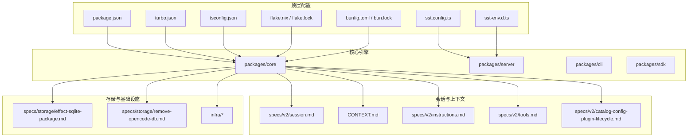
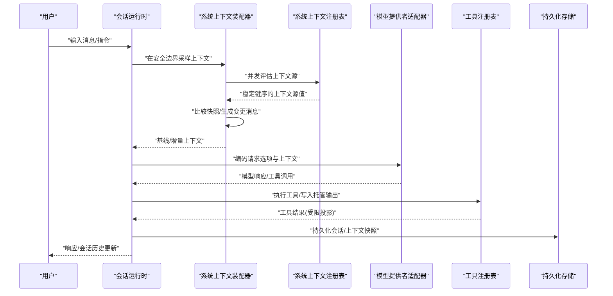
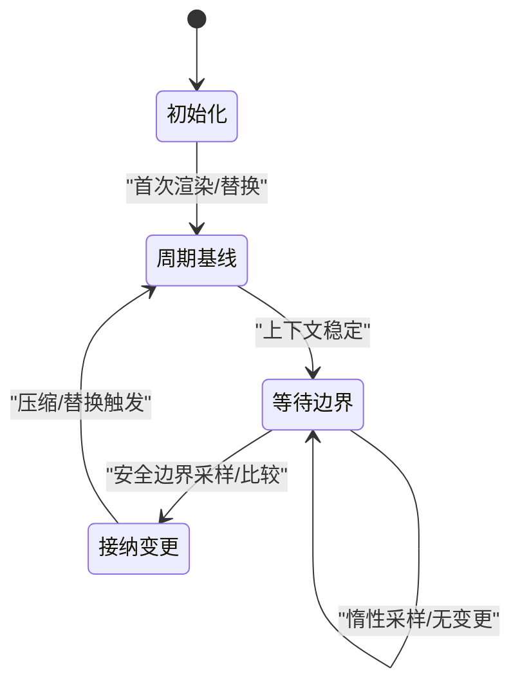
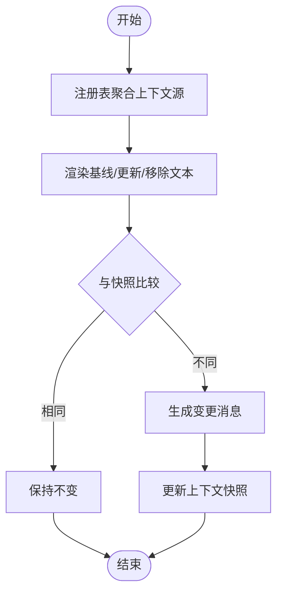
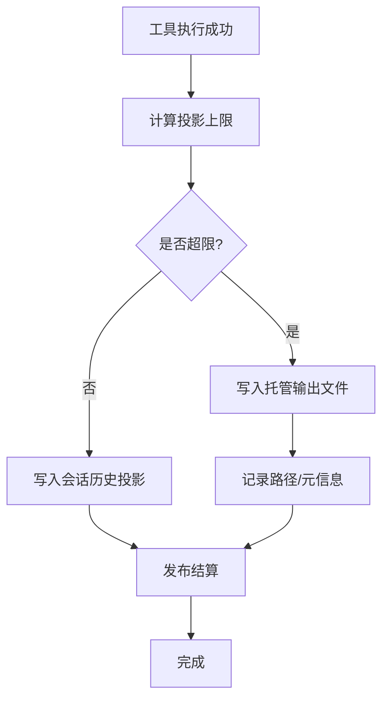
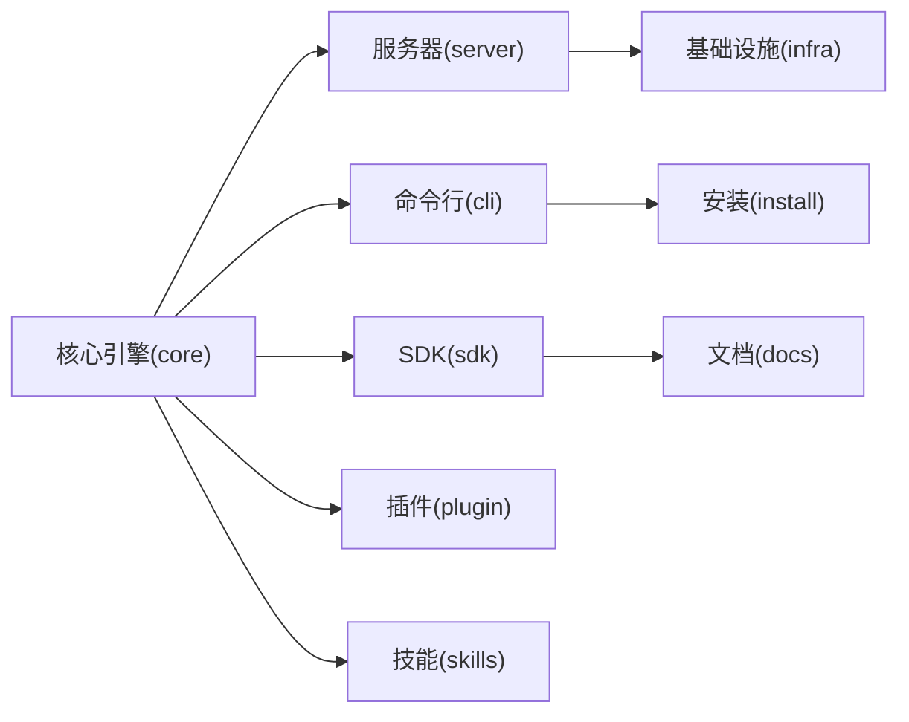
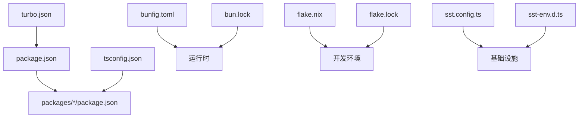

# 核心引擎架构

<cite>
**本文引用的文件**
- [README.md](file://README.md)
- [CONTEXT.md](file://CONTEXT.md)
- [session.md](file://specs/v2/session.md)
- [catalog-config-plugin-lifecycle.md](file://specs/v2/catalog-config-plugin-lifecycle.md)
- [provider-model.md](file://specs/v2/provider-model.md)
- [provider-policy.md](file://specs/v2/provider-policy.md)
- [instructions.md](file://specs/v2/instructions.md)
- [tools.md](file://specs/v2/tools.md)
- [config.md](file://specs/v2/config.md)
- [schema-changelog.md](file://specs/v2/schema-changelog.md)
- [todo.md](file://specs/v2/todo.md)
- [project.md](file://specs/project.md)
- [tui-package.md](file://specs/tui-package.md)
- [effect-sqlite-package.md](file://specs/storage/effect-sqlite-package.md)
- [remove-opencode-db.md](file://specs/storage/remove-opencode-db.md)
- [install](file://install)
- [package.json](file://package.json)
- [sst.config.ts](file://sst.config.ts)
- [sst-env.d.ts](file://sst-env.d.ts)
- [tsconfig.json](file://tsconfig.json)
- [turbo.json](file://turbo.json)
- [flake.nix](file://flake.nix)
- [flake.lock](file://flake.lock)
- [bunfig.toml](file://bunfig.toml)
- [bun.lock](file://bun.lock)
</cite>

## 目录
1. [引言](#引言)
2. [项目结构](#项目结构)
3. [核心组件](#核心组件)
4. [架构总览](#架构总览)
5. [详细组件分析](#详细组件分析)
6. [依赖分析](#依赖分析)
7. [性能考量](#性能考量)
8. [故障排查指南](#故障排查指南)
9. [结论](#结论)
10. [附录](#附录)

## 引言
本文件面向 OpenCode 核心引擎，聚焦以下主题：会话管理机制（生命周期、状态与持久化）、系统上下文处理架构（多组件环境下的上下文维护与传递）、安装版本管理策略（一致性与可追溯性）、核心引擎模块化设计（子系统职责与交互）、架构决策的技术背景与权衡、性能优化与扩展性原则，并通过架构图与代码片段路径展示关键实现细节与数据流。

## 项目结构
OpenCode 采用多包工作区组织，核心引擎位于 packages/core，同时围绕会话、上下文、插件、工具、LLM 提供者等形成清晰的分层与边界。顶层配置文件定义了构建、运行时与开发体验的统一基线。

图表来源
- [package.json](file://package.json)
- [turbo.json](file://turbo.json)
- [tsconfig.json](file://tsconfig.json)
- [sst.config.ts](file://sst.config.ts)
- [sst-env.d.ts](file://sst-env.d.ts)
- [flake.nix](file://flake.nix)
- [flake.lock](file://flake.lock)
- [bunfig.toml](file://bunfig.toml)
- [bun.lock](file://bun.lock)
- [CONTEXT.md](file://CONTEXT.md)
- [session.md](file://specs/v2/session.md)
- [instructions.md](file://specs/v2/instructions.md)
- [tools.md](file://specs/v2/tools.md)
- [catalog-config-plugin-lifecycle.md](file://specs/v2/catalog-config-plugin-lifecycle.md)
- [effect-sqlite-package.md](file://specs/storage/effect-sqlite-package.md)
- [remove-opencode-db.md](file://specs/storage/remove-opencode-db.md)
- [infra/app.ts](file://infra/app.ts)

章节来源
- [package.json](file://package.json)
- [turbo.json](file://turbo.json)
- [tsconfig.json](file://tsconfig.json)
- [sst.config.ts](file://sst.config.ts)
- [sst-env.d.ts](file://sst-env.d.ts)
- [flake.nix](file://flake.nix)
- [flake.lock](file://flake.lock)
- [bunfig.toml](file://bunfig.toml)
- [bun.lock](file://bun.lock)

## 核心组件
- 会话运行时与上下文装配器：负责在“安全请求边界”对系统上下文进行采样、合并与变更通知，维持会话历史与基线不变性。
- 系统上下文注册表：按位置作用域聚合稳定的上下文源贡献，支持并发评估与确定性组合。
- 工具输出与托管文件：在模型可见输出受限时，将完整结果写入托管临时文件，保证可审计与可重放。
- 提供者与模型策略：通过目录解析与协议适配器隔离提供者语义差异，统一生成控制与请求选项。
- 插件与技能上下文源：通过注册表注入可热加载的上下文源，支持跨代理切换与权限控制。
- 存储与持久化：基于 SQLite 的效果化封装，提供事务与一致性保障；支持数据库迁移与清理策略。

章节来源
- [CONTEXT.md](file://CONTEXT.md)
- [session.md](file://specs/v2/session.md)
- [instructions.md](file://specs/v2/instructions.md)
- [tools.md](file://specs/v2/tools.md)
- [provider-model.md](file://specs/v2/provider-model.md)
- [provider-policy.md](file://specs/v2/provider-policy.md)
- [catalog-config-plugin-lifecycle.md](file://specs/v2/catalog-config-plugin-lifecycle.md)
- [effect-sqlite-package.md](file://specs/storage/effect-sqlite-package.md)
- [remove-opencode-db.md](file://specs/storage/remove-opencode-db.md)

## 架构总览
下图展示了从用户输入到模型请求、再到工具执行与上下文更新的端到端流程，以及上下文在“基线-快照-会话历史”的协同工作机制。

图表来源
- [CONTEXT.md](file://CONTEXT.md)
- [session.md](file://specs/v2/session.md)
- [tools.md](file://specs/v2/tools.md)
- [effect-sqlite-package.md](file://specs/storage/effect-sqlite-package.md)

## 详细组件分析

### 会话生命周期与状态管理
- 上下文周期（Context Epoch）：每个周期内基线系统上下文保持不变，仅在压缩或替换时开启新周期。周期开始时初始化基线与上下文快照，避免异步唤醒与竞态。
- 安全请求边界（Safe Provider-Turn Boundary）：在该点前完成输入提升与工具结算，允许在此时接纳上下文变更；首次请求渲染完整基线并初始化快照。
- 变更通知（Mid-Conversation System Message）：当多个上下文源在同一点被接纳时，合并为一条消息；变更仅在边界处发生，不异步推送。
- 不可用上下文（Unavailable Context）：采用“缓存失效再验证”语义，保留先前有效状态，直到成功加载；初始不可用会阻塞首轮请求而非持久化不完整基线。

图表来源
- [CONTEXT.md](file://CONTEXT.md)
- [session.md](file://specs/v2/session.md)

章节来源
- [CONTEXT.md](file://CONTEXT.md)
- [session.md](file://specs/v2/session.md)

### 系统上下文处理架构
- 注册表与贡献者：位置作用域内的稳定键上下文源由注册表聚合，生产者并发评估，组合顺序遵循调用者与注册顺序，确保确定性。
- 编码与比较：每个上下文源具备编解码器，用于比较与存储；纯渲染器仅在需要时生成基线、更新与移除文本。
- 动态源与移除：对于可移除动态源，快照中保存预渲染移除消息；新增源在下一个边界一次性注入其基线渲染。
- 代理与技能：所选代理影响可用技能清单；代理切换触发周期替换，且替换在边界后生效，避免暴露旧代理特权基线。

图表来源
- [CONTEXT.md](file://CONTEXT.md)
- [catalog-config-plugin-lifecycle.md](file://specs/v2/catalog-config-plugin-lifecycle.md)
- [instructions.md](file://specs/v2/instructions.md)

章节来源
- [CONTEXT.md](file://CONTEXT.md)
- [catalog-config-plugin-lifecycle.md](file://specs/v2/catalog-config-plugin-lifecycle.md)
- [instructions.md](file://specs/v2/instructions.md)

### 工具输出与托管文件
- 投影限制：模型可见输出受限定（按行数或字节），优先保留开头与结尾；工具可在最终限制前应用更有意义的截断策略。
- 托管文件：超长文本写入共享临时目录的唯一命名文件，持久化的是可重放的投影；失败不影响操作成功性，但会记录诊断信息。
- 结算一致性：一旦工具成功，其受限投影与发布结算构成中断安全的完成区域；原始超长成功结果不会在后续修正前对外发布。

图表来源
- [tools.md](file://specs/v2/tools.md)

章节来源
- [tools.md](file://specs/v2/tools.md)

### 提供者与模型策略
- 目录解析：模型请求选项与生成控制分离，目录解析将提供者语义与兼容字段解耦；协议适配器仅负责编码到提供者请求。
- 请求选项分区：模型请求选项、生成控制与协议语义三者分属不同目录域；共享摄取适配器在路由前对遗留与模型元数据选项进行分区。
- 代理切换：模型/提供者切换总是开启新周期，保留历史会话，但替换基线以避免缓存污染。

章节来源
- [provider-model.md](file://specs/v2/provider-model.md)
- [provider-policy.md](file://specs/v2/provider-policy.md)
- [config.md](file://specs/v2/config.md)

### 模块化设计与职责划分
- 核心引擎（packages/core）：会话运行时、上下文装配、工具结算、存储接口与生命周期管理。
- 服务器（packages/server）：HTTP/WS 入口、会话调度、提供者适配器集成。
- CLI（packages/cli）：命令行入口、安装脚本与本地开发工具链。
- SDK（packages/sdk）：对外 API 封装、类型与工具集。
- 插件与技能（.opencode/plugins, .opencode/skills）：通过注册表注入上下文源与工具能力。
- 基础设施（infra/*）：部署、监控、密钥与统计服务。

图表来源
- [README.md](file://README.md)
- [package.json](file://package.json)

章节来源
- [README.md](file://README.md)
- [package.json](file://package.json)

### 安装版本管理策略
- 安装目录优先级：OPENCODE_INSTALL_DIR > XDG_BIN_DIR > $HOME/bin > $HOME/.opencode/bin，确保一致的二进制落盘路径。
- 包管理器与平台分发：提供 npm/bun/pnpm/yarn、Scoop、Chocolatey、Homebrew、pacman 等多渠道，覆盖 macOS/Linux/Windows。
- 版本与升级：顶层脚本与 Nix 配置提供固定版本与开发分支选择；发布流水线保障跨平台产物一致性。
- 清理策略：提供数据库与存储清理规范，避免历史残留影响新版本行为。

章节来源
- [README.md](file://README.md)
- [install](file://install)
- [flake.nix](file://flake.nix)
- [flake.lock](file://flake.lock)

## 依赖分析
- 工作区依赖：通过 turbo.json 组织任务与缓存；package.json 管理包版本与脚本；tsconfig.json 统一编译配置。
- 运行时依赖：bunfig.toml 与 bun.lock 确保运行时一致性；Nix flake 提供可复现构建环境。
- 基础设施：sst.config.ts 与 sst-env.d.ts 定义云资源与环境变量；infra/* 提供应用、控制台、企业版与监控等模块。

图表来源
- [turbo.json](file://turbo.json)
- [package.json](file://package.json)
- [tsconfig.json](file://tsconfig.json)
- [bunfig.toml](file://bunfig.toml)
- [bun.lock](file://bun.lock)
- [flake.nix](file://flake.nix)
- [flake.lock](file://flake.lock)
- [sst.config.ts](file://sst.config.ts)
- [sst-env.d.ts](file://sst-env.d.ts)

章节来源
- [turbo.json](file://turbo.json)
- [package.json](file://package.json)
- [tsconfig.json](file://tsconfig.json)
- [bunfig.toml](file://bunfig.toml)
- [bun.lock](file://bun.lock)
- [flake.nix](file://flake.nix)
- [flake.lock](file://flake.lock)
- [sst.config.ts](file://sst.config.ts)
- [sst-env.d.ts](file://sst-env.d.ts)

## 性能考量
- 惰性采样与边界接纳：上下文变更仅在安全边界采样与比较，避免频繁异步更新带来的抖动。
- 快照与投影：通过上下文快照减少重复渲染；工具输出投影与托管文件分离，降低内存峰值与网络传输压力。
- 并发评估：注册表对上下文源并发求值，结合稳定键序保证确定性与吞吐。
- 缓存与替换：提供者/模型切换触发新周期，避免缓存污染；压缩启动新周期，重用基线以降低重复编码成本。
- 存储事务：SQLite 效果化封装提供原子性与一致性，适合高并发场景下的会话与日志持久化。

## 故障排查指南
- 初始基线不可用：若初始上下文不可用，首轮请求会被阻塞直至恢复；检查上下文源加载与网络/文件权限。
- 变更未生效：确认是否已到达安全边界；变更在边界处合并为一条消息，不会异步推送。
- 工具输出缺失：若托管文件写入失败，操作仍视为成功，但会话中仅保留受限投影；检查共享输出目录权限与磁盘配额。
- 代理切换异常：代理切换需在边界后生效；若出现旧基线残留，检查当前边界是否已完成替换。
- 数据库问题：参考存储清理与迁移文档，确保会话与上下文快照一致性；必要时执行数据库重建流程。

章节来源
- [CONTEXT.md](file://CONTEXT.md)
- [tools.md](file://specs/v2/tools.md)
- [effect-sqlite-package.md](file://specs/storage/effect-sqlite-package.md)
- [remove-opencode-db.md](file://specs/storage/remove-opencode-db.md)

## 结论
OpenCode 核心引擎通过“上下文周期+安全边界+快照投影”的设计，在多组件环境下实现了可预测、可审计、可扩展的会话管理与上下文传递。模块化架构将提供者语义、工具执行与存储持久化解耦，配合严格的版本与安装策略，确保不同环境间的一致性与可追溯性。性能方面，惰性采样、并发评估与事务存储共同保障了高吞吐与低延迟。

## 附录
- 规格与变更追踪：v2 规范涵盖会话、目录配置、插件生命周期、模型与策略、指令与工具等主题；项目级与 TUI 包规格提供补充说明。
- 存储与迁移：SQLite 包封装与数据库移除策略为运维与升级提供依据。

章节来源
- [session.md](file://specs/v2/session.md)
- [catalog-config-plugin-lifecycle.md](file://specs/v2/catalog-config-plugin-lifecycle.md)
- [provider-model.md](file://specs/v2/provider-model.md)
- [provider-policy.md](file://specs/v2/provider-policy.md)
- [instructions.md](file://specs/v2/instructions.md)
- [tools.md](file://specs/v2/tools.md)
- [config.md](file://specs/v2/config.md)
- [schema-changelog.md](file://specs/v2/schema-changelog.md)
- [todo.md](file://specs/v2/todo.md)
- [project.md](file://specs/project.md)
- [tui-package.md](file://specs/tui-package.md)
- [effect-sqlite-package.md](file://specs/storage/effect-sqlite-package.md)
- [remove-opencode-db.md](file://specs/storage/remove-opencode-db.md)