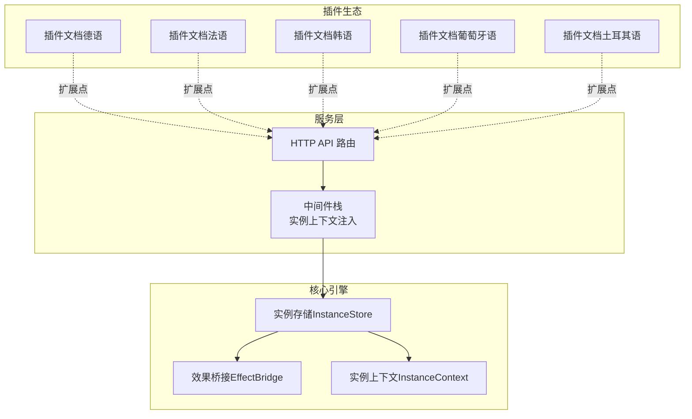
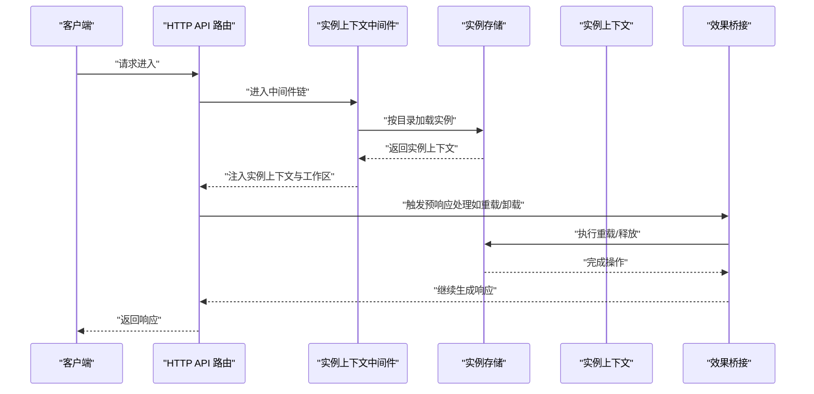
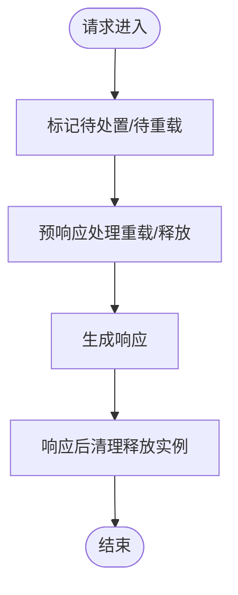
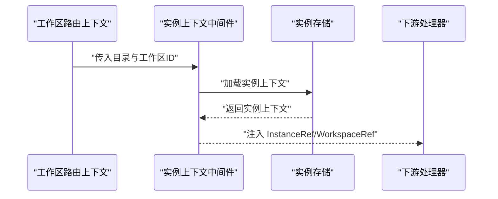
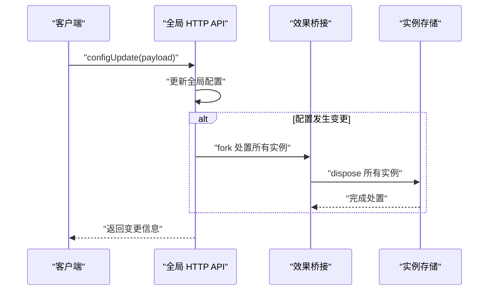
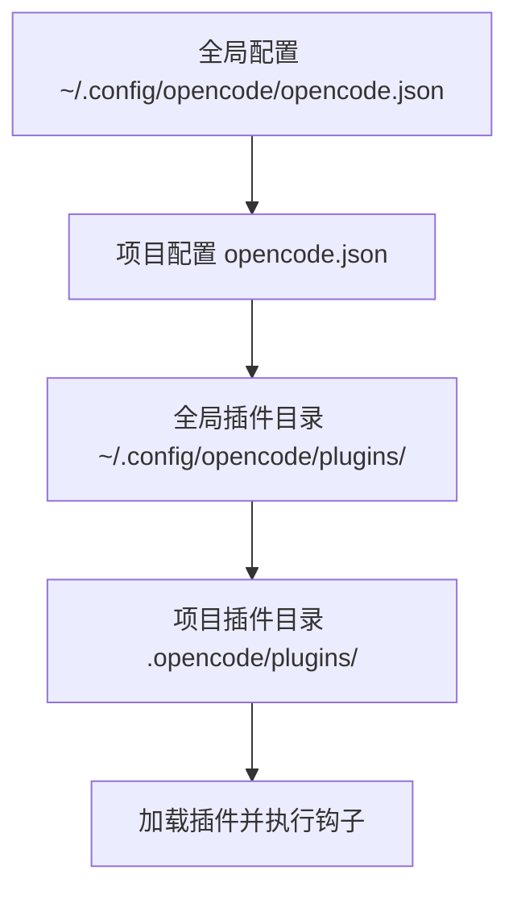
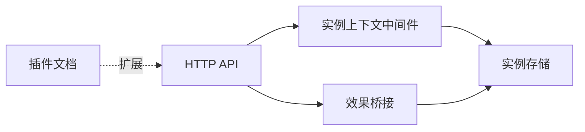

# 模块化设计原则

<cite>
**本文引用的文件**
- [packages/opencode/src/server/routes/instance/httpapi/lifecycle.ts](file://packages/opencode/src/server/routes/instance/httpapi/lifecycle.ts)
- [packages/opencode/src/server/routes/instance/httpapi/middleware/instance-context.ts](file://packages/opencode/src/server/routes/instance/httpapi/middleware/instance-context.ts)
- [packages/opencode/src/server/routes/instance/httpapi/handlers/global.ts](file://packages/opencode/src/server/routes/instance/httpapi/handlers/global.ts)
- [packages/web/src/content/docs/de/plugins.mdx](file://packages/web/src/content/docs/de/plugins.mdx)
- [packages/web/src/content/docs/fr/plugins.mdx](file://packages/web/src/content/docs/fr/plugins.mdx)
- [packages/web/src/content/docs/ko/plugins.mdx](file://packages/web/src/content/docs/ko/plugins.mdx)
- [packages/web/src/content/docs/pt-br/plugins.mdx](file://packages/web/src/content/docs/pt-br/plugins.mdx)
- [packages/web/src/content/docs/tr/plugins.mdx](file://packages/web/src/content/docs/tr/plugins.mdx)
- [CONTEXT.md](file://CONTEXT.md)
- [AGENTS.md](file://AGENTS.md)
</cite>

## 目录
1. [引言](#引言)
2. [项目结构](#项目结构)
3. [核心组件](#核心组件)
4. [架构总览](#架构总览)
5. [详细组件分析](#详细组件分析)
6. [依赖关系分析](#依赖关系分析)
7. [性能考量](#性能考量)
8. [故障排查指南](#故障排查指南)
9. [结论](#结论)
10. [附录](#附录)

## 引言
本文件面向 OpenCode 核心引擎的模块化设计，系统阐述模块边界、依赖管理与解耦策略；详解模块注入器（依赖注入、服务注册、生命周期）工作机制；描述模块间通信协议与数据交换；给出热加载与动态卸载的实现方案；并提供模块开发与扩展的最佳实践、性能优化策略以及可维护性与可扩展性的提升路径。

## 项目结构
OpenCode 采用多包（monorepo）组织方式，核心引擎位于 packages/opencode，围绕“实例上下文”“实例存储”“效果桥接（EffectBridge）”等基础设施构建模块化能力。插件生态通过文档说明了插件安装、加载顺序与钩子机制，体现模块化的扩展点与边界。

图示来源
- [packages/opencode/src/server/routes/instance/httpapi/lifecycle.ts:1-54](file://packages/opencode/src/server/routes/instance/httpapi/lifecycle.ts#L1-L54)
- [packages/opencode/src/server/routes/instance/httpapi/middleware/instance-context.ts:1-43](file://packages/opencode/src/server/routes/instance/httpapi/middleware/instance-context.ts#L1-L43)
- [packages/web/src/content/docs/de/plugins.mdx:46-73](file://packages/web/src/content/docs/de/plugins.mdx#L46-L73)
- [packages/web/src/content/docs/fr/plugins.mdx:46-73](file://packages/web/src/content/docs/fr/plugins.mdx#L46-L73)
- [packages/web/src/content/docs/ko/plugins.mdx:64-116](file://packages/web/src/content/docs/ko/plugins.mdx#L64-L116)
- [packages/web/src/content/docs/pt-br/plugins.mdx:41-72](file://packages/web/src/content/docs/pt-br/plugins.mdx#L41-L72)
- [packages/web/src/content/docs/tr/plugins.mdx:41-74](file://packages/web/src/content/docs/tr/plugins.mdx#L41-L74)

章节来源
- [packages/opencode/src/server/routes/instance/httpapi/lifecycle.ts:1-54](file://packages/opencode/src/server/routes/instance/httpapi/lifecycle.ts#L1-L54)
- [packages/opencode/src/server/routes/instance/httpapi/middleware/instance-context.ts:1-43](file://packages/opencode/src/server/routes/instance/httpapi/middleware/instance-context.ts#L1-L43)
- [packages/web/src/content/docs/de/plugins.mdx:46-73](file://packages/web/src/content/docs/de/plugins.mdx#L46-L73)
- [packages/web/src/content/docs/fr/plugins.mdx:46-73](file://packages/web/src/content/docs/fr/plugins.mdx#L46-L73)
- [packages/web/src/content/docs/ko/plugins.mdx:64-116](file://packages/web/src/content/docs/ko/plugins.mdx#L64-L116)
- [packages/web/src/content/docs/pt-br/plugins.mdx:41-72](file://packages/web/src/content/docs/pt-br/plugins.mdx#L41-L72)
- [packages/web/src/content/docs/tr/plugins.mdx:41-74](file://packages/web/src/content/docs/tr/plugins.mdx#L41-L74)

## 核心组件
- 实例上下文与存储：通过实例上下文承载会话、工作区与运行时状态，实例存储负责加载、重载与销毁。
- 效果桥接：将 Effect 程序与 HTTP 生命周期结合，支持在响应前/后执行清理或重载逻辑。
- 中间件注入：在路由处理前注入实例上下文与工作区引用，形成稳定的模块边界。
- 插件系统：通过文档说明插件安装、加载顺序与钩子机制，体现模块化扩展点。

章节来源
- [packages/opencode/src/server/routes/instance/httpapi/lifecycle.ts:1-54](file://packages/opencode/src/server/routes/instance/httpapi/lifecycle.ts#L1-L54)
- [packages/opencode/src/server/routes/instance/httpapi/middleware/instance-context.ts:1-43](file://packages/opencode/src/server/routes/instance/httpapi/middleware/instance-context.ts#L1-L43)
- [packages/web/src/content/docs/de/plugins.mdx:46-73](file://packages/web/src/content/docs/de/plugins.mdx#L46-L73)

## 架构总览
下图展示了从 HTTP 请求到实例生命周期管理的关键交互，强调模块边界与解耦：

图示来源
- [packages/opencode/src/server/routes/instance/httpapi/lifecycle.ts:18-41](file://packages/opencode/src/server/routes/instance/httpapi/lifecycle.ts#L18-L41)
- [packages/opencode/src/server/routes/instance/httpapi/middleware/instance-context.ts:23-35](file://packages/opencode/src/server/routes/instance/httpapi/middleware/instance-context.ts#L23-L35)

## 详细组件分析

### 组件一：实例生命周期与热重载
- 设计要点
  - 预响应标记：在处理阶段将“待处置/待重载”的实例信息标记到请求对象，确保响应发送后再执行清理或重载。
  - 响应后清理：中间件在响应完成后统一执行实例释放，失败时记录警告日志，避免阻塞请求。
  - 重载流程：通过效果桥接在响应前触发实例存储的重载，保证状态一致性。
- 关键接口
  - 标记待处置/待重载
  - 响应后清理中间件
  - 全局配置更新触发全局实例处置
- 数据流
  - 请求进入 → 标记 → 预响应处理 → 响应 → 清理/重载

图示来源
- [packages/opencode/src/server/routes/instance/httpapi/lifecycle.ts:18-54](file://packages/opencode/src/server/routes/instance/httpapi/lifecycle.ts#L18-L54)

章节来源
- [packages/opencode/src/server/routes/instance/httpapi/lifecycle.ts:1-54](file://packages/opencode/src/server/routes/instance/httpapi/lifecycle.ts#L1-L54)

### 组件二：实例上下文注入中间件
- 设计要点
  - 将工作区路由上下文转换为实例上下文，注入到后续处理链中。
  - 使用解码函数处理目录参数，确保路径安全。
  - 通过 Layer.effect 提供中间件服务，便于组合与替换。
- 关键接口
  - 工作区路由上下文 → 实例上下文
  - 注入 InstanceRef 与 WorkspaceRef 服务
- 依赖关系
  - 依赖实例存储进行加载
  - 依赖工作区路由上下文

图示来源
- [packages/opencode/src/server/routes/instance/httpapi/middleware/instance-context.ts:23-35](file://packages/opencode/src/server/routes/instance/httpapi/middleware/instance-context.ts#L23-L35)

章节来源
- [packages/opencode/src/server/routes/instance/httpapi/middleware/instance-context.ts:1-43](file://packages/opencode/src/server/routes/instance/httpapi/middleware/instance-context.ts#L1-L43)

### 组件三：全局 HTTP API 与配置变更
- 设计要点
  - 健康检查、事件查询、全局配置读取与更新。
  - 配置变更触发全局实例处置与重载，确保一致性。
  - 升级流程根据安装方式选择目标版本。
- 关键接口
  - health、event、configGet、configUpdate、dispose、upgrade
- 与生命周期的关系
  - configUpdate 变更触发全局实例处置
  - upgrade 触发目标版本升级

图示来源
- [packages/opencode/src/server/routes/instance/httpapi/handlers/global.ts:71-105](file://packages/opencode/src/server/routes/instance/httpapi/handlers/global.ts#L71-L105)
- [packages/opencode/src/server/routes/instance/httpapi/lifecycle.ts:23-41](file://packages/opencode/src/server/routes/instance/httpapi/lifecycle.ts#L23-L41)

章节来源
- [packages/opencode/src/server/routes/instance/httpapi/handlers/global.ts:71-105](file://packages/opencode/src/server/routes/instance/httpapi/handlers/global.ts#L71-L105)

### 组件四：插件系统与模块边界
- 设计要点
  - 插件是导出一个或多个插件函数的模块，函数接收上下文并返回钩子对象。
  - 支持 npm 与本地插件，加载顺序明确，重复 npm 包去重，相似名称的本地与 npm 插件分别加载。
  - 通过配置目录的 package.json 管理外部依赖，启动时自动安装。
- 边界与扩展点
  - 插件函数签名与钩子对象作为模块边界，隔离实现细节。
  - 加载顺序与缓存策略保证稳定性与性能。

图示来源
- [packages/web/src/content/docs/de/plugins.mdx:54-64](file://packages/web/src/content/docs/de/plugins.mdx#L54-L64)
- [packages/web/src/content/docs/fr/plugins.mdx:54-64](file://packages/web/src/content/docs/fr/plugins.mdx#L54-L64)
- [packages/web/src/content/docs/ko/plugins.mdx:64-86](file://packages/web/src/content/docs/ko/plugins.mdx#L64-L86)
- [packages/web/src/content/docs/pt-br/plugins.mdx:54-64](file://packages/web/src/content/docs/pt-br/plugins.mdx#L54-L64)
- [packages/web/src/content/docs/tr/plugins.mdx:54-64](file://packages/web/src/content/docs/tr/plugins.mdx#L54-L64)

章节来源
- [packages/web/src/content/docs/de/plugins.mdx:46-73](file://packages/web/src/content/docs/de/plugins.mdx#L46-L73)
- [packages/web/src/content/docs/fr/plugins.mdx:46-73](file://packages/web/src/content/docs/fr/plugins.mdx#L46-L73)
- [packages/web/src/content/docs/ko/plugins.mdx:64-116](file://packages/web/src/content/docs/ko/plugins.mdx#L64-L116)
- [packages/web/src/content/docs/pt-br/plugins.mdx:41-72](file://packages/web/src/content/docs/pt-br/plugins.mdx#L41-L72)
- [packages/web/src/content/docs/tr/plugins.mdx:41-74](file://packages/web/src/content/docs/tr/plugins.mdx#L41-L74)

### 组件五：系统上下文与注册表（概念）
- 设计要点
  - 位置作用域的有序生产者注册表，贡献当前系统上下文。
  - 内置与指令上下文生产者通过稳定键注册；插件定义的上下文注册与热重载生命周期基于同一注册表接口。
  - 代理可用技能指导仅列出允许的名称与描述，技能实体与位置仅通过权限检查的工具暴露。
- 影响
  - 通过注册表与作用域约束，实现上下文的可插拔与可热替换。

章节来源
- [CONTEXT.md:19-88](file://CONTEXT.md#L19-L88)
- [AGENTS.md:152-157](file://AGENTS.md#L152-L157)

## 依赖关系分析
- 模块内聚与解耦
  - 实例上下文中间件与实例存储解耦，通过服务注入与 Layer.effect 提供能力。
  - 效果桥接与 HTTP 生命周期解耦，通过预响应处理与响应后清理分离关注点。
- 外部依赖与集成点
  - 插件系统通过文档约定与加载顺序，形成稳定的扩展边界。
  - 全局 HTTP API 与实例存储/桥接协作，确保配置变更后的状态一致性。

图示来源
- [packages/opencode/src/server/routes/instance/httpapi/middleware/instance-context.ts:37-43](file://packages/opencode/src/server/routes/instance/httpapi/middleware/instance-context.ts#L37-L43)
- [packages/opencode/src/server/routes/instance/httpapi/lifecycle.ts:23-41](file://packages/opencode/src/server/routes/instance/httpapi/lifecycle.ts#L23-L41)
- [packages/web/src/content/docs/de/plugins.mdx:46-73](file://packages/web/src/content/docs/de/plugins.mdx#L46-L73)

章节来源
- [packages/opencode/src/server/routes/instance/httpapi/middleware/instance-context.ts:1-43](file://packages/opencode/src/server/routes/instance/httpapi/middleware/instance-context.ts#L1-L43)
- [packages/opencode/src/server/routes/instance/httpapi/lifecycle.ts:1-54](file://packages/opencode/src/server/routes/instance/httpapi/lifecycle.ts#L1-L54)
- [packages/web/src/content/docs/de/plugins.mdx:46-73](file://packages/web/src/content/docs/de/plugins.mdx#L46-L73)

## 性能考量
- 缓存与去重
  - 同名同版本的 npm 包仅加载一次，减少 IO 与解析开销。
- 延迟与异步
  - 预响应处理与响应后清理分离，避免阻塞主响应路径。
- 并行与中断
  - 使用不可中断的效果运行实例释放，确保清理不被打断。
- 插件依赖管理
  - 启动时集中安装依赖，避免运行期动态安装带来的抖动。

章节来源
- [packages/web/src/content/docs/de/plugins.mdx:48-50](file://packages/web/src/content/docs/de/plugins.mdx#L48-L50)
- [packages/opencode/src/server/routes/instance/httpapi/lifecycle.ts:40-52](file://packages/opencode/src/server/routes/instance/httpapi/lifecycle.ts#L40-L52)

## 故障排查指南
- 实例释放失败
  - 现象：响应已发送，但释放阶段出现错误。
  - 排查：查看中间件日志中的警告信息，确认实例上下文是否正确注入与加载。
  - 处理：修复实例资源释放逻辑，确保幂等与可恢复。
- 预响应处理未生效
  - 现象：重载/释放未按预期执行。
  - 排查：确认请求是否被标记为“待处置/待重载”，检查预响应处理链是否附加成功。
  - 处理：重新触发相关 API 或检查中间件链顺序。
- 插件加载异常
  - 现象：插件未生效或重复加载。
  - 排查：核对加载顺序与命名冲突；确认缓存目录与依赖安装状态。
  - 处理：清理缓存并重新安装依赖，或调整插件命名避免冲突。

章节来源
- [packages/opencode/src/server/routes/instance/httpapi/lifecycle.ts:40-52](file://packages/opencode/src/server/routes/instance/httpapi/lifecycle.ts#L40-L52)
- [packages/web/src/content/docs/de/plugins.mdx:54-64](file://packages/web/src/content/docs/de/plugins.mdx#L54-L64)

## 结论
OpenCode 的模块化设计通过“实例上下文注入中间件 + 实例存储 + 效果桥接”的组合，实现了清晰的模块边界与强解耦。配合插件系统的文档化扩展点与严格的加载顺序，既保障了可维护性，又提供了强大的可扩展性。热加载与动态卸载通过预响应与响应后清理机制实现，兼顾性能与一致性。建议在实际开发中遵循本文最佳实践，持续优化模块边界与依赖管理，以获得更好的系统稳定性与演进速度。

## 附录
- 最佳实践
  - 明确模块边界：以服务接口与注册表为核心，避免跨模块直接耦合。
  - 依赖注入：优先使用 Layer.effect 与服务注入，便于测试与替换。
  - 生命周期：将清理与重载逻辑置于响应后处理，确保对外可见状态一致。
  - 插件开发：遵循插件函数签名与钩子对象规范，控制加载顺序与依赖。
- 示例参考
  - 创建与注册模块：参考实例上下文中间件的服务注册与注入方式。
  - 使用模块：在 HTTP API 中通过中间件链获取实例上下文与工作区引用。
  - 热加载/卸载：参考全局 HTTP API 的配置更新与效果桥接调用。

章节来源
- [packages/opencode/src/server/routes/instance/httpapi/middleware/instance-context.ts:37-43](file://packages/opencode/src/server/routes/instance/httpapi/middleware/instance-context.ts#L37-L43)
- [packages/opencode/src/server/routes/instance/httpapi/handlers/global.ts:71-105](file://packages/opencode/src/server/routes/instance/httpapi/handlers/global.ts#L71-L105)
- [packages/web/src/content/docs/de/plugins.mdx:67-73](file://packages/web/src/content/docs/de/plugins.mdx#L67-L73)