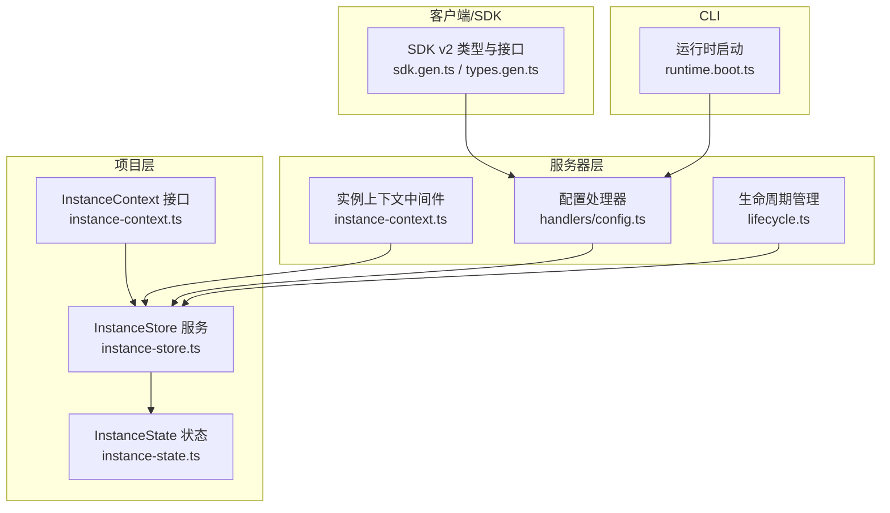
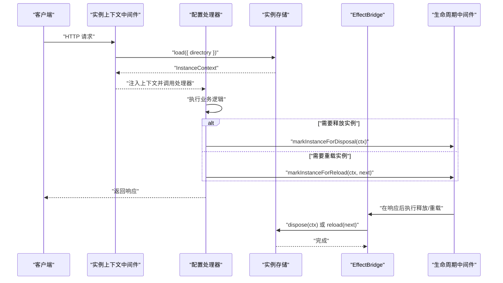
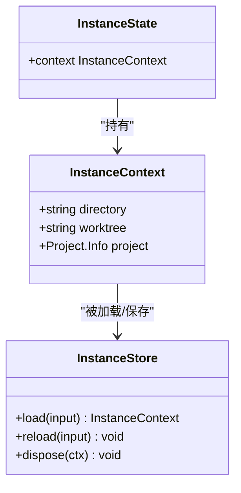
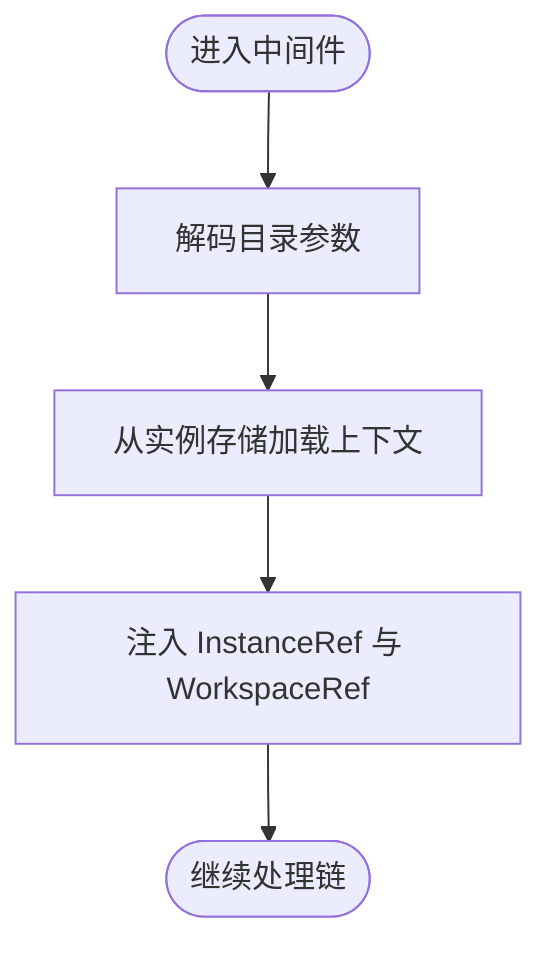
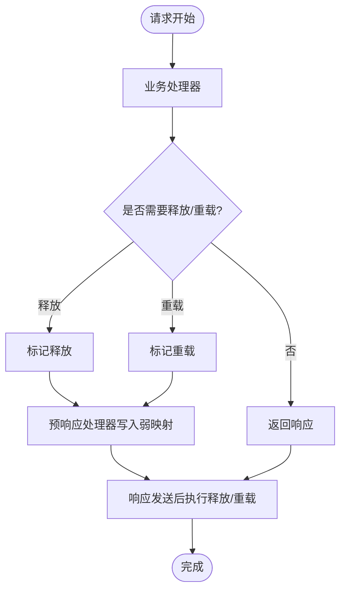
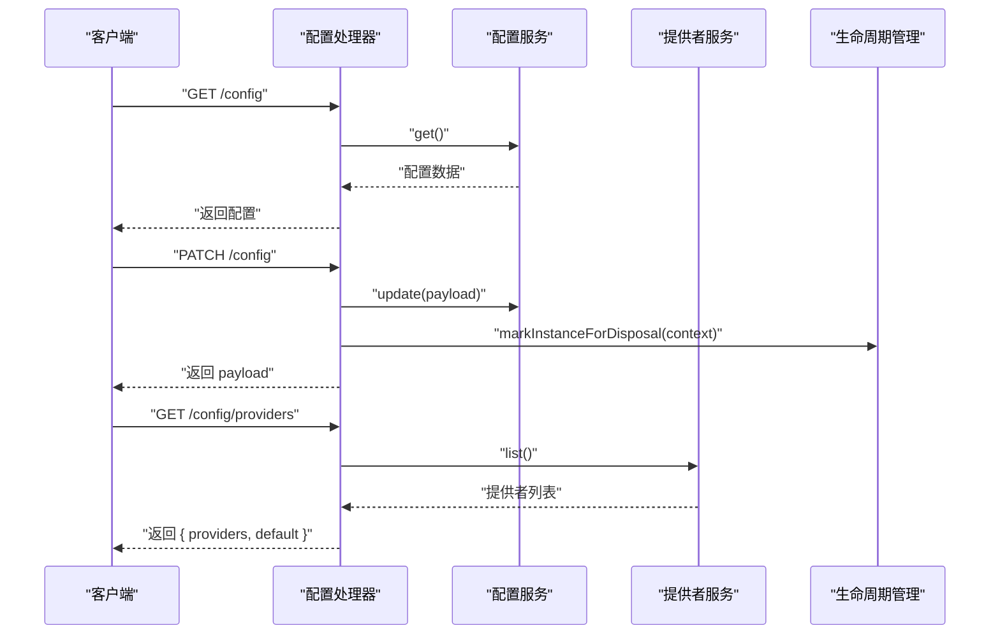
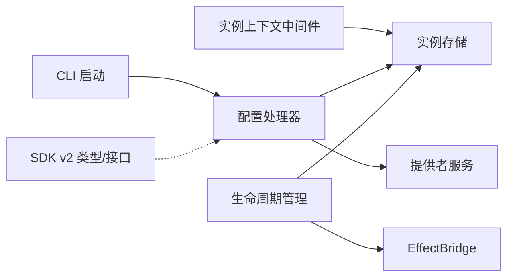

# 系统上下文处理

<cite>
**本文引用的文件**
- [packages/opencode/src/project/instance-context.ts](file://packages/opencode/src/project/instance-context.ts)
- [packages/opencode/src/project/instance-store.ts](file://packages/opencode/src/project/instance-store.ts)
- [packages/opencode/src/effect/instance-state.ts](file://packages/opencode/src/effect/instance-state.ts)
- [packages/opencode/src/effect/bridge.ts](file://packages/opencode/src/effect/bridge.ts)
- [packages/opencode/src/server/routes/instance/httpapi/middleware/instance-context.ts](file://packages/opencode/src/server/routes/instance/httpapi/middleware/instance-context.ts)
- [packages/opencode/src/server/routes/instance/httpapi/lifecycle.ts](file://packages/opencode/src/server/routes/instance/httpapi/lifecycle.ts)
- [packages/opencode/src/server/routes/instance/httpapi/handlers/config.ts](file://packages/opencode/src/server/routes/instance/httpapi/handlers/config.ts)
- [packages/opencode/src/cli/cmd/run/runtime.boot.ts](file://packages/opencode/src/cli/cmd/run/runtime.boot.ts)
- [packages/sdk/js/src/v2/gen/sdk.gen.ts](file://packages/sdk/js/src/v2/gen/sdk.gen.ts)
- [packages/sdk/js/src/v2/gen/types.gen.ts](file://packages/sdk/js/src/v2/gen/types.gen.ts)
- [CONTEXT.md](file://CONTEXT.md)
</cite>

## 目录
1. [引言](#引言)
2. [项目结构](#项目结构)
3. [核心组件](#核心组件)
4. [架构总览](#架构总览)
5. [详细组件分析](#详细组件分析)
6. [依赖关系分析](#依赖关系分析)
7. [性能考量](#性能考量)
8. [故障排查指南](#故障排查指南)
9. [结论](#结论)
10. [附录](#附录)

## 引言
本技术文档围绕 OpenCode 系统的“系统上下文处理”展开，目标是帮助读者理解：
- 系统上下文的概念与作用：如何在多组件环境中维护与传递上下文信息（如工作区目录、工作树、项目元数据等）。
- 上下文提供者的注册与管理：如何动态加载与卸载上下文，以及与 AI 提供者能力（如上下文长度限制）的联动。
- 上下文存储策略：内存缓存、持久化存储与缓存失效机制。
- 上下文继承与隔离：如何保证不同组件之间的上下文独立性。
- 配置与扩展：如何通过配置与类型系统扩展上下文能力。
- 与 AI 模型交互：如何在上下文中体现模型能力与限制。

本文件以仓库中的实际代码为依据，结合架构图与流程图进行说明，便于非专业读者也能理解。

## 项目结构
OpenCode 的上下文处理主要分布在以下模块：
- 项目级上下文与存储：实例上下文接口、实例存储服务与状态管理。
- 服务器中间件：基于 HTTP API 的实例上下文注入与生命周期管理。
- 客户端与 SDK：配置与提供者列表的查询与更新。
- CLI 运行时：运行时启动阶段对上下文与模型能力的解析与应用。

图表来源
- [packages/opencode/src/project/instance-context.ts:5-9](file://packages/opencode/src/project/instance-context.ts#L5-L9)
- [packages/opencode/src/project/instance-store.ts](file://packages/opencode/src/project/instance-store.ts)
- [packages/opencode/src/effect/instance-state.ts](file://packages/opencode/src/effect/instance-state.ts)
- [packages/opencode/src/server/routes/instance/httpapi/middleware/instance-context.ts:1-43](file://packages/opencode/src/server/routes/instance/httpapi/middleware/instance-context.ts#L1-L43)
- [packages/opencode/src/server/routes/instance/httpapi/lifecycle.ts:1-54](file://packages/opencode/src/server/routes/instance/httpapi/lifecycle.ts#L1-L54)
- [packages/opencode/src/server/routes/instance/httpapi/handlers/config.ts:1-34](file://packages/opencode/src/server/routes/instance/httpapi/handlers/config.ts#L1-L34)
- [packages/opencode/src/cli/cmd/run/runtime.boot.ts:84-129](file://packages/opencode/src/cli/cmd/run/runtime.boot.ts#L84-L129)
- [packages/sdk/js/src/v2/gen/sdk.gen.ts:3233-3298](file://packages/sdk/js/src/v2/gen/sdk.gen.ts#L3233-L3298)
- [packages/sdk/js/src/v2/gen/types.gen.ts:2133-2145](file://packages/sdk/js/src/v2/gen/types.gen.ts#L2133-L2145)

章节来源
- [packages/opencode/src/project/instance-context.ts:5-9](file://packages/opencode/src/project/instance-context.ts#L5-L9)
- [packages/opencode/src/project/instance-store.ts](file://packages/opencode/src/project/instance-store.ts)
- [packages/opencode/src/effect/instance-state.ts](file://packages/opencode/src/effect/instance-state.ts)
- [packages/opencode/src/server/routes/instance/httpapi/middleware/instance-context.ts:1-43](file://packages/opencode/src/server/routes/instance/httpapi/middleware/instance-context.ts#L1-L43)
- [packages/opencode/src/server/routes/instance/httpapi/lifecycle.ts:1-54](file://packages/opencode/src/server/routes/instance/httpapi/lifecycle.ts#L1-L54)
- [packages/opencode/src/server/routes/instance/httpapi/handlers/config.ts:1-34](file://packages/opencode/src/server/routes/instance/httpapi/handlers/config.ts#L1-L34)
- [packages/opencode/src/cli/cmd/run/runtime.boot.ts:84-129](file://packages/opencode/src/cli/cmd/run/runtime.boot.ts#L84-L129)
- [packages/sdk/js/src/v2/gen/sdk.gen.ts:3233-3298](file://packages/sdk/js/src/v2/gen/sdk.gen.ts#L3233-L3298)
- [packages/sdk/js/src/v2/gen/types.gen.ts:2133-2145](file://packages/sdk/js/src/v2/gen/types.gen.ts#L2133-L2145)

## 核心组件
- 实例上下文接口：定义了上下文的基本字段，如工作区目录、工作树与项目信息。
- 实例存储服务：负责从磁盘或缓存中加载/保存实例上下文，并支持重载与释放。
- 实例状态：提供当前实例上下文的访问入口，用于在处理链路中获取上下文。
- 实例上下文中间件：在 HTTP 请求进入时，根据路由参数加载实例上下文并注入到服务上下文中。
- 生命周期管理：在响应返回后执行实例释放或重载，确保资源正确回收与切换。
- 配置处理器：提供获取与更新全局配置的能力，并在更新后触发实例重载或释放。
- CLI 启动：在运行时解析模型提供者能力（如上下文长度限制），并与上下文策略协同。

章节来源
- [packages/opencode/src/project/instance-context.ts:5-9](file://packages/opencode/src/project/instance-context.ts#L5-L9)
- [packages/opencode/src/project/instance-store.ts](file://packages/opencode/src/project/instance-store.ts)
- [packages/opencode/src/effect/instance-state.ts](file://packages/opencode/src/effect/instance-state.ts)
- [packages/opencode/src/server/routes/instance/httpapi/middleware/instance-context.ts:1-43](file://packages/opencode/src/server/routes/instance/httpapi/middleware/instance-context.ts#L1-L43)
- [packages/opencode/src/server/routes/instance/httpapi/lifecycle.ts:1-54](file://packages/opencode/src/server/routes/instance/httpapi/lifecycle.ts#L1-L54)
- [packages/opencode/src/server/routes/instance/httpapi/handlers/config.ts:1-34](file://packages/opencode/src/server/routes/instance/httpapi/handlers/config.ts#L1-L34)
- [packages/opencode/src/cli/cmd/run/runtime.boot.ts:84-129](file://packages/opencode/src/cli/cmd/run/runtime.boot.ts#L84-L129)

## 架构总览
OpenCode 的上下文处理采用“请求驱动 + 生命周期分离”的设计：
- 请求进入：中间件根据路由参数加载实例上下文，注入到服务上下文。
- 处理阶段：业务处理器读取上下文并执行逻辑。
- 响应阶段：根据操作结果标记实例释放或重载；在响应发送后再执行清理/重载，避免竞态。
- 配置变更：当配置更新时，触发实例重载，使新配置生效。

图表来源
- [packages/opencode/src/server/routes/instance/httpapi/middleware/instance-context.ts:23-35](file://packages/opencode/src/server/routes/instance/httpapi/middleware/instance-context.ts#L23-L35)
- [packages/opencode/src/server/routes/instance/httpapi/handlers/config.ts:18-22](file://packages/opencode/src/server/routes/instance/httpapi/handlers/config.ts#L18-L22)
- [packages/opencode/src/server/routes/instance/httpapi/lifecycle.ts:23-41](file://packages/opencode/src/server/routes/instance/httpapi/lifecycle.ts#L23-L41)
- [packages/opencode/src/effect/bridge.ts](file://packages/opencode/src/effect/bridge.ts)

## 详细组件分析

### 实例上下文与存储
- 实例上下文接口：包含工作区目录、工作树与项目信息，作为跨组件传递的基础载体。
- 实例存储服务：负责加载、保存、重载与释放实例上下文，支持从磁盘或缓存恢复。
- 实例状态：提供当前实例上下文的访问入口，便于在处理链路中统一获取。

图表来源
- [packages/opencode/src/project/instance-context.ts:5-9](file://packages/opencode/src/project/instance-context.ts#L5-L9)
- [packages/opencode/src/project/instance-store.ts](file://packages/opencode/src/project/instance-store.ts)
- [packages/opencode/src/effect/instance-state.ts](file://packages/opencode/src/effect/instance-state.ts)

章节来源
- [packages/opencode/src/project/instance-context.ts:5-9](file://packages/opencode/src/project/instance-context.ts#L5-L9)
- [packages/opencode/src/project/instance-store.ts](file://packages/opencode/src/project/instance-store.ts)
- [packages/opencode/src/effect/instance-state.ts](file://packages/opencode/src/effect/instance-state.ts)

### 实例上下文中间件
- 路由解码：对路径参数进行安全解码，防止异常字符。
- 上下文注入：从实例存储加载上下文后，注入到服务上下文中，供后续处理器使用。
- 依赖关系：依赖工作区路由上下文与实例存储服务。

图表来源
- [packages/opencode/src/server/routes/instance/httpapi/middleware/instance-context.ts:15-35](file://packages/opencode/src/server/routes/instance/httpapi/middleware/instance-context.ts#L15-L35)

章节来源
- [packages/opencode/src/server/routes/instance/httpapi/middleware/instance-context.ts:1-43](file://packages/opencode/src/server/routes/instance/httpapi/middleware/instance-context.ts#L1-L43)

### 生命周期管理
- 标记释放/重载：在处理器中根据结果标记实例释放或重载，但不立即执行。
- 响应后执行：通过 HTTP 预响应处理器将标记写入弱映射，在响应发送后再执行释放/重载。
- 中断保护：使用不可中断的 Effect 执行释放，失败时记录警告日志。

图表来源
- [packages/opencode/src/server/routes/instance/httpapi/lifecycle.ts:18-54](file://packages/opencode/src/server/routes/instance/httpapi/lifecycle.ts#L18-L54)

章节来源
- [packages/opencode/src/server/routes/instance/httpapi/lifecycle.ts:1-54](file://packages/opencode/src/server/routes/instance/httpapi/lifecycle.ts#L1-L54)

### 配置与提供者
- 获取配置：直接返回当前配置。
- 更新配置：更新配置后，标记实例释放，以便在响应后回收旧上下文。
- 列出提供者：返回可用提供者列表及默认模型选择。

图表来源
- [packages/opencode/src/server/routes/instance/httpapi/handlers/config.ts:14-30](file://packages/opencode/src/server/routes/instance/httpapi/handlers/config.ts#L14-L30)

章节来源
- [packages/opencode/src/server/routes/instance/httpapi/handlers/config.ts:1-34](file://packages/opencode/src/server/routes/instance/httpapi/handlers/config.ts#L1-L34)

### CLI 运行时与模型上下文
- 在运行时启动阶段，解析提供者列表与模型能力，构建上下文长度限制映射。
- 将限制信息用于后续的上下文截断与提示策略，确保与模型输入/输出限制一致。

章节来源
- [packages/opencode/src/cli/cmd/run/runtime.boot.ts:84-129](file://packages/opencode/src/cli/cmd/run/runtime.boot.ts#L84-L129)

### SDK 与类型系统
- SDK v2 提供配置与提供者接口，支持按目录/workspace 查询提供者列表与认证方法。
- 类型系统定义了 Provider 与 Config 的结构，便于在前端/CLI 中进行类型安全的上下文扩展。

章节来源
- [packages/sdk/js/src/v2/gen/sdk.gen.ts:3233-3298](file://packages/sdk/js/src/v2/gen/sdk.gen.ts#L3233-L3298)
- [packages/sdk/js/src/v2/gen/types.gen.ts:2133-2145](file://packages/sdk/js/src/v2/gen/types.gen.ts#L2133-L2145)

## 依赖关系分析
- 组件耦合：中间件依赖实例存储；处理器依赖配置/提供者服务；生命周期依赖 EffectBridge 与实例存储。
- 外部依赖：SDK 类型与接口用于前端/CLI 与后端的契约定义；CLI 解析提供者能力用于上下文策略。
- 循环依赖：当前结构通过服务注入与中间件分层避免循环依赖。

图表来源
- [packages/opencode/src/server/routes/instance/httpapi/middleware/instance-context.ts:37-43](file://packages/opencode/src/server/routes/instance/httpapi/middleware/instance-context.ts#L37-L43)
- [packages/opencode/src/server/routes/instance/httpapi/handlers/config.ts:11-12](file://packages/opencode/src/server/routes/instance/httpapi/handlers/config.ts#L11-L12)
- [packages/opencode/src/server/routes/instance/httpapi/lifecycle.ts:18-21](file://packages/opencode/src/server/routes/instance/httpapi/lifecycle.ts#L18-L21)
- [packages/opencode/src/cli/cmd/run/runtime.boot.ts:93-123](file://packages/opencode/src/cli/cmd/run/runtime.boot.ts#L93-L123)
- [packages/sdk/js/src/v2/gen/sdk.gen.ts:3233-3298](file://packages/sdk/js/src/v2/gen/sdk.gen.ts#L3233-L3298)

章节来源
- [packages/opencode/src/server/routes/instance/httpapi/middleware/instance-context.ts:1-43](file://packages/opencode/src/server/routes/instance/httpapi/middleware/instance-context.ts#L1-L43)
- [packages/opencode/src/server/routes/instance/httpapi/handlers/config.ts:1-34](file://packages/opencode/src/server/routes/instance/httpapi/handlers/config.ts#L1-L34)
- [packages/opencode/src/server/routes/instance/httpapi/lifecycle.ts:1-54](file://packages/opencode/src/server/routes/instance/httpapi/lifecycle.ts#L1-L54)
- [packages/opencode/src/cli/cmd/run/runtime.boot.ts:84-129](file://packages/opencode/src/cli/cmd/run/runtime.boot.ts#L84-L129)
- [packages/sdk/js/src/v2/gen/sdk.gen.ts:3233-3298](file://packages/sdk/js/src/v2/gen/sdk.gen.ts#L3233-L3298)

## 性能考量
- 内存缓存：中间件在请求阶段加载上下文，减少重复 IO；释放/重载在响应后异步执行，避免阻塞请求。
- 缓存失效：配置更新触发实例重载，确保新配置生效；释放后实例资源回收，降低内存占用。
- 并发控制：CLI 启动阶段对任务进行复用，避免重复解析提供者能力。
- 日志与可观测性：释放失败时记录警告日志，便于定位问题。

## 故障排查指南
- 上下文加载失败：检查路由参数解码与实例存储加载逻辑，确认目录参数有效。
- 实例释放/重载异常：查看生命周期中间件的日志，确认 EffectBridge 是否正常运行。
- 配置更新无效：确认处理器已标记释放/重载，且响应后中间件已执行清理/重载。
- CLI 启动报错：检查提供者能力解析逻辑，确认模型上下文限制映射构建成功。

章节来源
- [packages/opencode/src/server/routes/instance/httpapi/middleware/instance-context.ts:15-35](file://packages/opencode/src/server/routes/instance/httpapi/middleware/instance-context.ts#L15-L35)
- [packages/opencode/src/server/routes/instance/httpapi/lifecycle.ts:43-54](file://packages/opencode/src/server/routes/instance/httpapi/lifecycle.ts#L43-L54)
- [packages/opencode/src/server/routes/instance/httpapi/handlers/config.ts:18-22](file://packages/opencode/src/server/routes/instance/httpapi/handlers/config.ts#L18-L22)
- [packages/opencode/src/cli/cmd/run/runtime.boot.ts:93-123](file://packages/opencode/src/cli/cmd/run/runtime.boot.ts#L93-L123)

## 结论
OpenCode 的上下文处理通过“请求驱动 + 生命周期分离”的模式，实现了在多组件环境中的上下文统一管理与传递。中间件负责上下文注入，处理器负责业务逻辑，生命周期中间件负责资源回收与重载，CLI 与 SDK 则提供了配置与能力解析的支撑。该架构既保证了上下文的可维护性，也兼顾了性能与可观测性。

## 附录
- 上下文概念与作用：在 OpenCode 中，上下文承载工作区、工作树与项目信息，是跨组件协作的基础。
- 动态加载与卸载：通过中间件加载、生命周期中间件在响应后执行释放/重载，实现动态上下文管理。
- 存储策略：内存缓存 + 持久化存储（实例存储），配合释放/重载实现缓存失效。
- 继承与隔离：通过中间件注入与 Effect 服务提供，确保各组件在各自作用域内访问独立上下文。
- 配置与扩展：通过 SDK 类型与 CLI 解析，扩展上下文能力（如模型上下文限制）。
- 与 AI 模型交互：CLI 启动阶段解析提供者能力，结合上下文策略控制模型输入/输出长度。

章节来源
- [CONTEXT.md](file://CONTEXT.md)
- [packages/opencode/src/project/instance-context.ts:5-9](file://packages/opencode/src/project/instance-context.ts#L5-L9)
- [packages/opencode/src/server/routes/instance/httpapi/middleware/instance-context.ts:23-35](file://packages/opencode/src/server/routes/instance/httpapi/middleware/instance-context.ts#L23-L35)
- [packages/opencode/src/server/routes/instance/httpapi/lifecycle.ts:23-41](file://packages/opencode/src/server/routes/instance/httpapi/lifecycle.ts#L23-L41)
- [packages/opencode/src/server/routes/instance/httpapi/handlers/config.ts:14-30](file://packages/opencode/src/server/routes/instance/httpapi/handlers/config.ts#L14-L30)
- [packages/opencode/src/cli/cmd/run/runtime.boot.ts:84-129](file://packages/opencode/src/cli/cmd/run/runtime.boot.ts#L84-L129)
- [packages/sdk/js/src/v2/gen/sdk.gen.ts:3233-3298](file://packages/sdk/js/src/v2/gen/sdk.gen.ts#L3233-L3298)
- [packages/sdk/js/src/v2/gen/types.gen.ts:2133-2145](file://packages/sdk/js/src/v2/gen/types.gen.ts#L2133-L2145)