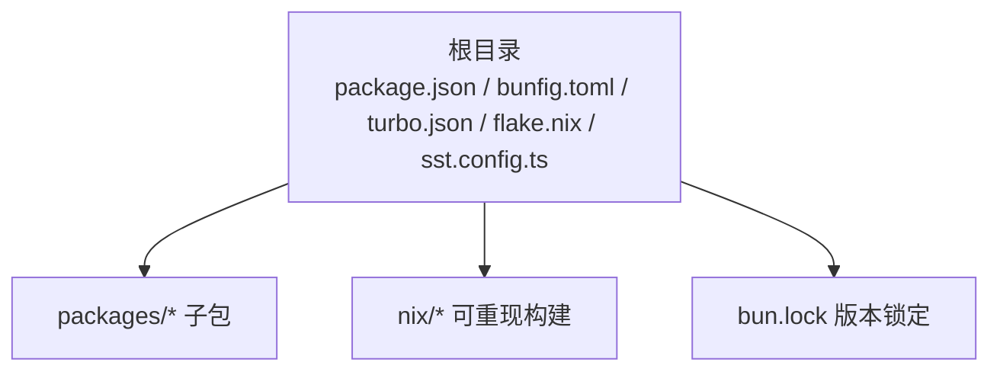
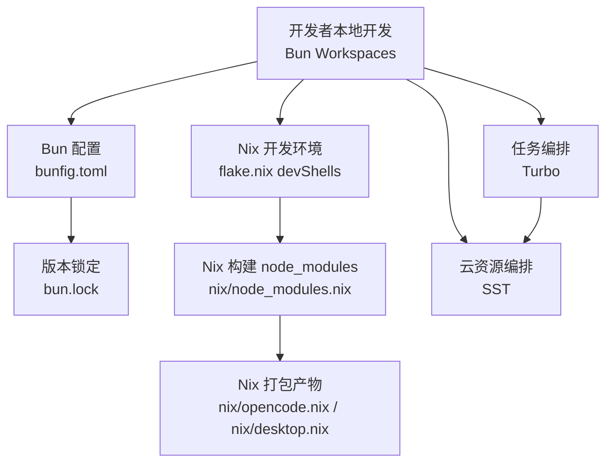
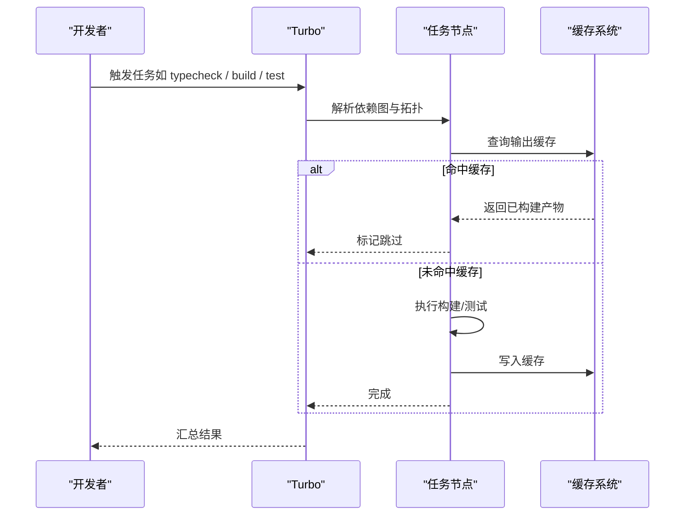
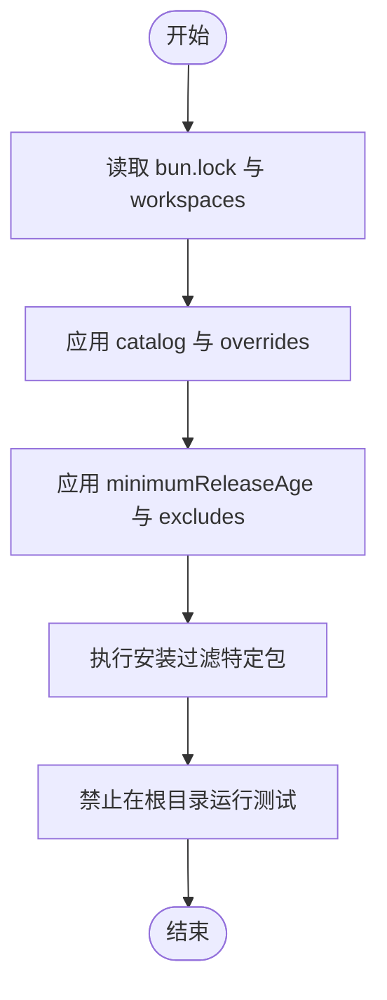
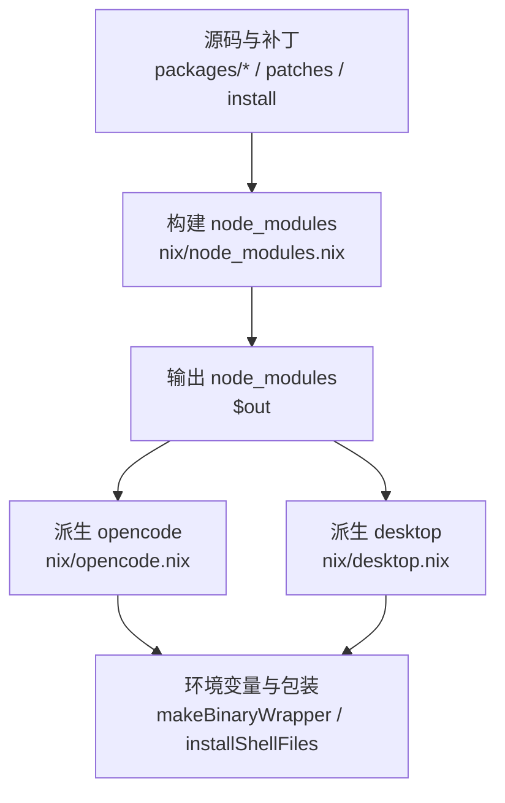
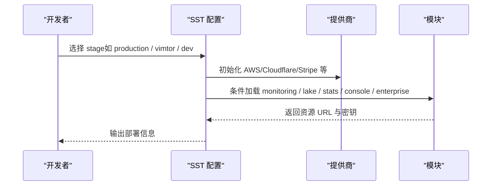
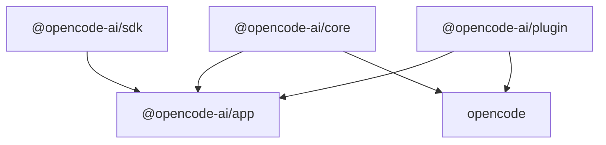
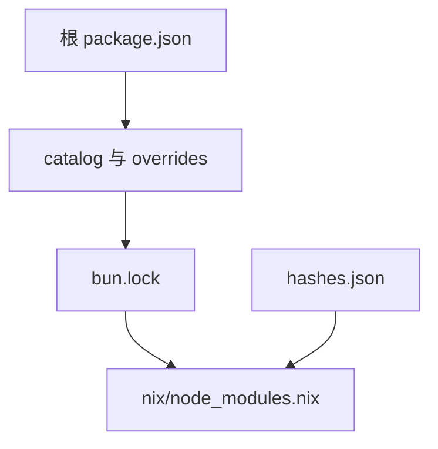

# Monorepo 架构

<cite>
**本文引用的文件**
- [turbo.json](file://turbo.json)
- [bunfig.toml](file://bunfig.toml)
- [flake.nix](file://flake.nix)
- [package.json](file://package.json)
- [bun.lock](file://bun.lock)
- [nix/node_modules.nix](file://nix/node_modules.nix)
- [nix/opencode.nix](file://nix/opencode.nix)
- [nix/desktop.nix](file://nix/desktop.nix)
- [packages/opencode/package.json](file://packages/opencode/package.json)
- [packages/core/package.json](file://packages/core/package.json)
- [packages/app/package.json](file://packages/app/package.json)
- [sst.config.ts](file://sst.config.ts)
</cite>

## 目录
1. [引言](#引言)
2. [项目结构](#项目结构)
3. [核心组件](#核心组件)
4. [架构总览](#架构总览)
5. [详细组件分析](#详细组件分析)
6. [依赖关系分析](#依赖关系分析)
7. [性能考量](#性能考量)
8. [故障排查指南](#故障排查指南)
9. [结论](#结论)
10. [附录](#附录)

## 引言
本文件面向 OpenCode 的多包仓库（Monorepo）架构，系统性阐述其设计理念与工程优势：统一包管理策略、依赖关系治理、构建与缓存优化、以及跨平台可重现构建能力。重点覆盖以下技术栈与工具链：
- 包管理与版本控制：Bun 及其 lockfile、workspaces、catalog 与 overrides
- 构建与任务编排：Turbo 的任务并行化、缓存与增量构建
- 系统级可重现构建：Nix 在开发环境与产物打包中的应用
- 云原生基础设施：SST 配置与多阶段部署

通过本文件，读者可以理解如何在多包环境中高效开发、测试、构建与发布。

## 项目结构
OpenCode 采用以根目录为中心的 Monorepo 结构，核心文件位于根目录，各子包位于 packages/* 下，并辅以 Nix 衍生物用于可重现构建与打包。关键入口与配置如下：
- 根级包管理与脚本：package.json
- 包管理器配置：bunfig.toml
- 任务编排与缓存：turbo.json
- 可重现构建与打包：flake.nix、nix/*.nix
- 云资源编排：sst.config.ts
- 锁定文件：bun.lock

图示来源
- [package.json:1-156](file://package.json#L1-L156)
- [bunfig.toml:1-9](file://bunfig.toml#L1-L9)
- [turbo.json:1-26](file://turbo.json#L1-L26)
- [flake.nix:1-74](file://flake.nix#L1-L74)
- [bun.lock:1-800](file://bun.lock#L1-L800)

章节来源
- [package.json:1-156](file://package.json#L1-L156)
- [bunfig.toml:1-9](file://bunfig.toml#L1-L9)
- [turbo.json:1-26](file://turbo.json#L1-L26)
- [flake.nix:1-74](file://flake.nix#L1-L74)
- [bun.lock:1-800](file://bun.lock#L1-L800)

## 核心组件
- 包管理与版本治理
  - 使用 Bun 作为包管理器与运行时，配合 workspaces 统一管理多包依赖；通过 catalog 与 overrides 实现版本一致性与快速升级。
  - 使用 minimumReleaseAge 与 minimumReleaseAgeExcludes 控制新版本引入节奏，降低上游不稳定风险。
- 任务编排与缓存
  - Turbo 管理类型检查、构建与测试等任务，支持按包拓扑并行与增量构建，结合全局环境变量提升 CI 可靠性。
- 可重现构建与打包
  - Nix 将 node_modules 与二进制产物固化，确保不同平台一致产出；提供开发 Shell 与打包目标，便于本地与 CI 使用。
- 云资源编排
  - SST 配置按阶段加载模块，实现 AWS/Cloudflare 等提供商的统一管理与条件部署。

章节来源
- [package.json:24-93](file://package.json#L24-L93)
- [bunfig.toml:1-9](file://bunfig.toml#L1-L9)
- [turbo.json:5-24](file://turbo.json#L5-L24)
- [flake.nix:21-31](file://flake.nix#L21-L31)
- [nix/node_modules.nix:48-64](file://nix/node_modules.nix#L48-L64)
- [sst.config.ts:1-54](file://sst.config.ts#L1-L54)

## 架构总览
下图展示从开发到构建、再到可重现打包的整体流程，体现多包协作与工具链协同：

图示来源
- [bunfig.toml:1-9](file://bunfig.toml#L1-L9)
- [bun.lock:1-800](file://bun.lock#L1-L800)
- [turbo.json:1-26](file://turbo.json#L1-L26)
- [flake.nix:21-31](file://flake.nix#L21-L31)
- [nix/node_modules.nix:48-64](file://nix/node_modules.nix#L48-L64)
- [nix/opencode.nix:16-53](file://nix/opencode.nix#L16-L53)
- [nix/desktop.nix:16-77](file://nix/desktop.nix#L16-L77)
- [sst.config.ts:1-54](file://sst.config.ts#L1-L54)

## 详细组件分析

### Turbo 工作流与任务编排
- 全局环境与传递变量
  - 通过 globalEnv 与 globalPassThroughEnv 指定 CI 与开关类变量，保证任务在不同环境的一致性。
- 任务定义与依赖
  - 类型检查、构建与测试任务按需声明；测试任务对上层构建结果进行依赖，确保顺序正确。
- 输出缓存
  - 构建任务声明输出目录，Turbo 增量构建基于输出指纹与依赖图进行缓存命中判断。

图示来源
- [turbo.json:3-24](file://turbo.json#L3-L24)

章节来源
- [turbo.json:1-26](file://turbo.json#L1-L26)

### Bun 包管理器与版本治理
- Workspaces 与 Catalog
  - 根 package.json 的 workspaces 字段聚合多包路径；通过 catalog 与 overrides 统一依赖版本，减少重复与冲突。
- 锁定与最小发布年龄
  - bun.lock 记录精确版本；bunfig.toml 的 minimumReleaseAge 与 excludes 控制新版本引入窗口，避免上游不稳定包影响主干。
- 测试隔离
  - 根 package.json 明确禁止在根目录直接运行测试，防止误触发与环境污染。

图示来源
- [package.json:24-93](file://package.json#L24-L93)
- [bunfig.toml:1-9](file://bunfig.toml#L1-L9)
- [bun.lock:1-800](file://bun.lock#L1-L800)

章节来源
- [package.json:24-93](file://package.json#L24-L93)
- [bunfig.toml:1-9](file://bunfig.toml#L1-L9)
- [bun.lock:1-800](file://bun.lock#L1-L800)

### Nix 在系统配置中的作用
- 开发环境
  - flake.nix 提供 devShells，包含 bun、nodejs、pkg-config、openssl、git 等常用工具，确保团队开发环境一致。
- 可重现构建 node_modules
  - nix/node_modules.nix 将源码与补丁纳入 fileset，构建时仅安装指定包并规范化 node_modules，输出固定哈希，保证可重现。
- 打包与封装
  - nix/opencode.nix 与 nix/desktop.nix 将构建产物复制到 $out，设置环境变量与 shebang，生成可执行程序与桌面应用分发包。
- 平台与二进制
  - 自动检测 CPU/OS 并选择对应二进制，Linux 平台自动修补 ELF 依赖，macOS 平台进行签名与包装。

图示来源
- [flake.nix:21-31](file://flake.nix#L21-L31)
- [nix/node_modules.nix:25-37](file://nix/node_modules.nix#L25-L37)
- [nix/node_modules.nix:48-64](file://nix/node_modules.nix#L48-L64)
- [nix/opencode.nix:16-53](file://nix/opencode.nix#L16-L53)
- [nix/desktop.nix:16-77](file://nix/desktop.nix#L16-L77)

章节来源
- [flake.nix:1-74](file://flake.nix#L1-L74)
- [nix/node_modules.nix:1-86](file://nix/node_modules.nix#L1-L86)
- [nix/opencode.nix:1-103](file://nix/opencode.nix#L1-L103)
- [nix/desktop.nix:1-111](file://nix/desktop.nix#L1-L111)

### 云资源编排（SST）
- 应用与提供商
  - 通过 sst.config.ts 定义应用名称、删除策略、保护状态与提供商（AWS/Cloudflare/Stripe 等），并按阶段动态加载模块。
- 条件部署
  - 根据 stage 判断是否部署监控、数据湖与统计服务，支持生产与预发布环境差异化配置。

图示来源
- [sst.config.ts:1-54](file://sst.config.ts#L1-L54)

章节来源
- [sst.config.ts:1-54](file://sst.config.ts#L1-L54)

### 多包依赖关系与导出约定
- 导出与条件导入
  - 各包通过 exports 与 imports 约定模块入口与平台条件导入（如 sqlite、pty、fff），提升可移植性与可维护性。
- 工作区依赖
  - 多数包以 workspace:* 引用内部包，减少外部依赖耦合，便于统一升级与热更新。

图示来源
- [packages/core/package.json:18-40](file://packages/core/package.json#L18-L40)
- [packages/app/package.json:6-13](file://packages/app/package.json#L6-L13)
- [packages/opencode/package.json:21-30](file://packages/opencode/package.json#L21-L30)

章节来源
- [packages/core/package.json:1-129](file://packages/core/package.json#L1-L129)
- [packages/app/package.json:1-82](file://packages/app/package.json#L1-L82)
- [packages/opencode/package.json:1-156](file://packages/opencode/package.json#L1-L156)

## 依赖关系分析
- 版本治理
  - 根 package.json 使用 catalog 与 overrides 统一版本，减少分散配置带来的漂移。
- 锁定文件
  - bun.lock 记录每个包的确切版本与依赖树，确保本地与 CI 一致性。
- Nix 固化
  - nix/node_modules.nix 通过 fileset 与输出哈希，将 node_modules 固化为可验证的构建产物。

图示来源
- [package.json:32-141](file://package.json#L32-L141)
- [bun.lock:1-800](file://bun.lock#L1-L800)
- [nix/node_modules.nix:7-11](file://nix/node_modules.nix#L7-L11)

章节来源
- [package.json:32-141](file://package.json#L32-L141)
- [bun.lock:1-800](file://bun.lock#L1-L800)
- [nix/node_modules.nix:1-86](file://nix/node_modules.nix#L1-L86)

## 性能考量
- Turbo 增量构建与缓存
  - 通过任务输出目录与依赖图，避免重复计算；在 CI 中建议开启共享缓存以进一步提升速度。
- Bun 安装优化
  - 使用 minimumReleaseAge 与 excludes 控制新版本引入，降低不稳定包导致的失败率；在 CI 中可结合 frozen-lockfile 与忽略脚本提升稳定性。
- Nix 可重现构建
  - 通过固定哈希与 fileset，确保不同机器与 CI 步骤间的一致性，减少“本地可用、CI 失败”的问题。

## 故障排查指南
- 根目录测试被阻止
  - 根 package.json 显式禁止在根目录运行测试，应切换至具体包目录执行测试。
- Nix 构建哈希不匹配
  - 若 node_modules 哈希校验失败，可使用 updater 衍生（fakeHash）定位正确哈希，再回填到 hashes.json。
- Electron/Linux 运行时缺失
  - desktop 打包在 Linux 平台需要 autoPatchelfHook 与系统库，确保构建环境具备相应依赖。
- SST 阶段配置错误
  - 检查 sst.config.ts 的 providers 与 stage 判断逻辑，确认所需模块已按条件加载。

章节来源
- [package.json:22-22](file://package.json#L22-L22)
- [nix/node_modules.nix:67-69](file://nix/node_modules.nix#L67-L69)
- [nix/desktop.nix:30-35](file://nix/desktop.nix#L30-L35)
- [sst.config.ts:30-52](file://sst.config.ts#L30-L52)

## 结论
OpenCode 的 Monorepo 架构以 Bun 为核心包管理器，结合 Turbo 的任务编排与 Nix 的可重现构建，实现了高一致性、高性能与强可维护性的多包开发体验。通过 catalog/overrides、minimumReleaseAge、以及 Nix 固化策略，团队能够在快速迭代的同时保持稳定交付。

## 附录
- 最佳实践清单
  - 使用 catalog 与 overrides 统一版本，减少分散配置
  - 在 CI 中启用 frozen-lockfile 与最小发布年龄策略
  - 为关键包配置 Turbo 任务输出目录，充分利用缓存
  - 使用 Nix 固化 node_modules 与二进制，确保跨平台一致性
  - 按阶段拆分 SST 模块，避免一次性加载过多资源
  - 对于 Electron/桌面应用，提前准备平台二进制与签名策略