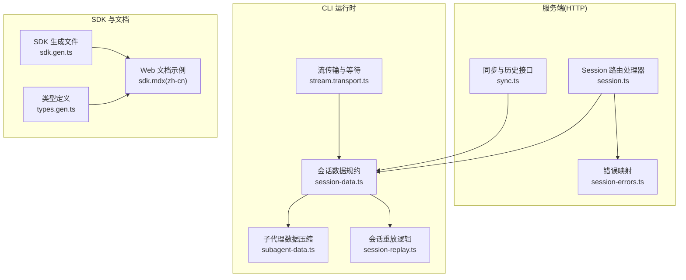
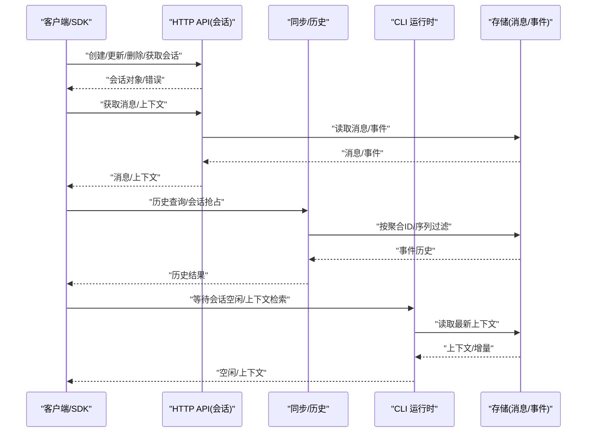
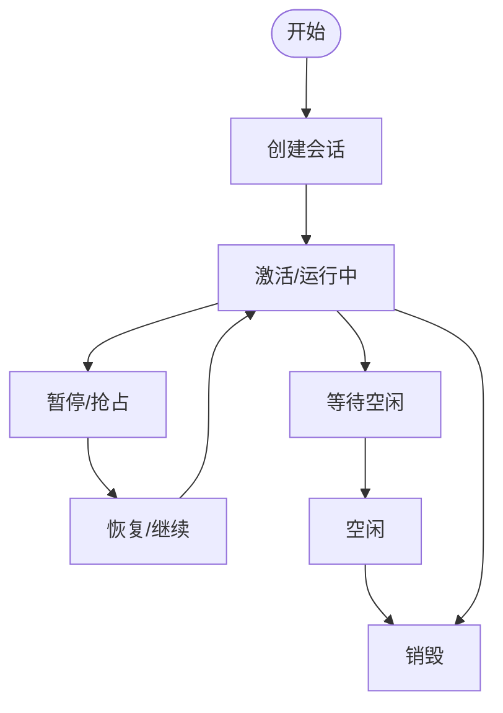
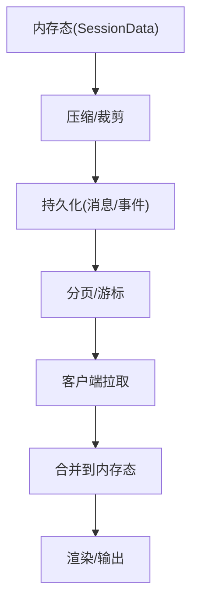
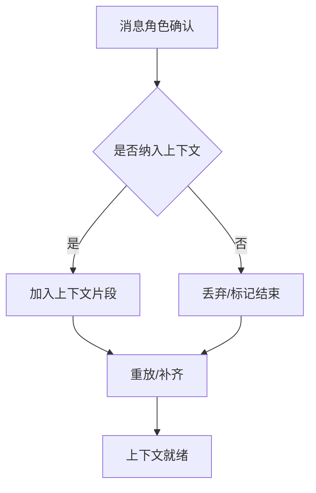
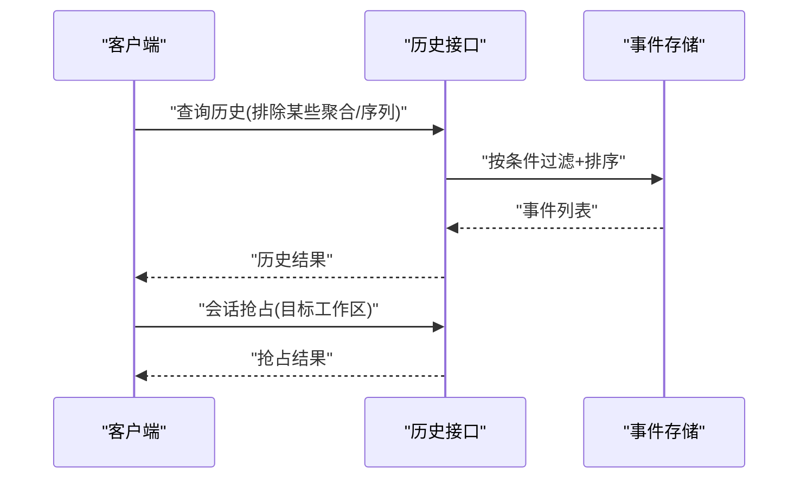
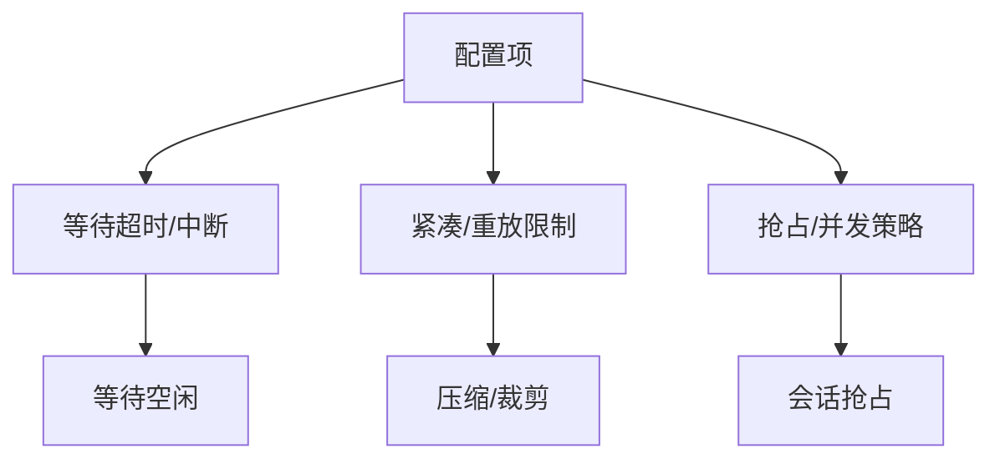
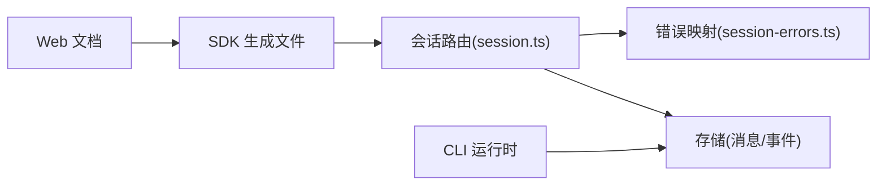

# 会话管理

<cite>
**本文引用的文件**
- [packages/opencode/src/server/routes/instance/httpapi/handlers/session.ts](file://packages/opencode/src/server/routes/instance/httpapi/handlers/session.ts)
- [packages/opencode/src/server/routes/instance/httpapi/handlers/session-errors.ts](file://packages/opencode/src/server/routes/instance/httpapi/handlers/session-errors.ts)
- [packages/opencode/src/server/routes/instance/httpapi/handlers/sync.ts](file://packages/opencode/src/server/routes/instance/httpapi/handlers/sync.ts)
- [packages/opencode/src/cli/cmd/run/stream.transport.ts](file://packages/opencode/src/cli/cmd/run/stream.transport.ts)
- [packages/opencode/src/cli/cmd/run/session-data.ts](file://packages/opencode/src/cli/cmd/run/session-data.ts)
- [packages/opencode/src/cli/cmd/run/subagent-data.ts](file://packages/opencode/src/cli/cmd/run/subagent-data.ts)
- [packages/opencode/src/cli/cmd/run/session-replay.ts](file://packages/opencode/src/cli/cmd/run/session-replay.ts)
- [packages/sdk/js/src/v2/gen/sdk.gen.ts](file://packages/sdk/js/src/v2/gen/sdk.gen.ts)
- [packages/sdk/js/src/v2/gen/types.gen.ts](file://packages/sdk/js/src/v2/gen/types.gen.ts)
- [packages/web/src/content/docs/zh-cn/sdk.mdx](file://packages/web/src/content/docs/zh-cn/sdk.mdx)
</cite>

## 目录
1. [简介](#简介)
2. [项目结构](#项目结构)
3. [核心组件](#核心组件)
4. [架构总览](#架构总览)
5. [详细组件分析](#详细组件分析)
6. [依赖关系分析](#依赖关系分析)
7. [性能考量](#性能考量)
8. [故障排查指南](#故障排查指南)
9. [结论](#结论)
10. [附录](#附录)

## 简介
本技术文档围绕 OpenCode 的会话管理系统进行系统性梳理，重点覆盖以下方面：
- 会话生命周期：创建、激活、暂停、恢复、销毁的状态转换与触发条件
- 会话状态存储：内存态、持久化、缓存策略与数据一致性保障
- 上下文保持：在会话内如何维护与传递状态信息（消息、权限、问题、角色等）
- 历史追踪：事件记录、变更历史、重放与回滚能力
- 配置与定制：超时、资源限制、并发控制等可调参数
- 使用示例与最佳实践：结合 SDK 与服务端接口的实际用法

## 项目结构
OpenCode 的会话管理横跨服务端 HTTP API、CLI 运行时、SDK 类型与文档说明，形成“接口—运行时—客户端”的完整闭环。

图表来源
- [packages/opencode/src/server/routes/instance/httpapi/handlers/session.ts:93-189](file://packages/opencode/src/server/routes/instance/httpapi/handlers/session.ts#L93-L189)
- [packages/opencode/src/server/routes/instance/httpapi/handlers/session-errors.ts:1-21](file://packages/opencode/src/server/routes/instance/httpapi/handlers/session-errors.ts#L1-L21)
- [packages/opencode/src/server/routes/instance/httpapi/handlers/sync.ts:64-89](file://packages/opencode/src/server/routes/instance/httpapi/handlers/sync.ts#L64-L89)
- [packages/opencode/src/cli/cmd/run/stream.transport.ts:219-866](file://packages/opencode/src/cli/cmd/run/stream.transport.ts#L219-L866)
- [packages/opencode/src/cli/cmd/run/session-data.ts:567-1091](file://packages/opencode/src/cli/cmd/run/session-data.ts#L567-L1091)
- [packages/opencode/src/cli/cmd/run/subagent-data.ts:354-414](file://packages/opencode/src/cli/cmd/run/subagent-data.ts#L354-L414)
- [packages/opencode/src/cli/cmd/run/session-replay.ts:297-336](file://packages/opencode/src/cli/cmd/run/session-replay.ts#L297-L336)
- [packages/sdk/js/src/v2/gen/sdk.gen.ts:3490-3543](file://packages/sdk/js/src/v2/gen/sdk.gen.ts#L3490-L3543)
- [packages/sdk/js/src/v2/gen/sdk.gen.ts:5351-5397](file://packages/sdk/js/src/v2/gen/sdk.gen.ts#L5351-L5397)
- [packages/sdk/js/src/v2/gen/types.gen.ts:7622-7690](file://packages/sdk/js/src/v2/gen/types.gen.ts#L7622-L7690)
- [packages/sdk/js/src/v2/gen/types.gen.ts:9642-9700](file://packages/sdk/js/src/v2/gen/types.gen.ts#L9642-L9700)
- [packages/web/src/content/docs/zh-cn/sdk.mdx:304-308](file://packages/web/src/content/docs/zh-cn/sdk.mdx#L304-L308)

章节来源
- [packages/opencode/src/server/routes/instance/httpapi/handlers/session.ts:93-189](file://packages/opencode/src/server/routes/instance/httpapi/handlers/session.ts#L93-L189)
- [packages/opencode/src/server/routes/instance/httpapi/handlers/sync.ts:64-89](file://packages/opencode/src/server/routes/instance/httpapi/handlers/sync.ts#L64-L89)
- [packages/opencode/src/cli/cmd/run/stream.transport.ts:219-866](file://packages/opencode/src/cli/cmd/run/stream.transport.ts#L219-L866)
- [packages/opencode/src/cli/cmd/run/session-data.ts:567-1091](file://packages/opencode/src/cli/cmd/run/session-data.ts#L567-L1091)
- [packages/sdk/js/src/v2/gen/sdk.gen.ts:3490-3543](file://packages/sdk/js/src/v2/gen/sdk.gen.ts#L3490-L3543)
- [packages/web/src/content/docs/zh-cn/sdk.mdx:304-308](file://packages/web/src/content/docs/zh-cn/sdk.mdx#L304-L308)

## 核心组件
- 服务端会话路由与错误映射：提供会话列表、分页消息、单条消息、创建、更新、删除等接口，并对存储未找到与繁忙错误进行统一映射。
- CLI 会话运行时：负责会话状态的内存规约、增量更新、重放与上下文压缩；支持等待会话空闲、上下文检索与消息检索。
- SDK 接口：提供会话 CRUD、上下文检索、消息检索、等待空闲等方法，配合类型定义确保参数与响应结构一致。
- 同步与历史：提供事件历史查询与会话“抢占”能力，支撑多端协作与冲突处理。

章节来源
- [packages/opencode/src/server/routes/instance/httpapi/handlers/session.ts:93-189](file://packages/opencode/src/server/routes/instance/httpapi/handlers/session.ts#L93-L189)
- [packages/opencode/src/server/routes/instance/httpapi/handlers/session-errors.ts:1-21](file://packages/opencode/src/server/routes/instance/httpapi/handlers/session-errors.ts#L1-L21)
- [packages/opencode/src/cli/cmd/run/stream.transport.ts:219-866](file://packages/opencode/src/cli/cmd/run/stream.transport.ts#L219-L866)
- [packages/opencode/src/cli/cmd/run/session-data.ts:567-1091](file://packages/opencode/src/cli/cmd/run/session-data.ts#L567-L1091)
- [packages/sdk/js/src/v2/gen/sdk.gen.ts:3490-3543](file://packages/sdk/js/src/v2/gen/sdk.gen.ts#L3490-L3543)
- [packages/sdk/js/src/v2/gen/sdk.gen.ts:5351-5397](file://packages/sdk/js/src/v2/gen/sdk.gen.ts#L5351-L5397)
- [packages/sdk/js/src/v2/gen/types.gen.ts:7622-7690](file://packages/sdk/js/src/v2/gen/types.gen.ts#L7622-L7690)
- [packages/sdk/js/src/v2/gen/types.gen.ts:9642-9700](file://packages/sdk/js/src/v2/gen/types.gen.ts#L9642-L9700)

## 架构总览
下图展示从客户端到服务端再到 CLI 运行时的整体交互路径，以及关键状态转换点。

图表来源
- [packages/opencode/src/server/routes/instance/httpapi/handlers/session.ts:93-189](file://packages/opencode/src/server/routes/instance/httpapi/handlers/session.ts#L93-L189)
- [packages/opencode/src/server/routes/instance/httpapi/handlers/sync.ts:64-89](file://packages/opencode/src/server/routes/instance/httpapi/handlers/sync.ts#L64-L89)
- [packages/opencode/src/cli/cmd/run/stream.transport.ts:219-866](file://packages/opencode/src/cli/cmd/run/stream.transport.ts#L219-L866)
- [packages/sdk/js/src/v2/gen/sdk.gen.ts:3490-3543](file://packages/sdk/js/src/v2/gen/sdk.gen.ts#L3490-L3543)
- [packages/sdk/js/src/v2/gen/sdk.gen.ts:5351-5397](file://packages/sdk/js/src/v2/gen/sdk.gen.ts#L5351-L5397)

## 详细组件分析

### 1) 会话生命周期与状态转换
- 激活与等待：CLI 提供等待会话空闲的能力，通过竞速等待完成信号或中断信号，确保在空闲状态下执行下一步动作。
- 暂停与恢复：通过“抢占”接口实现会话在不同工作区之间的转移，配合历史重放保证上下文连续性。
- 销毁：通过删除接口清理会话，返回布尔值表示是否成功。
- 状态转换流程示意：

图表来源
- [packages/opencode/src/server/routes/instance/httpapi/handlers/session.ts:153-179](file://packages/opencode/src/server/routes/instance/httpapi/handlers/session.ts#L153-L179)
- [packages/opencode/src/server/routes/instance/httpapi/handlers/sync.ts:64-89](file://packages/opencode/src/server/routes/instance/httpapi/handlers/sync.ts#L64-L89)
- [packages/opencode/src/cli/cmd/run/stream.transport.ts:230-248](file://packages/opencode/src/cli/cmd/run/stream.transport.ts#L230-L248)

章节来源
- [packages/opencode/src/server/routes/instance/httpapi/handlers/session.ts:153-179](file://packages/opencode/src/server/routes/instance/httpapi/handlers/session.ts#L153-L179)
- [packages/opencode/src/server/routes/instance/httpapi/handlers/sync.ts:64-89](file://packages/opencode/src/server/routes/instance/httpapi/handlers/sync.ts#L64-L89)
- [packages/opencode/src/cli/cmd/run/stream.transport.ts:230-248](file://packages/opencode/src/cli/cmd/run/stream.transport.ts#L230-L248)

### 2) 会话状态存储机制
- 内存存储：CLI 运行时维护会话数据结构（消息、部分文本、工具调用、权限、问题等），通过规约函数增量更新，避免全量拷贝。
- 持久化存储：服务端提供消息分页与游标链接头，支持基于游标的翻页与链接头暴露，便于客户端无状态拉取。
- 缓存策略：CLI 对会话数据进行压缩与近期保留，减少内存占用；同时支持“紧凑模式”与“重放模式”，在有限内存下维持上下文连续性。

图表来源
- [packages/opencode/src/cli/cmd/run/session-data.ts:567-1091](file://packages/opencode/src/cli/cmd/run/session-data.ts#L567-L1091)
- [packages/opencode/src/cli/cmd/run/subagent-data.ts:354-414](file://packages/opencode/src/cli/cmd/run/subagent-data.ts#L354-L414)
- [packages/opencode/src/server/routes/instance/httpapi/handlers/session.ts:104-143](file://packages/opencode/src/server/routes/instance/httpapi/handlers/session.ts#L104-L143)

章节来源
- [packages/opencode/src/cli/cmd/run/session-data.ts:567-1091](file://packages/opencode/src/cli/cmd/run/session-data.ts#L567-L1091)
- [packages/opencode/src/cli/cmd/run/subagent-data.ts:354-414](file://packages/opencode/src/cli/cmd/run/subagent-data.ts#L354-L414)
- [packages/opencode/src/server/routes/instance/httpapi/handlers/session.ts:104-143](file://packages/opencode/src/server/routes/instance/httpapi/handlers/session.ts#L104-L143)

### 3) 上下文保持机制
- 角色与消息映射：根据消息角色（用户/助手/推理）决定是否纳入上下文，支持“仅推理”或“包含用户文本”的开关。
- 权限与问题：会话数据中维护权限请求与问题问答队列，确保在上下文中正确体现交互状态。
- 重放与补齐：当消息角色确定后，对缓冲中的文本部分进行补齐与刷新，保证上下文完整性。

图表来源
- [packages/opencode/src/cli/cmd/run/session-data.ts:582-620](file://packages/opencode/src/cli/cmd/run/session-data.ts#L582-L620)
- [packages/opencode/src/cli/cmd/run/session-data.ts:1014-1044](file://packages/opencode/src/cli/cmd/run/session-data.ts#L1014-L1044)

章节来源
- [packages/opencode/src/cli/cmd/run/session-data.ts:582-620](file://packages/opencode/src/cli/cmd/run/session-data.ts#L582-L620)
- [packages/opencode/src/cli/cmd/run/session-data.ts:1014-1044](file://packages/opencode/src/cli/cmd/run/session-data.ts#L1014-L1044)

### 4) 历史追踪与回滚
- 事件历史：提供历史查询接口，按聚合ID与序列号过滤，支持升序排列与分页。
- 会话抢占：允许将会话从一个工作区转移到另一个工作区，配合历史重放确保新环境下的上下文连续。
- 回滚思路：通过“重放”将会话推进到某一历史时刻，从而实现“回滚到某时刻”的效果。

图表来源
- [packages/opencode/src/server/routes/instance/httpapi/handlers/sync.ts:72-85](file://packages/opencode/src/server/routes/instance/httpapi/handlers/sync.ts#L72-L85)
- [packages/opencode/src/server/routes/instance/httpapi/handlers/sync.ts:64-89](file://packages/opencode/src/server/routes/instance/httpapi/handlers/sync.ts#L64-L89)

章节来源
- [packages/opencode/src/server/routes/instance/httpapi/handlers/sync.ts:72-85](file://packages/opencode/src/server/routes/instance/httpapi/handlers/sync.ts#L72-L85)
- [packages/opencode/src/server/routes/instance/httpapi/handlers/sync.ts:64-89](file://packages/opencode/src/server/routes/instance/httpapi/handlers/sync.ts#L64-L89)

### 5) 会话配置与自定义
- 超时与等待：CLI 提供等待会话空闲的竞速逻辑，支持中断信号，避免长时间阻塞。
- 资源限制：通过“紧凑模式”与“重放限制”控制内存占用与回放范围。
- 并发控制：通过“抢占”接口实现多工作区并发访问同一会话，需结合业务策略避免冲突。

图表来源
- [packages/opencode/src/cli/cmd/run/stream.transport.ts:230-248](file://packages/opencode/src/cli/cmd/run/stream.transport.ts#L230-L248)
- [packages/opencode/src/cli/cmd/run/stream.transport.ts:710-747](file://packages/opencode/src/cli/cmd/run/stream.transport.ts#L710-L747)
- [packages/opencode/src/server/routes/instance/httpapi/handlers/sync.ts:64-89](file://packages/opencode/src/server/routes/instance/httpapi/handlers/sync.ts#L64-L89)

章节来源
- [packages/opencode/src/cli/cmd/run/stream.transport.ts:230-248](file://packages/opencode/src/cli/cmd/run/stream.transport.ts#L230-L248)
- [packages/opencode/src/cli/cmd/run/stream.transport.ts:710-747](file://packages/opencode/src/cli/cmd/run/stream.transport.ts#L710-L747)
- [packages/opencode/src/server/routes/instance/httpapi/handlers/sync.ts:64-89](file://packages/opencode/src/server/routes/instance/httpapi/handlers/sync.ts#L64-L89)

### 6) 使用示例与最佳实践
- SDK 方法概览（示例路径）
  - 更新会话属性：[update 方法签名:3497-3512](file://packages/sdk/js/src/v2/gen/sdk.gen.ts#L3497-L3512)
  - 等待会话空闲：[wait 方法签名:5362-5373](file://packages/sdk/js/src/v2/gen/sdk.gen.ts#L5362-L5373)
  - 获取会话上下文：[context 方法签名:5381-5392](file://packages/sdk/js/src/v2/gen/sdk.gen.ts#L5381-L5392)
  - 获取会话消息：[messages 方法签名:9655-9668](file://packages/sdk/js/src/v2/gen/types.gen.ts#L9655-L9668)
- Web 文档示例（示例路径）
  - 会话 CRUD 示例：[zh-cn 文档:304-308](file://packages/web/src/content/docs/zh-cn/sdk.mdx#L304-L308)

章节来源
- [packages/sdk/js/src/v2/gen/sdk.gen.ts:3497-3512](file://packages/sdk/js/src/v2/gen/sdk.gen.ts#L3497-L3512)
- [packages/sdk/js/src/v2/gen/sdk.gen.ts:5362-5373](file://packages/sdk/js/src/v2/gen/sdk.gen.ts#L5362-L5373)
- [packages/sdk/js/src/v2/gen/sdk.gen.ts:5381-5392](file://packages/sdk/js/src/v2/gen/sdk.gen.ts#L5381-L5392)
- [packages/sdk/js/src/v2/gen/types.gen.ts:9655-9668](file://packages/sdk/js/src/v2/gen/types.gen.ts#L9655-L9668)
- [packages/web/src/content/docs/zh-cn/sdk.mdx:304-308](file://packages/web/src/content/docs/zh-cn/sdk.mdx#L304-L308)

## 依赖关系分析
- 组件耦合
  - 服务端会话路由依赖存储层的消息分页与获取能力，并通过错误映射模块统一对外报错。
  - CLI 运行时依赖存储层的上下文与增量事件，通过规约函数与重放逻辑维持内存态一致性。
  - SDK 通过类型定义约束参数与响应，确保客户端与服务端契约一致。
- 外部依赖
  - 存储层：消息表、事件表、游标编码/解码
  - 客户端：SDK 生成文件与文档示例

图表来源
- [packages/opencode/src/server/routes/instance/httpapi/handlers/session.ts:93-189](file://packages/opencode/src/server/routes/instance/httpapi/handlers/session.ts#L93-L189)
- [packages/opencode/src/server/routes/instance/httpapi/handlers/session-errors.ts:1-21](file://packages/opencode/src/server/routes/instance/httpapi/handlers/session-errors.ts#L1-L21)
- [packages/opencode/src/cli/cmd/run/session-data.ts:567-1091](file://packages/opencode/src/cli/cmd/run/session-data.ts#L567-L1091)
- [packages/sdk/js/src/v2/gen/sdk.gen.ts:3490-3543](file://packages/sdk/js/src/v2/gen/sdk.gen.ts#L3490-L3543)
- [packages/web/src/content/docs/zh-cn/sdk.mdx:304-308](file://packages/web/src/content/docs/zh-cn/sdk.mdx#L304-L308)

章节来源
- [packages/opencode/src/server/routes/instance/httpapi/handlers/session.ts:93-189](file://packages/opencode/src/server/routes/instance/httpapi/handlers/session.ts#L93-L189)
- [packages/opencode/src/server/routes/instance/httpapi/handlers/session-errors.ts:1-21](file://packages/opencode/src/server/routes/instance/httpapi/handlers/session-errors.ts#L1-L21)
- [packages/opencode/src/cli/cmd/run/session-data.ts:567-1091](file://packages/opencode/src/cli/cmd/run/session-data.ts#L567-L1091)
- [packages/sdk/js/src/v2/gen/sdk.gen.ts:3490-3543](file://packages/sdk/js/src/v2/gen/sdk.gen.ts#L3490-L3543)
- [packages/web/src/content/docs/zh-cn/sdk.mdx:304-308](file://packages/web/src/content/docs/zh-cn/sdk.mdx#L304-L308)

## 性能考量
- 内存占用控制
  - 通过“紧凑模式”与“重放限制”控制会话数据规模，优先保留最近的片段与必要的上下文。
  - 在 CLI 中对消息、部分文本、工具调用、权限与问题进行集合式裁剪，降低内存峰值。
- I/O 优化
  - 服务端消息分页使用游标与 Link 头，避免全量加载，提升大列表场景的吞吐。
- 等待与中断
  - 等待空闲采用竞速策略，结合中断信号避免长时间阻塞，提高交互响应性。

## 故障排查指南
- 常见错误映射
  - 存储未找到：将存储层的未找到错误映射为 404，便于客户端识别资源不存在。
  - 会话繁忙：将“繁忙”错误映射为特定错误类型，提示会话当前不可用。
- 排查步骤
  - 确认会话 ID 是否有效，是否存在存储未找到错误。
  - 检查等待空闲是否被中断或超时，必要时调整等待策略。
  - 若出现历史不一致，检查重放范围与紧凑模式设置。

章节来源
- [packages/opencode/src/server/routes/instance/httpapi/handlers/session-errors.ts:1-21](file://packages/opencode/src/server/routes/instance/httpapi/handlers/session-errors.ts#L1-L21)
- [packages/opencode/src/cli/cmd/run/stream.transport.ts:230-248](file://packages/opencode/src/cli/cmd/run/stream.transport.ts#L230-L248)

## 结论
OpenCode 的会话管理以“服务端接口 + CLI 运行时 + SDK 类型”为核心，实现了从生命周期管理、状态存储、上下文保持到历史追踪与回滚的完整闭环。通过内存规约、分页游标与紧凑模式，兼顾了性能与可用性；通过等待空闲与抢占接口，满足了并发与协作需求。建议在实际集成中结合业务场景合理设置等待超时、重放限制与抢占策略，确保稳定性与用户体验。

## 附录
- 关键实现路径参考
  - 会话消息分页与游标：[消息分页与 Link 头:104-143](file://packages/opencode/src/server/routes/instance/httpapi/handlers/session.ts#L104-L143)
  - 会话创建/更新/删除：[CRUD 接口:153-179](file://packages/opencode/src/server/routes/instance/httpapi/handlers/session.ts#L153-L179)
  - 等待空闲与中断：[等待逻辑:230-248](file://packages/opencode/src/cli/cmd/run/stream.transport.ts#L230-L248)
  - 会话上下文与消息检索：[SDK 方法:5381-5392](file://packages/sdk/js/src/v2/gen/sdk.gen.ts#L5381-L5392), [消息类型定义:9655-9668](file://packages/sdk/js/src/v2/gen/types.gen.ts#L9655-L9668)
  - 历史查询与抢占：[历史接口:72-85](file://packages/opencode/src/server/routes/instance/httpapi/handlers/sync.ts#L72-L85), [抢占接口:64-89](file://packages/opencode/src/server/routes/instance/httpapi/handlers/sync.ts#L64-L89)