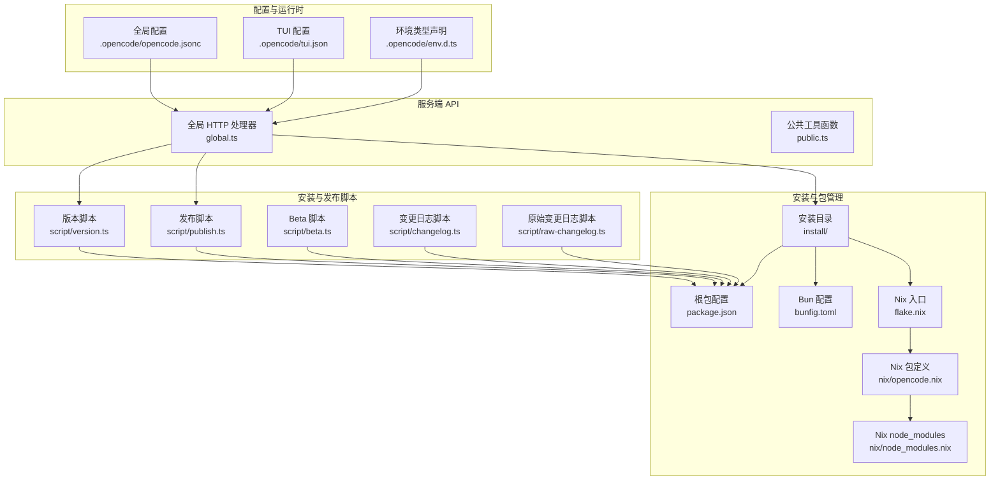
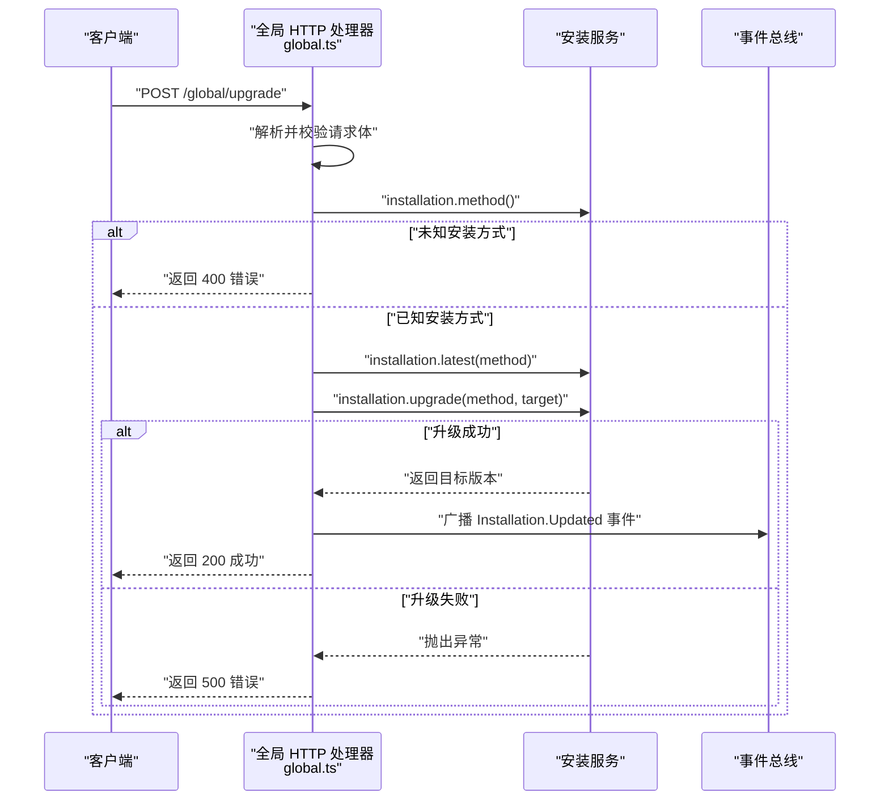
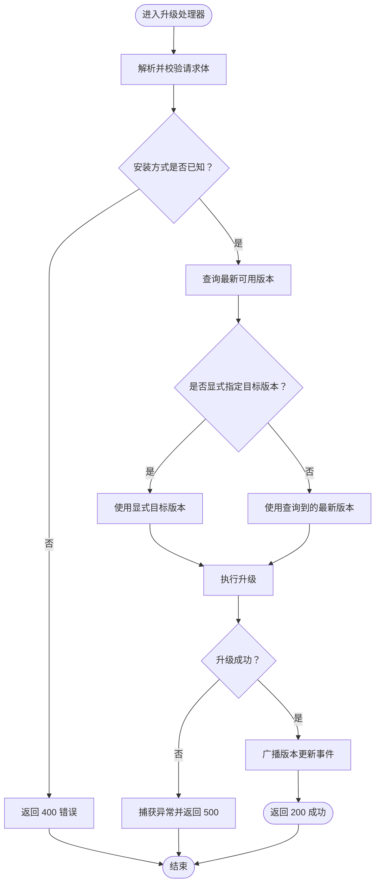
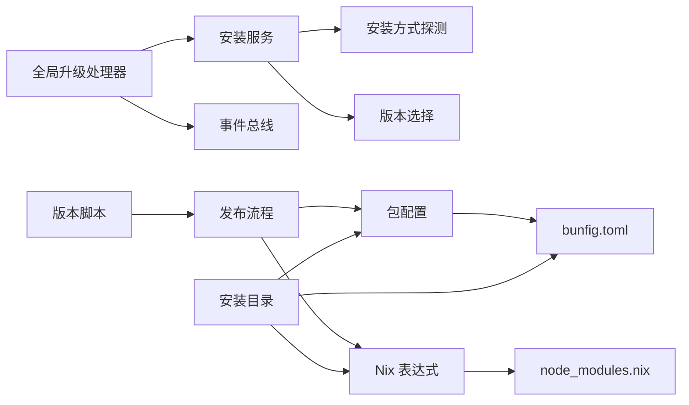

# 安装版本管理

<cite>
**本文引用的文件**
- [global.ts](file://packages/opencode/src/server/routes/instance/httpapi/handlers/global.ts)
- [public.ts](file://packages/opencode/src/server/routes/instance/httpapi/public.ts)
- [installation.test.ts](file://packages/opencode/test/installation/installation.test.ts)
- [install](file://install)
- [package.json](file://package.json)
- [bunfig.toml](file://bunfig.toml)
- [flake.nix](file://flake.nix)
- [opencode.nix](file://nix/opencode.nix)
- [node_modules.nix](file://nix/node_modules.nix)
- [version.ts](file://script/version.ts)
- [publish.ts](file://script/publish.ts)
- [beta.ts](file://script/beta.ts)
- [changelog.ts](file://script/changelog.ts)
- [raw-changelog.ts](file://script/raw-changelog.ts)
- [opencode.jsonc](file://.opencode/opencode.jsonc)
- [tui.json](file://.opencode/tui.json)
- [env.d.ts](file://.opencode/env.d.ts)
</cite>

## 目录
1. [简介](#简介)
2. [项目结构](#项目结构)
3. [核心组件](#核心组件)
4. [架构总览](#架构总览)
5. [详细组件分析](#详细组件分析)
6. [依赖关系分析](#依赖关系分析)
7. [性能考量](#性能考量)
8. [故障排除指南](#故障排除指南)
9. [结论](#结论)
10. [附录](#附录)

## 简介
本技术文档围绕 OpenCode 的安装版本管理系统展开，目标是帮助读者理解版本管理策略（语义化版本控制、版本兼容性检查、升级路径规划）、安装过程的实现机制（依赖验证、环境检测、文件复制、配置生成）、版本回滚与失败恢复、多环境版本控制（开发/测试/生产）以及版本更新最佳实践（向后兼容、破坏性变更处理、用户通知）。文档同时提供可操作的版本管理示例与故障排除建议。

## 项目结构
OpenCode 采用 Monorepo 架构，版本管理与安装流程涉及服务端 HTTP API、脚本工具链、Nix 包管理与安装目录等多个层面。下图展示了与“安装版本管理”直接相关的模块与文件：

图表来源
- [global.ts:71-138](file://packages/opencode/src/server/routes/instance/httpapi/handlers/global.ts#L71-L138)
- [public.ts:226-326](file://packages/opencode/src/server/routes/instance/httpapi/public.ts#L226-L326)
- [version.ts](file://script/version.ts)
- [publish.ts](file://script/publish.ts)
- [beta.ts](file://script/beta.ts)
- [changelog.ts](file://script/changelog.ts)
- [raw-changelog.ts](file://script/raw-changelog.ts)
- [install](file://install)
- [package.json](file://package.json)
- [bunfig.toml](file://bunfig.toml)
- [flake.nix](file://flake.nix)
- [opencode.nix](file://nix/opencode.nix)
- [node_modules.nix](file://nix/node_modules.nix)
- [opencode.jsonc](file://.opencode/opencode.jsonc)
- [tui.json](file://.opencode/tui.json)
- [env.d.ts](file://.opencode/env.d.ts)

章节来源
- [global.ts:71-138](file://packages/opencode/src/server/routes/instance/httpapi/handlers/global.ts#L71-L138)
- [public.ts:226-326](file://packages/opencode/src/server/routes/instance/httpapi/public.ts#L226-L326)

## 核心组件
- 版本升级 HTTP 接口：提供全局升级能力，支持从已知安装方式中选择目标版本并触发升级流程，同时在成功后广播事件。
- 升级输入校验与解析：对请求体进行解码与校验，确保升级参数合法。
- 版本脚本工具链：负责版本号生成、发布、Beta 分支管理、变更日志生成等。
- 安装与包管理：通过安装目录、Nix 表达式与 Bun 配置共同完成依赖解析、构建与部署。
- 全局配置与运行时：通过 opencode.jsonc、tui.json 与 env.d.ts 提供运行期配置与类型约束。

章节来源
- [global.ts:71-138](file://packages/opencode/src/server/routes/instance/httpapi/handlers/global.ts#L71-L138)
- [version.ts](file://script/version.ts)
- [publish.ts](file://script/publish.ts)
- [beta.ts](file://script/beta.ts)
- [changelog.ts](file://script/changelog.ts)
- [raw-changelog.ts](file://script/raw-changelog.ts)
- [install](file://install)
- [opencode.jsonc](file://.opencode/opencode.jsonc)
- [tui.json](file://.opencode/tui.json)
- [env.d.ts](file://.opencode/env.d.ts)

## 架构总览
下图展示“版本升级”的端到端调用序列，涵盖请求解析、安装方法判定、目标版本确定、升级执行、错误处理与事件广播：

图表来源
- [global.ts:71-138](file://packages/opencode/src/server/routes/instance/httpapi/handlers/global.ts#L71-L138)

## 详细组件分析

### 组件一：全局升级接口与事件广播
- 功能职责
  - 解析并校验升级请求体，支持显式指定目标版本或自动选择最新版本。
  - 基于当前安装方式（如包管理器、源码编译、容器镜像等）决定升级路径。
  - 执行升级并捕获异常，统一返回结构化结果。
  - 升级成功后通过全局事件总线广播“版本已更新”事件，便于订阅者同步状态。
- 关键行为
  - 当安装方式未知时返回明确错误，避免误操作。
  - 使用 Effect 管道进行错误转换，保证响应一致性。
  - 广播事件携带目标版本信息，便于前端或监控系统感知。

图表来源
- [global.ts:71-138](file://packages/opencode/src/server/routes/instance/httpapi/handlers/global.ts#L71-L138)

章节来源
- [global.ts:71-138](file://packages/opencode/src/server/routes/instance/httpapi/handlers/global.ts#L71-L138)

### 组件二：升级输入校验与解析
- 功能职责
  - 将请求体文本解析为 JSON，并使用 Schema 对输入进行解码与校验。
  - 返回“有效载荷”与“校验状态”，供后续升级逻辑使用。
- 关键行为
  - 请求体无效时立即返回 400。
  - 使用 Effect 管道进行解码与映射，保持错误处理一致。

章节来源
- [global.ts:129-165](file://packages/opencode/src/server/routes/instance/httpapi/handlers/global.ts#L129-L165)

### 组件三：版本脚本工具链
- 版本号生成与发布
  - 版本脚本负责生成新的版本号，遵循语义化版本规范；发布脚本负责打包、上传与标记。
- Beta 流程
  - Beta 脚本用于预发布通道管理，便于在正式发布前收集反馈。
- 变更日志
  - 变更日志脚本与原始变更日志脚本分别生成面向用户的摘要与完整记录，支撑发布说明与审计追踪。

章节来源
- [version.ts](file://script/version.ts)
- [publish.ts](file://script/publish.ts)
- [beta.ts](file://script/beta.ts)
- [changelog.ts](file://script/changelog.ts)
- [raw-changelog.ts](file://script/raw-changelog.ts)

### 组件四：安装与包管理
- 安装目录
  - 安装目录包含安装所需的资源与脚本，作为安装介质的一部分。
- 包管理与构建
  - 根 package.json 与 bunfig.toml 配置依赖解析与构建行为。
  - Nix 入口与包定义（flake.nix、opencode.nix、node_modules.nix）提供可复现的构建与依赖锁定。
- 运行时配置
  - opencode.jsonc、tui.json 与 env.d.ts 提供全局配置与类型声明，影响安装与运行时行为。

章节来源
- [install](file://install)
- [package.json](file://package.json)
- [bunfig.toml](file://bunfig.toml)
- [flake.nix](file://flake.nix)
- [opencode.nix](file://nix/opencode.nix)
- [node_modules.nix](file://nix/node_modules.nix)
- [opencode.jsonc](file://.opencode/opencode.jsonc)
- [tui.json](file://.opencode/tui.json)
- [env.d.ts](file://.opencode/env.d.ts)

### 组件五：公共工具与模式
- 公共工具函数
  - 提供 OpenAPI 规范规范化、模式稳定化与引用重写等能力，确保跨版本 API 的稳定性与兼容性。
- 应用场景
  - 在升级过程中，若涉及 API 或配置变更，可通过这些工具保障对外契约的一致性。

章节来源
- [public.ts:226-326](file://packages/opencode/src/server/routes/instance/httpapi/public.ts#L226-L326)

## 依赖关系分析
- 组件耦合
  - 全局升级处理器依赖安装服务与事件总线；安装服务进一步依赖安装方式探测与版本选择逻辑。
  - 版本脚本工具链与发布流程相互独立但共享版本号生成规则。
  - Nix 与 Bun 配置共同决定依赖解析与构建行为，安装目录作为最终产物承载层。
- 外部依赖
  - 包管理器（Bun/NPM）与包注册表（含企业私有注册表）影响依赖解析与下载。
  - Git 仓库与分支选择影响源码安装与版本锁定。

图表来源
- [global.ts:71-138](file://packages/opencode/src/server/routes/instance/httpapi/handlers/global.ts#L71-L138)
- [version.ts](file://script/version.ts)
- [publish.ts](file://script/publish.ts)
- [install](file://install)
- [package.json](file://package.json)
- [bunfig.toml](file://bunfig.toml)
- [node_modules.nix](file://nix/node_modules.nix)

## 性能考量
- 升级路径优化
  - 优先使用已知安装方式，避免在未知状态下进行昂贵的探测。
  - 在升级前尽量缓存目标版本信息，减少重复查询。
- 错误处理与超时
  - 对外部依赖（包注册表、Git 仓库）设置合理的超时与重试策略，防止阻塞主流程。
- 构建与安装效率
  - 利用 Nix 的可复现性与缓存机制，减少重复构建时间。
  - 合理拆分安装步骤，仅在必要时进行文件复制与配置生成。

## 故障排除指南
- 升级失败排查
  - 检查安装方式是否被正确识别；若为未知方式，需先修复安装方式探测逻辑。
  - 查看升级返回的错误信息，结合事件总线日志定位问题节点。
  - 若为依赖解析失败，确认包注册表可达性与认证配置。
- 回滚与降级
  - 若升级失败且具备回滚能力，应优先回退到上一个稳定版本；若无内置回滚，建议通过安装目录备份与版本切换实现手动降级。
  - 在回滚前后核对配置文件与数据迁移脚本，确保兼容性。
- 多环境差异
  - 开发环境允许更频繁的升级与 Beta 版本；测试环境启用自动化回归测试；生产环境严格限制升级窗口与回滚策略。
- 用户通知
  - 在升级前通过事件总线或通知渠道告知用户；升级完成后提供变更摘要与注意事项。

章节来源
- [global.ts:71-138](file://packages/opencode/src/server/routes/instance/httpapi/handlers/global.ts#L71-L138)
- [installation.test.ts](file://packages/opencode/test/installation/installation.test.ts)

## 结论
OpenCode 的安装版本管理系统通过“HTTP 升级接口 + 版本脚本工具链 + Nix/Bun 包管理 + 运行时配置”的组合，实现了从版本选择、升级执行到事件广播的闭环。建议在实践中强化回滚机制、完善多环境策略与用户通知，并持续优化依赖解析与构建性能，以提升整体稳定性与可维护性。

## 附录
- 版本管理示例（基于现有脚本）
  - 生成新版本：使用版本脚本生成语义化版本号。
  - 发布流程：使用发布脚本完成打包、上传与标记。
  - Beta 分支：使用 Beta 脚本推进预发布通道。
  - 变更日志：使用变更日志脚本生成面向用户的摘要与完整记录。
- 最佳实践清单
  - 向后兼容：在升级前评估破坏性变更，提供迁移指引与回滚方案。
  - 用户通知：在升级前后及时通知用户，提供变更摘要与风险提示。
  - 多环境策略：开发/测试/生产采用不同升级策略与回滚权限。
  - 自动化测试：在测试环境执行自动化回归测试，降低升级风险。

章节来源
- [version.ts](file://script/version.ts)
- [publish.ts](file://script/publish.ts)
- [beta.ts](file://script/beta.ts)
- [changelog.ts](file://script/changelog.ts)
- [raw-changelog.ts](file://script/raw-changelog.ts)