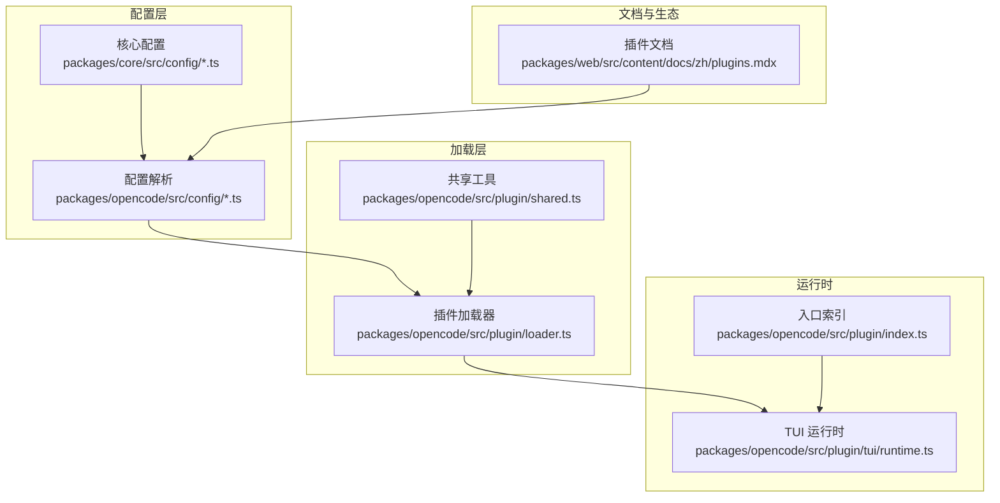
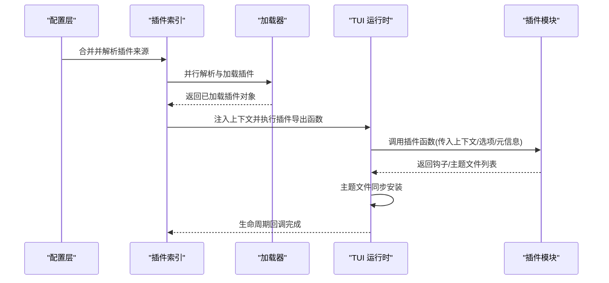
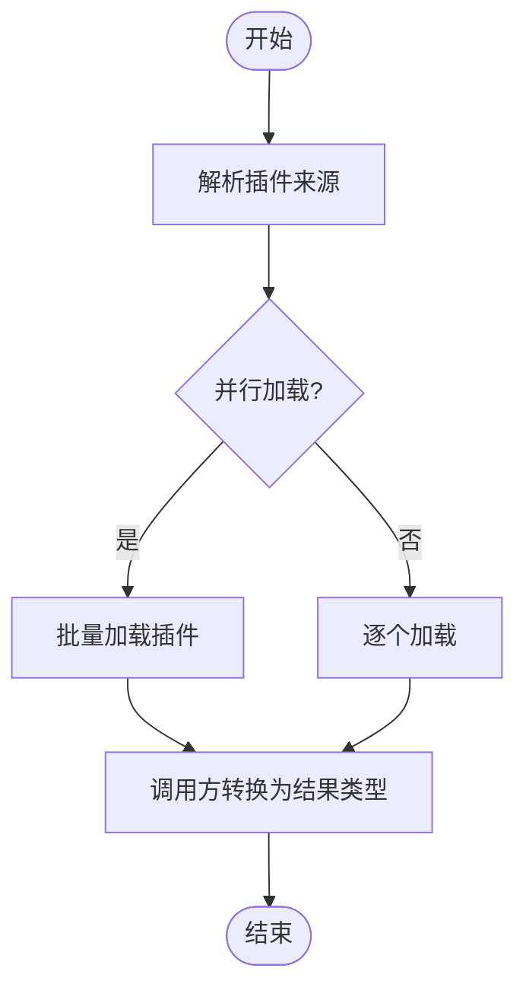
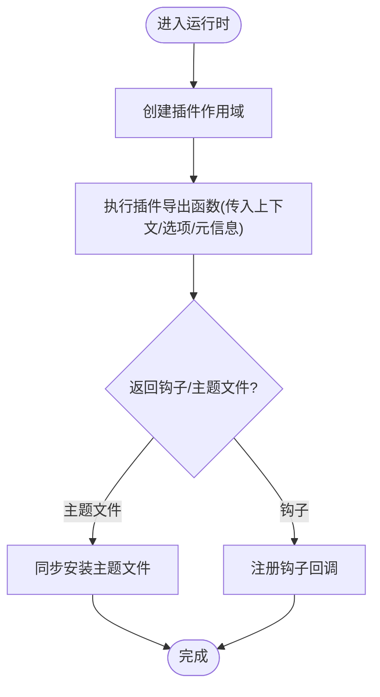
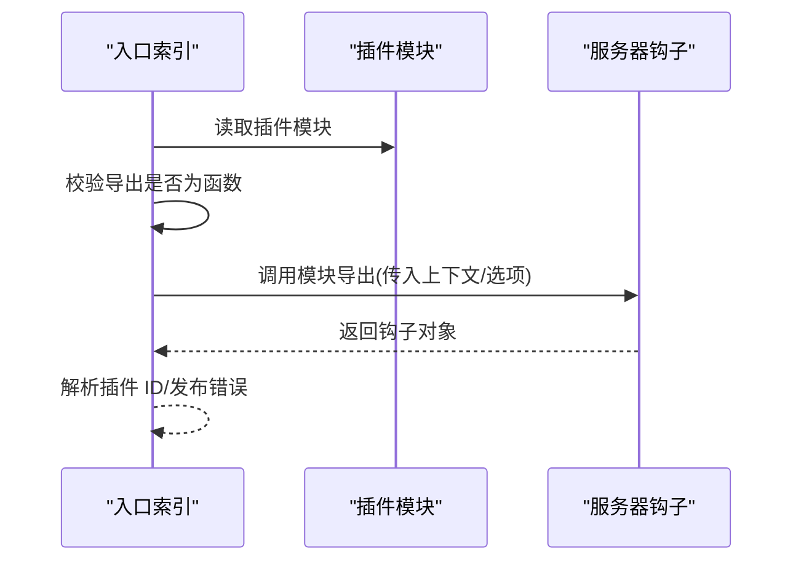
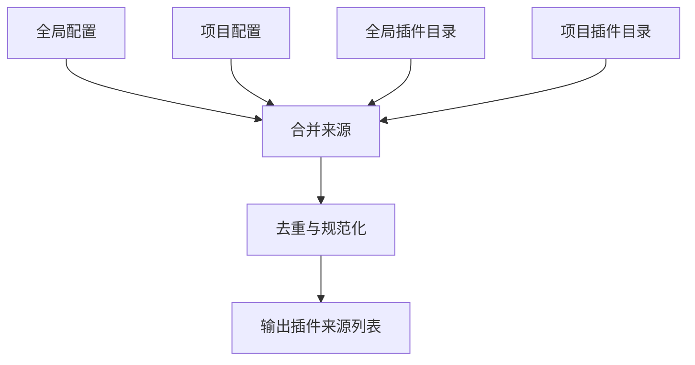
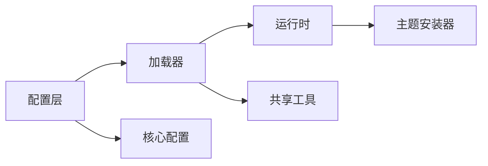

# 插件系统

<cite>
**本文引用的文件**
- [packages/web/src/content/docs/zh/plugins.mdx](file://packages/web/src/content/docs/zh/plugins.mdx)
- [packages/web/src/content/docs/zh/skills.mdx](file://packages/web/src/content/docs/zh/skills.mdx)
- [packages/opencode/src/plugin/index.ts](file://packages/opencode/src/plugin/index.ts)
- [packages/opencode/src/plugin/loader.ts](file://packages/opencode/src/plugin/loader.ts)
- [packages/opencode/src/plugin/tui/runtime.ts](file://packages/opencode/src/plugin/tui/runtime.ts)
- [packages/opencode/src/plugin/shared.ts](file://packages/opencode/src/plugin/shared.ts)
- [packages/opencode/src/config/plugin.ts](file://packages/opencode/src/config/plugin.ts)
- [packages/opencode/src/config/tui.ts](file://packages/opencode/src/config/tui.ts)
- [packages/core/src/config/plugin.ts](file://packages/core/src/config/plugin.ts)
- [packages/core/src/plugin.ts](file://packages/core/src/plugin.ts)
- [packages/opencode/test/cli/tui/plugin-lifecycle.test.ts](file://packages/opencode/test/cli/tui/plugin-lifecycle.test.ts)
- [packages/opencode/test/cli/tui/plugin-loader-entrypoint.test.ts](file://packages/opencode/test/cli/tui/plugin-loader-entrypoint.test.ts)
- [packages/opencode/test/fixture/agent-plugin.ts](file://packages/opencode/test/fixture/agent-plugin.ts)
</cite>

## 目录
1. [简介](#简介)
2. [项目结构](#项目结构)
3. [核心组件](#核心组件)
4. [架构总览](#架构总览)
5. [详细组件分析](#详细组件分析)
6. [依赖关系分析](#依赖关系分析)
7. [性能考量](#性能考量)
8. [故障排查指南](#故障排查指南)
9. [结论](#结论)
10. [附录](#附录)

## 简介
本文件面向 OpenCode 插件体系，系统性阐述插件架构设计、加载机制、生命周期管理、依赖注入与事件钩子模型，并对 Agent、Tool、Skill、Theme 四类插件的职责边界、典型场景与集成方式给出说明。同时提供开发 API 规范、插件间通信与数据交换方式、最佳实践与安全建议，以及可操作的开发与部署指引。

## 项目结构
OpenCode 将“插件”作为统一抽象，围绕“配置解析—加载器—运行时—主题安装器”的链路组织能力；核心代码位于 packages/opencode/src/plugin 下，配套配置与测试位于 packages/opencode/src/config、packages/core 等目录。文档侧提供了多语言的插件安装与加载顺序说明，便于理解插件来源与加载优先级。

图示来源
- [packages/opencode/src/plugin/loader.ts](file://packages/opencode/src/plugin/loader.ts)
- [packages/opencode/src/plugin/tui/runtime.ts](file://packages/opencode/src/plugin/tui/runtime.ts)
- [packages/opencode/src/plugin/index.ts](file://packages/opencode/src/plugin/index.ts)
- [packages/opencode/src/config/plugin.ts](file://packages/opencode/src/config/plugin.ts)
- [packages/core/src/config/plugin.ts](file://packages/core/src/config/plugin.ts)
- [packages/web/src/content/docs/zh/plugins.mdx](file://packages/web/src/content/docs/zh/plugins.mdx)

章节来源
- [packages/web/src/content/docs/zh/plugins.mdx](file://packages/web/src/content/docs/zh/plugins.mdx)
- [packages/opencode/src/config/plugin.ts](file://packages/opencode/src/config/plugin.ts)
- [packages/core/src/config/plugin.ts](file://packages/core/src/config/plugin.ts)

## 核心组件
- 配置解析与来源合并
  - 支持从全局配置、项目配置、全局插件目录、项目插件目录四个层级加载插件源，按顺序合并并去重，避免同名同版本 npm 包重复加载，但本地与 npm 名称相似的插件仍会分别加载。
- 插件加载器
  - 提供统一的加载流程，支持本地文件、npm 包等多来源；支持并行解析与加载；允许调用方将已加载插件转换为任意结果类型。
- 运行时与生命周期
  - TUI 运行时负责将插件导出函数注入上下文并执行；支持主题文件同步安装；提供作用域与销毁超时控制。
- 共享工具
  - 提供插件来源解析、规范器、错误处理等通用能力，保障加载与运行一致性。

章节来源
- [packages/web/src/content/docs/zh/plugins.mdx](file://packages/web/src/content/docs/zh/plugins.mdx)
- [packages/opencode/src/plugin/loader.ts](file://packages/opencode/src/plugin/loader.ts)
- [packages/opencode/src/plugin/tui/runtime.ts](file://packages/opencode/src/plugin/tui/runtime.ts)
- [packages/opencode/src/plugin/shared.ts](file://packages/opencode/src/plugin/shared.ts)

## 架构总览
下图展示从配置到运行时的整体调用序列，体现“配置—加载—运行—主题安装”的主干流程。

图示来源
- [packages/opencode/src/plugin/index.ts](file://packages/opencode/src/plugin/index.ts)
- [packages/opencode/src/plugin/loader.ts](file://packages/opencode/src/plugin/loader.ts)
- [packages/opencode/src/plugin/tui/runtime.ts](file://packages/opencode/src/plugin/tui/runtime.ts)

## 详细组件分析

### 组件一：插件加载器（Loader）
- 职责
  - 解析与加载多种来源的插件（本地文件、npm 包等），支持并行加载以提升启动性能。
  - 提供默认行为：直接返回成功加载的插件对象；调用方可按需转换为所需结果类型。
- 关键点
  - 默认行为可被调用方覆盖，以适配不同插件类型（如主题文件加载）。
  - 对于无代码入口的包（仅主题资源），可通过特殊入口策略加载资源文件。
- 复杂度
  - 并行解析与加载的时间复杂度近似 O(N)，空间复杂度与插件数量线性相关。

图示来源
- [packages/opencode/src/plugin/loader.ts](file://packages/opencode/src/plugin/loader.ts)

章节来源
- [packages/opencode/src/plugin/loader.ts](file://packages/opencode/src/plugin/loader.ts)

### 组件二：TUI 运行时（TUI Runtime）
- 职责
  - 将插件导出函数注入上下文并执行，形成钩子/能力暴露。
  - 负责主题文件的同步安装，确保 UI 主题生效。
  - 提供插件作用域与销毁超时控制，保证资源释放与稳定性。
- 关键点
  - 通过 createPluginScope 创建作用域，结合 dispose_timeout_ms 控制销毁时机。
  - 在主题安装阶段，遍历 theme_files 并进行安装，失败时记录告警日志。
- 错误处理
  - 加载失败或主题安装失败均记录错误上下文，便于定位问题。

图示来源
- [packages/opencode/src/plugin/tui/runtime.ts](file://packages/opencode/src/plugin/tui/runtime.ts)

章节来源
- [packages/opencode/src/plugin/tui/runtime.ts](file://packages/opencode/src/plugin/tui/runtime.ts)

### 组件三：插件入口索引（Index）
- 职责
  - 负责将已加载插件模块转换为服务端可用的 hooks，并进行 ID 解析与发布错误消息。
- 关键点
  - 对插件导出进行校验，确保导出为函数；失败时记录错误并上报。
  - 支持内部插件加载与错误处理，保证系统健壮性。

图示来源
- [packages/opencode/src/plugin/index.ts](file://packages/opencode/src/plugin/index.ts)

章节来源
- [packages/opencode/src/plugin/index.ts](file://packages/opencode/src/plugin/index.ts)

### 组件四：配置与来源解析（Config）
- 职责
  - 定义插件来源的合并与去重逻辑，支持全局/项目/全局/项目四层来源。
  - 提供插件规范器与来源解析工具，确保跨版本兼容与一致性。
- 关键点
  - 去重策略：同名同版本 npm 包仅加载一次；本地与 npm 名称相似的插件分别加载。
  - 来源顺序：全局配置 → 项目配置 → 全局插件目录 → 项目插件目录。

图示来源
- [packages/opencode/src/config/plugin.ts](file://packages/opencode/src/config/plugin.ts)
- [packages/core/src/config/plugin.ts](file://packages/core/src/config/plugin.ts)
- [packages/web/src/content/docs/zh/plugins.mdx](file://packages/web/src/content/docs/zh/plugins.mdx)

章节来源
- [packages/opencode/src/config/plugin.ts](file://packages/opencode/src/config/plugin.ts)
- [packages/core/src/config/plugin.ts](file://packages/core/src/config/plugin.ts)
- [packages/web/src/content/docs/zh/plugins.mdx](file://packages/web/src/content/docs/zh/plugins.mdx)

### 组件五：共享工具与错误处理（Shared）
- 职责
  - 提供插件来源解析、规范器、错误处理等通用能力。
- 关键点
  - 对路径型插件强制要求导出 id，否则抛出类型错误。
  - 为加载失败提供统一的错误日志与上报通道。

章节来源
- [packages/opencode/src/plugin/shared.ts](file://packages/opencode/src/plugin/shared.ts)

## 依赖关系分析
- 组件耦合
  - 配置层与加载层低耦合：配置层只负责来源合并与去重，加载层独立承担加载与转换职责。
  - 运行时依赖加载器与共享工具，形成“加载—运行—安装”的流水线。
- 外部依赖
  - 使用 Bun 在启动时自动安装 npm 插件依赖，并缓存至本地缓存目录。
  - 支持本地插件与外部 npm 包，本地插件通过配置目录下的 package.json 声明依赖。

图示来源
- [packages/opencode/src/config/plugin.ts](file://packages/opencode/src/config/plugin.ts)
- [packages/core/src/config/plugin.ts](file://packages/core/src/config/plugin.ts)
- [packages/opencode/src/plugin/loader.ts](file://packages/opencode/src/plugin/loader.ts)
- [packages/opencode/src/plugin/tui/runtime.ts](file://packages/opencode/src/plugin/tui/runtime.ts)
- [packages/opencode/src/plugin/shared.ts](file://packages/opencode/src/plugin/shared.ts)

章节来源
- [packages/opencode/src/config/plugin.ts](file://packages/opencode/src/config/plugin.ts)
- [packages/core/src/config/plugin.ts](file://packages/core/src/config/plugin.ts)
- [packages/opencode/src/plugin/loader.ts](file://packages/opencode/src/plugin/loader.ts)
- [packages/opencode/src/plugin/tui/runtime.ts](file://packages/opencode/src/plugin/tui/runtime.ts)
- [packages/opencode/src/plugin/shared.ts](file://packages/opencode/src/plugin/shared.ts)

## 性能考量
- 并行加载
  - 加载器支持并行解析与加载，显著缩短启动时间，适合大型项目与多插件场景。
- 缓存策略
  - npm 依赖在启动时安装并缓存，避免重复下载，提高后续加载效率。
- 去重优化
  - 同名同版本 npm 包仅加载一次，减少内存占用与 IO 开销。
- 作用域与销毁
  - 运行时提供作用域与销毁超时控制，防止资源泄漏，提升长期运行稳定性。

## 故障排查指南
- 插件未加载
  - 检查插件来源顺序与去重规则：确认全局/项目配置与目录中是否存在同名冲突。
  - 确认插件导出为函数，且满足 id 要求（路径型插件必须导出 id）。
- 主题未生效
  - 检查主题文件列表与安装流程，关注运行时安装阶段的日志告警。
- 生命周期异常
  - 参考生命周期测试用例，验证插件启用/禁用与状态切换是否符合预期。
- 入口点安全
  - 确保 npm 包的 TUI 导出不越界访问插件根目录外的文件，避免安全风险。

章节来源
- [packages/opencode/src/plugin/shared.ts](file://packages/opencode/src/plugin/shared.ts)
- [packages/opencode/src/plugin/tui/runtime.ts](file://packages/opencode/src/plugin/tui/runtime.ts)
- [packages/opencode/test/cli/tui/plugin-lifecycle.test.ts](file://packages/opencode/test/cli/tui/plugin-lifecycle.test.ts)
- [packages/opencode/test/cli/tui/plugin-loader-entrypoint.test.ts](file://packages/opencode/test/cli/tui/plugin-loader-entrypoint.test.ts)

## 结论
OpenCode 插件系统以“配置—加载—运行—安装”为主线，通过并行加载、去重与缓存策略提升性能，通过运行时作用域与销毁超时保障稳定性。四类插件（Agent/Tool/Skill/Theme）在统一抽象下具备清晰的职责边界与扩展点。遵循本文的开发规范、通信机制与安全建议，可高效构建高质量插件并稳定交付。

## 附录

### 不同类型插件的特性与场景
- Agent 插件
  - 用于自动化代理任务，通过运行时注入上下文并执行钩子，实现代理行为扩展。
- Tool 插件
  - 提供功能性工具扩展，通常以钩子形式接入工作流，在执行前后进行拦截与增强。
- Skill 插件
  - 实现专业技能模块，支持权限控制与禁用策略，适用于需要精细授权的场景。
- Theme 插件
  - 支持界面主题定制，运行时负责主题文件的同步安装，确保 UI 主题生效。

章节来源
- [packages/web/src/content/docs/zh/skills.mdx](file://packages/web/src/content/docs/zh/skills.mdx)
- [packages/opencode/src/plugin/tui/runtime.ts](file://packages/opencode/src/plugin/tui/runtime.ts)

### 插件开发 API 与接口规范
- 插件注册
  - 插件为 JavaScript/TypeScript 模块，导出一个或多个插件函数；每个函数接收上下文对象并返回钩子对象。
- 配置管理
  - 通过全局/项目配置与目录声明插件来源；本地插件可在配置目录内添加 package.json 声明依赖。
- 事件处理
  - 插件通过钩子对象暴露事件回调，运行时按顺序执行，支持在执行前/后进行拦截与增强。
- 生命周期
  - 由运行时创建作用域并执行插件导出函数，完成后按超时策略销毁，确保资源回收。

章节来源
- [packages/web/src/content/docs/zh/plugins.mdx](file://packages/web/src/content/docs/zh/plugins.mdx)
- [packages/opencode/src/plugin/loader.ts](file://packages/opencode/src/plugin/loader.ts)
- [packages/opencode/src/plugin/tui/runtime.ts](file://packages/opencode/src/plugin/tui/runtime.ts)

### 插件间通信与数据交换
- 通信机制
  - 插件通过钩子对象暴露回调，运行时按顺序执行；不同插件之间通过共享上下文与钩子链路进行协作。
- 数据交换
  - 在钩子执行过程中，输入/输出对象可携带上下文数据；插件可对输入进行预处理，对输出进行后处理，实现数据在插件间的传递与转换。

章节来源
- [packages/opencode/src/plugin/index.ts](file://packages/opencode/src/plugin/index.ts)
- [packages/opencode/src/plugin/tui/runtime.ts](file://packages/opencode/src/plugin/tui/runtime.ts)

### 最佳实践与安全考虑
- 最佳实践
  - 使用并行加载与缓存策略提升启动性能；在插件中尽量避免阻塞式操作；合理划分钩子粒度，保持插件职责单一。
- 安全考虑
  - 严格限制 npm 包的 TUI 导出范围，禁止越界访问插件根目录外文件；对插件来源进行可信校验；在运行时对异常进行捕获与上报。

章节来源
- [packages/opencode/test/cli/tui/plugin-loader-entrypoint.test.ts](file://packages/opencode/test/cli/tui/plugin-loader-entrypoint.test.ts)
- [packages/opencode/src/plugin/tui/runtime.ts](file://packages/opencode/src/plugin/tui/runtime.ts)

### 开发示例与部署指南
- 开发示例
  - 参考测试夹具中的插件导出约定，确保每个导出均为插件函数；在插件中正确返回钩子对象。
- 部署指南
  - npm 插件在启动时由 Bun 自动安装并缓存；本地插件直接从插件目录加载；若需使用外部 npm 包，需在配置目录添加 package.json 声明依赖。

章节来源
- [packages/web/src/content/docs/zh/plugins.mdx](file://packages/web/src/content/docs/zh/plugins.mdx)
- [packages/opencode/test/fixture/agent-plugin.ts](file://packages/opencode/test/fixture/agent-plugin.ts)