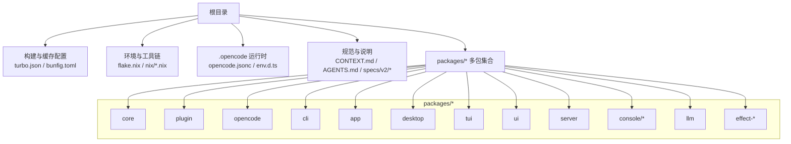
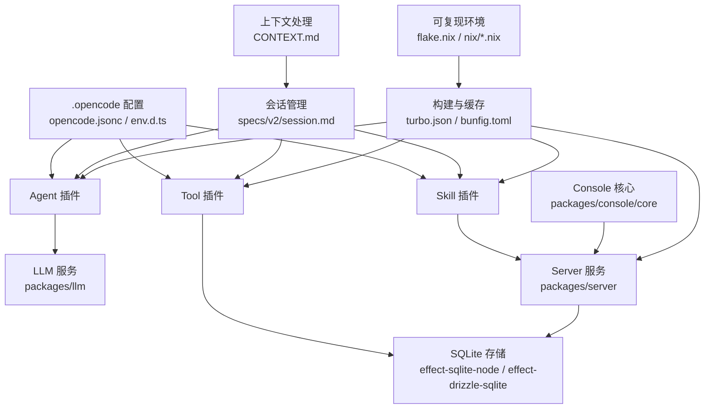
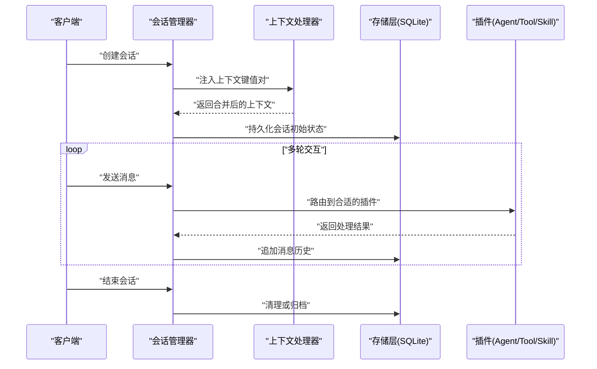
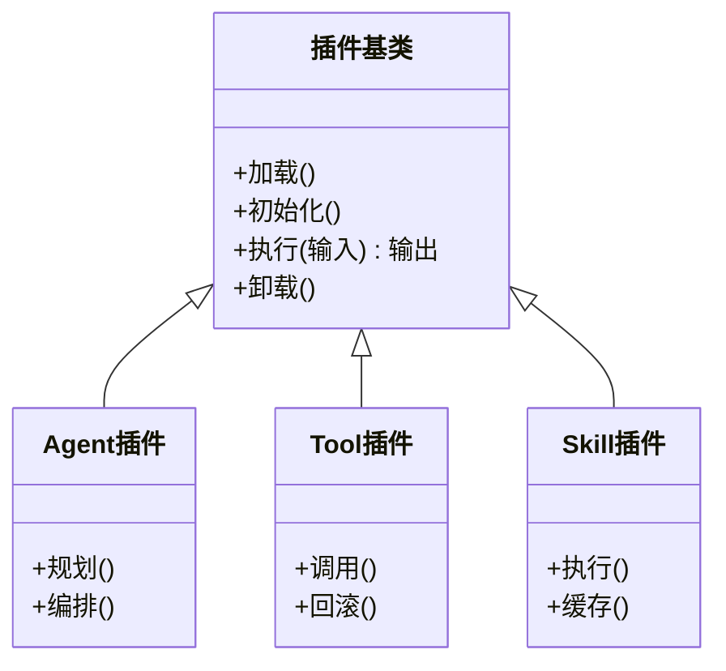
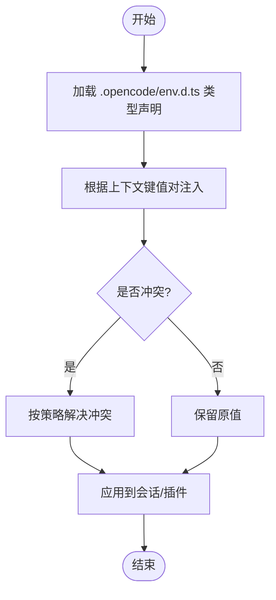
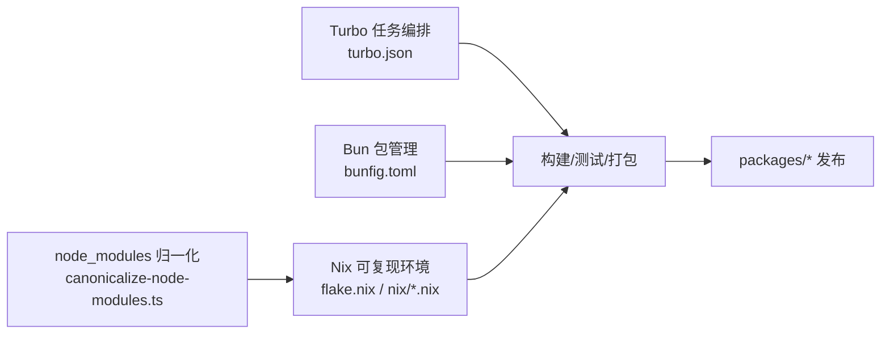
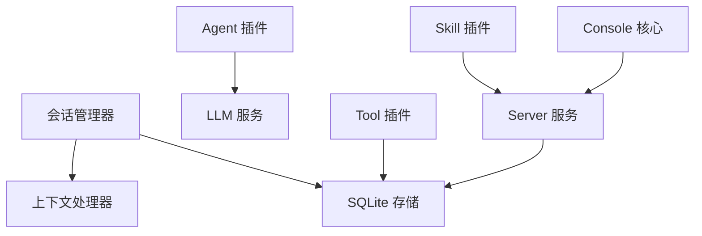

# 核心概念

<cite>
**本文引用的文件**
- [turbo.json](file://turbo.json)
- [bunfig.toml](file://bunfig.toml)
- [flake.nix](file://flake.nix)
- [.opencode/opencode.jsonc](file://.opencode/opencode.jsonc)
- [.opencode/env.d.ts](file://.opencode/env.d.ts)
- [CONTEXT.md](file://CONTEXT.md)
- [AGENTS.md](file://AGENTS.md)
- [specs/v2/session.md](file://specs/v2/session.md)
- [specs/v2/tools.md](file://specs/v2/tools.md)
- [specs/v2/catalog-config-plugin-lifecycle.md](file://specs/v2/catalog-config-plugin-lifecycle.md)
- [packages/core/package.json](file://packages/core/package.json)
- [packages/plugin/package.json](file://packages/plugin/package.json)
- [packages/opencode/package.json](file://packages/opencode/package.json)
- [packages/cli/package.json](file://packages/cli/package.json)
- [packages/app/package.json](file://packages/app/package.json)
- [packages/desktop/package.json](file://packages/desktop/package.json)
- [packages/tui/package.json](file://packages/tui/package.json)
- [packages/ui/package.json](file://packages/ui/package.json)
- [packages/server/package.json](file://packages/server/package.json)
- [packages/console/core/package.json](file://packages/console/core/package.json)
- [packages/llm/package.json](file://packages/llm/package.json)
- [packages/effect-sqlite-node/package.json](file://packages/effect-sqlite-node/package.json)
- [packages/effect-drizzle-sqlite/package.json](file://packages/effect-drizzle-sqlite/package.json)
- [nix/node_modules.nix](file://nix/node_modules.nix)
- [nix/opencode.nix](file://nix/opencode.nix)
- [nix/scripts/canonicalize-node-modules.ts](file://nix/scripts/canonicalize-node-modules.ts)
</cite>

## 目录
1. [引言](#引言)
2. [项目结构](#项目结构)
3. [核心组件](#核心组件)
4. [架构总览](#架构总览)
5. [详细组件分析](#详细组件分析)
6. [依赖分析](#依赖分析)
7. [性能考虑](#性能考虑)
8. [故障排查指南](#故障排查指南)
9. [结论](#结论)
10. [附录](#附录)

## 引言
本文件面向 OpenCode 的核心概念与实现，聚焦以下主题：  
- 单体仓库（monorepo）架构设计与包管理策略，涵盖 Turbo、Bun、Nix 等工具链协同  
- 会话管理系统：状态管理、上下文保持、历史追踪  
- 插件系统：Agent、Tool、Skill 的差异与适用场景  
- 系统上下文处理机制：跨组件传递与状态管理  
- 安装与版本管理策略：多环境一致性保障  
- 通过架构图与流程图展示组件交互，辅以“代码片段路径”指引定位实现细节

## 项目结构
OpenCode 采用 monorepo 组织方式，根目录包含统一的构建与运行配置，以及按领域拆分的 packages 子目录。关键配置文件如下：
- 构建与缓存：turbo.json（Turbo 工作流与任务定义）、bunfig.toml（Bun 包管理与脚本配置）
- 环境与工具链：flake.nix（Nix 包与开发环境）、nix/*.nix（可复现的依赖与二进制归一化）
- 运行时与插件：.opencode/opencode.jsonc（运行时配置）、.opencode/env.d.ts（类型声明）
- 规范与说明：CONTEXT.md、AGENTS.md、specs/v2/*（会话、工具、插件生命周期等）

图表来源
- [turbo.json](file://turbo.json)
- [bunfig.toml](file://bunfig.toml)
- [flake.nix](file://flake.nix)
- [.opencode/opencode.jsonc](file://.opencode/opencode.jsonc)
- [.opencode/env.d.ts](file://.opencode/env.d.ts)
- [specs/v2/session.md](file://specs/v2/session.md)
- [specs/v2/tools.md](file://specs/v2/tools.md)
- [specs/v2/catalog-config-plugin-lifecycle.md](file://specs/v2/catalog-config-plugin-lifecycle.md)

章节来源
- [turbo.json](file://turbo.json)
- [bunfig.toml](file://bunfig.toml)
- [flake.nix](file://flake.nix)
- [.opencode/opencode.jsonc](file://.opencode/opencode.jsonc)
- [.opencode/env.d.ts](file://.opencode/env.d.ts)
- [CONTEXT.md](file://CONTEXT.md)
- [AGENTS.md](file://AGENTS.md)
- [specs/v2/session.md](file://specs/v2/session.md)
- [specs/v2/tools.md](file://specs/v2/tools.md)
- [specs/v2/catalog-config-plugin-lifecycle.md](file://specs/v2/catalog-config-plugin-lifecycle.md)

## 核心组件
- 会话管理：基于 specs/v2/session.md 的会话模型与生命周期，支持上下文注入、历史记录与状态持久化
- 插件体系：Agent/Tool/Skill 三类插件，遵循 catalog-config-plugin-lifecycle.md 的加载与生命周期管理
- 上下文处理：CONTEXT.md 定义的上下文键值对在组件间传递与合并策略
- 包管理与版本：turbo.json 驱动的任务编排，bunfig.toml 管理包解析与脚本，flake.nix/nix/*.nix 提供可复现的依赖与二进制归一化
- 数据与存储：effect-sqlite-node 与 effect-drizzle-sqlite 提供 SQLite 访问与迁移能力

章节来源
- [specs/v2/session.md](file://specs/v2/session.md)
- [specs/v2/tools.md](file://specs/v2/tools.md)
- [specs/v2/catalog-config-plugin-lifecycle.md](file://specs/v2/catalog-config-plugin-lifecycle.md)
- [CONTEXT.md](file://CONTEXT.md)
- [packages/effect-sqlite-node/package.json](file://packages/effect-sqlite-node/package.json)
- [packages/effect-drizzle-sqlite/package.json](file://packages/effect-drizzle-sqlite/package.json)

## 架构总览
OpenCode 的运行时由“配置层（.opencode）+ 插件层（Agent/Tool/Skill）+ 服务层（server/console/llm）+ 存储层（SQLite）+ 工具链（Turbo/Bun/Nix）”构成。会话作为贯穿各层的状态载体，通过上下文键值对在组件间传递。

图表来源
- [.opencode/opencode.jsonc](file://.opencode/opencode.jsonc)
- [.opencode/env.d.ts](file://.opencode/env.d.ts)
- [CONTEXT.md](file://CONTEXT.md)
- [specs/v2/session.md](file://specs/v2/session.md)
- [specs/v2/tools.md](file://specs/v2/tools.md)
- [specs/v2/catalog-config-plugin-lifecycle.md](file://specs/v2/catalog-config-plugin-lifecycle.md)
- [packages/llm/package.json](file://packages/llm/package.json)
- [packages/server/package.json](file://packages/server/package.json)
- [packages/console/core/package.json](file://packages/console/core/package.json)
- [packages/effect-sqlite-node/package.json](file://packages/effect-sqlite-node/package.json)
- [packages/effect-drizzle-sqlite/package.json](file://packages/effect-drizzle-sqlite/package.json)
- [turbo.json](file://turbo.json)
- [bunfig.toml](file://bunfig.toml)
- [flake.nix](file://flake.nix)
- [nix/opencode.nix](file://nix/opencode.nix)

## 详细组件分析

### 会话管理系统
- 设计目标：在多轮对话中维持用户意图、上下文与历史，支持跨组件共享与持久化
- 关键机制：
  - 会话状态：会话对象包含标识、上下文、消息历史、元数据等字段
  - 上下文注入：通过 CONTEXT.md 的键值对在请求进入时注入到会话
  - 历史追踪：消息序列按时间顺序维护，支持回溯与重放
  - 生命周期：遵循 specs/v2/session.md 的创建、更新、结束与清理流程

图表来源
- [specs/v2/session.md](file://specs/v2/session.md)
- [CONTEXT.md](file://CONTEXT.md)
- [packages/effect-sqlite-node/package.json](file://packages/effect-sqlite-node/package.json)
- [packages/effect-drizzle-sqlite/package.json](file://packages/effect-drizzle-sqlite/package.json)

章节来源
- [specs/v2/session.md](file://specs/v2/session.md)
- [CONTEXT.md](file://CONTEXT.md)

### 插件系统架构
- Agent 插件：面向复杂推理与多步规划，负责协调多个 Tool/Skill 完成任务
- Tool 插件：面向具体工具调用（如数据库查询、外部 API），强调幂等与可测试性
- Skill 插件：面向常见技能动作（如回答、总结、分类），强调快速执行与稳定性
- 生命周期：遵循 catalog-config-plugin-lifecycle.md 的加载、初始化、执行、卸载流程

图表来源
- [specs/v2/tools.md](file://specs/v2/tools.md)
- [specs/v2/catalog-config-plugin-lifecycle.md](file://specs/v2/catalog-config-plugin-lifecycle.md)

章节来源
- [specs/v2/tools.md](file://specs/v2/tools.md)
- [specs/v2/catalog-config-plugin-lifecycle.md](file://specs/v2/catalog-config-plugin-lifecycle.md)
- [AGENTS.md](file://AGENTS.md)

### 系统上下文处理机制
- 键值对模型：上下文以键值对形式存在，支持覆盖、合并与优先级
- 传递路径：从 .opencode/env.d.ts 类型声明到运行时注入，再到会话与插件
- 合并策略：同名键按预设规则（如后入为主、数组合并、对象递归合并）处理冲突
- 可观测性：上下文变更与注入点在日志与监控中可追踪

图表来源
- [.opencode/env.d.ts](file://.opencode/env.d.ts)
- [CONTEXT.md](file://CONTEXT.md)

章节来源
- [.opencode/env.d.ts](file://.opencode/env.d.ts)
- [CONTEXT.md](file://CONTEXT.md)

### 包管理与版本策略
- Turbo：通过 turbo.json 定义任务图与缓存策略，加速构建与测试
- Bun：通过 bunfig.toml 统一包解析、脚本与工作区行为
- Nix：通过 flake.nix 与 nix/*.nix 提供可复现的依赖树与二进制归一化，nix/scripts/canonicalize-node-modules.ts 负责 node_modules 归一化
- 版本一致性：所有 packages/* 在同一版本号策略下发布；Nix 层面锁定依赖哈希，避免漂移

图表来源
- [turbo.json](file://turbo.json)
- [bunfig.toml](file://bunfig.toml)
- [flake.nix](file://flake.nix)
- [nix/opencode.nix](file://nix/opencode.nix)
- [nix/node_modules.nix](file://nix/node_modules.nix)
- [nix/scripts/canonicalize-node-modules.ts](file://nix/scripts/canonicalize-node-modules.ts)

章节来源
- [turbo.json](file://turbo.json)
- [bunfig.toml](file://bunfig.toml)
- [flake.nix](file://flake.nix)
- [nix/opencode.nix](file://nix/opencode.nix)
- [nix/node_modules.nix](file://nix/node_modules.nix)
- [nix/scripts/canonicalize-node-modules.ts](file://nix/scripts/canonicalize-node-modules.ts)

## 依赖分析
- 组件耦合：会话管理器对上下文处理器与存储层有直接依赖；Agent 插件对 LLM 服务有间接依赖；Tool/Skill 对 Server/DB 有直接依赖
- 外部依赖：packages/*/package.json 中声明了各包的依赖与脚本入口
- 版本约束：通过 Nix 锁定关键依赖哈希，Bun/Turbo 保证本地与 CI 行为一致

图表来源
- [packages/server/package.json](file://packages/server/package.json)
- [packages/console/core/package.json](file://packages/console/core/package.json)
- [packages/llm/package.json](file://packages/llm/package.json)
- [packages/effect-sqlite-node/package.json](file://packages/effect-sqlite-node/package.json)
- [packages/effect-drizzle-sqlite/package.json](file://packages/effect-drizzle-sqlite/package.json)

章节来源
- [packages/server/package.json](file://packages/server/package.json)
- [packages/console/core/package.json](file://packages/console/core/package.json)
- [packages/llm/package.json](file://packages/llm/package.json)
- [packages/effect-sqlite-node/package.json](file://packages/effect-sqlite-node/package.json)
- [packages/effect-drizzle-sqlite/package.json](file://packages/effect-drizzle-sqlite/package.json)

## 性能考虑
- 并行化：Turbo 任务图允许并行执行独立任务，减少整体等待时间
- 缓存：利用 Turbo 缓存与 Bun 的快速包解析，降低重复构建成本
- 存储优化：SQLite 访问通过 effect-sqlite-node 与 effect-drizzle-sqlite 提供事务与索引建议
- 环境一致性：Nix 可复现环境避免“在我机器上能跑”的问题，提升端到端性能稳定性

## 故障排查指南
- 会话异常：检查 specs/v2/session.md 的状态机与错误码；确认 CONTEXT.md 注入是否覆盖预期键
- 插件未加载：核对 catalog-config-plugin-lifecycle.md 的加载顺序与依赖；查看 packages/*/package.json 的入口与导出
- 存储失败：验证 effect-sqlite-node 与 effect-drizzle-sqlite 的连接参数与迁移脚本
- 构建失败：对比 turbo.json 的任务图与 bunfig.toml 的工作区设置；在 Nix 环境中重新生成 lockfile

章节来源
- [specs/v2/session.md](file://specs/v2/session.md)
- [specs/v2/catalog-config-plugin-lifecycle.md](file://specs/v2/catalog-config-plugin-lifecycle.md)
- [packages/effect-sqlite-node/package.json](file://packages/effect-sqlite-node/package.json)
- [packages/effect-drizzle-sqlite/package.json](file://packages/effect-drizzle-sqlite/package.json)
- [turbo.json](file://turbo.json)
- [bunfig.toml](file://bunfig.toml)
- [flake.nix](file://flake.nix)

## 结论
OpenCode 以 monorepo 为核心组织形态，结合 Turbo、Bun、Nix 实现高效、可复现且可扩展的工程体系。会话管理、插件系统与上下文处理共同构成了系统的运行时内核，贯穿于 Agent/Tool/Skill 的协作与 Server/DB 的数据通路。通过规范化的生命周期与版本策略，确保多环境一致性与长期演进的稳定性。

## 附录
- 代码片段路径参考（用于定位实现）：
  - 会话状态与历史：[specs/v2/session.md](file://specs/v2/session.md)
  - 插件生命周期：[specs/v2/catalog-config-plugin-lifecycle.md](file://specs/v2/catalog-config-plugin-lifecycle.md)
  - 工具插件接口与示例：[specs/v2/tools.md](file://specs/v2/tools.md)
  - 上下文键值对注入：[CONTEXT.md](file://CONTEXT.md)
  - 运行时配置与类型：[.opencode/opencode.jsonc](file://.opencode/opencode.jsonc), [.opencode/env.d.ts](file://.opencode/env.d.ts)
  - 构建与缓存：[turbo.json](file://turbo.json), [bunfig.toml](file://bunfig.toml)
  - 可复现环境：[flake.nix](file://flake.nix), [nix/opencode.nix](file://nix/opencode.nix), [nix/node_modules.nix](file://nix/node_modules.nix), [nix/scripts/canonicalize-node-modules.ts](file://nix/scripts/canonicalize-node-modules.ts)
  - 包定义与入口：[packages/core/package.json](file://packages/core/package.json), [packages/plugin/package.json](file://packages/plugin/package.json), [packages/opencode/package.json](file://packages/opencode/package.json), [packages/cli/package.json](file://packages/cli/package.json), [packages/app/package.json](file://packages/app/package.json), [packages/desktop/package.json](file://packages/desktop/package.json), [packages/tui/package.json](file://packages/tui/package.json), [packages/ui/package.json](file://packages/ui/package.json), [packages/server/package.json](file://packages/server/package.json), [packages/console/core/package.json](file://packages/console/core/package.json), [packages/llm/package.json](file://packages/llm/package.json), [packages/effect-sqlite-node/package.json](file://packages/effect-sqlite-node/package.json), [packages/effect-drizzle-sqlite/package.json](file://packages/effect-drizzle-sqlite/package.json)