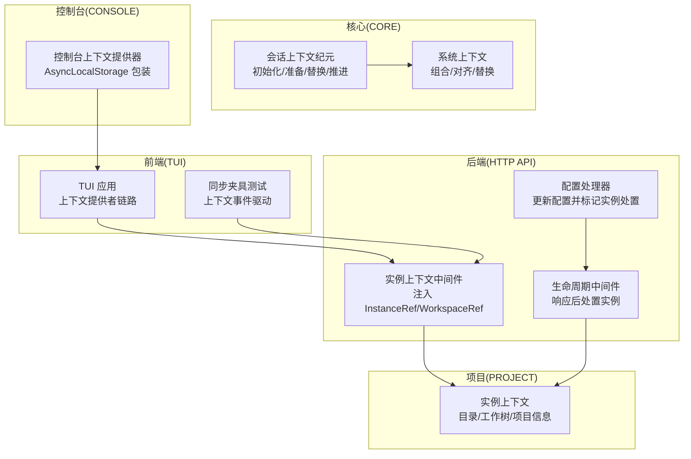
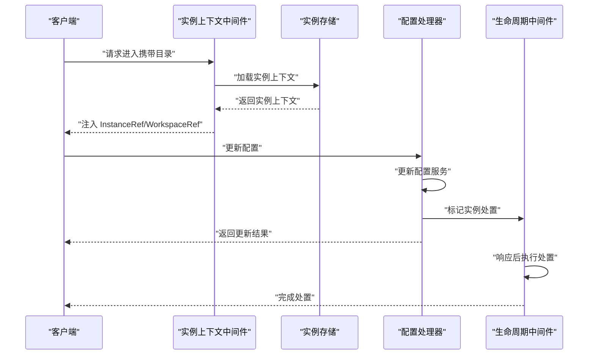
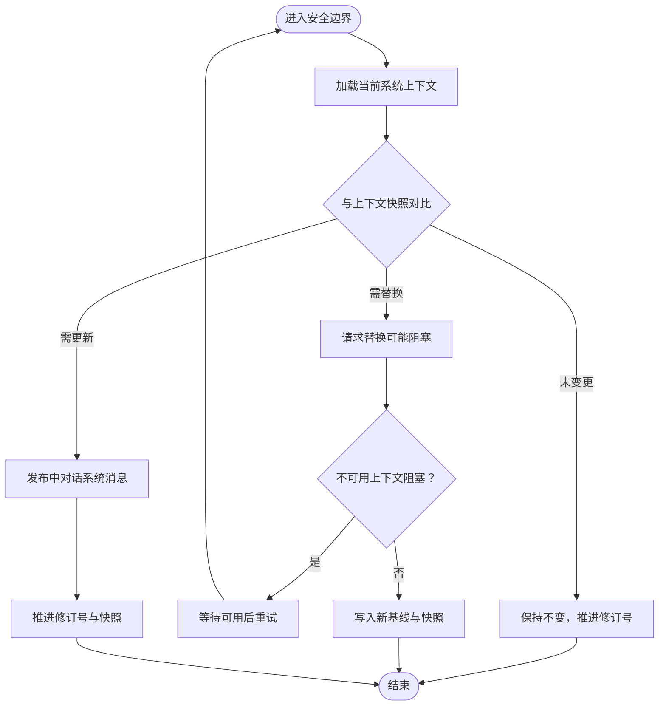
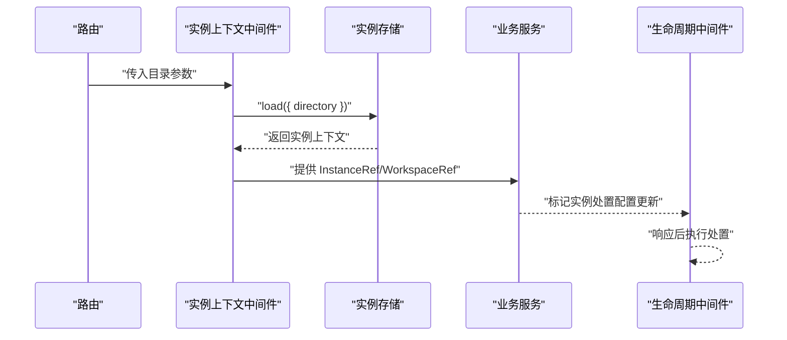
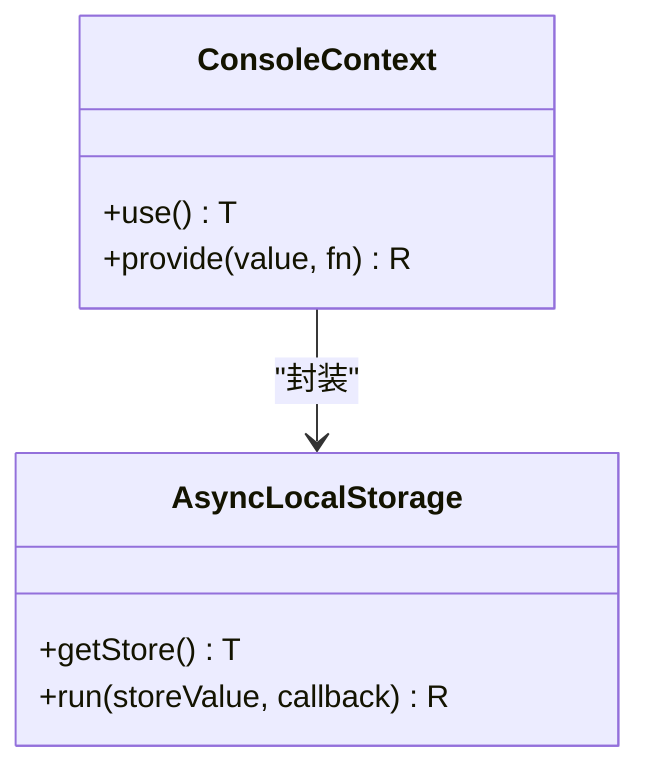
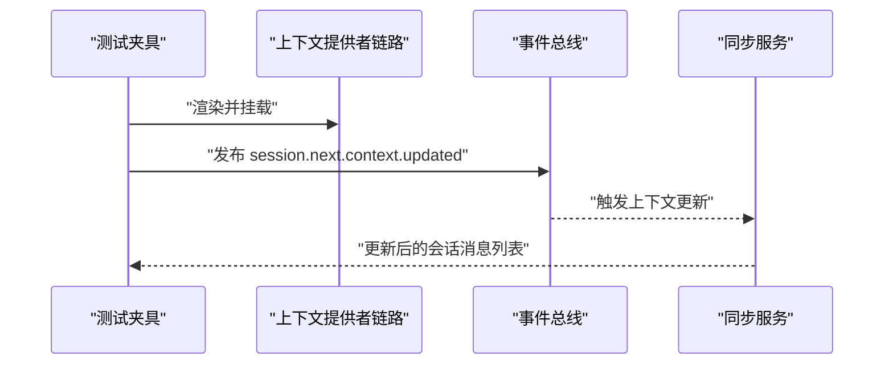
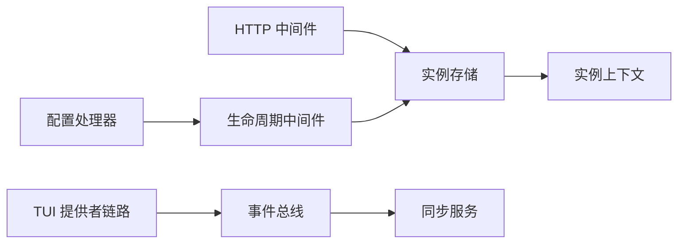

# 系统上下文

<cite>
**本文引用的文件**
- [CONTEXT.md](file://CONTEXT.md)
- [packages/console/core/src/context.ts](file://packages/console/core/src/context.ts)
- [packages/core/src/session/context-epoch.ts](file://packages/core/src/session/context-epoch.ts)
- [packages/opencode/src/project/instance-context.ts](file://packages/opencode/src/project/instance-context.ts)
- [packages/opencode/src/server/routes/instance/httpapi/middleware/instance-context.ts](file://packages/opencode/src/server/routes/instance/httpapi/middleware/instance-context.ts)
- [packages/opencode/src/server/routes/instance/httpapi/handlers/config.ts](file://packages/opencode/src/server/routes/instance/httpapi/handlers/config.ts)
- [packages/opencode/src/server/routes/instance/httpapi/lifecycle.ts](file://packages/opencode/src/server/routes/instance/httpapi/lifecycle.ts)
- [packages/tui/test/cli/cmd/tui/sync-fixture.tsx](file://packages/tui/test/cli/cmd/tui/sync-fixture.tsx)
- [packages/tui/test/cli/tui/data.test.tsx](file://packages/tui/test/cli/tui/data.test.tsx)
</cite>

## 目录
1. [引言](#引言)
2. [项目结构](#项目结构)
3. [核心组件](#核心组件)
4. [架构总览](#架构总览)
5. [详细组件分析](#详细组件分析)
6. [依赖关系分析](#依赖关系分析)
7. [性能考量](#性能考量)
8. [故障排查指南](#故障排查指南)
9. [结论](#结论)
10. [附录](#附录)

## 引言
本文件系统性阐述 OpenCode 的“系统上下文”机制：从概念定义到实现细节，涵盖上下文的组装、持久化、变更传播与生命周期管理。重点说明以下方面：
- 系统上下文的概念边界与术语规范（如系统上下文、会话历史、上下文源、系统上下文注册表、中对话系统消息、上下文纪元、基线系统上下文、上下文快照、不可用上下文、安全的提供方调用边界、模型工具输出、托管工具输出文件、模型请求选项、生成控制、PTY 环境等）。
- 上下文提供者与注册、更新通知、依赖解析的实现路径。
- 上下文存储策略（内存存储、持久化存储、缓存优化）。
- 上下文继承与覆盖机制（嵌套上下文与优先级冲突处理）。
- 使用最佳实践（性能优化、内存管理、线程安全）。
- 具体使用示例与常见问题解决方案。

## 项目结构
OpenCode 将“系统上下文”作为会话运行时的关键抽象，贯穿前端 TUI、后端 HTTP API、实例上下文注入、会话上下文纪元管理与数据库持久化等模块。核心文件分布如下：
- 概念与术语：CONTEXT.md
- 控制台上下文提供器：packages/console/core/src/context.ts
- 会话上下文纪元（初始化/准备/替换/推进）：packages/core/src/session/context-epoch.ts
- 实例上下文（目录、工作树、项目信息）：packages/opencode/src/project/instance-context.ts
- 实例上下文中间件（HTTP 层注入）：packages/opencode/src/server/routes/instance/httpapi/middleware/instance-context.ts
- 配置处理器（含上下文更新触发实例处置）：packages/opencode/src/server/routes/instance/httpapi/handlers/config.ts
- 生命周期中间件（响应后处置实例）：packages/opencode/src/server/routes/instance/httpapi/lifecycle.ts
- TUI 测试中的上下文提供者链路与事件驱动更新：packages/tui/test/cli/cmd/tui/sync-fixture.tsx、packages/tui/test/cli/tui/data.test.tsx

图表来源
- [packages/opencode/src/server/routes/instance/httpapi/middleware/instance-context.ts:1-44](file://packages/opencode/src/server/routes/instance/httpapi/middleware/instance-context.ts#L1-L44)
- [packages/opencode/src/server/routes/instance/httpapi/handlers/config.ts:1-34](file://packages/opencode/src/server/routes/instance/httpapi/handlers/config.ts#L1-L34)
- [packages/opencode/src/server/routes/instance/httpapi/lifecycle.ts:1-54](file://packages/opencode/src/server/routes/instance/httpapi/lifecycle.ts#L1-L54)
- [packages/core/src/session/context-epoch.ts:1-344](file://packages/core/src/session/context-epoch.ts#L1-L344)
- [packages/console/core/src/context.ts:1-22](file://packages/console/core/src/context.ts#L1-L22)
- [packages/opencode/src/project/instance-context.ts:1-25](file://packages/opencode/src/project/instance-context.ts#L1-L25)
- [packages/tui/test/cli/cmd/tui/sync-fixture.tsx:27-64](file://packages/tui/test/cli/cmd/tui/sync-fixture.tsx#L27-L64)
- [packages/tui/test/cli/tui/data.test.tsx:493-534](file://packages/tui/test/cli/tui/data.test.tsx#L493-L534)

章节来源
- [CONTEXT.md:1-130](file://CONTEXT.md#L1-L130)
- [packages/opencode/src/server/routes/instance/httpapi/middleware/instance-context.ts:1-44](file://packages/opencode/src/server/routes/instance/httpapi/middleware/instance-context.ts#L1-L44)
- [packages/opencode/src/server/routes/instance/httpapi/handlers/config.ts:1-34](file://packages/opencode/src/server/routes/instance/httpapi/handlers/config.ts#L1-L34)
- [packages/opencode/src/server/routes/instance/httpapi/lifecycle.ts:1-54](file://packages/opencode/src/server/routes/instance/httpapi/lifecycle.ts#L1-L54)
- [packages/core/src/session/context-epoch.ts:1-344](file://packages/core/src/session/context-epoch.ts#L1-L344)
- [packages/console/core/src/context.ts:1-22](file://packages/console/core/src/context.ts#L1-L22)
- [packages/opencode/src/project/instance-context.ts:1-25](file://packages/opencode/src/project/instance-context.ts#L1-L25)
- [packages/tui/test/cli/cmd/tui/sync-fixture.tsx:27-64](file://packages/tui/test/cli/cmd/tui/sync-fixture.tsx#L27-L64)
- [packages/tui/test/cli/tui/data.test.tsx:493-534](file://packages/tui/test/cli/tui/data.test.tsx#L493-L534)

## 核心组件
- 系统上下文（System Context）
  - 定义：由零个或多个“上下文源”组成的结构化事实集合，作为初始指令与时间序列更新呈现给模型。
  - 关键能力：组合（combine）、初始化（initialize）、对齐（reconcile）、替换（replace）。
  - 参考：CONTEXT.md 中对系统上下文、上下文源、系统上下文注册表、中对话系统消息、上下文纪元、基线系统上下文、上下文快照、不可用上下文、安全的提供方调用边界的定义与关系。

- 会话上下文纪元（Session Context Epoch）
  - 职责：负责上下文的初始化、准备、替换与推进；维护上下文快照与修订号；在安全边界处决定是否发出“中对话系统消息”。
  - 关键流程：initialize/prepare/reconcile/replace/requestReplacement/reset/advance/current/fence。
  - 并发与一致性：通过事务与修订号 fencing，避免并发替换导致的不一致。

- 实例上下文（Instance Context）
  - 结构：包含目录、工作树、项目信息。
  - 提供：通过本地上下文工具创建，用于路径判定与权限边界判断。

- 实例上下文中间件（Instance Context Middleware）
  - 功能：从路由上下文中解码目录，加载实例上下文，注入 InstanceRef 与 WorkspaceRef，供后续服务使用。

- 控制台上下文提供器（Console Context Provider）
  - 实现：基于 Node.js AsyncLocalStorage，提供 use/provide 方法，支持在异步链路中传递上下文值。

- 配置处理器与生命周期中间件
  - 配置更新：更新配置后，标记实例进行处置，确保上下文变更生效。
  - 响应后处置：在 HTTP 响应发送后再执行实例释放，保证幂等与一致性。

章节来源
- [CONTEXT.md:58-121](file://CONTEXT.md#L58-L121)
- [packages/core/src/session/context-epoch.ts:42-123](file://packages/core/src/session/context-epoch.ts#L42-L123)
- [packages/core/src/session/context-epoch.ts:159-187](file://packages/core/src/session/context-epoch.ts#L159-L187)
- [packages/core/src/session/context-epoch.ts:298-344](file://packages/core/src/session/context-epoch.ts#L298-L344)
- [packages/opencode/src/project/instance-context.ts:5-25](file://packages/opencode/src/project/instance-context.ts#L5-L25)
- [packages/opencode/src/server/routes/instance/httpapi/middleware/instance-context.ts:23-43](file://packages/opencode/src/server/routes/instance/httpapi/middleware/instance-context.ts#L23-L43)
- [packages/console/core/src/context.ts:3-21](file://packages/console/core/src/context.ts#L3-L21)
- [packages/opencode/src/server/routes/instance/httpapi/handlers/config.ts:18-22](file://packages/opencode/src/server/routes/instance/httpapi/handlers/config.ts#L18-L22)
- [packages/opencode/src/server/routes/instance/httpapi/lifecycle.ts:23-54](file://packages/opencode/src/server/routes/instance/httpapi/lifecycle.ts#L23-L54)

## 架构总览
系统上下文在 OpenCode 中以“会话上下文纪元”为核心，围绕“安全提供方调用边界”进行上下文的采样与准入。实例上下文通过 HTTP 中间件注入，控制台上下文提供器在前端/控制台侧提供异步上下文传递能力。配置更新触发实例处置，确保上下文变更在新实例中生效。

图表来源
- [packages/opencode/src/server/routes/instance/httpapi/middleware/instance-context.ts:23-43](file://packages/opencode/src/server/routes/instance/httpapi/middleware/instance-context.ts#L23-L43)
- [packages/opencode/src/server/routes/instance/httpapi/handlers/config.ts:18-22](file://packages/opencode/src/server/routes/instance/httpapi/handlers/config.ts#L18-L22)
- [packages/opencode/src/server/routes/instance/httpapi/lifecycle.ts:23-54](file://packages/opencode/src/server/routes/instance/httpapi/lifecycle.ts#L23-L54)

## 详细组件分析

### 组件一：系统上下文与会话上下文纪元
- 组合与初始化
  - SystemContext.initialize：对组合后的系统上下文一次性观察，生成基线与上下文快照。
  - reconcile/replace：在安全边界处比较当前上下文与快照，决定是否需要替换或仅推进快照。
- 快照与修订
  - 上下文快照用于与上次提交值对比，记录每个上下文源的编码 JSON 值及可选移除渲染文本。
  - 修订号 fencing 保障并发替换的一致性。
- 安全边界与中对话系统消息
  - 在安全边界前，用户输入或工具结算先于任何上下文变更被接纳。
  - 多源变更合并为一条“中对话系统消息”，记录精确的已发送文本，便于审计与重放。

图表来源
- [packages/core/src/session/context-epoch.ts:67-110](file://packages/core/src/session/context-epoch.ts#L67-L110)
- [packages/core/src/session/context-epoch.ts:159-187](file://packages/core/src/session/context-epoch.ts#L159-L187)
- [packages/core/src/session/context-epoch.ts:298-344](file://packages/core/src/session/context-epoch.ts#L298-L344)

章节来源
- [CONTEXT.md:58-121](file://CONTEXT.md#L58-L121)
- [packages/core/src/session/context-epoch.ts:42-123](file://packages/core/src/session/context-epoch.ts#L42-L123)
- [packages/core/src/session/context-epoch.ts:159-187](file://packages/core/src/session/context-epoch.ts#L159-L187)
- [packages/core/src/session/context-epoch.ts:298-344](file://packages/core/src/session/context-epoch.ts#L298-L344)

### 组件二：实例上下文与中间件注入
- 实例上下文结构：包含目录、工作树、项目信息，用于路径判定与权限边界判断。
- 中间件职责：解码路由参数，加载实例上下文，注入 InstanceRef 与 WorkspaceRef，供后续服务使用。
- 生命周期联动：配置更新后，通过生命周期中间件在响应后执行实例处置，确保上下文变更生效。

图表来源
- [packages/opencode/src/server/routes/instance/httpapi/middleware/instance-context.ts:23-43](file://packages/opencode/src/server/routes/instance/httpapi/middleware/instance-context.ts#L23-L43)
- [packages/opencode/src/project/instance-context.ts:5-25](file://packages/opencode/src/project/instance-context.ts#L5-L25)
- [packages/opencode/src/server/routes/instance/httpapi/handlers/config.ts:18-22](file://packages/opencode/src/server/routes/instance/httpapi/handlers/config.ts#L18-L22)
- [packages/opencode/src/server/routes/instance/httpapi/lifecycle.ts:23-54](file://packages/opencode/src/server/routes/instance/httpapi/lifecycle.ts#L23-L54)

章节来源
- [packages/opencode/src/project/instance-context.ts:5-25](file://packages/opencode/src/project/instance-context.ts#L5-L25)
- [packages/opencode/src/server/routes/instance/httpapi/middleware/instance-context.ts:23-43](file://packages/opencode/src/server/routes/instance/httpapi/middleware/instance-context.ts#L23-L43)
- [packages/opencode/src/server/routes/instance/httpapi/handlers/config.ts:18-22](file://packages/opencode/src/server/routes/instance/httpapi/handlers/config.ts#L18-L22)
- [packages/opencode/src/server/routes/instance/httpapi/lifecycle.ts:23-54](file://packages/opencode/src/server/routes/instance/httpapi/lifecycle.ts#L23-L54)

### 组件三：控制台上下文提供器（AsyncLocalStorage）
- 提供 use/provide 能力，基于 Node.js AsyncLocalStorage，在异步链路中传递上下文值。
- 适用场景：控制台应用、测试夹具、TUI 渲染链路中的上下文共享。

图表来源
- [packages/console/core/src/context.ts:3-21](file://packages/console/core/src/context.ts#L3-L21)

章节来源
- [packages/console/core/src/context.ts:3-21](file://packages/console/core/src/context.ts#L3-L21)

### 组件四：TUI 上下文提供者链路与事件驱动更新
- 提供者链路：ArgsProvider -> KVProvider -> SDKProvider -> ProjectProvider -> SyncProvider。
- 事件驱动：通过会话事件“下一个上下文更新”触发中对话系统消息，确保模型侧看到最新上下文。

图表来源
- [packages/tui/test/cli/cmd/tui/sync-fixture.tsx:46-59](file://packages/tui/test/cli/cmd/tui/sync-fixture.tsx#L46-L59)
- [packages/tui/test/cli/tui/data.test.tsx:514-531](file://packages/tui/test/cli/tui/data.test.tsx#L514-L531)

章节来源
- [packages/tui/test/cli/cmd/tui/sync-fixture.tsx:46-59](file://packages/tui/test/cli/cmd/tui/sync-fixture.tsx#L46-L59)
- [packages/tui/test/cli/tui/data.test.tsx:514-531](file://packages/tui/test/cli/tui/data.test.tsx#L514-L531)

## 依赖关系分析
- 低耦合高内聚
  - 会话上下文纪元独立于具体上下文源实现，通过 SystemContext 抽象进行组合与对齐。
  - 实例上下文中间件仅负责注入，不关心上下文内容。
- 关键依赖链
  - HTTP 中间件 -> 实例存储 -> 实例上下文
  - 配置处理器 -> 生命周期中间件 -> 实例存储/处置
  - TUI 提供者链路 -> 事件总线 -> 同步服务
- 循环依赖规避
  - 通过服务注入与 Effect 层隔离，避免直接循环引用。

图表来源
- [packages/opencode/src/server/routes/instance/httpapi/middleware/instance-context.ts:23-43](file://packages/opencode/src/server/routes/instance/httpapi/middleware/instance-context.ts#L23-L43)
- [packages/opencode/src/server/routes/instance/httpapi/handlers/config.ts:18-22](file://packages/opencode/src/server/routes/instance/httpapi/handlers/config.ts#L18-L22)
- [packages/opencode/src/server/routes/instance/httpapi/lifecycle.ts:23-54](file://packages/opencode/src/server/routes/instance/httpapi/lifecycle.ts#L23-L54)
- [packages/tui/test/cli/cmd/tui/sync-fixture.tsx:46-59](file://packages/tui/test/cli/cmd/tui/sync-fixture.tsx#L46-L59)
- [packages/tui/test/cli/tui/data.test.tsx:514-531](file://packages/tui/test/cli/tui/data.test.tsx#L514-L531)

章节来源
- [packages/opencode/src/server/routes/instance/httpapi/middleware/instance-context.ts:23-43](file://packages/opencode/src/server/routes/instance/httpapi/middleware/instance-context.ts#L23-L43)
- [packages/opencode/src/server/routes/instance/httpapi/handlers/config.ts:18-22](file://packages/opencode/src/server/routes/instance/httpapi/handlers/config.ts#L18-L22)
- [packages/opencode/src/server/routes/instance/httpapi/lifecycle.ts:23-54](file://packages/opencode/src/server/routes/instance/httpapi/lifecycle.ts#L23-L54)
- [packages/tui/test/cli/cmd/tui/sync-fixture.tsx:46-59](file://packages/tui/test/cli/cmd/tui/sync-fixture.tsx#L46-L59)
- [packages/tui/test/cli/tui/data.test.tsx:514-531](file://packages/tui/test/cli/tui/data.test.tsx#L514-L531)

## 性能考量
- 上下文快照与增量推进
  - 通过上下文快照与修订号 fencing，减少不必要的基线重建与消息发布。
- 并发与重试
  - 对修订不匹配采用 yieldNow 重试，降低锁竞争带来的抖动。
- 事件驱动与懒加载
  - 上下文变更在安全边界处采样与准入，避免异步唤醒导致的频繁更新。
- 缓存与持久化
  - 基线系统上下文在上下文纪元内复用，避免重复渲染；上下文快照持久化至数据库，支持进程重启恢复。

章节来源
- [packages/core/src/session/context-epoch.ts:27-34](file://packages/core/src/session/context-epoch.ts#L27-L34)
- [packages/core/src/session/context-epoch.ts:75-110](file://packages/core/src/session/context-epoch.ts#L75-L110)
- [CONTEXT.md:74-86](file://CONTEXT.md#L74-L86)

## 故障排查指南
- Agent 替换被阻塞
  - 现象：跨代理替换请求被标记为“替换阻塞”。
  - 排查：确认当前上下文是否存在不可用上下文；检查上下文快照与当前上下文的差异。
  - 参考：AgentReplacementBlocked 错误类型与 fence 逻辑。
- 位置不匹配
  - 现象：插入上下文纪元时抛出位置不匹配错误。
  - 排查：确认会话所在目录与工作区 ID 与实例上下文一致。
- 修订不匹配
  - 现象：事务更新失败，提示修订不匹配。
  - 排查：重试策略已在实现中处理，若持续出现，检查并发替换逻辑。
- 不可用上下文
  - 现象：初始上下文不可用导致首次回合阻塞。
  - 排查：确认上下文源加载器行为，必要时采用“不可用上下文”的退避策略。

章节来源
- [packages/core/src/session/context-epoch.ts:19-25](file://packages/core/src/session/context-epoch.ts#L19-L25)
- [packages/core/src/session/context-epoch.ts:214-215](file://packages/core/src/session/context-epoch.ts#L214-L215)
- [packages/core/src/session/context-epoch.ts:273-274](file://packages/core/src/session/context-epoch.ts#L273-L274)
- [CONTEXT.md:80-86](file://CONTEXT.md#L80-L86)

## 结论
OpenCode 的系统上下文机制通过“会话上下文纪元”与“安全边界”确保上下文变更的确定性与可审计性；通过实例上下文中间件与控制台上下文提供器实现多层上下文的注入与传递；通过配置更新与生命周期中间件实现上下文变更的平滑过渡。该设计在保证一致性的同时，兼顾了性能与可扩展性。

## 附录
- 最佳实践清单
  - 在安全边界处进行上下文变更采样，避免异步推送。
  - 使用上下文快照与修订号 fencing，减少冗余更新。
  - 对不可用上下文采用“不可用上下文”语义，避免暴露过期状态。
  - 在 HTTP 层通过中间件注入实例上下文，确保服务层一致性。
  - 使用控制台上下文提供器在异步链路中传递上下文值，注意作用域与清理。
- 常见问题
  - 上下文未生效：确认配置更新后是否触发实例处置与新实例加载。
  - 更新风暴：检查是否存在频繁的上下文源变更，考虑合并与节流。
  - 权限边界：利用实例上下文的路径判定函数，确保外部目录权限正确。