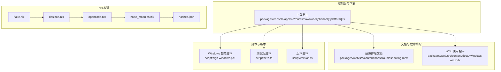
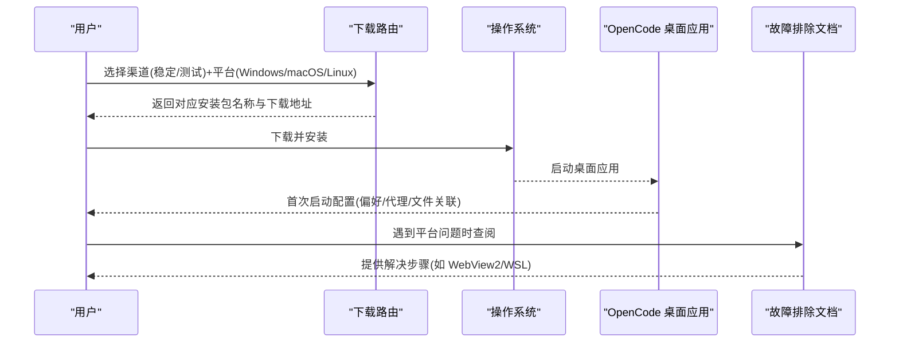
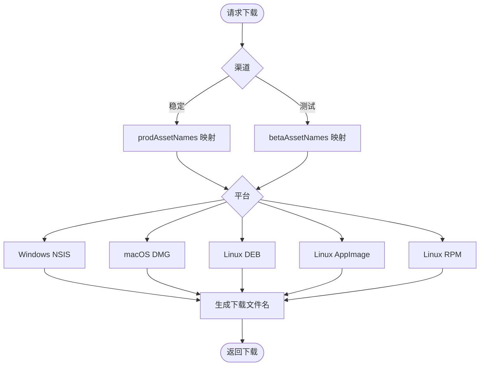
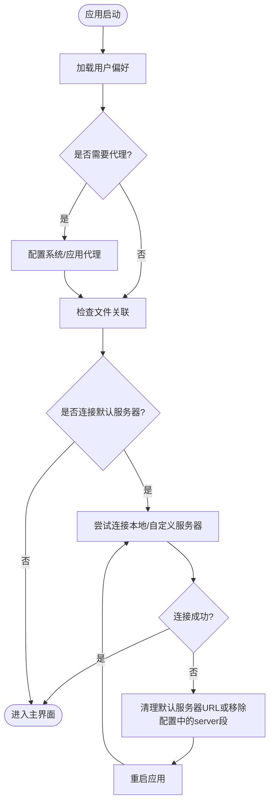
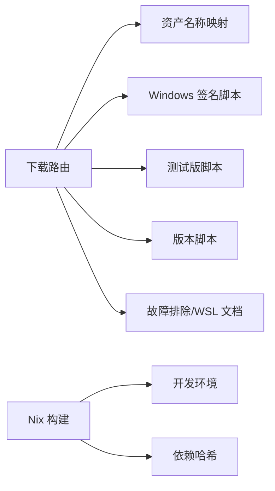

# 安装与配置

<cite>
**本文引用的文件**
- [packages/console/app/src/routes/download/[channel]/[platform].ts](file://packages/console/app/src/routes/download/[channel]/[platform].ts)
- [packages/web/src/content/docs/troubleshooting.mdx](file://packages/web/src/content/docs/troubleshooting.mdx)
- [packages/web/src/content/docs/windows-wsl.mdx](file://packages/web/src/content/docs/windows-wsl.mdx)
- [packages/web/src/content/docs/de/troubleshooting.mdx](file://packages/web/src/content/docs/de/troubleshooting.mdx)
- [packages/web/src/content/docs/pt-br/troubleshooting.mdx](file://packages/web/src/content/docs/pt-br/troubleshooting.mdx)
- [packages/web/src/content/docs/zh-cn/windows-wsl.mdx](file://packages/web/src/content/docs/zh-cn/windows-wsl.mdx)
- [packages/web/src/content/docs/es/windows-wsl.mdx](file://packages/web/src/content/docs/es/windows-wsl.mdx)
- [packages/web/src/content/docs/pl/windows-wsl.mdx](file://packages/web/src/content/docs/pl/windows-wsl.mdx)
- [packages/web/src/content/docs/ar/plugins.mdx](file://packages/web/src/content/docs/ar/plugins.mdx)
- [packages/web/src/content/docs/config.mdx](file://packages/web/src/content/docs/config.mdx)
- [script/sign-windows.ps1](file://script/sign-windows.ps1)
- [script/beta.ts](file://script/beta.ts)
- [script/version.ts](file://script/version.ts)
- [flake.nix](file://flake.nix)
- [nix/desktop.nix](file://nix/desktop.nix)
- [nix/opencode.nix](file://nix/opencode.nix)
- [nix/node_modules.nix](file://nix/node_modules.nix)
- [nix/hashes.json](file://nix/hashes.json)
</cite>

## 目录
1. [简介](#简介)
2. [项目结构](#项目结构)
3. [核心组件](#核心组件)
4. [架构总览](#架构总览)
5. [详细组件分析](#详细组件分析)
6. [依赖分析](#依赖分析)
7. [性能考虑](#性能考虑)
8. [故障排除指南](#故障排除指南)
9. [结论](#结论)
10. [附录](#附录)

## 简介
本指南面向首次安装与配置 OpenCode 桌面应用的用户，覆盖 Windows、macOS、Linux 三大平台的安装方法、安装包验证、系统要求检查、首次启动配置流程（用户偏好、代理、文件关联）、版本选择建议（稳定版/测试版）、卸载与重置配置等关键步骤。文档内容基于仓库中的下载路由、故障排除与 WSL 推荐说明整理而成，确保用户能在不同环境下顺利完成安装与初始配置。

## 项目结构
OpenCode 仓库采用多包工作区组织，桌面应用相关的下载入口位于控制台服务的下载路由中；同时，官方文档提供了跨平台的故障排除与 WSL 使用建议。Nix 构建脚本用于本地开发与依赖管理，便于理解安装与打包的上下文。

图表来源
- [packages/console/app/src/routes/download/[channel]/[platform].ts](file://packages/console/app/src/routes/download/[channel]/[platform].ts#L1-L29)
- [packages/web/src/content/docs/troubleshooting.mdx:147-180](file://packages/web/src/content/docs/troubleshooting.mdx#L147-L180)
- [packages/web/src/content/docs/windows-wsl.mdx:1-46](file://packages/web/src/content/docs/windows-wsl.mdx#L1-L46)
- [script/sign-windows.ps1](file://script/sign-windows.ps1)
- [script/beta.ts](file://script/beta.ts)
- [script/version.ts](file://script/version.ts)
- [flake.nix](file://flake.nix)
- [nix/desktop.nix](file://nix/desktop.nix)
- [nix/opencode.nix](file://nix/opencode.nix)
- [nix/node_modules.nix](file://nix/node_modules.nix)
- [nix/hashes.json](file://nix/hashes.json)

章节来源
- [packages/console/app/src/routes/download/[channel]/[platform].ts](file://packages/console/app/src/routes/download/[channel]/[platform].ts#L1-L29)
- [packages/web/src/content/docs/troubleshooting.mdx:147-180](file://packages/web/src/content/docs/troubleshooting.mdx#L147-L180)
- [packages/web/src/content/docs/windows-wsl.mdx:1-46](file://packages/web/src/content/docs/windows-wsl.mdx#L1-L46)
- [script/sign-windows.ps1](file://script/sign-windows.ps1)
- [script/beta.ts](file://script/beta.ts)
- [script/version.ts](file://script/version.ts)
- [flake.nix](file://flake.nix)
- [nix/desktop.nix](file://nix/desktop.nix)
- [nix/opencode.nix](file://nix/opencode.nix)
- [nix/node_modules.nix](file://nix/node_modules.nix)
- [nix/hashes.json](file://nix/hashes.json)

## 核心组件
- 下载路由：根据渠道（稳定/测试）与平台（Windows/macOS/Linux）返回对应资产名称与下载链接，支撑各平台安装包分发。
- 故障排除文档：涵盖 Windows WebView2 运行时、Linux Wayland/X11、通知显示、重置应用存储等常见问题处理。
- WSL 使用指南：在 Windows 上推荐通过 WSL 运行以获得更佳体验，并提供从 WSL 启动 OpenCode 的步骤。
- 版本与签名：提供测试版脚本与版本管理脚本，Windows 安装包由专用脚本进行签名。
- Nix 构建：通过 flake.nix 与 desktop.nix 等脚本定义构建环境与依赖哈希，辅助本地安装与打包。

章节来源
- [packages/console/app/src/routes/download/[channel]/[platform].ts](file://packages/console/app/src/routes/download/[channel]/[platform].ts#L1-L29)
- [packages/web/src/content/docs/troubleshooting.mdx:147-180](file://packages/web/src/content/docs/troubleshooting.mdx#L147-L180)
- [packages/web/src/content/docs/windows-wsl.mdx:1-46](file://packages/web/src/content/docs/windows-wsl.mdx#L1-L46)
- [script/sign-windows.ps1](file://script/sign-windows.ps1)
- [script/beta.ts](file://script/beta.ts)
- [script/version.ts](file://script/version.ts)
- [nix/desktop.nix](file://nix/desktop.nix)
- [nix/opencode.nix](file://nix/opencode.nix)
- [nix/node_modules.nix](file://nix/node_modules.nix)
- [nix/hashes.json](file://nix/hashes.json)

## 架构总览
下图展示桌面应用安装与配置的关键流程：用户通过控制台下载路由获取安装包，完成安装后首次启动进入配置阶段；若遇到平台特定问题，可参考故障排除文档或在 Windows 上使用 WSL 获得更佳体验。

图表来源
- [packages/console/app/src/routes/download/[channel]/[platform].ts](file://packages/console/app/src/routes/download/[channel]/[platform].ts#L1-L29)
- [packages/web/src/content/docs/troubleshooting.mdx:147-180](file://packages/web/src/content/docs/troubleshooting.mdx#L147-L180)
- [packages/web/src/content/docs/windows-wsl.mdx:1-46](file://packages/web/src/content/docs/windows-wsl.mdx#L1-L46)

## 详细组件分析

### 平台与渠道映射（稳定/测试）
下载路由为不同平台与渠道定义了对应的资产名称，确保用户能正确获取稳定版或测试版安装包。

图表来源
- [packages/console/app/src/routes/download/[channel]/[platform].ts](file://packages/console/app/src/routes/download/[channel]/[platform].ts#L1-L29)

章节来源
- [packages/console/app/src/routes/download/[channel]/[platform].ts](file://packages/console/app/src/routes/download/[channel]/[platform].ts#L1-L29)

### 首次启动配置流程
桌面应用首次启动通常会引导用户完成以下配置项：
- 用户偏好设置：界面语言、主题、字体大小等基础选项。
- 代理配置：若网络受限，需配置系统或应用内代理以连接服务器。
- 文件关联设置：将常用文件类型与 OpenCode 关联，提升编辑效率。
- 服务器连接：默认启动本地服务器，或连接自定义服务器 URL；若连接失败，可清理默认服务器 URL 或移除配置中的 server 段落并重启。

图表来源
- [packages/web/src/content/docs/troubleshooting.mdx:104-114](file://packages/web/src/content/docs/troubleshooting.mdx#L104-L114)

章节来源
- [packages/web/src/content/docs/troubleshooting.mdx:104-114](file://packages/web/src/content/docs/troubleshooting.mdx#L104-L114)

### 版本选择建议与安装注意事项
- 稳定版：适合日常开发与生产使用，更新频率较低，变更经过充分验证。
- 测试版：包含最新功能与修复，适合希望提前试用新特性的用户；可通过测试版脚本进行版本标记与发布准备。
- 安装注意事项：
  - Windows：确保已安装 Microsoft Edge WebView2 Runtime，否则可能出现空白窗口或无法启动。
  - Linux：Wayland 环境可能引发空窗或 compositor 错误，可尝试设置允许 Wayland 或切换至 X11 会话。
  - macOS：安装包名称统一为 DMG，下载后按常规方式挂载并拖拽安装。
  - Windows 安装包由专用脚本进行签名，确保来源可信。

章节来源
- [packages/web/src/content/docs/troubleshooting.mdx:147-156](file://packages/web/src/content/docs/troubleshooting.mdx#L147-L156)
- [packages/web/src/content/docs/de/troubleshooting.mdx:134-136](file://packages/web/src/content/docs/de/troubleshooting.mdx#L134-L136)
- [packages/web/src/content/docs/pt-br/troubleshooting.mdx:133-135](file://packages/web/src/content/docs/pt-br/troubleshooting.mdx#L133-L135)
- [script/sign-windows.ps1](file://script/sign-windows.ps1)
- [script/beta.ts](file://script/beta.ts)

### 卸载与重置配置
若应用无法启动或需要彻底清除状态，可按以下步骤操作：
- 卸载：通过系统自带的应用管理器或安装包提供的卸载程序进行卸载。
- 重置配置（最后手段）：
  - 退出桌面应用。
  - 定位并删除应用数据目录中的以下文件（示例路径以 macOS 为例，其他平台请参考对应系统路径）：
    - 桌面默认服务器 URL 存储文件
    - 全局与工作区 UI 状态文件
  - 重新启动应用以恢复默认配置。

章节来源
- [packages/web/src/content/docs/troubleshooting.mdx:168-180](file://packages/web/src/content/docs/troubleshooting.mdx#L168-L180)

### Windows（WSL）推荐方案
在 Windows 上推荐使用 WSL 获取更佳体验，步骤如下：
- 安装 WSL（参考官方指南）。
- 在 WSL 终端中使用任一安装方式安装 OpenCode。
- 在项目目录中运行 OpenCode 命令启动。

章节来源
- [packages/web/src/content/docs/windows-wsl.mdx:1-46](file://packages/web/src/content/docs/windows-wsl.mdx#L1-L46)
- [packages/web/src/content/docs/zh-cn/windows-wsl.mdx:1-46](file://packages/web/src/content/docs/zh-cn/windows-wsl.mdx#L1-L46)
- [packages/web/src/content/docs/es/windows-wsl.mdx:1-46](file://packages/web/src/content/docs/es/windows-wsl.mdx#L1-L46)
- [packages/web/src/content/docs/pl/windows-wsl.mdx:1-46](file://packages/web/src/content/docs/pl/windows-wsl.mdx#L1-L46)

### 插件与配置文件
- 插件安装：外部 npm 包会在应用启动时自动通过 Bun 安装并缓存到用户目录；本地插件可直接从插件目录加载。
- 配置文件：全局与项目级配置文件支持 JSON/JSONC 格式，TUI 配置可单独使用 tui.json；可通过环境变量指向自定义配置文件。

章节来源
- [packages/web/src/content/docs/ar/plugins.mdx:48-50](file://packages/web/src/content/docs/ar/plugins.mdx#L48-L50)
- [packages/web/src/content/docs/config.mdx:266-287](file://packages/web/src/content/docs/config.mdx#L266-L287)

## 依赖分析
- 下载路由依赖渠道与平台参数，映射到具体资产名称与下载文件名。
- 故障排除文档与 WSL 指南作为用户支持与平台适配的补充材料。
- 版本与签名脚本保障测试版发布与 Windows 安装包签名。
- Nix 构建脚本提供一致的开发与打包环境，确保依赖可复现。

图表来源
- [packages/console/app/src/routes/download/[channel]/[platform].ts](file://packages/console/app/src/routes/download/[channel]/[platform].ts#L1-L29)
- [script/sign-windows.ps1](file://script/sign-windows.ps1)
- [script/beta.ts](file://script/beta.ts)
- [script/version.ts](file://script/version.ts)
- [packages/web/src/content/docs/troubleshooting.mdx:147-180](file://packages/web/src/content/docs/troubleshooting.mdx#L147-L180)
- [packages/web/src/content/docs/windows-wsl.mdx:1-46](file://packages/web/src/content/docs/windows-wsl.mdx#L1-L46)
- [nix/desktop.nix](file://nix/desktop.nix)
- [nix/opencode.nix](file://nix/opencode.nix)
- [nix/node_modules.nix](file://nix/node_modules.nix)
- [nix/hashes.json](file://nix/hashes.json)

章节来源
- [packages/console/app/src/routes/download/[channel]/[platform].ts](file://packages/console/app/src/routes/download/[channel]/[platform].ts#L1-L29)
- [script/sign-windows.ps1](file://script/sign-windows.ps1)
- [script/beta.ts](file://script/beta.ts)
- [script/version.ts](file://script/version.ts)
- [packages/web/src/content/docs/troubleshooting.mdx:147-180](file://packages/web/src/content/docs/troubleshooting.mdx#L147-L180)
- [packages/web/src/content/docs/windows-wsl.mdx:1-46](file://packages/web/src/content/docs/windows-wsl.mdx#L1-L46)
- [nix/desktop.nix](file://nix/desktop.nix)
- [nix/opencode.nix](file://nix/opencode.nix)
- [nix/node_modules.nix](file://nix/node_modules.nix)
- [nix/hashes.json](file://nix/hashes.json)

## 性能考虑
- Windows：若遇到性能缓慢、文件访问问题或终端异常，建议改用 WSL 运行以获得更顺畅的开发体验。
- Linux：Wayland 环境可能导致空窗或 compositor 错误，可尝试设置允许 Wayland 或切换至 X11 会话。

章节来源
- [packages/web/src/content/docs/troubleshooting.mdx:153-156](file://packages/web/src/content/docs/troubleshooting.mdx#L153-L156)
- [packages/web/src/content/docs/de/troubleshooting.mdx:125-131](file://packages/web/src/content/docs/de/troubleshooting.mdx#L125-L131)

## 故障排除指南
- Windows：若出现空白窗口或无法启动，安装/更新 Microsoft Edge WebView2 Runtime 后重试。
- Linux：Wayland/X11 问题可通过设置允许 Wayland 或切换到 X11 会话解决。
- 通知不显示：需在系统设置中启用通知且应用窗口未处于聚焦状态。
- 重置应用存储：若无法通过界面清除设置，可删除应用数据目录中的相关文件后重启应用。

章节来源
- [packages/web/src/content/docs/troubleshooting.mdx:147-180](file://packages/web/src/content/docs/troubleshooting.mdx#L147-L180)
- [packages/web/src/content/docs/de/troubleshooting.mdx:134-141](file://packages/web/src/content/docs/de/troubleshooting.mdx#L134-L141)
- [packages/web/src/content/docs/pt-br/troubleshooting.mdx:133-151](file://packages/web/src/content/docs/pt-br/troubleshooting.mdx#L133-L151)

## 结论
通过本指南，您可以在 Windows、macOS、Linux 上完成 OpenCode 桌面应用的安装与配置。建议优先选择稳定版进行日常使用，如需抢先体验新功能可选择测试版；遇到平台特定问题时，可参考故障排除文档或在 Windows 上使用 WSL 获得更佳体验。若仍无法解决，可按“重置配置”步骤清除状态后重新启动应用。

## 附录
- 下载与安装包命名：下载路由为各平台与渠道定义了标准化的资产名称与下载文件名，便于用户识别与校验。
- Nix 构建：flake.nix 与 desktop.nix 等脚本提供一致的构建环境与依赖哈希，有助于本地开发与打包一致性。

章节来源
- [packages/console/app/src/routes/download/[channel]/[platform].ts](file://packages/console/app/src/routes/download/[channel]/[platform].ts#L23-L27)
- [nix/desktop.nix](file://nix/desktop.nix)
- [nix/opencode.nix](file://nix/opencode.nix)
- [nix/node_modules.nix](file://nix/node_modules.nix)
- [nix/hashes.json](file://nix/hashes.json)