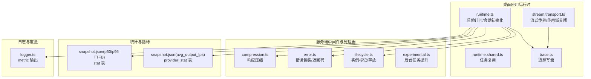
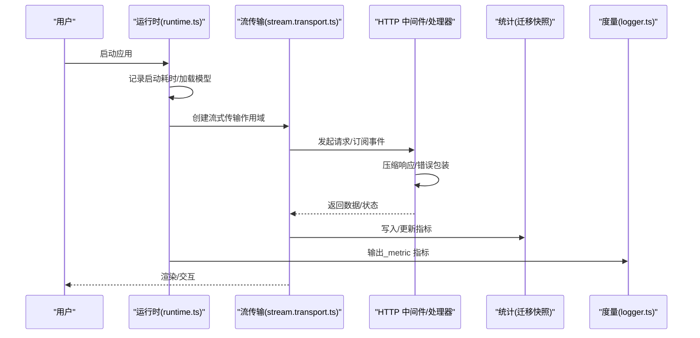
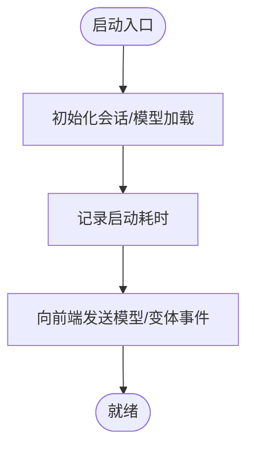
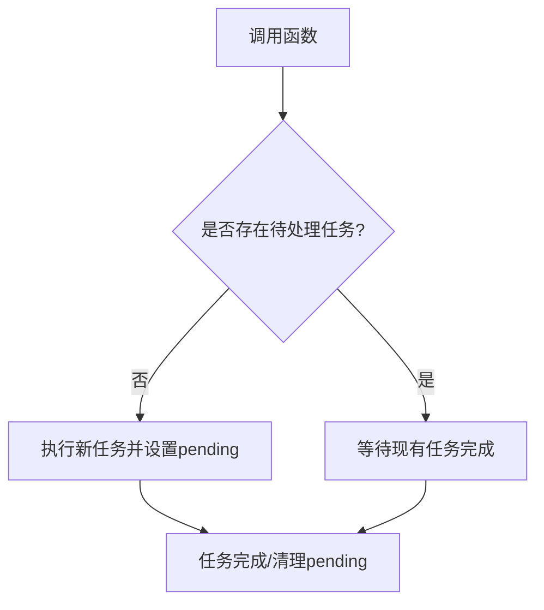
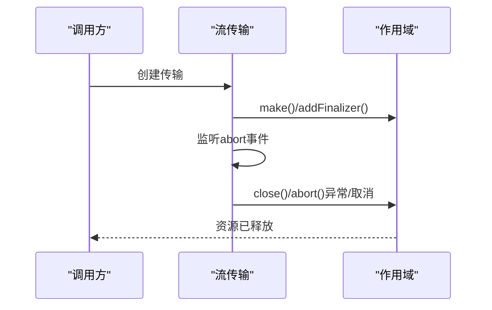
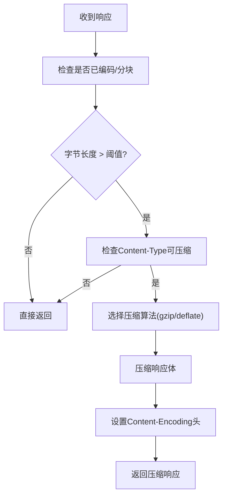
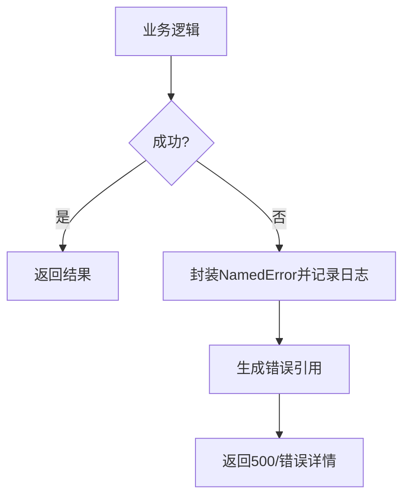
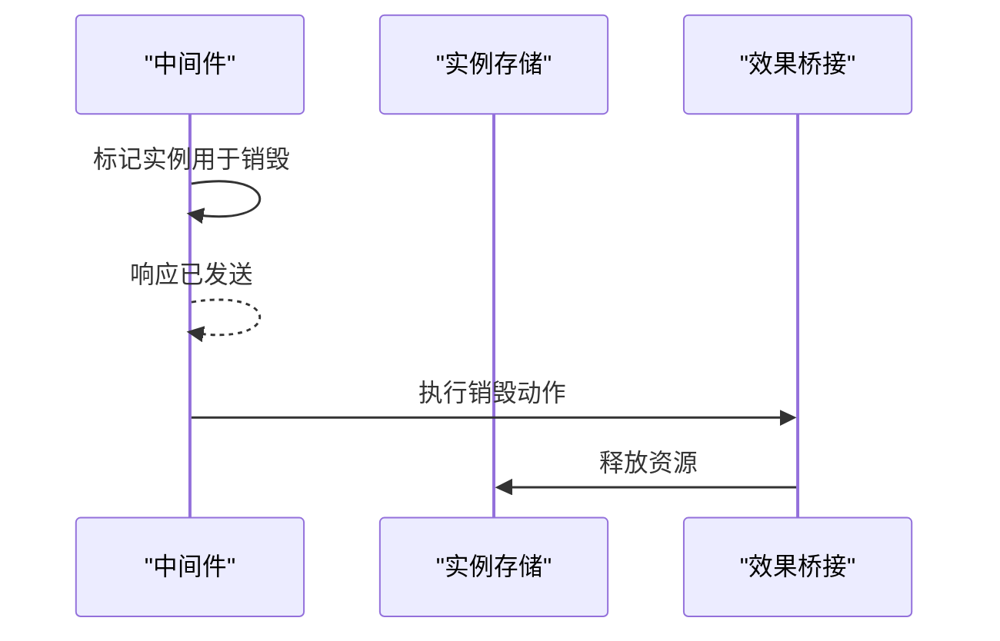
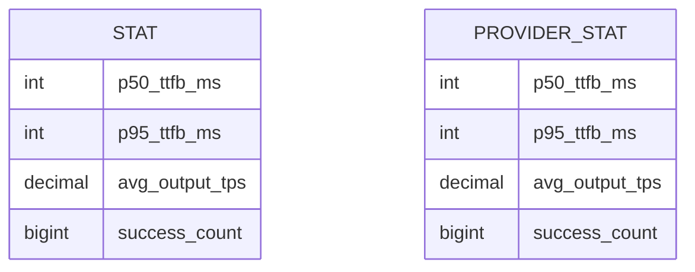
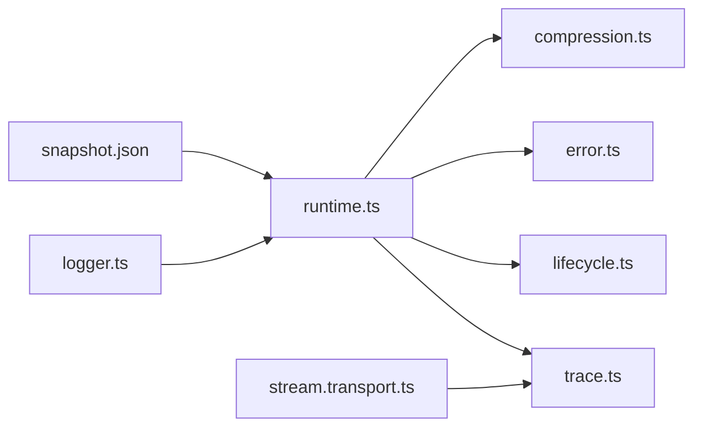

# 性能优化与故障排除

<cite>
**本文引用的文件**
- [packages/opencode/src/cli/cmd/run/runtime.ts](file://packages/opencode/src/cli/cmd/run/runtime.ts)
- [packages/opencode/src/cli/cmd/run/runtimeshared.ts](file://packages/opencode/src/cli/cmd/run/runtime.shared.ts)
- [packages/opencode/src/cli/cmd/run/stream.transport.ts](file://packages/opencode/src/cli/cmd/run/stream.transport.ts)
- [packages/opencode/src/cli/cmd/run/trace.ts](file://packages/opencode/src/cli/cmd/run/trace.ts)
- [packages/opencode/src/server/routes/instance/httpapi/middleware/compression.ts](file://packages/opencode/src/server/routes/instance/httpapi/middleware/compression.ts)
- [packages/opencode/src/server/routes/instance/httpapi/middleware/error.ts](file://packages/opencode/src/server/routes/instance/httpapi/middleware/error.ts)
- [packages/opencode/src/server/routes/instance/httpapi/lifecycle.ts](file://packages/opencode/src/server/routes/instance/httpapi/lifecycle.ts)
- [packages/opencode/src/server/routes/instance/httpapi/handlers/experimental.ts](file://packages/opencode/src/server/routes/instance/httpapi/handlers/experimental.ts)
- [packages/console/app/src/routes/zen/util/logger.ts](file://packages/console/app/src/routes/zen/util/logger.ts)
- [packages/console/app/src/routes/zen/util/modelTpsLimiter.ts](file://packages/console/app/src/routes/zen/util/modelTpsLimiter.ts)
- [packages/stats/core/migrations/20260522121617_common_dust/snapshot.json](file://packages/stats/core/migrations/20260522121617_common_dust/snapshot.json)
- [packages/stats/core/migrations/20260528012726_worthless_ultimo/snapshot.json](file://packages/stats/core/migrations/20260528012726_worthless_ultimo/snapshot.json)
- [packages/web/src/content/docs/ar/troubleshooting.mdx](file://packages/web/src/content/docs/ar/troubleshooting.mdx)
- [packages/web/src/content/docs/tr/troubleshooting.mdx](file://packages/web/src/content/docs/tr/troubleshooting.mdx)
- [packages/ui/src/v2/components/text-shimmer-v2.tsx](file://packages/ui/src/v2/components/text-shimmer-v2.tsx)
</cite>

## 目录
1. [简介](#简介)
2. [项目结构](#项目结构)
3. [核心组件](#核心组件)
4. [架构总览](#架构总览)
5. [详细组件分析](#详细组件分析)
6. [依赖关系分析](#依赖关系分析)
7. [性能考量](#性能考量)
8. [故障排除指南](#故障排除指南)
9. [结论](#结论)
10. [附录](#附录)

## 简介
本指南面向 OpenCode 桌面应用用户与维护者，聚焦于性能监控与优化、常见问题诊断与修复、资源占用控制策略以及系统化故障排除流程。内容覆盖启动耗时、界面渲染、网络压缩、日志与追踪、数据库统计字段等与性能密切相关的模块，并提供可操作的排障步骤与日志收集方法。

## 项目结构
OpenCode 采用多包（monorepo）组织方式，桌面应用运行时由本地 sidecar 进程承载，前端通过 WebView 或 Web 渲染层交互。与性能相关的关键路径包括：
- 命令行运行时与会话生命周期：负责启动计时、任务复用、流式传输与追踪写入
- 服务器中间件与处理器：负责压缩、错误处理、实例生命周期与实验性接口
- 统计与指标：提供 TTFB、TPS 等指标的数据库表结构与迁移快照
- 日志与度量：控制台侧度量输出与调试日志开关
- UI 组件：文本闪烁等渲染开销较小的组件示例

图示来源
- [packages/opencode/src/cli/cmd/run/runtime.ts:402-455](file://packages/opencode/src/cli/cmd/run/runtime.ts#L402-L455)
- [packages/opencode/src/cli/cmd/run/stream.transport.ts:391-424](file://packages/opencode/src/cli/cmd/run/stream.transport.ts#L391-L424)
- [packages/opencode/src/cli/cmd/run/trace.ts:53-94](file://packages/opencode/src/cli/cmd/run/trace.ts#L53-L94)
- [packages/opencode/src/server/routes/instance/httpapi/middleware/compression.ts:31-64](file://packages/opencode/src/server/routes/instance/httpapi/middleware/compression.ts#L31-L64)
- [packages/opencode/src/server/routes/instance/httpapi/middleware/error.ts:26-43](file://packages/opencode/src/server/routes/instance/httpapi/middleware/error.ts#L26-L43)
- [packages/opencode/src/server/routes/instance/httpapi/lifecycle.ts:18-54](file://packages/opencode/src/server/routes/instance/httpapi/lifecycle.ts#L18-L54)
- [packages/stats/core/migrations/20260522121617_common_dust/snapshot.json:361-418](file://packages/stats/core/migrations/20260522121617_common_dust/snapshot.json#L361-L418)
- [packages/stats/core/migrations/20260528012726_worthless_ultimo/snapshot.json:1418-1473](file://packages/stats/core/migrations/20260528012726_worthless_ultimo/snapshot.json#L1418-L1473)
- [packages/console/app/src/routes/zen/util/logger.ts:1-12](file://packages/console/app/src/routes/zen/util/logger.ts#L1-L12)

章节来源
- [packages/opencode/src/cli/cmd/run/runtime.ts:402-455](file://packages/opencode/src/cli/cmd/run/runtime.ts#L402-L455)
- [packages/opencode/src/server/routes/instance/httpapi/middleware/compression.ts:31-64](file://packages/opencode/src/server/routes/instance/httpapi/middleware/compression.ts#L31-L64)

## 核心组件
- 启动计时与会话初始化：在运行时记录启动耗时并触发模型加载与变体解析，便于定位启动慢问题
- 任务复用：避免重复执行相同任务，降低 CPU 与线程压力
- 流式传输与作用域管理：确保长连接/流式任务在取消或异常时正确释放资源
- 响应压缩：对大体积响应进行 gzip/deflate 压缩，减少带宽与 I/O
- 错误处理：统一错误包装与返回码，便于前端与日志定位
- 实例生命周期：延迟释放与重载标记，保证资源回收一致性
- 指标统计：TTFB 百分位与平均输出 TPS 等指标，支撑性能基线
- 控制台度量：以 _metric 前缀输出结构化指标，辅助前端性能观测

章节来源
- [packages/opencode/src/cli/cmd/run/runtime.ts:402-455](file://packages/opencode/src/cli/cmd/run/runtime.ts#L402-L455)
- [packages/opencode/src/cli/cmd/run/runtimeshared.ts:1-17](file://packages/opencode/src/cli/cmd/run/runtime.shared.ts#L1-L17)
- [packages/opencode/src/cli/cmd/run/stream.transport.ts:391-424](file://packages/opencode/src/cli/cmd/run/stream.transport.ts#L391-L424)
- [packages/opencode/src/server/routes/instance/httpapi/middleware/compression.ts:31-64](file://packages/opencode/src/server/routes/instance/httpapi/middleware/compression.ts#L31-L64)
- [packages/opencode/src/server/routes/instance/httpapi/middleware/error.ts:26-43](file://packages/opencode/src/server/routes/instance/httpapi/middleware/error.ts#L26-L43)
- [packages/opencode/src/server/routes/instance/httpapi/lifecycle.ts:18-54](file://packages/opencode/src/server/routes/instance/httpapi/lifecycle.ts#L18-L54)
- [packages/stats/core/migrations/20260522121617_common_dust/snapshot.json:361-418](file://packages/stats/core/migrations/20260522121617_common_dust/snapshot.json#L361-L418)
- [packages/stats/core/migrations/20260528012726_worthless_ultimo/snapshot.json:1418-1473](file://packages/stats/core/migrations/20260528012726_worthless_ultimo/snapshot.json#L1418-L1473)
- [packages/console/app/src/routes/zen/util/logger.ts:1-12](file://packages/console/app/src/routes/zen/util/logger.ts#L1-L12)

## 架构总览
下图展示桌面应用运行时与服务端之间的关键交互，以及性能相关组件如何协同工作：

图示来源
- [packages/opencode/src/cli/cmd/run/runtime.ts:402-455](file://packages/opencode/src/cli/cmd/run/runtime.ts#L402-L455)
- [packages/opencode/src/cli/cmd/run/stream.transport.ts:391-424](file://packages/opencode/src/cli/cmd/run/stream.transport.ts#L391-L424)
- [packages/opencode/src/server/routes/instance/httpapi/middleware/compression.ts:31-64](file://packages/opencode/src/server/routes/instance/httpapi/middleware/compression.ts#L31-L64)
- [packages/opencode/src/server/routes/instance/httpapi/middleware/error.ts:26-43](file://packages/opencode/src/server/routes/instance/httpapi/middleware/error.ts#L26-L43)
- [packages/stats/core/migrations/20260522121617_common_dust/snapshot.json:361-418](file://packages/stats/core/migrations/20260522121617_common_dust/snapshot.json#L361-L418)
- [packages/console/app/src/routes/zen/util/logger.ts:1-12](file://packages/console/app/src/routes/zen/util/logger.ts#L1-L12)

## 详细组件分析

### 启动计时与会话初始化
- 关键点：在启动阶段记录耗时并在模型加载完成后向前端发送事件，便于定位启动慢环节
- 性能影响：过长的启动时间可能由模型加载、变体解析或外部依赖初始化引起

图示来源
- [packages/opencode/src/cli/cmd/run/runtime.ts:402-455](file://packages/opencode/src/cli/cmd/run/runtime.ts#L402-L455)

章节来源
- [packages/opencode/src/cli/cmd/run/runtime.ts:402-455](file://packages/opencode/src/cli/cmd/run/runtime.ts#L402-L455)

### 任务复用（避免重复执行）
- 关键点：通过共享 pending 任务避免并发重复调用，减少 CPU 与上下文切换
- 性能影响：在高频触发场景下显著降低资源消耗

图示来源
- [packages/opencode/src/cli/cmd/run/runtimeshared.ts:1-17](file://packages/opencode/src/cli/cmd/run/runtime.shared.ts#L1-L17)

章节来源
- [packages/opencode/src/cli/cmd/run/runtimeshared.ts:1-17](file://packages/opencode/src/cli/cmd/run/runtime.shared.ts#L1-L17)

### 流式传输与作用域管理
- 关键点：为每个流式传输创建独立作用域，监听中止信号并在最终化时关闭，防止资源泄露
- 性能影响：正确的资源回收可避免内存与句柄泄漏

图示来源
- [packages/opencode/src/cli/cmd/run/stream.transport.ts:391-424](file://packages/opencode/src/cli/cmd/run/stream.transport.ts#L391-L424)

章节来源
- [packages/opencode/src/cli/cmd/run/stream.transport.ts:391-424](file://packages/opencode/src/cli/cmd/run/stream.transport.ts#L391-L424)

### 响应压缩与带宽优化
- 关键点：根据 Accept-Encoding 选择 gzip/deflate，仅对满足阈值与类型要求的响应进行压缩
- 性能影响：显著降低网络 I/O 与带宽占用，但会增加少量 CPU 开销

图示来源
- [packages/opencode/src/server/routes/instance/httpapi/middleware/compression.ts:31-64](file://packages/opencode/src/server/routes/instance/httpapi/middleware/compression.ts#L31-L64)

章节来源
- [packages/opencode/src/server/routes/instance/httpapi/middleware/compression.ts:31-64](file://packages/opencode/src/server/routes/instance/httpapi/middleware/compression.ts#L31-L64)

### 错误处理与可观测性
- 关键点：统一错误包装并生成唯一错误引用，便于日志检索与问题定位
- 性能影响：错误路径的快速失败与日志记录有助于缩短故障恢复时间

图示来源
- [packages/opencode/src/server/routes/instance/httpapi/middleware/error.ts:26-43](file://packages/opencode/src/server/routes/instance/httpapi/middleware/error.ts#L26-L43)

章节来源
- [packages/opencode/src/server/routes/instance/httpapi/middleware/error.ts:26-43](file://packages/opencode/src/server/routes/instance/httpapi/middleware/error.ts#L26-L43)

### 实例生命周期与资源回收
- 关键点：在响应后标记实例销毁，确保桥接与存储的有序释放
- 性能影响：避免长时间占用的实例导致内存与句柄堆积

图示来源
- [packages/opencode/src/server/routes/instance/httpapi/lifecycle.ts:18-54](file://packages/opencode/src/server/routes/instance/httpapi/lifecycle.ts#L18-L54)

章节来源
- [packages/opencode/src/server/routes/instance/httpapi/lifecycle.ts:18-54](file://packages/opencode/src/server/routes/instance/httpapi/lifecycle.ts#L18-L54)

### 指标统计与性能基线
- 关键点：统计表包含 p50/p95 TTFB 与 avg_output_tps 等字段，支持按会话/提供方维度分析
- 性能影响：基于历史数据建立性能基线，识别回归与异常

图示来源
- [packages/stats/core/migrations/20260522121617_common_dust/snapshot.json:361-418](file://packages/stats/core/migrations/20260522121617_common_dust/snapshot.json#L361-L418)
- [packages/stats/core/migrations/20260528012726_worthless_ultimo/snapshot.json:1418-1473](file://packages/stats/core/migrations/20260528012726_worthless_ultimo/snapshot.json#L1418-L1473)

章节来源
- [packages/stats/core/migrations/20260522121617_common_dust/snapshot.json:361-418](file://packages/stats/core/migrations/20260522121617_common_dust/snapshot.json#L361-L418)
- [packages/stats/core/migrations/20260528012726_worthless_ultimo/snapshot.json:1418-1473](file://packages/stats/core/migrations/20260528012726_worthless_ultimo/snapshot.json#L1418-L1473)

### 控制台度量输出
- 关键点：以 _metric 前缀输出结构化指标，便于前端采集与可视化
- 性能影响：为 UI 层提供轻量级性能观测能力

章节来源
- [packages/console/app/src/routes/zen/util/logger.ts:1-12](file://packages/console/app/src/routes/zen/util/logger.ts#L1-L12)

### 文本闪烁组件（UI 渲染示例）
- 关键点：文本闪烁组件通过定时器与动态渲染实现占位动画，注意清理定时器避免内存泄漏
- 性能影响：在大量组件同时渲染时需关注定时器数量与样式计算开销

章节来源
- [packages/ui/src/v2/components/text-shimmer-v2.tsx:1-63](file://packages/ui/src/v2/components/text-shimmer-v2.tsx#L1-L63)

## 依赖关系分析
- 运行时依赖中间件与处理器：启动计时与会话初始化依赖压缩与错误处理的稳定返回
- 流式传输依赖作用域管理：确保异常/取消路径下的资源回收
- 统计依赖迁移快照：指标字段定义来自数据库迁移
- 度量依赖控制台工具：前端通过 _metric 输出进行观测

图示来源
- [packages/opencode/src/cli/cmd/run/runtime.ts:402-455](file://packages/opencode/src/cli/cmd/run/runtime.ts#L402-L455)
- [packages/opencode/src/cli/cmd/run/stream.transport.ts:391-424](file://packages/opencode/src/cli/cmd/run/stream.transport.ts#L391-L424)
- [packages/opencode/src/cli/cmd/run/trace.ts:53-94](file://packages/opencode/src/cli/cmd/run/trace.ts#L53-L94)
- [packages/opencode/src/server/routes/instance/httpapi/middleware/compression.ts:31-64](file://packages/opencode/src/server/routes/instance/httpapi/middleware/compression.ts#L31-L64)
- [packages/opencode/src/server/routes/instance/httpapi/middleware/error.ts:26-43](file://packages/opencode/src/server/routes/instance/httpapi/middleware/error.ts#L26-L43)
- [packages/opencode/src/server/routes/instance/httpapi/lifecycle.ts:18-54](file://packages/opencode/src/server/routes/instance/httpapi/lifecycle.ts#L18-L54)
- [packages/stats/core/migrations/20260522121617_common_dust/snapshot.json:361-418](file://packages/stats/core/migrations/20260522121617_common_dust/snapshot.json#L361-L418)
- [packages/console/app/src/routes/zen/util/logger.ts:1-12](file://packages/console/app/src/routes/zen/util/logger.ts#L1-L12)

## 性能考量
- 启动优化
  - 使用启动计时定位瓶颈；优先检查模型加载与变体解析阶段
  - 利用任务复用避免重复初始化
- 网络与 I/O
  - 压缩中间件自动对大响应启用 gzip/deflate；若仍出现高带宽占用，检查响应大小与类型
- 渲染与 UI
  - 文本闪烁组件需注意定时器清理；在高频更新场景下减少不必要的组件重建
- 资源回收
  - 流式传输必须在取消/异常时正确关闭作用域；实例生命周期中间件确保销毁顺序

[本节为通用指导，不直接分析具体文件]

## 故障排除指南
- 快速自检
  - 完全退出应用后重启；若出现错误页面，点击“重启”并复制错误详情
  - macOS 用户可在菜单中选择“Reload Webview”以刷新 WebView
- 插件排查
  - 若应用启动缓慢、卡顿或行为异常，先禁用插件：编辑全局配置文件中的 plugin 字段为空数组
  - 检查插件目录是否异常或存在损坏文件
- 日志与追踪
  - 日志默认保存在本地存储目录，保留最近若干份；可通过 CLI 参数调整日志级别
  - 可启用追踪环境变量以写入详细事件序列，便于回放与分析
- 高级重置
  - 清理缓存与临时文件
  - 重置无效的服务器配置
  - 在极端情况下，备份配置后删除应用数据目录并重新初始化

章节来源
- [packages/web/src/content/docs/ar/troubleshooting.mdx:10-33](file://packages/web/src/content/docs/ar/troubleshooting.mdx#L10-L33)
- [packages/web/src/content/docs/tr/troubleshooting.mdx:40-74](file://packages/web/src/content/docs/tr/troubleshooting.mdx#L40-L74)
- [packages/opencode/src/cli/cmd/run/trace.ts:53-94](file://packages/opencode/src/cli/cmd/run/trace.ts#L53-L94)

## 结论
通过结合启动计时、任务复用、流式传输资源回收、响应压缩与统一错误处理，OpenCode 桌面应用具备了较为完善的性能基础。配合日志与追踪、指标统计与禁用插件等故障排除手段，用户可以系统地定位并解决启动慢、界面卡顿、内存泄漏等问题，持续优化资源占用与运行效率。

[本节为总结性内容，不直接分析具体文件]

## 附录
- 性能监控建议
  - 建立启动耗时基线，关注 p50/p95 TTFB 与 avg_output_tps 的趋势变化
  - 在高频场景下启用任务复用，减少重复初始化
  - 对大响应体启用压缩，平衡 CPU 与带宽
- 故障排除清单
  - 重启应用与 WebView 刷新
  - 禁用插件并检查配置
  - 收集日志与追踪文件
  - 清理缓存与临时文件，必要时重置配置

[本节为通用指导，不直接分析具体文件]