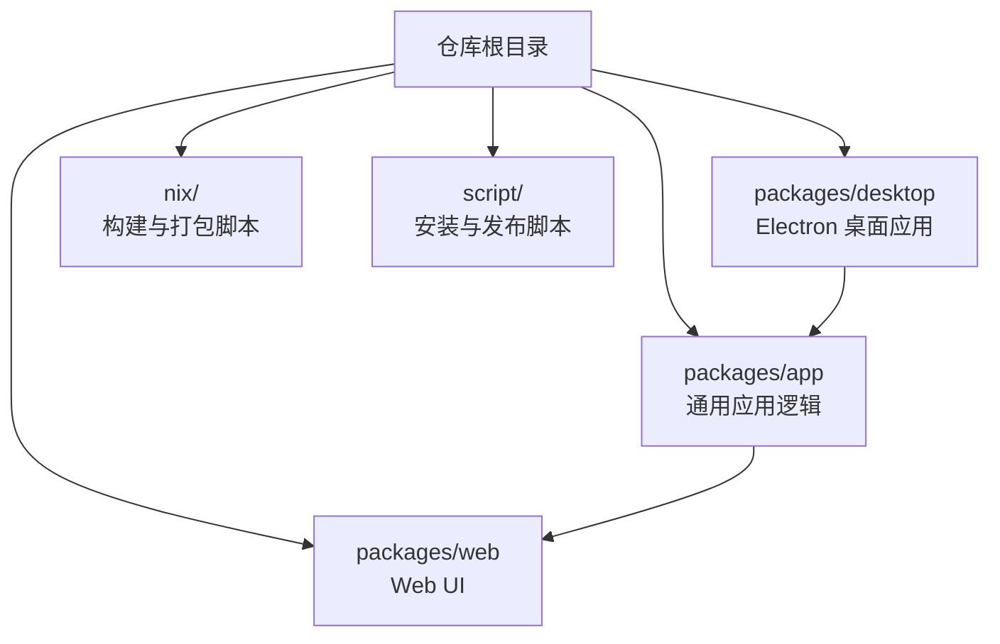
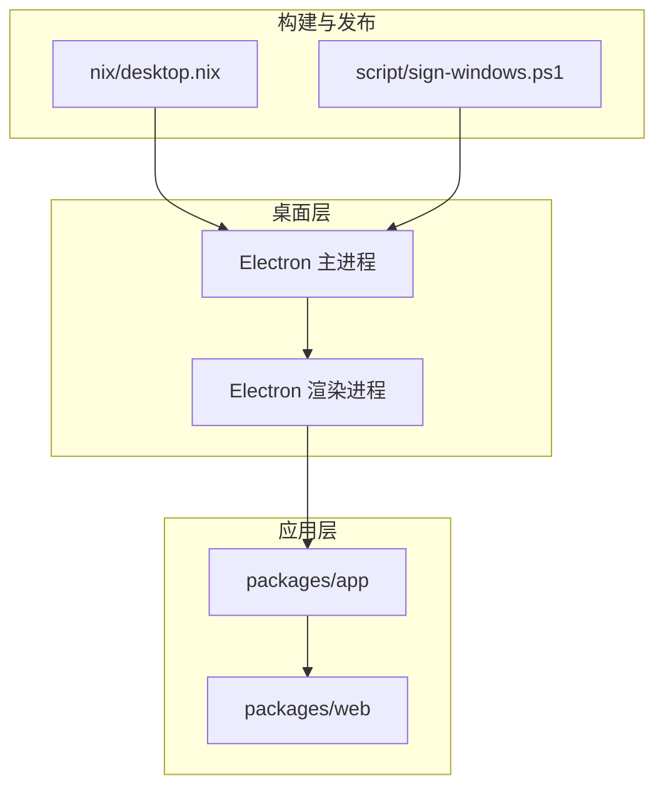
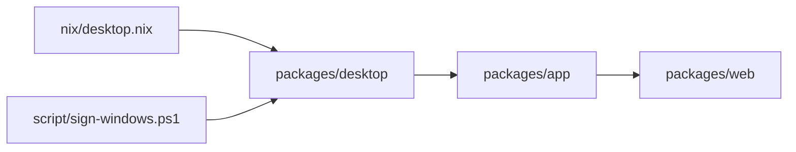

# 桌面应用使用

<cite>
**本文引用的文件**
- [README.md](file://README.md)
- [README.zh.md](file://README.zh.md)
- [CONTRIBUTING.md](file://CONTRIBUTING.md)
- [flake.nix](file://flake.nix)
- [nix/desktop.nix](file://nix/desktop.nix)
- [nix/opencode.nix](file://nix/opencode.nix)
- [script/sign-windows.ps1](file://script/sign-windows.ps1)
- [packages/desktop](file://packages/desktop)
- [packages/app](file://packages/app)
- [packages/web](file://packages/web)
</cite>

## 目录
1. [简介](#简介)
2. [项目结构](#项目结构)
3. [核心组件](#核心组件)
4. [架构总览](#架构总览)
5. [详细组件分析](#详细组件分析)
6. [依赖关系分析](#依赖关系分析)
7. [性能考虑](#性能考虑)
8. [故障排除指南](#故障排除指南)
9. [结论](#结论)
10. [附录](#附录)

## 简介
OpenCode 桌面应用是一个基于 Electron 的原生桌面程序，用于在本地环境中运行 OpenCode 的 Web UI。它通过封装 Web 应用实现跨平台支持（Windows、macOS、Linux），提供更贴近系统的本地体验，同时保留与 Web 版本一致的功能与内容。

桌面应用的主要目标：
- 提供离线可用性与更快的本地加载体验
- 集成系统级功能（如系统托盘、全局快捷键、文件关联）
- 统一的安装与更新机制，简化用户部署
- 保持与 Web 版本一致的功能边界与数据一致性

章节来源
- [CONTRIBUTING.md:75](file://CONTRIBUTING.md#L75)
- [CONTRIBUTING.md:125](file://CONTRIBUTING.md#L125)

## 项目结构
OpenCode 仓库采用多包（monorepo）结构，桌面应用位于 packages/desktop，Web UI 位于 packages/web，通用应用逻辑位于 packages/app。Nix 构建脚本位于 nix 目录，提供可复现的构建与打包环境；安装签名脚本位于 script 目录，用于 Windows 安装包签名。

图表来源
- [packages/desktop](file://packages/desktop)
- [packages/app](file://packages/app)
- [packages/web](file://packages/web)
- [nix/desktop.nix](file://nix/desktop.nix)
- [nix/opencode.nix](file://nix/opencode.nix)

章节来源
- [CONTRIBUTING.md:75](file://CONTRIBUTING.md#L75)
- [CONTRIBUTING.md:125](file://CONTRIBUTING.md#L125)

## 核心组件
- 桌面应用入口与打包：桌面应用由 Electron 驱动，通过 Nix 脚本进行构建与打包，支持多平台产物生成。
- Web UI 封装：桌面应用内部运行 Web UI，所有业务逻辑与界面渲染来自 packages/app 与 packages/web。
- 构建与分发：Nix 提供可复现的构建环境；Windows 安装包可通过脚本进行签名以提升可信度。
- 多语言文档：README 及其多语言版本提供了安装与使用说明，覆盖 Windows/macOS/Linux 的安装包下载与安装方式。

章节来源
- [CONTRIBUTING.md:130](file://CONTRIBUTING.md#L130)
- [CONTRIBUTING.md:136](file://CONTRIBUTING.md#L136)
- [CONTRIBUTING.md:137](file://CONTRIBUTING.md#L137)
- [README.md](file://README.md)
- [README.zh.md](file://README.zh.md)
- [nix/desktop.nix](file://nix/desktop.nix)
- [script/sign-windows.ps1](file://script/sign-windows.ps1)

## 架构总览
桌面应用的运行时架构如下：Electron 主进程负责应用生命周期与系统集成，渲染进程承载 Web UI；应用逻辑与界面分别来自 packages/app 与 packages/web；Nix 负责构建与打包，脚本负责签名与发布。

图表来源
- [packages/desktop](file://packages/desktop)
- [packages/app](file://packages/app)
- [packages/web](file://packages/web)
- [nix/desktop.nix](file://nix/desktop.nix)
- [script/sign-windows.ps1](file://script/sign-windows.ps1)

章节来源
- [CONTRIBUTING.md:125](file://CONTRIBUTING.md#L125)
- [nix/desktop.nix](file://nix/desktop.nix)

## 详细组件分析

### 安装与启动流程
- 获取安装包
  - Windows：从发行页或官网下载对应 x64 安装包。
  - macOS：从发行页或官网下载对应 Apple Silicon 或 Intel dmg 包；也可通过 Homebrew 或 MacPorts 安装。
  - Linux：从发行页或官网下载对应包格式（如 DEB/RPM），或通过包管理器安装。
- 启动应用
  - 安装完成后，按系统习惯打开应用；首次启动可能需要授权权限（如文件访问、通知等）。
- 开发模式启动
  - 在开发环境中，可在桌面应用目录执行开发命令以启动调试版本。

章节来源
- [README.md](file://README.md)
- [README.zh.md](file://README.zh.md)
- [CONTRIBUTING.md:130](file://CONTRIBUTING.md#L130)

### 界面布局与功能特性
- 窗口管理
  - 支持最小化到系统托盘、退出确认、窗口尺寸记忆与恢复。
- 菜单栏与工具栏
  - 菜单栏提供应用级操作（如关于、首选项、开发者工具等）；工具栏提供常用功能入口。
- 系统集成功能
  - 支持系统托盘图标与菜单、全局快捷键、文件类型关联、拖拽打开文件等。
- 与 Web 版本的关系
  - 桌面应用内嵌 Web UI，功能与数据保持一致；差异主要体现在系统集成与本地体验上。

章节来源
- [CONTRIBUTING.md:125](file://CONTRIBUTING.md#L125)

### 配置选项
- 启动设置
  - 自动启动、随系统登录启动、最小化到托盘等。
- 通知配置
  - 控制系统通知显示、静默模式、通知权限等。
- 文件关联
  - 关联特定文件类型以便双击打开；支持拖拽导入。
- 其他
  - 代理设置、缓存清理、日志路径等。

章节来源
- [CONTRIBUTING.md:125](file://CONTRIBUTING.md#L125)

### 性能优化建议与资源占用
- 资源占用
  - 首次启动会解压与初始化资源；后续启动应更快；长时间使用后建议清理缓存。
- 优化建议
  - 关闭不必要的后台功能（如自动更新、通知）以降低资源消耗。
  - 使用系统自带的任务管理器监控内存与 CPU 占用。
  - 定期重启应用以释放内存碎片。

章节来源
- [CONTRIBUTING.md:125](file://CONTRIBUTING.md#L125)

### 故障排除指南
- 启动失败
  - 检查系统兼容性与权限；尝试以管理员身份运行；查看系统安全软件拦截记录。
- 界面异常
  - 刷新页面或重启应用；禁用硬件加速（在应用设置中）；清除缓存后重试。
- 更新问题
  - 手动检查最新版本；若为 Windows，确认安装包签名有效；必要时重新下载安装包。
- 文件关联失效
  - 重新注册文件关联；检查系统默认程序设置。
- 网络与代理
  - 若使用代理，请在应用设置中正确配置；测试网络连通性。

章节来源
- [CONTRIBUTING.md:125](file://CONTRIBUTING.md#L125)

## 依赖关系分析
桌面应用与各模块之间的依赖关系如下：桌面应用依赖通用应用逻辑与 Web UI；构建与打包由 Nix 脚本提供；Windows 安装包可选地通过脚本进行签名。

图表来源
- [packages/desktop](file://packages/desktop)
- [packages/app](file://packages/app)
- [packages/web](file://packages/web)
- [nix/desktop.nix](file://nix/desktop.nix)
- [script/sign-windows.ps1](file://script/sign-windows.ps1)

章节来源
- [CONTRIBUTING.md:75](file://CONTRIBUTING.md#L75)
- [nix/desktop.nix](file://nix/desktop.nix)

## 性能考虑
- 启动时间
  - 首次启动包含初始化步骤，后续启动应明显更快。
- 内存与 CPU
  - 长时间运行后可能出现内存增长，建议定期重启或清理缓存。
- 网络与代理
  - 在受限网络环境下，建议配置代理并验证连通性。
- 系统资源
  - 关闭不必要功能可降低资源占用；关注系统任务管理器中的占用情况。

章节来源
- [CONTRIBUTING.md:125](file://CONTRIBUTING.md#L125)

## 故障排除指南
- 常见问题
  - 无法启动：检查权限与杀毒软件拦截；尝试以管理员身份运行。
  - 界面空白或卡顿：刷新页面、禁用硬件加速、清理缓存。
  - 更新失败：手动下载最新安装包；Windows 平台确认签名有效。
  - 文件无法打开：重新注册文件关联；检查系统默认程序。
- 进一步诊断
  - 查看应用日志与系统事件日志；提供问题描述与截图便于定位。

章节来源
- [CONTRIBUTING.md:125](file://CONTRIBUTING.md#L125)

## 结论
OpenCode 桌面应用通过 Electron 封装 Web UI，提供跨平台的本地化体验与系统集成功能。借助统一的构建与发布流程，用户可以在不同操作系统上获得一致的功能与使用体验。建议根据实际需求调整启动与通知设置，并在遇到问题时参考故障排除指南快速定位与解决。

## 附录
- 官方下载与安装说明请参阅 README 及其多语言版本。
- 开发者可参考贡献指南了解如何运行与打包桌面应用。

章节来源
- [README.md](file://README.md)
- [README.zh.md](file://README.zh.md)
- [CONTRIBUTING.md:130](file://CONTRIBUTING.md#L130)
- [CONTRIBUTING.md:136](file://CONTRIBUTING.md#L136)
- [CONTRIBUTING.md:137](file://CONTRIBUTING.md#L137)