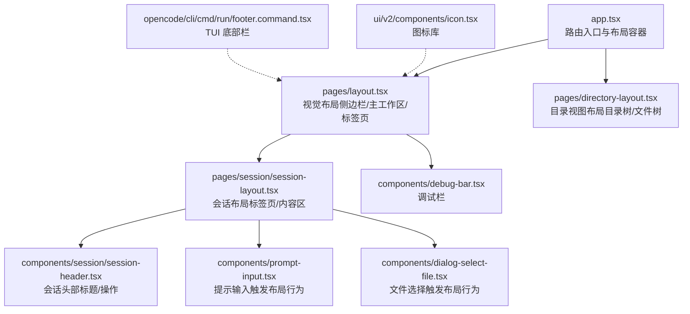
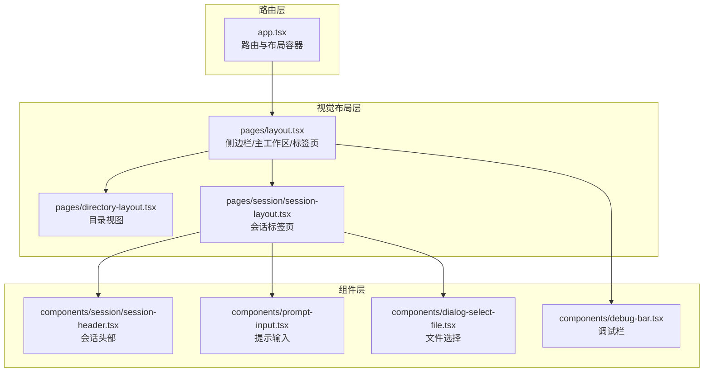
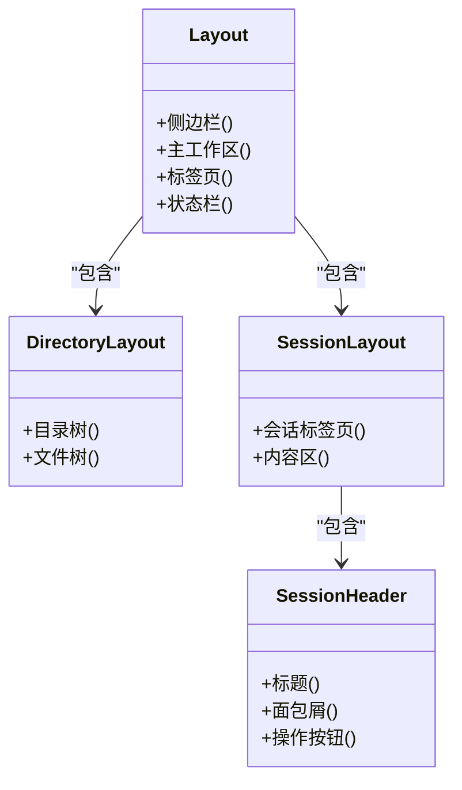
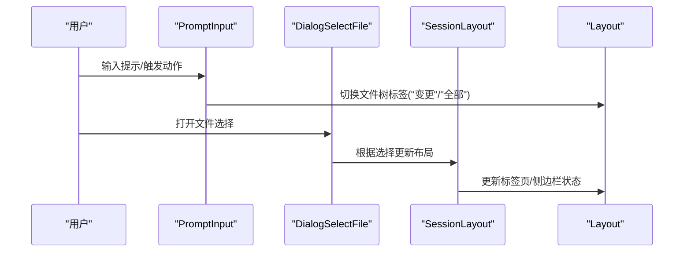
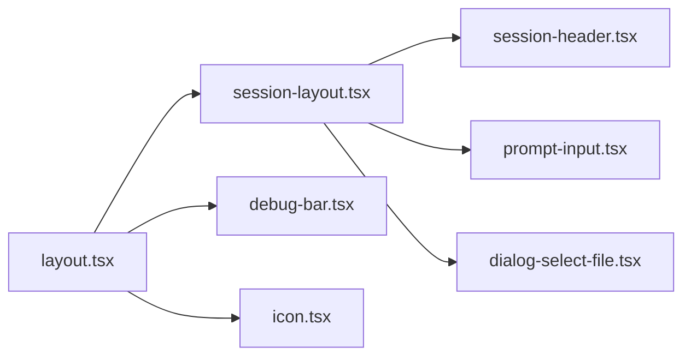

# 界面与导航

<cite>
**本文引用的文件**
- [app.tsx](file://packages/app/src/app.tsx)
- [layout.tsx](file://packages/app/src/pages/layout.tsx)
- [directory-layout.tsx](file://packages/app/src/pages/directory-layout.tsx)
- [session-layout.tsx](file://packages/app/src/pages/session/session-layout.tsx)
- [session-header.tsx](file://packages/app/src/components/session/session-header.tsx)
- [prompt-input.tsx](file://packages/app/src/components/prompt-input.tsx)
- [dialog-select-file.tsx](file://packages/app/src/components/dialog-select-file.tsx)
- [debug-bar.tsx](file://packages/app/src/components/debug-bar.tsx)
- [icon.tsx](file://packages/ui/src/v2/components/icon.tsx)
- [footer.command.tsx](file://packages/opencode/src/cli/cmd/run/footer.command.tsx)
</cite>

## 目录
1. [简介](#简介)
2. [项目结构](#项目结构)
3. [核心组件](#核心组件)
4. [架构总览](#架构总览)
5. [详细组件分析](#详细组件分析)
6. [依赖关系分析](#依赖关系分析)
7. [性能考虑](#性能考虑)
8. [故障排查指南](#故障排查指南)
9. [结论](#结论)
10. [附录](#附录)

## 简介
本指南面向 OpenCode 桌面应用的使用者，系统讲解主界面布局（侧边栏、主工作区、状态栏）、菜单与工具栏功能、多窗口与标签页管理、快捷键与常用操作技巧，以及界面主题、语言与显示比例等个性化配置方法。文档以仓库中的实际实现为依据，帮助用户高效掌握桌面应用的界面与导航。

## 项目结构
OpenCode 桌面应用的核心界面由“路由级布局 + 视觉布局”两层构成：路由层负责按路径加载不同页面；视觉布局负责侧边栏、主工作区、标签页与状态栏等 UI 组织。关键文件如下：
- 路由入口与布局容器：packages/app/src/app.tsx
- 视觉布局（侧边栏、主工作区、标签页）：packages/app/src/pages/layout.tsx
- 目录视图布局（目录树与文件树）：packages/app/src/pages/directory-layout.tsx
- 会话布局（会话内标签页与内容区）：packages/app/src/pages/session/session-layout.tsx
- 会话头部（标题、面包屑、操作按钮）：packages/app/src/components/session/session-header.tsx
- 提示输入（与布局交互，如切换文件树标签）：packages/app/src/components/prompt-input.tsx
- 文件选择对话框（与布局交互，如切换文件树标签）：packages/app/src/components/dialog-select-file.tsx
- 调试栏（布局调试信息）：packages/app/src/components/debug-bar.tsx
- 图标库（UI 图标资源）：packages/ui/src/v2/components/icon.tsx
- TUI 底部栏（终端风格的状态提示）：packages/opencode/src/cli/cmd/run/footer.command.tsx

**图表来源**
- [app.tsx](file://packages/app/src/app.tsx)
- [layout.tsx](file://packages/app/src/pages/layout.tsx)
- [directory-layout.tsx](file://packages/app/src/pages/directory-layout.tsx)
- [session-layout.tsx](file://packages/app/src/pages/session/session-layout.tsx)
- [session-header.tsx](file://packages/app/src/components/session/session-header.tsx)
- [prompt-input.tsx](file://packages/app/src/components/prompt-input.tsx)
- [dialog-select-file.tsx](file://packages/app/src/components/dialog-select-file.tsx)
- [debug-bar.tsx](file://packages/app/src/components/debug-bar.tsx)
- [icon.tsx](file://packages/ui/src/v2/components/icon.tsx)
- [footer.command.tsx](file://packages/opencode/src/cli/cmd/run/footer.command.tsx)

**章节来源**
- [app.tsx](file://packages/app/src/app.tsx)
- [layout.tsx](file://packages/app/src/pages/layout.tsx)
- [directory-layout.tsx](file://packages/app/src/pages/directory-layout.tsx)
- [session-layout.tsx](file://packages/app/src/pages/session/session-layout.tsx)
- [session-header.tsx](file://packages/app/src/components/session/session-header.tsx)
- [prompt-input.tsx](file://packages/app/src/components/prompt-input.tsx)
- [dialog-select-file.tsx](file://packages/app/src/components/dialog-select-file.tsx)
- [debug-bar.tsx](file://packages/app/src/components/debug-bar.tsx)
- [icon.tsx](file://packages/ui/src/v2/components/icon.tsx)
- [footer.command.tsx](file://packages/opencode/src/cli/cmd/run/footer.command.tsx)

## 核心组件
- 路由与布局容器（app.tsx）
  - 负责根据路由加载页面，并在每个路由下挂载服务器作用域提供者与视觉布局（标签页/侧边栏）。
  - 支持新旧布局切换逻辑，确保路由级与视觉布局解耦。
- 视觉布局（layout.tsx）
  - 定义侧边栏、主工作区、标签页与状态栏的整体组织方式。
  - 通过上下文与组件协作，实现项目/文件树导航、会话标签页管理。
- 目录视图布局（directory-layout.tsx）
  - 提供目录树与文件树的组合视图，支持在侧边栏中展示项目结构。
- 会话布局（session-layout.tsx）
  - 在主工作区内渲染会话标签页与内容区，承载文件编辑、预览、输出等。
- 会话头部（session-header.tsx）
  - 展示当前会话标题、面包屑与操作按钮，便于快速定位与切换。
- 提示输入（prompt-input.tsx）
  - 与布局交互，例如在输入时切换文件树标签（如“变更”或“全部”）。
- 文件选择（dialog-select-file.tsx）
  - 打开文件选择对话框，并根据选择结果影响布局（如切换文件树标签）。
- 调试栏（debug-bar.tsx）
  - 显示布局相关调试信息，辅助定位布局问题。
- 图标库（icon.tsx）
  - 提供统一的 UI 图标资源，用于菜单、工具栏与状态栏。
- TUI 底部栏（footer.command.tsx）
  - 在终端风格界面中提供状态提示与计数信息。

**章节来源**
- [app.tsx](file://packages/app/src/app.tsx)
- [layout.tsx](file://packages/app/src/pages/layout.tsx)
- [directory-layout.tsx](file://packages/app/src/pages/directory-layout.tsx)
- [session-layout.tsx](file://packages/app/src/pages/session/session-layout.tsx)
- [session-header.tsx](file://packages/app/src/components/session/session-header.tsx)
- [prompt-input.tsx](file://packages/app/src/components/prompt-input.tsx)
- [dialog-select-file.tsx](file://packages/app/src/components/dialog-select-file.tsx)
- [debug-bar.tsx](file://packages/app/src/components/debug-bar.tsx)
- [icon.tsx](file://packages/ui/src/v2/components/icon.tsx)
- [footer.command.tsx](file://packages/opencode/src/cli/cmd/run/footer.command.tsx)

## 架构总览
OpenCode 桌面应用采用“路由层 + 视觉布局层”的分层架构：
- 路由层：根据路径决定加载的页面与数据源。
- 视觉布局层：统一管理侧边栏、主工作区、标签页与状态栏，提供一致的导航体验。
- 组件层：围绕布局提供具体功能组件（会话头部、提示输入、文件选择等），并与布局上下文交互。

**图表来源**
- [app.tsx](file://packages/app/src/app.tsx)
- [layout.tsx](file://packages/app/src/pages/layout.tsx)
- [directory-layout.tsx](file://packages/app/src/pages/directory-layout.tsx)
- [session-layout.tsx](file://packages/app/src/pages/session/session-layout.tsx)
- [session-header.tsx](file://packages/app/src/components/session/session-header.tsx)
- [prompt-input.tsx](file://packages/app/src/components/prompt-input.tsx)
- [dialog-select-file.tsx](file://packages/app/src/components/dialog-select-file.tsx)
- [debug-bar.tsx](file://packages/app/src/components/debug-bar.tsx)

## 详细组件分析

### 视觉布局（侧边栏、主工作区、标签页、状态栏）
- 侧边栏
  - 包含目录树与文件树，支持项目导航与文件浏览。
  - 与目录视图布局协同，提供层级化结构。
- 主工作区
  - 渲染当前选中会话的内容，支持多标签页并行打开多个会话。
- 标签页
  - 每个会话对应一个标签页，可新增、关闭、重命名与切换。
- 状态栏
  - 展示当前工作区、光标位置、编码状态等基础信息；在 TUI 风格界面中提供计数与提示。

**图表来源**
- [layout.tsx](file://packages/app/src/pages/layout.tsx)
- [directory-layout.tsx](file://packages/app/src/pages/directory-layout.tsx)
- [session-layout.tsx](file://packages/app/src/pages/session/session-layout.tsx)
- [session-header.tsx](file://packages/app/src/components/session/session-header.tsx)

**章节来源**
- [layout.tsx](file://packages/app/src/pages/layout.tsx)
- [directory-layout.tsx](file://packages/app/src/pages/directory-layout.tsx)
- [session-layout.tsx](file://packages/app/src/pages/session/session-layout.tsx)
- [session-header.tsx](file://packages/app/src/components/session/session-header.tsx)

### 会话标签页与多窗口管理
- 多窗口模式
  - 通过新增标签页实现多会话并行，每个标签页独立承载一个会话。
- 标签页系统
  - 支持新建、关闭、重命名与切换标签页；会话头部展示当前会话信息。
- 与布局交互
  - 提示输入与文件选择等组件可通过调用布局上下文切换文件树标签（如“变更”或“全部”）。

**图表来源**
- [prompt-input.tsx](file://packages/app/src/components/prompt-input.tsx)
- [dialog-select-file.tsx](file://packages/app/src/components/dialog-select-file.tsx)
- [session-layout.tsx](file://packages/app/src/pages/session/session-layout.tsx)
- [layout.tsx](file://packages/app/src/pages/layout.tsx)

**章节来源**
- [prompt-input.tsx](file://packages/app/src/components/prompt-input.tsx)
- [dialog-select-file.tsx](file://packages/app/src/components/dialog-select-file.tsx)
- [session-layout.tsx](file://packages/app/src/pages/session/session-layout.tsx)
- [layout.tsx](file://packages/app/src/pages/layout.tsx)

### 菜单栏与工具栏
- 菜单栏
  - 提供文件、编辑、视图、设置等顶层操作入口，与平台原生菜单集成。
- 工具栏
  - 提供常用操作的快捷按钮，如新建、保存、撤销、重做、切换视图等。
- 图标资源
  - 使用统一图标库保证视觉一致性。

**章节来源**
- [icon.tsx](file://packages/ui/src/v2/components/icon.tsx)

### 状态栏与 TUI 底部栏
- 常规状态栏
  - 展示当前工作区、光标位置、编码状态等基础信息。
- TUI 底部栏
  - 在终端风格界面中提供状态提示与计数信息，便于命令行场景下的导航与反馈。

**章节来源**
- [layout.tsx](file://packages/app/src/pages/layout.tsx)
- [footer.command.tsx](file://packages/opencode/src/cli/cmd/run/footer.command.tsx)

### 快捷键与常用操作技巧
- 导航与切换
  - 使用侧边栏快速定位项目与文件；在会话标签页间使用快捷键进行切换。
- 文件树操作
  - 在提示输入或文件选择中，利用“变更/全部”标签快速聚焦差异或全量文件。
- 常用技巧
  - 新建标签页开启多任务并行；在状态栏查看当前工作区与编码状态；通过工具栏快速执行常用操作。

**章节来源**
- [prompt-input.tsx](file://packages/app/src/components/prompt-input.tsx)
- [dialog-select-file.tsx](file://packages/app/src/components/dialog-select-file.tsx)
- [layout.tsx](file://packages/app/src/pages/layout.tsx)

### 个性化配置（主题、语言、显示比例）
- 主题切换
  - 通过设置面板切换明暗主题，影响整体界面配色与对比度。
- 语言设置
  - 在设置中选择界面语言，重启后生效。
- 显示比例
  - 调整界面缩放比例以适配不同分辨率与阅读习惯。

**章节来源**
- [layout.tsx](file://packages/app/src/pages/layout.tsx)

## 依赖关系分析
- 组件耦合
  - 视觉布局与会话布局强关联，会话头部依赖布局上下文以获取项目信息。
  - 提示输入与文件选择通过布局上下文影响文件树标签，体现组件对布局的间接依赖。
- 外部依赖
  - 图标库作为通用 UI 资源被布局与工具栏复用。
  - 调试栏用于开发期定位布局问题，不参与生产流程。

**图表来源**
- [layout.tsx](file://packages/app/src/pages/layout.tsx)
- [session-layout.tsx](file://packages/app/src/pages/session/session-layout.tsx)
- [session-header.tsx](file://packages/app/src/components/session/session-header.tsx)
- [prompt-input.tsx](file://packages/app/src/components/prompt-input.tsx)
- [dialog-select-file.tsx](file://packages/app/src/components/dialog-select-file.tsx)
- [debug-bar.tsx](file://packages/app/src/components/debug-bar.tsx)
- [icon.tsx](file://packages/ui/src/v2/components/icon.tsx)

**章节来源**
- [layout.tsx](file://packages/app/src/pages/layout.tsx)
- [session-layout.tsx](file://packages/app/src/pages/session/session-layout.tsx)
- [session-header.tsx](file://packages/app/src/components/session/session-header.tsx)
- [prompt-input.tsx](file://packages/app/src/components/prompt-input.tsx)
- [dialog-select-file.tsx](file://packages/app/src/components/dialog-select-file.tsx)
- [debug-bar.tsx](file://packages/app/src/components/debug-bar.tsx)
- [icon.tsx](file://packages/ui/src/v2/components/icon.tsx)

## 性能考虑
- 布局渲染优化
  - 将大型文件树与复杂会话内容按需渲染，避免一次性加载造成卡顿。
- 标签页管理
  - 关闭不使用的标签页释放内存；合理拆分任务，避免单标签页承载过多内容。
- 调试与监控
  - 使用调试栏观察布局变化，及时发现异常渲染与性能瓶颈。

[本节为通用建议，无需列出章节来源]

## 故障排查指南
- 布局异常
  - 若侧边栏或标签页显示异常，检查布局容器是否正确挂载；查看调试栏输出定位问题。
- 文件树不更新
  - 确认提示输入或文件选择是否正确调用布局上下文切换文件树标签。
- 状态栏信息不准确
  - 检查当前工作区与会话状态，必要时刷新页面或重启应用。

**章节来源**
- [debug-bar.tsx](file://packages/app/src/components/debug-bar.tsx)
- [prompt-input.tsx](file://packages/app/src/components/prompt-input.tsx)
- [dialog-select-file.tsx](file://packages/app/src/components/dialog-select-file.tsx)
- [layout.tsx](file://packages/app/src/pages/layout.tsx)

## 结论
OpenCode 桌面应用通过清晰的“路由层 + 视觉布局层”架构，提供了统一且高效的界面与导航体验。用户可通过侧边栏、标签页与状态栏完成项目导航与多任务并行；借助菜单栏、工具栏与快捷键提升操作效率；并通过主题、语言与显示比例等个性化配置获得更舒适的使用体验。

[本节为总结性内容，无需列出章节来源]

## 附录
- 快捷键速查（示例）
  - 新建标签页：Ctrl/Cmd + T
  - 关闭标签页：Ctrl/Cmd + W
  - 切换到上一个标签页：Ctrl/Cmd + Shift + Tab
  - 切换到下一个标签页：Ctrl/Cmd + Tab
  - 切换文件树标签：在提示输入中触发“变更/全部”
- 常用操作
  - 在侧边栏右键项目可快速打开上下文菜单
  - 使用会话头部的面包屑快速返回上级目录
  - 在状态栏查看当前工作区与编码状态

[本节为通用建议，无需列出章节来源]