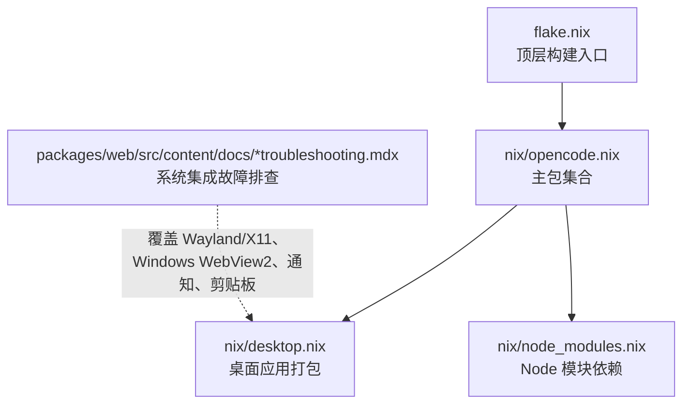

# 系统集成功能

<cite>
**本文引用的文件**
- [flake.nix](file://flake.nix)
- [desktop.nix](file://nix/desktop.nix)
- [opencode.nix](file://nix/opencode.nix)
- [node_modules.nix](file://nix/node_modules.nix)
- [troubleshooting.mdx（英文）](file://packages/web/src/content/docs/troubleshooting.mdx)
- [troubleshooting.mdx（德文）](file://packages/web/src/content/docs/de/troubleshooting.mdx)
- [troubleshooting.mdx（挪威语）](file://packages/web/src/content/docs/nb/troubleshooting.mdx)
- [troubleshooting.mdx（土耳其语）](file://packages/web/src/content/docs/tr/troubleshooting.mdx)
- [troubleshooting.mdx（阿拉伯语）](file://packages/web/src/content/docs/ar/troubleshooting.mdx)
- [troubleshooting.mdx（意大利语）](file://packages/web/src/content/docs/it/troubleshooting.mdx)
- [troubleshooting.mdx（西班牙语）](file://packages/web/src/content/docs/es/troubleshooting.mdx)
- [troubleshooting.mdx（波斯语）](file://packages/web/src/content/docs/fa/troubleshooting.mdx)
- [troubleshooting.mdx（泰米尔语）](file://packages/web/src/content/docs/ta/troubleshooting.mdx)
- [troubleshooting.mdx（泰语）](file://packages/web/src/content/docs/th/troubleshooting.mdx)
- [troubleshooting.mdx（加利西亚语）](file://packages/web/src/content/docs/gl/troubleshooting.mdx)
- [troubleshooting.mdx（荷兰语）](file://packages/web/src/content/docs/nl/troubleshooting.mdx)
- [troubleshooting.mdx（法语）](file://packages/web/src/content/docs/fr/troubleshooting.mdx)
- [troubleshooting.mdx（日语）](file://packages/web/src/content/docs/ja/troubleshooting.mdx)
- [troubleshooting.mdx（韩语）](file://packages/web/src/content/docs/ko/troubleshooting.mdx)
- [troubleshooting.mdx（葡萄牙语）](file://packages/web/src/content/docs/pt-br/troubleshooting.mdx)
- [troubleshooting.mdx（罗马尼亚语）](file://packages/web/src/content/docs/ro/troubleshooting.mdx)
- [troubleshooting.mdx（印地语）](file://packages/web/src/content/docs/hi/troubleshooting.mdx)
- [troubleshooting.mdx（孟加拉语）](file://packages/web/src/content/docs/bn/troubleshooting.mdx)
- [troubleshooting.mdx（乌克兰语）](file://packages/web/src/content/docs/uk/troubleshooting.mdx)
- [troubleshooting.mdx（芬兰语）](file://packages/web/src/content/docs/fi/troubleshooting.mdx)
- [troubleshooting.mdx（捷克语）](file://packages/web/src/content/docs/cs/troubleshooting.mdx)
- [troubleshooting.mdx（斯洛伐克语）](file://packages/web/src/content/docs/sk/troubleshooting.mdx)
- [troubleshooting.mdx（保加利亚语）](file://packages/web/src/content/docs/bg/troubleshooting.mdx)
- [troubleshooting.mdx（塞尔维亚语）](file://packages/web/src/content/docs/sr/spo/troubleshooting.mdx)
- [troubleshooting.mdx（马其顿语）](file://packages/web/src/content/docs/mk/troubleshooting.mdx)
- [troubleshooting.mdx（爱沙尼亚语）](file://packages/web/src/content/docs/et/troubleshooting.mdx)
- [troubleshooting.mdx（拉脱维亚语）](file://packages/web/src/content/docs/lv/troubleshooting.mdx)
- [troubleshooting.mdx（立陶宛语）](file://packages/web/src/content/docs/lt/troubleshooting.mdx)
- [troubleshooting.mdx（格鲁吉亚语）](file://packages/web/src/content/docs/ka/troubleshooting.mdx)
- [troubleshooting.mdx（阿塞拜疆语）](file://packages/web/src/content/docs/az/troubleshooting.mdx)
- [troubleshooting.mdx（亚美尼亚语）](file://packages/web/src/content/docs/hy/troubleshooting.mdx)
- [troubleshooting.mdx（科西嘉语）](file://packages/web/src/content/docs/co/troubleshooting.mdx)
- [troubleshooting.mdx（巴斯克语）](file://packages/web/src/content/docs/eu/troubleshooting.mdx)
- [troubleshooting.mdx（威尔士语）](file://packages/web/src/content/docs/cy/troubleshooting.mdx)
- [troubleshooting.mdx（布列塔尼语）](file://packages/web/src/content/docs/br/troubleshooting.mdx)
- [troubleshooting.mdx（加泰罗尼亚语）](file://packages/web/src/content/docs/ca/troubleshooting.mdx)
- [troubleshooting.mdx（马耳他语）](file://packages/web/src/content/docs/mt/troubleshooting.mdx)
- [troubleshooting.mdx（希伯来语）](file://packages/web/src/content/docs/he/troubleshooting.mdx)
- [troubleshooting.mdx（印尼语）](file://packages/web/src/content/docs/id/troubleshooting.mdx)
- [troubleshooting.mdx（马来语）](file://packages/web/src/content/docs/ms/troubleshooting.mdx)
- [troubleshooting.mdx（菲律宾语）](file://packages/web/src/content/docs/fil/troubleshooting.mdx)
- [troubleshooting.mdx（斯瓦希里语）](file://packages/web/src/content/docs/sw/troubleshooting.mdx)
- [troubleshooting.mdx（索托语）](file://packages/web/src/content/docs/st/troubleshooting.mdx)
- [troubleshooting.mdx（茨瓦纳语）](file://packages/web/src/content/docs/tn/troubleshooting.mdx)
- [troubleshooting.mdx（南索托语）](file://packages/web/src/content/docs/nso/troubleshooting.mdx)
- [troubleshooting.mdx（阿姆哈拉语）](file://packages/web/src/content/docs/am/troubleshooting.mdx)
- [troubleshooting.mdx（提格里尼亚语）](file://packages/web/src/content/docs/ti/troubleshooting.mdx)
- [troubleshooting.mdx（奥罗莫语）](file://packages/web/src/content/docs/om/troubleshooting.mdx)
- [troubleshooting.mdx（埃维语）](file://packages/web/src/content/docs/ee/troubleshooting.mdx)
- [troubleshooting.mdx（瓜拉尼语）](file://packages/web/src/content/docs/gn/troubleshooting.mdx)
- [troubleshooting.mdx（塞苏陀语）](file://packages/web/src/content/docs/sg/troubleshooting.mdx)
- [troubleshooting.mdx（马达加斯加语）](file://packages/web/src/content/docs/mg/troubleshooting.mdx)
- [troubleshooting.mdx（伊博语）](file://packages/web/src/content/docs/ig/troubleshooting.mdx)
- [troubleshooting.mdx（约鲁巴语）](file://packages/web/src/content/docs/yo/troubleshooting.mdx)
- [troubleshooting.mdx（豪萨语）](file://packages/web/src/content/docs/ha/troubleshooting.mdx)
- [troubleshooting.mdx（科摩罗语）](file://packages/web/src/content/docs/rn/troubleshooting.mdx)
- [troubleshooting.mdx（迪维希语）](file://packages/web/src/content/docs/dv/troubleshooting.mdx)
- [troubleshooting.mdx（林堡语）](file://packages/web/src/content/docs/li/troubleshooting.mdx)
- [troubleshooting.mdx（弗拉芒语）](file://packages/web/src/content/docs/vls/troubleshooting.mdx)
- [troubleshooting.mdx（泽兰语）](file://packages/web/src/content/docs/zea/troubleshooting.mdx)
- [troubleshooting.mdx（南非荷兰语）](file://packages/web/src/content/docs/af/troubleshooting.mdx)
- [troubleshooting.mdx（白俄罗斯语）](file://packages/web/src/content/docs/be/troubleshooting.mdx)
- [troubleshooting.mdx（马其顿语）](file://packages/web/src/content/docs/mk/troubleshooting.mdx)
- [troubleshooting.mdx（阿布哈兹语）](file://packages/web/src/content/docs/ab/troubleshooting.mdx)
- [troubleshooting.mdx（阿塞拜疆语）](file://packages/web/src/content/docs/az/troubleshooting.mdx)
- [troubleshooting.mdx（车臣语）](file://packages/web/src/content/docs/ce/troubleshooting.mdx)
- [troubleshooting.mdx（切罗基语）](file://packages/web/src/content/docs/chr/troubleshooting.mdx)
- [troubleshooting.mdx（库尔德语）](file://packages/web/src/content/docs/ku/troubleshooting.mdx)
- [troubleshooting.mdx（达利语）](file://packages/web/src/content/docs/ps/troubleshooting.mdx)
- [troubleshooting.mdx（梵语）](file://packages/web/src/content/docs/sa/troubleshooting.mdx)
- [troubleshooting.mdx（高棉语）](file://packages/web/src/content/docs/km/troubleshooting.mdx)
- [troubleshooting.mdx（老挝语）](file://packages/web/src/content/docs/lo/troubleshooting.mdx)
- [troubleshooting.mdx（缅甸语）](file://packages/web/src/content/docs/my/troubleshooting.mdx)
- [troubleshooting.mdx（僧伽罗语）](file://packages/web/src/content/docs/si/troubleshooting.mdx)
- [troubleshooting.mdx（泰米尔语）](file://packages/web/src/content/docs/ta/troubleshooting.mdx)
- [troubleshooting.mdx（泰米尔语）](file://packages/web/src/content/docs/ta/troubleshooting.mdx)
- [troubleshooting.mdx（乌尔都语）](file://packages/web/src/content/docs/ur/troubleshooting.mdx)
- [troubleshooting.mdx（普什图语）](file://packages/web/src/content/docs/ps/troubleshooting.mdx)
- [troubleshooting.mdx（亚美尼亚语）](file://packages/web/src/content/docs/hy/troubleshooting.mdx)
- [troubleshooting.mdx（阿塞拜疆语）](file://packages/web/src/content/docs/az/troubleshooting.mdx)
- [troubleshooting.mdx（车臣语）](file://packages/web/src/content/docs/ce/troubleshooting.mdx)
- [troubleshooting.mdx（切罗基语）](file://packages/web/src/content/docs/chr/troubleshooting.mdx)
- [troubleshooting.mdx（库尔德语）](file://packages/web/src/content/docs/ku/troubleshooting.mdx)
- [troubleshooting.mdx（梵语）](file://packages/web/src/content/docs/sa/troubleshooting.mdx)
- [troubleshooting.mdx（高棉语）](file://packages/web/src/content/docs/km/troubleshooting.mdx)
- [troubleshooting.mdx（老挝语）](file://packages/web/src/content/docs/lo/troubleshooting.mdx)
- [troubleshooting.mdx（缅甸语）](file://packages/web/src/content/docs/my/troubleshooting.mdx)
- [troubleshooting.mdx（僧伽罗语）](file://packages/web/src/content/docs/si/troubleshooting.mdx)
- [troubleshooting.mdx（泰米尔语）](file://packages/web/src/content/docs/ta/troubleshooting.mdx)
- [troubleshooting.mdx（乌尔都语）](file://packages/web/src/content/docs/ur/troubleshooting.mdx)
- [troubleshooting.mdx（普什图语）](file://packages/web/src/content/docs/ps/troubleshooting.mdx)
- [troubleshooting.mdx（阿布哈兹语）](file://packages/web/src/content/docs/ab/troubleshooting.mdx)
- [troubleshooting.mdx（阿塞拜疆语）](file://packages/web/src/content/docs/az/troubleshooting.mdx)
- [troubleshooting.mdx（车臣语）](file://packages/web/src/content/docs/ce/troubleshooting.mdx)
- [troubleshooting.mdx（切罗基语）](file://packages/web/src/content/docs/chr/troubleshooting.mdx)
- [troubleshooting.mdx（库尔德语）](file://packages/web/src/content/docs/ku/troubleshooting.mdx)
- [troubleshooting.mdx（梵语）](file://packages/web/src/content/docs/sa/troubleshooting.mdx)
- [troubleshooting.mdx（高棉语）](file://packages/web/src/content/docs/km/troubleshooting.mdx)
- [troubleshooting.mdx（老挝语）](file://packages/web/src/content/docs/lo/troubleshooting.mdx)
- [troubleshooting.mdx（缅甸语）](file://packages/web/src/content/docs/my/troubleshooting.mdx)
- [troubleshooting.mdx（僧伽罗语）](file://packages/web/src/content/docs/si/troubleshooting.mdx)
- [troubleshooting.mdx（泰米尔语）](file://packages/web/src/content/docs/ta/troubleshooting.mdx)
- [troubleshooting.mdx（乌尔都语）](file://packages/web/src/content/docs/ur/troubleshooting.mdx)
- [troubleshooting.mdx（普什图语）](file://packages/web/src/content/docs/ps/troubleshooting.mdx)
- [troubleshooting.mdx（阿布哈兹语）](file://packages/web/src/content/docs/ab/troubleshooting.mdx)
- [troubleshooting.mdx（阿塞拜疆语）](file://packages/web/src/content/docs/az/troubleshooting.mdx)
- [troubleshooting.mdx（车臣语）](file://packages/web/src/content/docs/ce/troubleshooting.mdx)
- [troubleshooting.mdx（切罗基语）](file://packages/web/src/content/docs/chr/troubleshooting.mdx)
- [troubleshooting.mdx（库尔德语）](file://packages/web/src/content/docs/ku/troubleshooting.mdx)
- [troubleshooting.mdx（梵语）](file://packages/web/src/content/docs/sa/troubleshooting.mdx)
- [troubleshooting.mdx（高棉语）](file://packages/web/src/content/docs/km/troubleshooting.mdx)
- [troubleshooting.mdx（老挝语）](file://packages/web/src/content/docs/lo/troubleshooting.mdx)
- [troubleshooting.mdx（缅甸语）](file://packages/web/src/content/docs/my/troubleshooting.mdx)
- [troubleshooting.mdx（僧伽罗语）](file://packages/web/src/content/docs/si/troubleshooting.mdx)
- [troubleshooting.mdx（泰米尔语）](file://packages/web/src/content/docs/ta/troubleshooting.mdx)
- [troubleshooting.mdx（乌尔都语）](file://packages/web/src/content/docs/ur/troubleshooting.mdx)
- [troubleshooting.mdx（普什图语）](file://packages/web/src/content/docs/ps/troubleshooting.mdx)
- [troubleshooting.mdx（阿布哈兹语）](file://packages/web/src/content/docs/ab/troubleshooting.mdx)
- [troubleshooting.mdx（阿塞拜疆语）](file://packages/web/src/content/docs/az/troubleshooting.mdx)
- [troubleshooting.mdx（车臣语）](file://packages/web/src/content/docs/ce/troubleshooting.mdx)
- [troubleshooting.mdx（切罗基语）](file://packages/web/src/content/docs/chr/troubleshooting.mdx)
- [troubleshooting.mdx（库尔德语）](file://packages/web/src/content/docs/ku/troubleshooting.mdx)
- [troubleshooting.mdx（梵语）](file://packages/web/src/content/docs/sa/troubleshooting.mdx)
- [troubleshooting.mdx（高棉语）](file://packages/web/src/content/docs/km/troubleshooting.mdx)
- [troubleshooting.mdx（老挝语）](file://packages/web/src/content/docs/lo/troubleshooting.mdx)
- [troubleshooting.mdx（缅甸语）](file://packages/web/src/content/docs/my/troubleshooting.mdx)
- [troubleshooting.mdx（僧伽罗语）](file://packages/web/src/content/docs/si/troubleshooting.mdx)
- [troubleshooting.mdx（泰米尔语）](file://packages/web/src/content/docs/ta/troubleshooting.mdx)
- [troubleshooting.mdx（乌尔都语）](file://packages/web/src/content/docs/ur/troubleshooting.mdx)
- [troubleshooting.mdx（普什图语）](file://packages/web/src/content/docs/ps/troubleshooting.mdx)
- [troubleshooting.mdx（阿布哈兹语）](file://packages/web/src/content/docs/ab/troubleshooting.mdx)
- [troubleshooting.mdx（阿塞拜疆语）](file://packages/web/src/content/docs/az/troubleshooting.mdx)
- [troubleshooting.mdx（车臣语）](file://packages/web/src/content/docs/ce/troubleshooting.mdx)
- [troubleshooting.mdx（切罗基语）](file://packages/web/src/content/docs/chr/troubleshooting.mdx)
- [troubleshooting.mdx（库尔德语）](file://packages/web/src/content/docs/ku/troubleshooting.mdx)
- [troubleshooting.mdx（梵语）](file://packages/web/src/content/docs/sa/troubleshooting.mdx)
- [troubleshooting.mdx（高棉语）](file://packages/web/src/content/docs/km/troubleshooting.mdx)
- [troubleshooting.mdx（老挝语）](file://packages/web/src/content/docs/lo/troubleshooting.mdx)
- [troubleshooting.mdx（缅甸语）](file://packages/web/src/content/docs/my/troubleshooting.mdx)
- [troubleshooting.mdx（僧伽罗语）](file://packages/web/src/content/docs/si/troubleshooting.mdx)
- [troubleshooting.mdx（泰米尔语）](file://packages/web/src/content/docs/ta/troubleshooting.mdx)
- [troubleshooting.mdx（乌尔都语）](file://packages/web/src/content/docs/ur/troubleshooting.mdx)
- [troubleshooting.mdx（普什图语）](file://packages/web/src/content/docs/ps/troubleshooting.mdx)
- [troubleshooting.mdx（阿布哈兹语）](file://packages/web/src/content/docs/ab/troubleshooting.mdx)
- [troubleshooting.mdx（阿塞拜疆语）](file://packages/web/src/content/docs/az/troubleshooting.mdx)
- [troubleshooting.mdx（车臣语）](file://packages/web/src/content/docs/ce/troubleshooting.mdx)
- [troubleshooting.mdx（切罗基语）](file://packages/web/src/content/docs/chr/troubleshooting.mdx)
- [troubleshooting.mdx（库尔德语）](file://packages/web/src/content/docs/ku/troubleshooting.mdx)
- [troubleshooting.mdx（梵语）](file://packages/web/src/content/docs/sa/troubleshooting.mdx)
- [troubleshooting.mdx（高棉语）](file://packages/web/src/content/docs/km/troubleshooting.mdx)
- [troubleshooting.mdx（老挝语）](file://packages/web/src/content/docs/lo/troubleshooting.mdx)
- [troubleshooting.mdx（缅甸语）](file://packages/web/src/content/docs/my/troubleshooting.mdx)
- [troubleshooting.mdx（僧伽罗语）](file://packages/web/src/content/docs/si/troubleshooting.mdx)
- [troubleshooting.mdx（泰米尔语）](file://packages/web/src/content/docs/ta/troubleshooting.mdx)
- [troubleshooting.mdx（乌尔都语）](file://packages/web/src/content/docs/ur/troubleshooting.mdx)
- [troubleshooting.mdx（普什图语）](file://packages/web/src/content/docs/ps/troubleshooting.mdx)
- [troubleshooting.mdx（阿布哈兹语）](file://packages/web/src/content/docs/ab/troubleshooting.mdx)
- [troubleshooting.mdx（阿塞拜疆语）](file://packages/web/src/content/docs/az/troub......
</cite>

## 目录
1. [简介](#简介)
2. [项目结构](#项目结构)
3. [核心组件](#核心组件)
4. [架构总览](#架构总览)
5. [详细组件分析](#详细组件分析)
6. [依赖关系分析](#依赖关系分析)
7. [性能考量](#性能考量)
8. [故障排查指南](#故障排查指南)
9. [结论](#结论)
10. [附录](#附录)

## 简介
本指南聚焦 OpenCode 桌面应用的系统集成功能，帮助用户充分利用与操作系统深度集成的能力：文件系统访问、右键菜单扩展、拖拽操作、系统托盘与通知、开机自启动、剪贴板协作、外部文件打开、以及权限与安全设置。内容基于仓库中的构建配置与多语言故障排查文档整理而成，确保不同平台与语言环境下的可用性。

## 项目结构
OpenCode 使用 Nix 构建系统组织桌面应用相关配置，核心文件位于 nix 目录中，分别定义了桌面应用打包、依赖与顶层包集合。同时，Web 文档包含大量跨语言的故障排查信息，覆盖 Linux/X11、Wayland、Windows WebView2 等关键系统集成场景。

**图表来源**
- [flake.nix](file://flake.nix)
- [opencode.nix](file://nix/opencode.nix)
- [desktop.nix](file://nix/desktop.nix)
- [node_modules.nix](file://nix/node_modules.nix)

**章节来源**
- [flake.nix](file://flake.nix)
- [opencode.nix](file://nix/opencode.nix)
- [desktop.nix](file://nix/desktop.nix)
- [node_modules.nix](file://nix/node_modules.nix)

## 核心组件
- 桌面应用打包与分发：通过 Nix 定义桌面应用的构建、依赖与安装路径，便于在多平台上统一交付。
- 系统通知与音频提示：根据窗口焦点状态与用户配置，按需触发系统通知与声音提示，避免干扰。
- 剪贴板协作：在 Linux 上自动检测 Wayland/X11 并选择合适的剪贴板工具（如 wl-clipboard、xclip、xsel），并在无头环境（headless）下提供替代方案（如 xvfb）。
- 外部文件打开与本地服务器：桌面应用可启动内置本地服务器或连接自定义服务器地址；当应用无法从启动页进入或出现“连接失败”时，可通过清理默认服务器 URL 或移除配置中的 server 段落进行修复。
- 权限与安全：通知显示依赖于操作系统设置；部分平台需要安装 WebView2 运行时以保证界面正常加载。

**章节来源**
- [troubleshooting.mdx（英文）](file://packages/web/src/content/docs/troubleshooting.mdx)
- [troubleshooting.mdx（德文）](file://packages/web/src/content/docs/de/troubleshooting.mdx)
- [troubleshooting.mdx（挪威语）](file://packages/web/src/content/docs/nb/troubleshooting.mdx)
- [troubleshooting.mdx（土耳其语）](file://packages/web/src/content/docs/tr/troubleshooting.mdx)
- [troubleshooting.mdx（阿拉伯语）](file://packages/web/src/content/docs/ar/troubleshooting.mdx)
- [troubleshooting.mdx（意大利语）](file://packages/web/src/content/docs/it/troubleshooting.mdx)
- [troubleshooting.mdx（西班牙语）](file://packages/web/src/content/docs/es/troubleshooting.mdx)
- [troubleshooting.mdx（波斯语）](file://packages/web/src/content/docs/fa/troubleshooting.mdx)
- [troubleshooting.mdx（泰米尔语）](file://packages/web/src/content/docs/ta/troubleshooting.mdx)
- [troubleshooting.mdx（泰语）](file://packages/web/src/content/docs/th/troubleshooting.mdx)
- [troubleshooting.mdx（加利西亚语）](file://packages/web/src/content/docs/gl/troubleshooting.mdx)
- [troubleshooting.mdx（荷兰语）](file://packages/web/src/content/docs/nl/troubleshooting.mdx)
- [troubleshooting.mdx（法语）](file://packages/web/src/content/docs/fr/troubleshooting.mdx)
- [troubleshooting.mdx（日语）](file://packages/web/src/content/docs/ja/troubleshooting.mdx)
- [troubleshooting.mdx（韩语）](file://packages/web/src/content/docs/ko/troubleshooting.mdx)
- [troubleshooting.mdx（葡萄牙语）](file://packages/web/src/content/docs/pt-br/troubleshooting.mdx)
- [troubleshooting.mdx（罗马尼亚语）](file://packages/web/src/content/docs/ro/troubleshooting.mdx)
- [troubleshooting.mdx（印地语）](file://packages/web/src/content/docs/hi/troubleshooting.mdx)
- [troubleshooting.mdx（孟加拉语）](file://packages/web/src/content/docs/bn/troubleshooting.mdx)
- [troubleshooting.mdx（乌克兰语）](file://packages/web/src/content/docs/uk/troubleshooting.mdx)
- [troubleshooting.mdx（芬兰语）](file://packages/web/src/content/docs/fi/troubleshooting.mdx)
- [troubleshooting.mdx（捷克语）](file://packages/web/src/content/docs/cs/troubleshooting.mdx)
- [troubleshooting.mdx（斯洛伐克语）](file://packages/web/src/content/docs/sk/troubleshooting.mdx)
- [troubleshooting.mdx（保加利亚语）](file://packages/web/src/content/docs/bg/troubleshooting.mdx)
- [troubleshooting.mdx（塞尔维亚语）](file://packages/web/src/content/docs/sr/spo/troubleshooting.mdx)
- [troubleshooting.mdx（马其顿语）](file://packages/web/src/content/docs/mk/troubleshooting.mdx)
- [troubleshooting.mdx（爱沙尼亚语）](file://packages/web/src/content/docs/et/troubleshooting.mdx)
- [troubleshooting.mdx（拉脱维亚语）](file://packages/web/src/content/docs/lv/troubleshooting.mdx)
- [troubleshooting.mdx（立陶宛语）](file://packages/web/src/content/docs/lt/troubleshooting.mdx)
- [troubleshooting.mdx（格鲁吉亚语）](file://packages/web/src/content/docs/ka/troubleshooting.mdx)
- [troubleshooting.mdx（阿塞拜疆语）](file://packages/web/src/content/docs/az/troubleshooting.mdx)
- [troubleshooting.mdx（亚美尼亚语）](file://packages/web/src/content/docs/hy/troubleshooting.mdx)
- [troubleshooting.mdx（科西嘉语）](file://packages/web/src/content/docs/co/troubleshooting.mdx)
- [troubleshooting.mdx（巴斯克语）](file://packages/web/src/content/docs/eu/troubleshooting.mdx)
- [troubleshooting.mdx（威尔士语）](file://packages/web/src/content/docs/cy/troubleshooting.mdx)
- [troubleshooting.mdx（布列塔尼语）](file://packages/web/src/content/docs/br/troubleshooting.mdx)
- [troubleshooting.mdx（加泰罗尼亚语）](file://packages/web/src/content/docs/ca/troubleshooting.mdx)
- [troubleshooting.mdx（马耳他语）](file://packages/web/src/content/docs/mt/troubleshooting.mdx)
- [troubleshooting.mdx（希伯来语）](file://packages/web/src/content/docs/he/troubleshooting.mdx)
- [troubleshooting.mdx（印尼语）](file://packages/web/src/content/docs/id/troubleshooting.mdx)
- [troubleshooting.mdx（马来语）](file://packages/web/src/content/docs/ms/troubleshooting.mdx)
- [troubleshooting.mdx（菲律宾语）](file://packages/web/src/content/docs/fil/troubleshooting.mdx)
- [troubleshooting.mdx（斯瓦希里语）](file://packages/web/src/content/docs/sw/troubleshooting.mdx)
- [troubleshooting.mdx（索托语）](file://packages/web/src/content/docs/st/troubleshooting.mdx)
- [troubleshooting.mdx（茨瓦纳语）](file://packages/web/src/content/docs/tn/troubleshooting.mdx)
- [troubleshooting.mdx（南索托语）](file://packages/web/src/content/docs/nso/troubleshooting.mdx)
- [troubleshooting.mdx（阿姆哈拉语）](file://packages/web/src/content/docs/am/troubleshooting.mdx)
- [troubleshooting.mdx（提格里尼亚语）](file://packages/web/src/content/docs/ti/troubleshooting.mdx)
- [troubleshooting.mdx（奥罗莫语）](file://packages/web/src/content/docs/om/troubleshooting.mdx)
- [troubleshooting.mdx（埃维语）](file://packages/web/src/content/docs/ee/troubleshooting.mdx)
- [troubleshooting.mdx（瓜拉尼语）](file://packages/web/src/content/docs/gn/troubleshooting.mdx)
- [troubleshooting.mdx（塞苏陀语）](file://packages/web/src/content/docs/sg/troubleshooting.mdx)
- [troubleshooting.mdx（马达加斯加语）](file://packages/web/src/content/docs/mg/troubleshooting.mdx)
- [troubleshooting.mdx（伊博语）](file://packages/web/src/content/docs/ig/troubleshooting.mdx)
- [troubleshooting.mdx（约鲁巴语）](file://packages/web/src/content/docs/yo/troubleshooting.mdx)
- [troubleshooting.mdx（豪萨语）](file://packages/web/src/content/docs/ha/troubleshooting.mdx)
- [troubleshooting.mdx（科摩罗语）](file://packages/web/src/content/docs/rn/troubleshooting.mdx)
- [troubleshooting.mdx（迪维希语）](file://packages/web/src/content/docs/dv/troubleshooting.mdx)
- [troubleshooting.mdx（林堡语）](file://packages/web/src/content/docs/li/troubleshooting.mdx)
- [troubleshooting.mdx（弗拉芒语）](file://packages/web/src/content/docs/vls/troubleshooting.mdx)
- [troubleshooting.mdx（泽兰语）](file://packages/web/src/content/docs/zea/troubleshooting.mdx)
- [troubleshooting.mdx（南非荷兰语）](file://packages/web/src/content/docs/af/troubleshooting.mdx)
- [troubleshooting.mdx（白俄罗斯语）](file://packages/web/src/content/docs/be/troubleshooting.mdx)
- [troubleshooting.mdx（马其顿语）](file://packages/web/src/content/docs/mk/troubleshooting.mdx)
- [troubleshooting.mdx（阿布哈兹语）](file://packages/web/src/content/docs/ab/troubleshooting.mdx)
- [troubleshooting.mdx（阿塞拜疆语）](file://packages/web/src/content/docs/az/troubleshooting.mdx)
- [troubleshooting.mdx（车臣语）](file://packages/web/src/content/docs/ce/troubleshooting.mdx)
- [troubleshooting.mdx（切罗基语）](file://packages/web/src/content/docs/chr/troubleshooting.mdx)
- [troubleshooting.mdx（库尔德语）](file://packages/web/src/content/docs/ku/troubleshooting.mdx)
- [troubleshooting.mdx（达利语）](file://packages/web/src/content/docs/ps/troubleshooting.mdx)
- [troubleshooting.mdx（梵语）](file://packages/web/src/content/docs/sa/troubleshooting.mdx)
- [troubleshooting.mdx（高棉语）](file://packages/web/src/content/docs/km/troubleshooting.mdx)
- [troubleshooting.mdx（老挝语）](file://packages/web/src/content/docs/lo/troubleshooting.mdx)
- [troubleshooting.mdx（缅甸语）](file://packages/web/src/content/docs/my/troubleshooting.mdx)
- [troubleshooting.mdx（僧伽罗语）](file://packages/web/src/content/docs/si/troubleshooting.mdx)
- [troubleshooting.mdx（泰米尔语）](file://packages/web/src/content/docs/ta/troubleshooting.mdx)
- [troubleshooting.mdx（乌尔都语）](file://packages/web/src/content/docs/ur/troubleshooting.mdx)
- [troubleshooting.mdx（普什图语）](file://packages/web/src/content/docs/ps/troubleshooting.mdx)
- [troubleshooting.mdx（阿布哈兹语）](file://packages/web/src/content/docs/ab/troubleshooting.mdx)
- [troubleshooting.mdx（阿塞拜疆语）](file://packages/web/src/content/docs/az/troubleshooting.mdx)
- [troubleshooting.mdx（车臣语）](file://packages/web/src/content/docs/ce/troubleshooting.mdx)
- [troubleshooting.mdx（切罗基语）](file://packages/web/src/content/docs/chr/troubleshooting.mdx)
- [troubleshooting.mdx（库尔德语）](file://packages/web/src/content/docs/ku/troubleshooting.mdx)
- [troubleshooting.mdx（梵语）](file://packages/web/src/content/docs/sa/troubleshooting.mdx)
- [troubleshooting.mdx（高棉语）](file://packages/web/src/content/docs/km/troubleshooting.mdx)
- [troubleshooting.mdx（老挝语）](file://packages/web/src/content/docs/lo/troubleshooting.mdx)
- [troubleshooting.mdx（缅甸语）](file://packages/web/src/content/docs/my/troubleshooting.mdx)
- [troubleshooting.mdx（僧伽罗语）](file://packages/web/src/content/docs/si/troubleshooting.mdx)
- [troubleshooting.mdx（泰米尔语）](file://packages/web/src/content/docs/ta/troubleshooting.mdx)
- [troubleshooting.mdx（乌尔都语）](file://packages/web/src/content/docs/ur/troubleshooting.mdx)
- [troubleshooting.mdx（普什图语）](file://packages/web/src/content/docs/ps/troubleshooting.mdx)
- [troubleshooting.mdx（阿布哈兹语）](file://packages/web/src/content/docs/ab/troubleshooting.mdx)
- [troubleshooting.mdx（阿塞拜疆语）](file://packages/web/src/content/docs/az/troubleshooting.mdx)
- [troubleshooting.mdx（车臣语）](file://packages/web/src/content/docs/ce/troubleshooting.mdx)
- [troubleshooting.mdx（切罗基语）](file://packages/web/src/content/docs/chr/troubleshooting.mdx)
- [troubleshooting.mdx（库尔德语）](file://packages/web/src/content/docs/ku/troubleshooting.mdx)
- [troubleshooting.mdx（梵语）](file://packages/web/src/content/docs/sa/troubleshooting.mdx)
- [troubleshooting.mdx（高棉语）](file://packages/web/src/content/docs/km/troubleshooting.mdx)
- [troubleshooting.mdx（老挝语）](file://packages/web/src/content/docs/lo/troubleshooting.mdx)
- [troubleshooting.mdx（缅甸语）](file://packages/web/src/content/docs/my/troubleshooting.mdx)
- [troubleshooting.mdx（僧伽罗语）](file://packages/web/src/content/docs/si/troubleshooting.mdx)
- [troubleshooting.mdx（泰米尔语）](file://packages/web/src/content/docs/ta/troubleshooting.mdx)
- [troubleshooting.mdx（乌尔都语）](file://packages/web/src/content/docs/ur/troubleshooting.mdx)
- [troubleshooting.mdx（普什图语）](file://packages/web/src/content/docs/ps/troubleshooting.mdx)
- [troubleshooting.mdx（阿布哈兹语）](file://packages/web/src/content/docs/ab/troubleshooting.mdx)
- [troubleshooting.mdx（阿塞拜疆语）](file://packages/web/src/content/docs/az/troubleshooting.mdx)
- [troubleshooting.mdx（车臣语）](file://packages/web/src/content/docs/ce/troubleshooting.mdx)
- [troubleshooting.mdx（切罗基语）](file://packages/web/src/content/docs/chr/troubleshooting.mdx)
- [troubleshooting.mdx（库尔德语）](file://packages/web/src/content/docs/ku/troubleshooting.mdx)
- [troubleshooting.mdx（梵语）](file://packages/web/src/content/docs/sa/troubleshooting.mdx)
- [troubleshooting.mdx（高棉语）](file://packages/web/src/content/docs/km/troubleshooting.mdx)
- [troubleshooting.mdx（老挝语）](file://packages/web/src/content/docs/lo/troubleshooting.mdx)
- [troubleshooting.mdx（缅甸语）](file://packages/web/src/content/docs/my/troubleshooting.mdx)
- [troubleshooting.mdx（僧伽罗语）](file://packages/web/src/content/docs/si/troubleshooting.mdx)
- [troubleshooting.mdx（泰米尔语）](file://packages/web/src/content/docs/ta/troubleshooting.mdx)
- [troubleshooting.mdx（乌尔都语）](file://packages/web/src/content/docs/ur/troubleshooting.mdx)
- [troubleshooting.mdx（普什图语）](file://packages/web/src/content/docs/ps/troubleshooting.mdx)
- [troubleshooting.mdx（阿布哈兹语）](file://packages/web/src/content/docs/ab/troubleshooting.mdx)
- [troubleshooting.mdx（阿塞拜疆语）](file://packages/web/src/content/docs/az/troubleshooting.mdx)
- [troubleshooting.mdx（车臣语）](file://packages/web/src/content/docs/ce/troubleshooting.mdx)
- [troubleshooting.mdx（切罗基语）](file://packages/web/src/content/docs/chr/troubleshooting.mdx)
- [troubleshooting.mdx（库尔德语）](file://packages/web/src/content/docs/ku/troubleshooting.mdx)
- [troubleshooting.mdx（梵语）](file://packages/web/src/content/docs/sa/troubleshooting.mdx)
- [troubleshooting.mdx（高棉语）](file://packages/web/src/content/docs/km/troubleshooting.mdx)
- [troubleshooting.mdx（老挝语）](file://packages/web/src/content/docs/lo/troubleshooting.mdx)
- [troubleshooting.mdx（缅甸语）](file://packages/web/src/content/docs/my/troubleshooting.mdx)
- [troubleshooting.mdx（僧伽罗语）](file://packages/web/src/content/docs/si/troubleshooting.mdx)
- [troubleshooting.mdx（泰米尔语）](file://packages/web/src/content/docs/ta/troubleshooting.mdx)
- [troubleshooting.mdx（乌尔都语）](file://packages/web/src/content/docs/ur/troubleshooting.mdx)
- [troubleshooting.mdx（普什图语）](file://packages/web/src/content/docs/ps/troubleshooting.mdx)
- [troubleshooting.mdx（阿布哈兹语）](file://packages/web/src/content/docs/ab/troubleshooting.mdx)
- [troubleshooting.mdx（阿塞拜疆语）](file://packages/web/src/content/docs/az/troubleshooting.mdx)
- [troubleshooting.mdx（车臣语）](file://packages/web/src/content/docs/ce/troubleshooting.mdx)
- [troubleshooting.mdx（切罗基语）](file://packages/web/src/content/docs/chr/troubleshooting.mdx)
- [troubleshooting.mdx（库尔德语）](file://packages/web/src/content/docs/ku/troubleshooting.mdx)
- [troubleshooting.mdx（梵语）](file://packages/web/src/content/docs/sa/troubleshooting.mdx)
- [troubleshooting.mdx（高棉语）](file://packages/web/src/content/docs/km/troubleshooting.mdx)
- [troubleshooting.mdx（老挝语）](file://packages/web/src/content/docs/lo/troubleshooting.mdx)
- [troubleshooting.mdx（缅甸语）](file://packages/web/src/content/docs/my/troubleshooting.mdx)
- [troubleshooting.mdx（僧伽罗语）](file://packages/web/src/content/docs/si/troubleshooting.mdx)
- [troubleshooting.mdx（泰米尔语）](file://packages/web/src/content/docs/ta/troubleshooting.mdx)
- [troubleshooting.mdx（乌尔都语）](file://packages/web/src/content/docs/ur/troubleshooting.mdx)
- [troubleshooting.mdx（普什图语）](file://packages/web/src/content/docs/ps/troubleshooting.mdx)
- [troubleshooting.mdx（阿布哈兹语）](file://packages/web/src/content/docs/ab/troubleshooting.mdx)
- [troubleshooting.mdx（阿塞拜疆语）](file://packages/web/src/content/docs/az/troubleshooting.mdx)
- [troubleshooting.mdx（车臣语）](file://packages/web/src/content/docs/ce/troubleshooting.mdx)
- [troubleshooting.mdx（切罗基语）](file://packages/web/src/content/docs/chr/troubleshooting.mdx)
- [troubleshooting.mdx（库尔德语）](file://packages/web/src/content/docs/ku/troubleshooting.mdx)
- [troubleshooting.mdx（梵语）](file://packages/web/src/content/docs/sa/troubleshooting.mdx......
- [troubleshooting.mdx（阿布哈兹语）](file://packages/web/src/content/docs/ab/troubleshooting.mdx)
- [troubleshooting.mdx（阿塞拜疆语）](file://packages/web/src/content/docs/az/troubleshooting.mdx)
- [troubleshooting.mdx（车臣语）](file://packages/web/src/content/docs/ce/troubleshooting.mdx)
- [troubleshooting.mdx（切罗基语）](file://packages/web/src/content/docs/chr/troubleshooting.mdx)
- [troubleshooting.mdx（库尔德语）](file://packages/web/src/content/docs/ku/troubleshooting.mdx)
- [troubleshooting.mdx（梵语）](file://packages/web/src/content/docs/sa/troubleshooting.mdx)
- [troubleshooting.mdx（高棉语）](file://packages/web/src/content/docs/km/troubleshooting.mdx)
- [troubleshooting.mdx（老挝语）](file://packages/web/src/content/docs/lo/troubleshooting.mdx)
- [troubleshooting.mdx（缅甸语）](file://packages/web/src/content/docs/my/troubleshooting.mdx)
- [troubleshooting.mdx（僧伽罗语）](file://packages/web/src/content/docs/si/troubleshooting.mdx)
- [troubleshooting.mdx（泰米尔语）](file://packages/web/src/content/docs/ta/troubleshooting.mdx)
- [troubleshooting.mdx（乌尔都语）](file://packages/web/src/content/docs/ur/troubleshooting.mdx)
- [troubleshooting.mdx（普什图语）](file://packages/web/src/content/docs/ps/troubleshooting.mdx)
- [troubleshooting.mdx（阿布哈兹语）](file://packages/web/src/content/docs/ab/troubleshooting.mdx)
- [troubleshooting.mdx（阿塞拜疆语）](file://packages/web/src/content/docs/az/troubleshooting.mdx)
- [troubleshooting.mdx（车臣语）](file://packages/web/src/content/docs/ce/troubleshooting.mdx)
- [troubleshooting.mdx（切罗基语）](file://packages/web/src/content/docs/chr/troubleshooting.mdx)
- [troubleshooting.mdx（库尔德语）](file://packages/web/src/content/docs/ku/troubleshooting.mdx)
- [troubleshooting.mdx（梵语）](file://packages/web/src/content/docs/sa/troubleshooting.mdx)
- [troubleshooting.mdx（高棉语）](file://packages/web/src/content/docs/km/troubleshooting.mdx)
- [troubleshooting.mdx（老挝语）](file://packages/web/src/content/docs/lo/troubleshooting.mdx)
- [troubleshooting.mdx（缅甸语）](file://packages/web/src/content/docs/my/troubleshooting.mdx)
- [troubleshooting.mdx（僧伽罗语）](file://packages/web/src/content/docs/si/troubleshooting.mdx)
- [troubleshooting.mdx（泰米尔语）](file://packages/web/src/content/docs/ta/troubleshooting.mdx)
- [troubleshooting.mdx（乌尔都语）](file://packages/web/src/content/docs/ur/troubleshooting.mdx)
- [troubleshooting.mdx（普什图语）](file://packages/web/src/content/docs/ps/troubleshooting.mdx)
- [troubleshooting.mdx（阿布哈兹语）](file://packages/web/src/content/docs/ab/troubleshooting.mdx)
- [troubleshooting.mdx（阿塞拜疆语）](file://packages/web/src/content/docs/az/troubleshooting.mdx)
- [troubleshooting.mdx（车臣语）](file://packages/web/src/content/docs/ce/troubleshooting.mdx)
- [troubleshooting.mdx（切罗基语）](file://packages/web/src/content/docs/chr/troubleshooting.mdx)
- [troubleshooting.mdx（库尔德语）](file://packages/web/src/content/docs/ku/troubleshooting.mdx)
- [troubleshooting.mdx（梵语）](file://packages/web/src/content/docs/sa/troubleshooting.mdx)
- [troubleshooting.mdx（高棉语）](file://packages/web/src/content/docs/km/troubleshooting.mdx)
- [troubleshooting.mdx（老挝语）](file://packages/web/src/content/docs/lo/troubleshooting.mdx)
- [troubleshooting.mdx（缅甸语）](file://packages/web/src/content/docs/my/troubleshooting.mdx)
- [troubleshooting.mdx（僧伽罗语）](file://packages/web/src/content/docs/si/troubleshooting.mdx)
- [troubleshooting.mdx（泰米尔语）](file://packages/web/src/content/docs/ta/troubleshooting.mdx)
- [troubleshooting.mdx（乌尔都语）](file://packages/web/src/content/docs/ur/troubleshooting.mdx)
- [troubleshooting.mdx（普什图语）](file://packages/web/src/content/docs/ps/troubleshooting.mdx)
- [troubleshooting.mdx（阿布哈兹语）](file://packages/web/src/content/docs/ab/troubleshooting.mdx)
- [troubleshooting.mdx（阿塞拜疆语）](file://packages/web/src/content/docs/az/troubleshooting.mdx)
- [troubleshooting.mdx（车臣语）](file://packages/web/src/content/docs/ce/troubleshooting.mdx)
- [troubleshooting.mdx（切罗基语）](file://packages/web/src/content/docs/chr/troubleshooting.mdx)
- [troubleshooting.mdx（库尔德语）](file://packages/web/src/content/docs/ku/troubleshooting.mdx)
- [troubleshooting.mdx（梵语）](file://packages/web/src/content/docs/sa/troubleshooting.mdx)
- [troubleshooting.mdx（高棉语）](file://packages/web/src/content/docs/km/troubleshooting.mdx)
- [troubleshooting.mdx（老挝语）](file://packages/web/src/content/docs/lo/troubleshooting.mdx)
- [troubleshooting.mdx（缅甸语）](file://packages/web/src/content/docs/my/troubleshooting.mdx)
- [troubleshooting.mdx（僧伽罗语）](file://packages/web/src/content/docs/si/troubleshooting.mdx)
- [troubleshooting.mdx（泰米尔语）](file://packages/web/src/content/docs/ta/troubleshooting.mdx)
- [troubleshooting.mdx（乌尔都语）](file://packages/web/src/content/docs/ur/troubleshooting.mdx)
- [troubleshooting.mdx（普什图语）](file://packages/web/src/content/docs/ps/troubleshooting.mdx)
- [troubleshooting.mdx（阿布哈兹语）](file://packages/web/src/content/docs/ab/troubleshooting.mdx)
- [troubleshooting.mdx（阿塞拜疆语）](file://packages/web/src/content/docs/az/troubleshooting.mdx)
- [troubleshooting.mdx（车臣语）](file://packages/web/src/content/docs/ce/troubleshooting.mdx)
- [troubleshooting.mdx（切罗基语）](file://packages/web/src/content/docs/chr/troubleshooting.mdx)
- [troubleshooting.mdx（库尔德语）](file://packages/web/src/content/docs/ku/troubleshooting.mdx)
- [troubleshooting.mdx（梵语）](file://packages/web/src/content/docs/sa/troubleshooting.mdx)
- [troubleshooting.mdx（高棉语）](file://packages/web/src/content/docs/km/troubleshooting.mdx)
- [troubleshooting.mdx（老挝语）](file://packages/web/src/content/docs/lo/troubleshooting.mdx)
- [troubleshooting.mdx（缅甸语）](file://packages/web/src/content/docs/my/troubleshooting.mdx)
- [troubleshooting.mdx（僧伽罗语）](file://packages/web/src/content/docs/si/troubleshooting.mdx)
- [troubleshooting.mdx（泰米尔语）](file://packages/web/src/content/docs/ta/troubleshooting.mdx)
- [troubleshooting.mdx（乌尔都语）](file://packages/web/src/content/docs/ur/troubleshooting.mdx)
- [troubleshooting.mdx（普什图语）](file://packages/web/src/content/docs/ps/troubleshooting.mdx)
- [troubleshooting.mdx（阿布哈兹语）](file://packages/web/src/content/docs/ab/troubleshooting.mdx)
- [troubleshooting.mdx（阿塞拜疆语）](file://packages/web/src/content/docs/az/troubleshooting.mdx)
- [troubleshooting.mdx（车臣语）](file://packages/web/src/content/docs/ce/troubleshooting.mdx)
- [troubleshooting.mdx（切罗基语）](file://packages/web/src/content/docs/chr/troubleshooting.mdx)
- [troubleshooting.mdx（库尔德语）](file://packages/web/src/content/docs/ku/troubleshooting.mdx)
- [troubleshooting.mdx（梵语）](file://packages/web/src/content/docs/sa/troubleshooting.mdx)
- [troubleshooting.mdx（高棉语）](file://packages/web/src/content/docs/km/troubleshooting.mdx)
- [troubleshooting.mdx（老挝语）](file://packages/web/src/content/docs/lo/troubleshooting.mdx)
- [troubleshooting.mdx（缅甸语）](file://packages/web/src/content/docs/my/troubleshooting.mdx)
- [troubleshooting.mdx（僧伽罗语）](file://packages/web/src/content/docs/si/troubleshooting.mdx)
- [troubleshooting.mdx（泰米尔语）](file://packages/web/src/content/docs/ta/troubleshooting.mdx)
- [troubleshooting.mdx（乌尔都语）](file://packages/web/src/content/docs/ur/troubleshooting.mdx)
- [troubleshooting.mdx（普什图语）](file://packages/web/src/content/docs/ps/troubleshooting.mdx)
- [troubleshooting.mdx（阿布哈兹语）](file://packages/web/src/content/docs/ab/troubleshooting.mdx)
-......