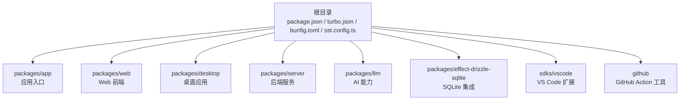
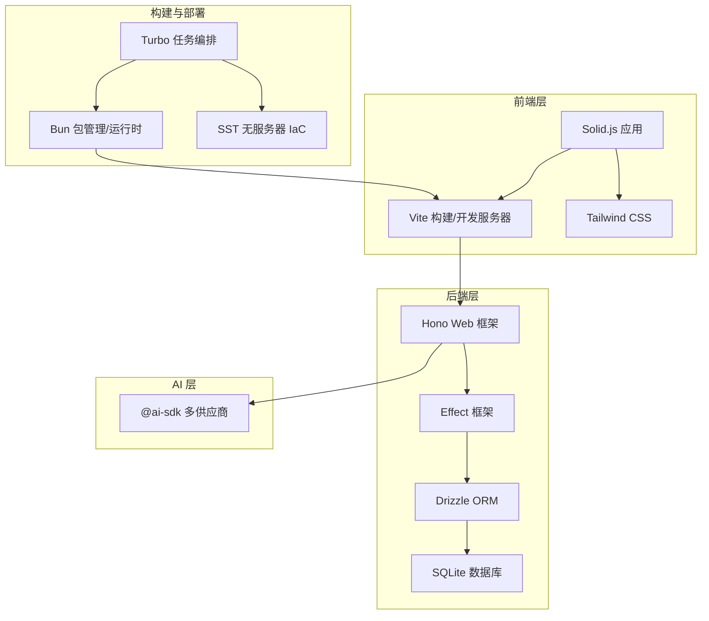
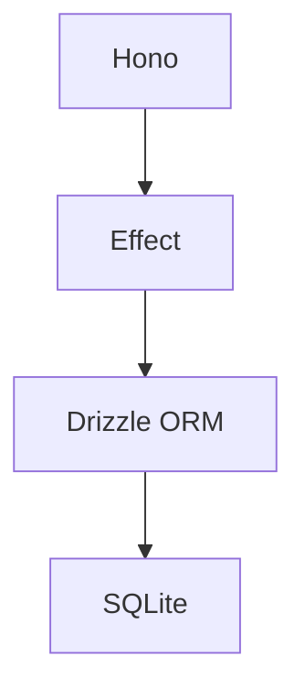
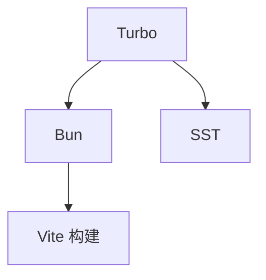
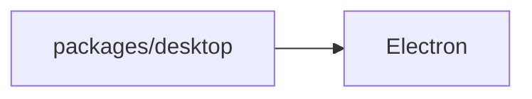
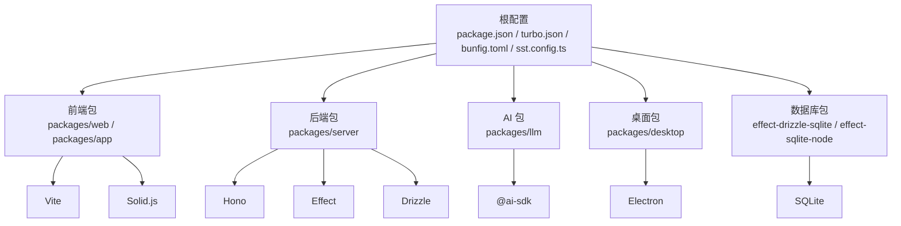

# 技术栈概览

<cite>
**本文档引用的文件**
- [package.json](file://package.json)
- [turbo.json](file://turbo.json)
- [bunfig.toml](file://bunfig.toml)
- [sst.config.ts](file://sst.config.ts)
- [flake.nix](file://flake.nix)
- [README.md](file://README.md)
- [packages/app/package.json](file://packages/app/package.json)
- [packages/web/package.json](file://packages/web/package.json)
- [packages/desktop/package.json](file://packages/desktop/package.json)
- [packages/server/package.json](file://packages/server/package.json)
- [packages/effect-drizzle-sqlite/package.json](file://packages/effect-drizzle-sqlite/package.json)
- [packages/effect-sqlite-node/package.json](file://packages/effect-sqlite-node/package.json)
- [packages/llm/package.json](file://packages/llm/package.json)
- [github/package.json](file://github/package.json)
- [sdks/vscode/package.json](file://sdks/vscode/package.json)
</cite>

## 目录
1. [引言](#引言)
2. [项目结构](#项目结构)
3. [核心组件](#核心组件)
4. [架构总览](#架构总览)
5. [详细组件分析](#详细组件分析)
6. [依赖关系分析](#依赖关系分析)
7. [性能考虑](#性能考虑)
8. [故障排除指南](#故障排除指南)
9. [结论](#结论)
10. [附录](#附录)

## 引言
本技术栈概览面向 OpenCode 项目的开发者与贡献者，系统性梳理项目采用的核心技术与框架组合，涵盖前端（Solid.js、Vite、Tailwind CSS）、后端（Hono、Effect 框架、Drizzle ORM）、AI 集成（@ai-sdk 多供应商支持）、构建工具（Turbo、Bun、SST）、数据库（SQLite）、桌面应用（Electron）等。文档解释各技术选型的原因与优势，并阐明它们在整体架构中的角色与协作关系，帮助读者快速理解系统的技术脉络与数据流向。

## 项目结构
OpenCode 采用 Monorepo 管理多包，根目录包含统一的构建与运行配置，各功能域以 packages 下的子包形式组织，如 app、web、desktop、server、llm、effect-drizzle-sqlite 等。根配置文件定义了工作区、任务编排与工具链，支撑跨包的统一开发体验。

**图表来源**
- [package.json:1-200](file://package.json#L1-L200)
- [turbo.json:1-200](file://turbo.json#L1-L200)
- [bunfig.toml:1-200](file://bunfig.toml#L1-L200)
- [sst.config.ts:1-200](file://sst.config.ts#L1-L200)

**章节来源**
- [package.json:1-200](file://package.json#L1-L200)
- [turbo.json:1-200](file://turbo.json#L1-L200)
- [bunfig.toml:1-200](file://bunfig.toml#L1-L200)
- [sst.config.ts:1-200](file://sst.config.ts#L1-L200)

## 核心组件
本节从技术栈维度概述各组件及其职责定位：

- 前端技术栈
  - Solid.js：用于构建高性能、细粒度响应式的用户界面，强调运行时性能与可维护性。
  - Vite：作为构建工具与开发服务器，提供快速热更新与按需打包能力。
  - Tailwind CSS：实用优先的 CSS 框架，提升样式开发效率与一致性。

- 后端技术栈
  - Hono：轻量级 Web 框架，适配多运行时（Cloudflare Workers、Node.js），强调简洁与高性能。
  - Effect 框架：函数式编程范式下的可组合效果模型，提供类型安全与可测试性。
  - Drizzle ORM：现代化 ORM，支持类型安全查询与迁移管理，配合 SQLite 实现本地存储。

- AI 集成方案
  - @ai-sdk：统一的多供应商 AI SDK，支持多家大模型提供商，便于切换与抽象。

- 构建工具
  - Turbo：Monorepo 任务编排与缓存加速，显著缩短构建时间。
  - Bun：包管理器与运行时，结合 Vite 提供更快的安装与启动体验。
  - SST：无服务器基础设施即代码（IaC），用于部署与环境管理。

- 数据库解决方案
  - SQLite：轻量、零配置的关系型数据库，适合开发、测试与边缘场景。

- 桌面应用框架
  - Electron：跨平台桌面应用开发框架，结合 Web 技术栈实现桌面端体验。

**章节来源**
- [packages/app/package.json:1-200](file://packages/app/package.json#L1-L200)
- [packages/web/package.json:1-200](file://packages/web/package.json#L1-L200)
- [packages/desktop/package.json:1-200](file://packages/desktop/package.json#L1-L200)
- [packages/server/package.json:1-200](file://packages/server/package.json#L1-L200)
- [packages/effect-drizzle-sqlite/package.json:1-200](file://packages/effect-drizzle-sqlite/package.json#L1-L200)
- [packages/effect-sqlite-node/package.json:1-200](file://packages/effect-sqlite-node/package.json#L1-L200)
- [packages/llm/package.json:1-200](file://packages/llm/package.json#L1-L200)
- [github/package.json:1-200](file://github/package.json#L1-L200)
- [sdks/vscode/package.json:1-200](file://sdks/vscode/package.json#L1-L200)

## 架构总览
下图展示 OpenCode 的端到端技术架构：前端通过 Vite 开发与构建，Solid.js 提供 UI 层；后端由 Hono 提供路由与中间件，Effect 与 Drizzle 组合实现数据访问层；AI 能力通过 @ai-sdk 抽象多供应商接口；构建与部署由 Turbo、Bun、SST 协同完成；SQLite 作为本地数据库支撑。

**图表来源**
- [packages/web/package.json:1-200](file://packages/web/package.json#L1-L200)
- [packages/server/package.json:1-200](file://packages/server/package.json#L1-L200)
- [packages/effect-drizzle-sqlite/package.json:1-200](file://packages/effect-drizzle-sqlite/package.json#L1-L200)
- [packages/llm/package.json:1-200](file://packages/llm/package.json#L1-L200)
- [turbo.json:1-200](file://turbo.json#L1-L200)
- [bunfig.toml:1-200](file://bunfig.toml#L1-L200)
- [sst.config.ts:1-200](file://sst.config.ts#L1-L200)

## 详细组件分析

### 前端技术栈（Solid.js、Vite、Tailwind CSS）
- Solid.js：在 packages/web 与 packages/app 中作为主要 UI 框架，强调细粒度响应与最小重渲染，适合复杂交互场景。
- Vite：在 packages/web 与 packages/app 中承担开发服务器与构建任务，提供快速冷启动与热更新。
- Tailwind CSS：在前端包中用于样式体系，提升设计一致性与开发效率。

**图表来源**
- [packages/web/package.json:1-200](file://packages/web/package.json#L1-L200)
- [packages/app/package.json:1-200](file://packages/app/package.json#L1-L200)

**章节来源**
- [packages/web/package.json:1-200](file://packages/web/package.json#L1-L200)
- [packages/app/package.json:1-200](file://packages/app/package.json#L1-L200)

### 后端技术栈（Hono、Effect、Drizzle ORM）
- Hono：在 packages/server 中提供路由与中间件，适配多运行时，简化请求处理与错误管理。
- Effect：在数据访问与业务逻辑中提供类型安全的效果模型，增强可测试性与可维护性。
- Drizzle ORM：在 packages/effect-drizzle-sqlite 中集成，提供类型安全的查询与迁移管理，SQLite 作为本地存储。

**图表来源**
- [packages/server/package.json:1-200](file://packages/server/package.json#L1-L200)
- [packages/effect-drizzle-sqlite/package.json:1-200](file://packages/effect-drizzle-sqlite/package.json#L1-L200)
- [packages/effect-sqlite-node/package.json:1-200](file://packages/effect-sqlite-node/package.json#L1-L200)

**章节来源**
- [packages/server/package.json:1-200](file://packages/server/package.json#L1-L200)
- [packages/effect-drizzle-sqlite/package.json:1-200](file://packages/effect-drizzle-sqlite/package.json#L1-L200)
- [packages/effect-sqlite-node/package.json:1-200](file://packages/effect-sqlite-node/package.json#L1-L200)

### AI 集成方案（@ai-sdk 多供应商支持）
- @ai-sdk：在 packages/llm 中集成，统一抽象多家大模型供应商，便于切换与扩展，降低供应商锁定风险。

**图表来源**
- [packages/llm/package.json:1-200](file://packages/llm/package.json#L1-L200)

**章节来源**
- [packages/llm/package.json:1-200](file://packages/llm/package.json#L1-L200)

### 构建工具（Turbo、Bun、SST）
- Turbo：在根目录配置中定义任务编排与缓存策略，加速 monorepo 内部构建与测试。
- Bun：在根与各子包配置中启用，提供更快的包安装与脚本执行速度。
- SST：在 sst.config.ts 中定义无服务器基础设施，支持一键部署与环境管理。

**图表来源**
- [turbo.json:1-200](file://turbo.json#L1-L200)
- [bunfig.toml:1-200](file://bunfig.toml#L1-L200)
- [sst.config.ts:1-200](file://sst.config.ts#L1-L200)

**章节来源**
- [turbo.json:1-200](file://turbo.json#L1-L200)
- [bunfig.toml:1-200](file://bunfig.toml#L1-L200)
- [sst.config.ts:1-200](file://sst.config.ts#L1-L200)

### 数据库解决方案（SQLite）
- SQLite：在 effect-drizzle-sqlite 与 effect-sqlite-node 中作为底层存储，满足开发、测试与边缘场景需求，零配置与高兼容性。

**图表来源**
- [packages/effect-drizzle-sqlite/package.json:1-200](file://packages/effect-drizzle-sqlite/package.json#L1-L200)
- [packages/effect-sqlite-node/package.json:1-200](file://packages/effect-sqlite-node/package.json#L1-L200)

**章节来源**
- [packages/effect-drizzle-sqlite/package.json:1-200](file://packages/effect-drizzle-sqlite/package.json#L1-L200)
- [packages/effect-sqlite-node/package.json:1-200](file://packages/effect-sqlite-node/package.json#L1-L200)

### 桌面应用框架（Electron）
- Electron：在 packages/desktop 中用于构建跨平台桌面应用，结合 Web 技术栈实现一致的用户体验。

**图表来源**
- [packages/desktop/package.json:1-200](file://packages/desktop/package.json#L1-L200)

**章节来源**
- [packages/desktop/package.json:1-200](file://packages/desktop/package.json#L1-L200)

## 依赖关系分析
OpenCode 的技术栈通过根配置与各子包配置形成清晰的依赖关系：前端包依赖 Vite 与 Solid.js；后端包依赖 Hono、Effect 与 Drizzle；AI 能力通过 @ai-sdk 在 LLM 包中集中管理；构建与部署由 Turbo、Bun、SST 统一调度；数据库层由 SQLite 提供支撑。

**图表来源**
- [package.json:1-200](file://package.json#L1-L200)
- [turbo.json:1-200](file://turbo.json#L1-L200)
- [packages/web/package.json:1-200](file://packages/web/package.json#L1-L200)
- [packages/server/package.json:1-200](file://packages/server/package.json#L1-L200)
- [packages/llm/package.json:1-200](file://packages/llm/package.json#L1-L200)
- [packages/desktop/package.json:1-200](file://packages/desktop/package.json#L1-L200)
- [packages/effect-drizzle-sqlite/package.json:1-200](file://packages/effect-drizzle-sqlite/package.json#L1-L200)
- [packages/effect-sqlite-node/package.json:1-200](file://packages/effect-sqlite-node/package.json#L1-L200)

**章节来源**
- [package.json:1-200](file://package.json#L1-L200)
- [turbo.json:1-200](file://turbo.json#L1-L200)

## 性能考虑
- 构建性能：Turbo 通过任务缓存与增量构建减少重复计算；Bun 提供更快的包安装与脚本执行。
- 运行时性能：Solid.js 的细粒度响应与 Vite 的按需加载共同优化首屏与交互性能。
- 数据访问：Effect + Drizzle 的类型安全与查询优化降低运行时开销。
- AI 调用：@ai-sdk 的统一抽象便于缓存与并发控制，减少网络往返。

[本节为通用指导，无需列出具体文件来源]

## 故障排除指南
- 构建失败：检查 turbo.json 的任务配置与 bunfig.toml 的包管理设置，确保依赖版本一致。
- 运行时错误：确认 Hono 路由与 Effect 效果的类型签名匹配，避免未捕获异常。
- 数据库问题：验证 Drizzle 的迁移脚本与 SQLite 文件权限，确保路径正确。
- AI 接口异常：检查 @ai-sdk 的供应商密钥与网络代理配置。

**章节来源**
- [turbo.json:1-200](file://turbo.json#L1-L200)
- [bunfig.toml:1-200](file://bunfig.toml#L1-L200)
- [packages/server/package.json:1-200](file://packages/server/package.json#L1-L200)
- [packages/effect-drizzle-sqlite/package.json:1-200](file://packages/effect-drizzle-sqlite/package.json#L1-L200)
- [packages/llm/package.json:1-200](file://packages/llm/package.json#L1-L200)

## 结论
OpenCode 的技术栈围绕“高性能前端 + 轻量化后端 + 类型安全数据层 + 多供应商 AI + 统一构建与部署”展开，既保证了开发效率，也兼顾了运行时性能与可维护性。通过模块化与工具链协同，项目能够在不同运行时与平台上保持一致的交付质量。

[本节为总结性内容，无需列出具体文件来源]

## 附录
- 学习资源与官方文档建议（基于技术栈名称与常见实践）：
  - Solid.js：官方文档与示例仓库
  - Vite：官方文档与最佳实践指南
  - Tailwind CSS：官方文档与组件库
  - Hono：官方文档与运行时适配说明
  - Effect：官方文档与效果模型教程
  - Drizzle：官方文档与迁移指南
  - @ai-sdk：多供应商集成与缓存策略
  - Turbo：Monorepo 任务编排与缓存策略
  - Bun：包管理与运行时特性
  - SST：无服务器 IaC 与部署流程
  - SQLite：官方文档与性能调优
  - Electron：跨平台桌面应用开发指南

[本节为概念性内容，无需列出具体文件来源]