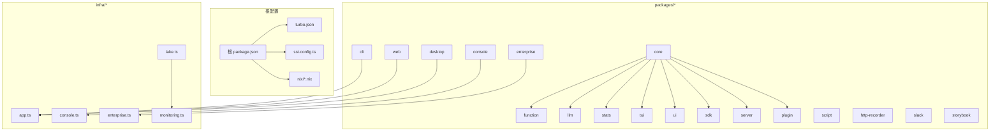
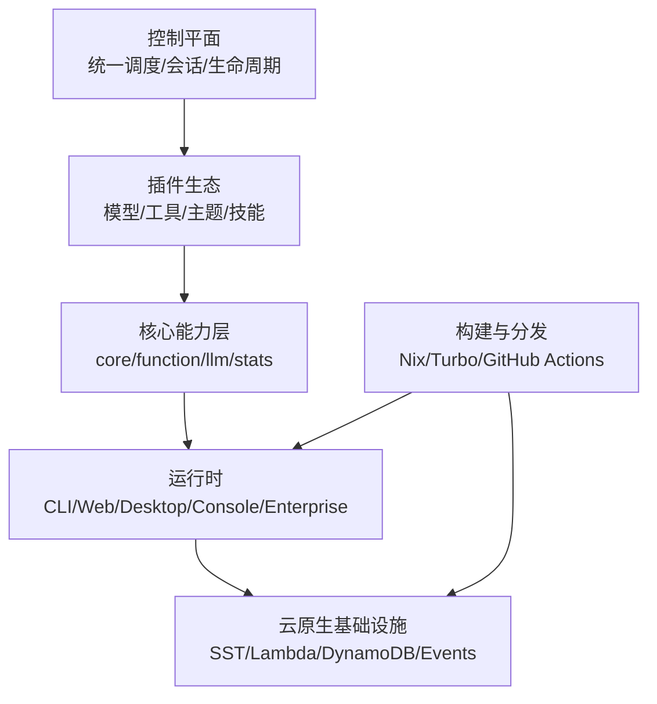
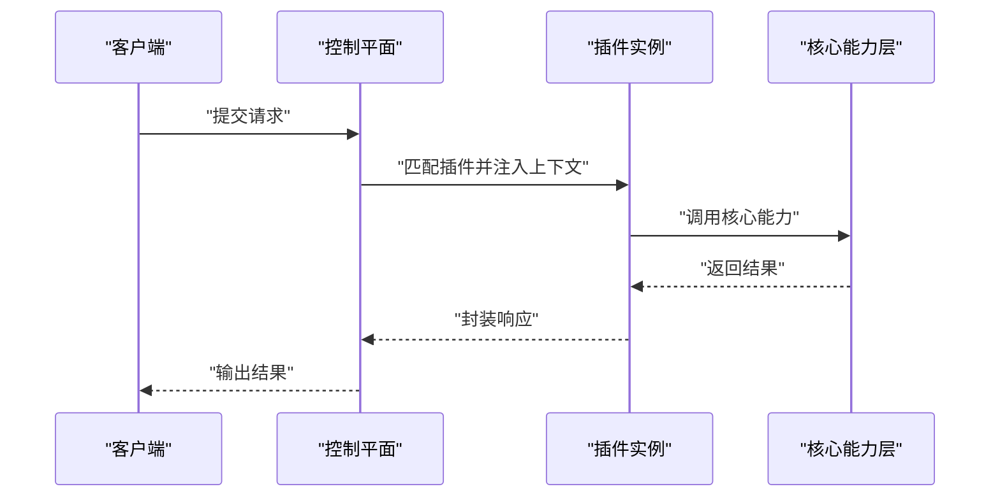
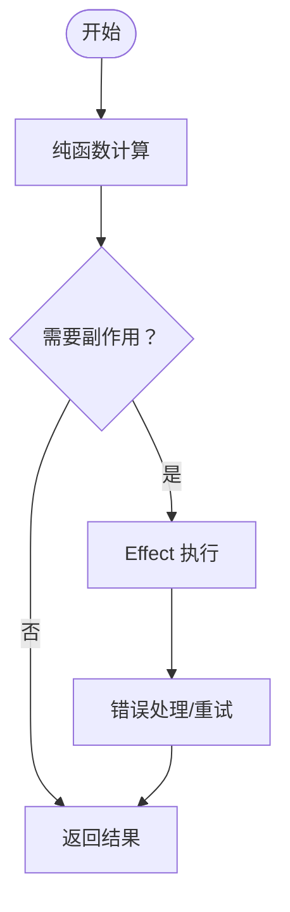
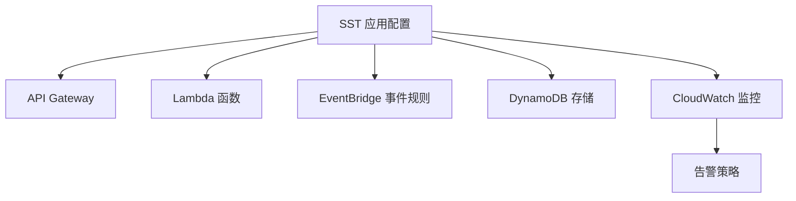
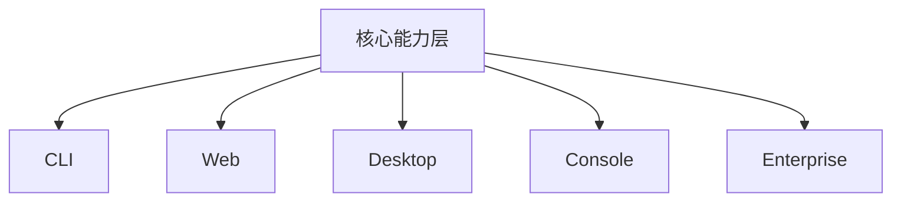
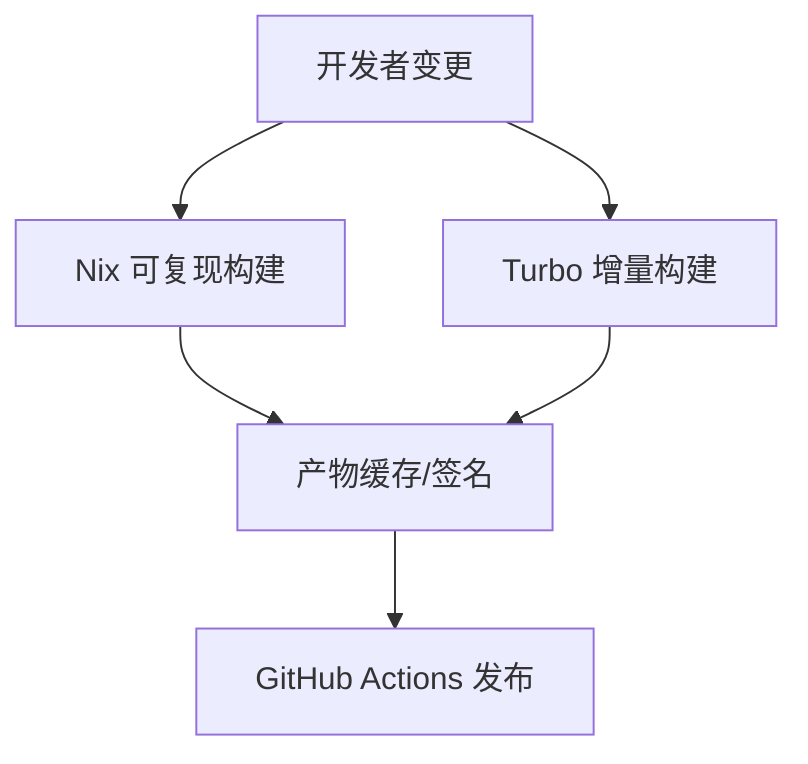
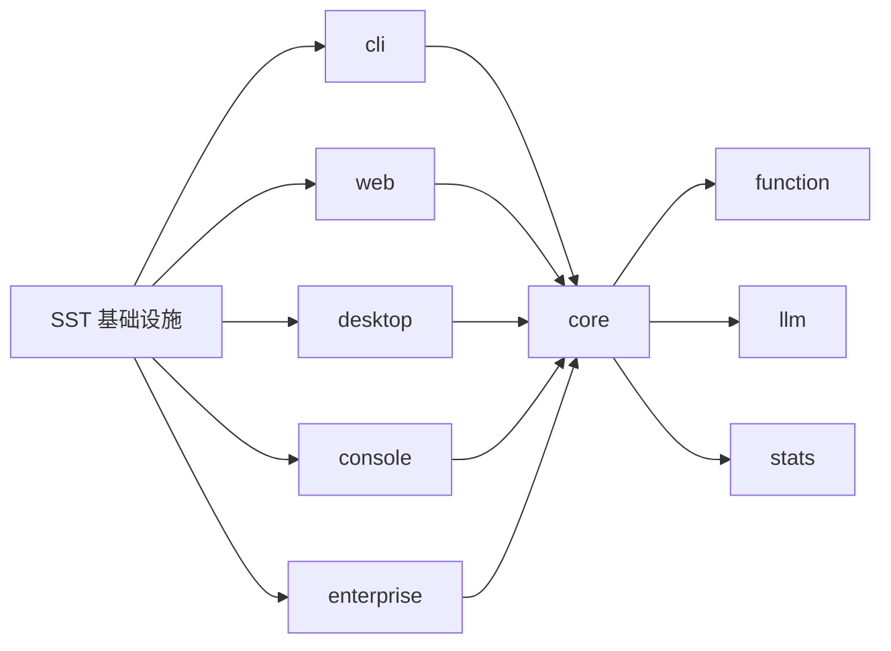

# 架构设计理念

<cite>
**本文引用的文件**
- [README.md](file://README.md)
- [turbo.json](file://turbo.json)
- [sst.config.ts](file://sst.config.ts)
- [package.json](file://package.json)
- [github/package.json](file://github/package.json)
- [.opencode/opencode.jsonc](file://.opencode/opencode.jsonc)
- [packages/opencode/package.json](file://packages/opencode/package.json)
- [packages/core/package.json](file://packages/core/package.json)
- [packages/cli/package.json](file://packages/cli/package.json)
- [packages/web/package.json](file://packages/web/package.json)
- [packages/desktop/package.json](file://packages/desktop/package.json)
- [packages/console/app/package.json](file://packages/console/app/package.json)
- [packages/enterprise/package.json](file://packages/enterprise/package.json)
- [packages/plugin/package.json](file://packages/plugin/package.json)
- [packages/function/package.json](file://packages/function/package.json)
- [packages/llm/package.json](file://packages/llm/package.json)
- [packages/stats/package.json](file://packages/stats/package.json)
- [packages/tui/package.json](file://packages/tui/package.json)
- [packages/ui/package.json](file://packages/ui/package.json)
- [packages/sdk/package.json](file://packages/sdk/package.json)
- [packages/server/package.json](file://packages/server/package.json)
- [infra/app.ts](file://infra/app.ts)
- [infra/console.ts](file://infra/console.ts)
- [infra/enterprise.ts](file://infra/enterprise.ts)
- [infra/lake.ts](file://infra/lake.ts)
- [infra/monitoring.ts](file://infra/monitoring.ts)
- [nix/opencode.nix](file://nix/opencode.nix)
- [nix/desktop.nix](file://nix/desktop.nix)
- [sdks/vscode/package.json](file://sdks/vscode/package.json)
</cite>

## 目录
1. [引言](#引言)
2. [项目结构](#项目结构)
3. [核心组件](#核心组件)
4. [架构总览](#架构总览)
5. [详细组件分析](#详细组件分析)
6. [依赖分析](#依赖分析)
7. [性能考虑](#性能考虑)
8. [故障排查指南](#故障排查指南)
9. [结论](#结论)
10. [附录](#附录)

## 引言
OpenCode 是一个面向多端与多场景的工程化平台，采用 monorepo 管理与插件化架构，结合函数式编程范式与云原生部署策略，实现高内聚、低耦合、可扩展且可维护的系统设计。其目标是通过统一的控制平面与丰富的插件生态，支撑从 CLI、Web、桌面到企业级控制台与监控湖的全栈能力，并通过 Nix、Turborepo、SST 等工具链实现高效构建、分发与部署。

本文件聚焦于架构理念的深度解析：monorepo 的优势与挑战、插件化设计原则、函数式编程的应用、云原生部署策略、模块化组织与依赖关系、演进历程与未来方向，并辅以图示帮助读者把握系统设计的精髓。

## 项目结构
OpenCode 采用 monorepo 组织方式，根目录包含工作流、脚本、基础设施与多包管理配置；核心业务与能力分布在 packages 下的多个子包中，同时通过 infra 提供云原生基础设施定义，nix 提供可复现的构建与打包环境，turbo 负责任务编排与缓存加速。

- 根配置
  - 工作流与发布：.github/workflows、publish-python-sdk.yml
  - Monorepo 管理：turbo.json（任务编排）、package.json（根依赖）
  - 云原生配置：sst.config.ts（SST 应用入口）
  - Nix 可复现构建：nix/*.nix
- 包组织（packages/*）
  - 核心与通用：core、effect-*、function、llm、stats、tui、ui、sdk、server、identity
  - 产品与形态：app、cli、web、desktop、console、enterprise、plugin、script
  - 工具与集成：http-recorder、slack、storybook
- 基础设施（infra/*）
  - 应用与控制台：app.ts、console.ts、enterprise.ts
  - 数据湖与监控：lake.ts、monitoring.ts
  - 辅助：stage.ts、secret.ts、stats.ts
- 开发者工具与 SDK
  - VS Code 扩展：sdks/vscode
  - GitHub 集成：github/*

**图示来源**
- [turbo.json](file://turbo.json)
- [sst.config.ts](file://sst.config.ts)
- [package.json](file://package.json)
- [nix/opencode.nix](file://nix/opencode.nix)
- [nix/desktop.nix](file://nix/desktop.nix)
- [infra/app.ts](file://infra/app.ts)
- [infra/console.ts](file://infra/console.ts)
- [infra/enterprise.ts](file://infra/enterprise.ts)
- [infra/lake.ts](file://infra/lake.ts)
- [infra/monitoring.ts](file://infra/monitoring.ts)

**章节来源**
- [README.md](file://README.md)
- [turbo.json](file://turbo.json)
- [sst.config.ts](file://sst.config.ts)
- [package.json](file://package.json)

## 核心组件
- 控制平面与插件体系
  - 控制平面负责统一调度、会话与生命周期管理，插件体系提供可插拔的能力扩展点，二者通过配置与接口契约解耦。
  - 插件生态覆盖模型提供方、工具、主题、技能等，支持按需加载与热更新。
- 函数式编程范式
  - 使用不可变数据结构与纯函数组合，降低副作用与状态复杂度；通过 Effect 系列库进行资源管理与错误处理。
- 多端产品矩阵
  - CLI、Web、桌面、企业控制台与监控湖形成互补的产品形态，共享核心能力层，差异化前端与运行时。
- 云原生基础设施
  - 基于 SST 的无服务器应用定义，结合 Lambda、API Gateway、DynamoDB、EventBridge 等服务，实现弹性伸缩与可观测性。
- 可复现构建与分发
  - Nix 提供可复现的依赖与二进制构建；VS Code SDK 与多语言 SDK 支持跨平台分发。

**章节来源**
- [.opencode/opencode.jsonc](file://.opencode/opencode.jsonc)
- [packages/opencode/package.json](file://packages/opencode/package.json)
- [packages/core/package.json](file://packages/core/package.json)
- [packages/plugin/package.json](file://packages/plugin/package.json)
- [packages/function/package.json](file://packages/function/package.json)
- [packages/llm/package.json](file://packages/llm/package.json)
- [packages/stats/package.json](file://packages/stats/package.json)
- [packages/tui/package.json](file://packages/tui/package.json)
- [packages/ui/package.json](file://packages/ui/package.json)
- [packages/sdk/package.json](file://packages/sdk/package.json)
- [packages/server/package.json](file://packages/server/package.json)
- [packages/cli/package.json](file://packages/cli/package.json)
- [packages/web/package.json](file://packages/web/package.json)
- [packages/desktop/package.json](file://packages/desktop/package.json)
- [packages/console/app/package.json](file://packages/console/app/package.json)
- [packages/enterprise/package.json](file://packages/enterprise/package.json)
- [sdks/vscode/package.json](file://sdks/vscode/package.json)

## 架构总览
OpenCode 的架构以“控制平面 + 插件生态 + 多端产品 + 云原生基础设施”为核心，强调：
- 分层清晰：核心能力层（core/function/llm/stats）向上提供能力，向下对接基础设施与运行时。
- 插件化：通过统一的插件接口与生命周期，实现能力的即插即用与版本化治理。
- 函数式：以不可变与纯函数为主，配合 Effect 进行资源与错误建模，提升可靠性与可测试性。
- 云原生：以 SST 定义应用，结合 Lambda、事件驱动与无服务器存储，实现弹性与可观测性。
- 可复现：Nix 确保构建一致性，Turbo 加速增量构建，GitHub Actions 实现 CI/CD。

**图示来源**
- [packages/opencode/package.json](file://packages/opencode/package.json)
- [packages/core/package.json](file://packages/core/package.json)
- [packages/function/package.json](file://packages/function/package.json)
- [packages/llm/package.json](file://packages/llm/package.json)
- [packages/stats/package.json](file://packages/stats/package.json)
- [packages/cli/package.json](file://packages/cli/package.json)
- [packages/web/package.json](file://packages/web/package.json)
- [packages/desktop/package.json](file://packages/desktop/package.json)
- [packages/console/app/package.json](file://packages/console/app/package.json)
- [packages/enterprise/package.json](file://packages/enterprise/package.json)
- [sst.config.ts](file://sst.config.ts)
- [turbo.json](file://turbo.json)
- [nix/opencode.nix](file://nix/opencode.nix)

## 详细组件分析

### 控制平面与插件体系
- 设计原则
  - 统一入口：控制平面集中管理插件注册、生命周期与会话上下文。
  - 接口契约：插件以标准化接口暴露能力，避免直接耦合具体实现。
  - 版本化治理：插件版本与兼容性约束由配置与元数据声明。
- 关键流程
  - 启动阶段：加载配置、初始化插件、建立会话上下文。
  - 运行阶段：根据请求路由到对应插件，执行前/后置钩子，聚合结果。
  - 生命周期：支持热加载、灰度发布与回滚策略。
- 适用场景
  - 模型提供方切换、工具链扩展、主题与技能定制。

**图示来源**
- [packages/opencode/package.json](file://packages/opencode/package.json)
- [packages/plugin/package.json](file://packages/plugin/package.json)
- [packages/core/package.json](file://packages/core/package.json)

**章节来源**
- [.opencode/opencode.jsonc](file://.opencode/opencode.jsonc)
- [packages/opencode/package.json](file://packages/opencode/package.json)
- [packages/plugin/package.json](file://packages/plugin/package.json)
- [packages/core/package.json](file://packages/core/package.json)

### 函数式编程范式
- 不可变与纯函数
  - 数据结构以不可变形式传递，减少副作用，提升并发安全性。
  - 纯函数组合用于业务逻辑编排，便于单元测试与推理。
- Effect 生态
  - 使用 Effect 进行资源管理（数据库、HTTP、文件），统一错误处理与重试策略。
  - 通过 Effect 的并发模型提升吞吐，同时保持错误隔离。
- 复杂度控制
  - 将状态集中在少数可预测的模块中，其余模块保持纯函数特性。

**图示来源**
- [packages/function/package.json](file://packages/function/package.json)
- [packages/llm/package.json](file://packages/llm/package.json)
- [packages/stats/package.json](file://packages/stats/package.json)

**章节来源**
- [packages/function/package.json](file://packages/function/package.json)
- [packages/llm/package.json](file://packages/llm/package.json)
- [packages/stats/package.json](file://packages/stats/package.json)

### 云原生部署策略
- 应用定义
  - 通过 SST 在单个配置中定义多环境、多资源的应用拓扑，包括 API、队列、事件规则与存储。
- 无服务器组件
  - Lambda 函数按需触发，自动扩缩容；API Gateway 提供统一入口；DynamoDB/EventBridge 提供数据与事件驱动。
- 观测与治理
  - 结合监控与日志，实现端到端追踪与告警；通过阶段化部署与蓝绿发布降低风险。
- 多端协同
  - CLI/Web/Desktop/Console/Enterprise 共享同一套基础设施抽象，按需选择运行时与前端框架。

**图示来源**
- [sst.config.ts](file://sst.config.ts)
- [infra/app.ts](file://infra/app.ts)
- [infra/console.ts](file://infra/console.ts)
- [infra/enterprise.ts](file://infra/enterprise.ts)
- [infra/lake.ts](file://infra/lake.ts)
- [infra/monitoring.ts](file://infra/monitoring.ts)

**章节来源**
- [sst.config.ts](file://sst.config.ts)
- [infra/app.ts](file://infra/app.ts)
- [infra/console.ts](file://infra/console.ts)
- [infra/enterprise.ts](file://infra/enterprise.ts)
- [infra/lake.ts](file://infra/lake.ts)
- [infra/monitoring.ts](file://infra/monitoring.ts)

### 多端产品与运行时
- CLI：命令行工具，适合自动化与脚本集成。
- Web：浏览器端应用，强调交互体验与离线能力。
- 桌面：基于 Electron 或原生桌面框架，提供更丰富的本地能力。
- 控制台：企业级管理界面，强调权限与审计。
- 企业版：面向组织的扩展能力与合规要求。
- 共享核心：所有运行时共享 core/function/llm/stats 等能力层，确保一致的行为与数据模型。

**图示来源**
- [packages/core/package.json](file://packages/core/package.json)
- [packages/cli/package.json](file://packages/cli/package.json)
- [packages/web/package.json](file://packages/web/package.json)
- [packages/desktop/package.json](file://packages/desktop/package.json)
- [packages/console/app/package.json](file://packages/console/app/package.json)
- [packages/enterprise/package.json](file://packages/enterprise/package.json)

**章节来源**
- [packages/core/package.json](file://packages/core/package.json)
- [packages/cli/package.json](file://packages/cli/package.json)
- [packages/web/package.json](file://packages/web/package.json)
- [packages/desktop/package.json](file://packages/desktop/package.json)
- [packages/console/app/package.json](file://packages/console/app/package.json)
- [packages/enterprise/package.json](file://packages/enterprise/package.json)

### 可复现构建与分发
- Nix
  - 提供可复现的依赖解析与二进制构建，确保开发与生产环境一致性。
  - 桌面与主包分别有独立的 Nix 配置，便于隔离与优化。
- Turborepo
  - 通过任务缓存与增量构建，显著缩短构建时间，支持多包并行流水线。
- GitHub Actions
  - 自动化发布与验证，结合 Nix 与 Turborepo，实现端到端的 CI/CD。

**图示来源**
- [nix/opencode.nix](file://nix/opencode.nix)
- [nix/desktop.nix](file://nix/desktop.nix)
- [turbo.json](file://turbo.json)
- [github/package.json](file://github/package.json)

**章节来源**
- [nix/opencode.nix](file://nix/opencode.nix)
- [nix/desktop.nix](file://nix/desktop.nix)
- [turbo.json](file://turbo.json)
- [github/package.json](file://github/package.json)

## 依赖分析
- 内聚与解耦
  - 核心能力层对上提供稳定接口，对下屏蔽底层差异，降低上层依赖复杂度。
  - 插件通过接口契约与配置驱动，避免直接依赖具体实现。
- 直接与间接依赖
  - CLI/Web/Desktop/Console/Enterprise 直接依赖核心能力层；核心能力层间接依赖函数式与 LLM/统计等子模块。
  - 基础设施层通过 SST 抽象对外暴露统一资源视图。
- 循环依赖规避
  - 通过清晰的边界与接口定义，避免包间循环依赖；必要时引入适配器或中间层。
- 外部依赖与集成
  - 通过 SDK 与第三方服务集成，统一抽象与错误处理。

**图示来源**
- [packages/core/package.json](file://packages/core/package.json)
- [packages/function/package.json](file://packages/function/package.json)
- [packages/llm/package.json](file://packages/llm/package.json)
- [packages/stats/package.json](file://packages/stats/package.json)
- [packages/cli/package.json](file://packages/cli/package.json)
- [packages/web/package.json](file://packages/web/package.json)
- [packages/desktop/package.json](file://packages/desktop/package.json)
- [packages/console/app/package.json](file://packages/console/app/package.json)
- [packages/enterprise/package.json](file://packages/enterprise/package.json)
- [sst.config.ts](file://sst.config.ts)

**章节来源**
- [packages/core/package.json](file://packages/core/package.json)
- [packages/function/package.json](file://packages/function/package.json)
- [packages/llm/package.json](file://packages/llm/package.json)
- [packages/stats/package.json](file://packages/stats/package.json)
- [packages/cli/package.json](file://packages/cli/package.json)
- [packages/web/package.json](file://packages/web/package.json)
- [packages/desktop/package.json](file://packages/desktop/package.json)
- [packages/console/app/package.json](file://packages/console/app/package.json)
- [packages/enterprise/package.json](file://packages/enterprise/package.json)
- [sst.config.ts](file://sst.config.ts)

## 性能考虑
- 构建性能
  - 利用 Turborepo 的任务缓存与并行执行，减少重复构建；Nix 提供可复现的缓存与二进制分发。
- 运行时性能
  - 无服务器函数按需触发，结合事件驱动与批处理，降低空闲资源占用。
  - 核心能力层以纯函数与不可变数据结构为主，减少锁竞争与状态同步开销。
- 可观测性
  - 基础设施侧埋点与告警，端到端追踪定位性能瓶颈。
- 可扩展性
  - 插件化与多端产品矩阵，支持按场景扩展与隔离，避免全局性改动带来的性能退化。

## 故障排查指南
- 插件问题
  - 检查插件注册与生命周期钩子是否正确执行；核对配置与版本兼容性。
- 函数式与 Effect
  - 关注 Effect 的错误传播与重试策略；确认资源释放与超时设置。
- 云原生
  - 查看 API 网关与 Lambda 的日志与指标；核对事件规则与存储权限。
- 构建与分发
  - 使用 Nix 重建以排除环境差异；检查 Turborepo 缓存与任务依赖图。

**章节来源**
- [packages/plugin/package.json](file://packages/plugin/package.json)
- [packages/function/package.json](file://packages/function/package.json)
- [packages/llm/package.json](file://packages/llm/package.json)
- [packages/stats/package.json](file://packages/stats/package.json)
- [sst.config.ts](file://sst.config.ts)
- [turbo.json](file://turbo.json)
- [nix/opencode.nix](file://nix/opencode.nix)

## 结论
OpenCode 的架构以 monorepo 为组织基础，通过控制平面与插件生态实现能力的可插拔与可治理；以函数式编程范式提升可靠性与可测试性；以云原生基础设施实现弹性与可观测性；以 Nix 与 Turborepo 保障构建的一致性与效率。该架构在可扩展性、可维护性与性能之间取得平衡，并为未来的多端融合与生态演进提供了坚实基础。

## 附录
- 架构演进方向
  - 插件生态：完善插件市场与版本治理，增强灰度与回滚能力。
  - 函数式深化：进一步推广不可变数据结构与 Effect 并发模型。
  - 云原生：引入更多 Serverless 组件与边缘计算能力，优化冷启动与延迟。
  - 多端协同：统一运行时抽象，提升跨端一致性与共享效率。
- 最佳实践
  - 以接口契约驱动插件开发，避免隐式依赖。
  - 使用纯函数与 Effect 管理副作用，提升可测试性。
  - 借助 SST 与 Nix 建立一致的开发与发布流水线。