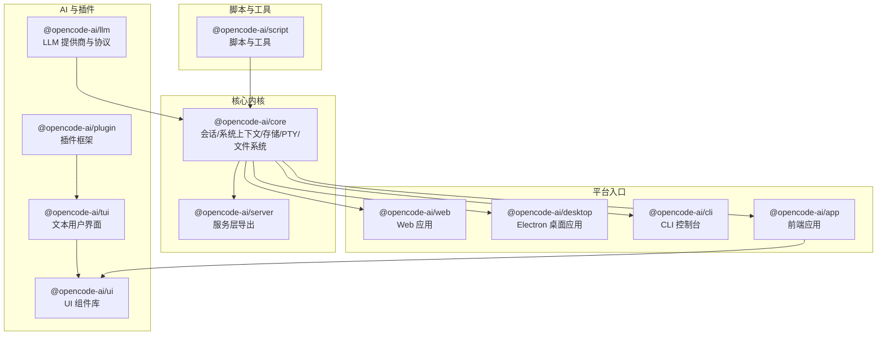
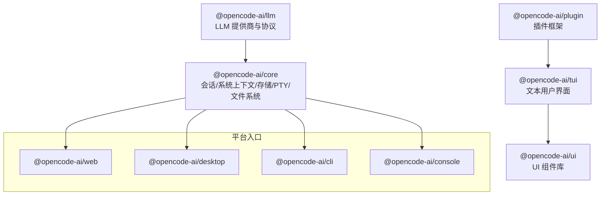
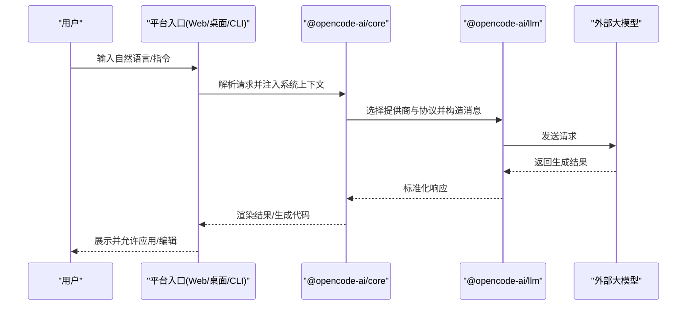
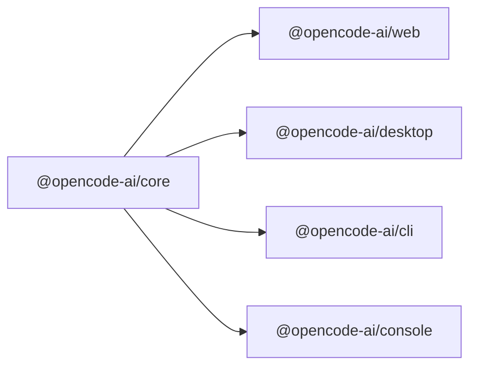
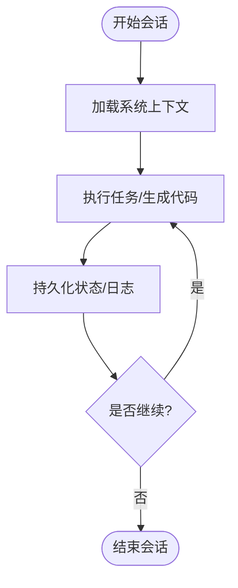
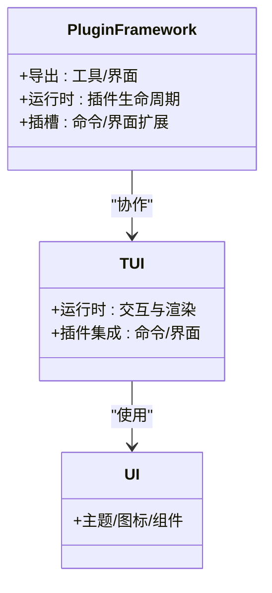
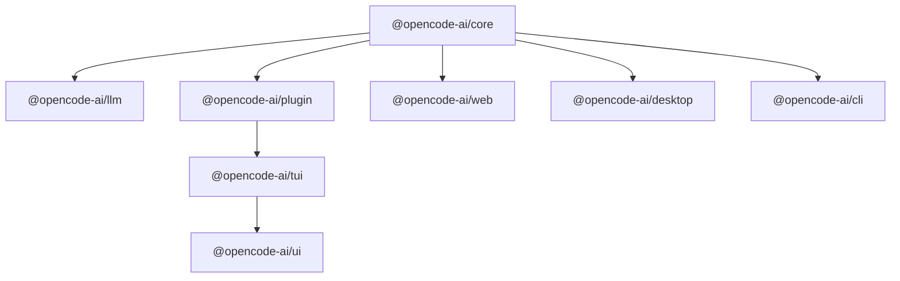

# 核心功能特性

<cite>
**本文引用的文件**
- [README.md](file://README.md)
- [opencode 包 package.json](file://packages/opencode/package.json)
- [core 包 package.json](file://packages/core/package.json)
- [web 包 package.json](file://packages/web/package.json)
- [desktop 包 package.json](file://packages/desktop/package.json)
- [cli 包 package.json](file://packages/cli/package.json)
- [llm 包 package.json](file://packages/llm/package.json)
- [plugin 包 package.json](file://packages/plugin/package.json)
- [tui 包 package.json](file://packages/tui/package.json)
- [server 包 package.json](file://packages/server/package.json)
- [ui 包 package.json](file://packages/ui/package.json)
- [app 包 package.json](file://packages/app/package.json)
- [script 包 package.json](file://packages/script/package.json)
</cite>

## 目录
1. [简介](#简介)
2. [项目结构](#项目结构)
3. [核心组件](#核心组件)
4. [架构总览](#架构总览)
5. [详细组件分析](#详细组件分析)
6. [依赖分析](#依赖分析)
7. [性能考虑](#性能考虑)
8. [故障排查指南](#故障排查指南)
9. [结论](#结论)
10. [附录](#附录)

## 简介
OpenCode 是一个开源的 AI 编码代理平台，提供统一的开发体验，覆盖 Web、桌面、CLI 和控制台等多种入口，并通过会话管理与插件生态实现可扩展的能力组合。其核心目标是通过 AI 驱动的代码生成与智能编辑能力，结合多平台一致的交互界面，帮助开发者在不同环境中高效完成从探索到落地的全流程任务。

## 项目结构
该项目采用多包（monorepo）组织方式，围绕“核心内核 + 多平台入口 + 插件与 UI 生态”的分层设计展开。主要模块包括：
- 核心内核：负责会话运行、系统上下文、SQLite 存储、伪终端（PTY）与文件系统抽象等基础能力
- 平台入口：Web、桌面、CLI、控制台四端应用，分别面向浏览器、原生桌面、命令行与终端交互
- LLM 能力：统一的模型适配层，支持多家大模型供应商与协议
- 插件与 TUI：提供可扩展的工具与界面能力，支撑丰富的交互与工作流
- UI 组件：提供主题、图标、对话框、编辑器等通用 UI 能力
- 脚本与工具：辅助构建、测试、发布与环境准备

图表来源
- [core 包 package.json:15-40](file://packages/core/package.json#L15-L40)
- [web 包 package.json:14-37](file://packages/web/package.json#L14-L37)
- [desktop 包 package.json:26-59](file://packages/desktop/package.json#L26-L59)
- [cli 包 package.json:18-29](file://packages/cli/package.json#L18-L29)
- [llm 包 package.json:13-36](file://packages/llm/package.json#L13-L36)
- [plugin 包 package.json:11-18](file://packages/plugin/package.json#L11-L18)
- [tui 包 package.json:12-48](file://packages/tui/package.json#L12-L48)
- [ui 包 package.json:6-29](file://packages/ui/package.json#L6-L29)
- [app 包 package.json:6-13](file://packages/app/package.json#L6-L13)
- [script 包 package.json:12-14](file://packages/script/package.json#L12-L14)

章节来源
- [README.md:46-130](file://README.md#L46-L130)
- [core 包 package.json:15-40](file://packages/core/package.json#L15-L40)
- [opencode 包 package.json:18-30](file://packages/opencode/package.json#L18-L30)

## 核心组件
- 会话与系统上下文：提供会话生命周期管理、系统上下文注入与运行时环境抽象，支撑多平台一致的交互体验
- 存储与文件系统：通过 SQLite 抽象与文件系统抽象（FFF），在不同运行时（Bun/Node）下保持一致性
- 伪终端（PTY）：为命令执行与交互式终端提供跨平台支持
- LLM 适配层：统一接入多家大模型供应商与协议，便于切换与扩展
- 插件与 TUI：以插件化的方式扩展工具与界面能力，支持命令、对话框、主题等
- UI 组件库：提供主题、图标、编辑器、对话框等通用 UI 能力，支撑多端一致的视觉与交互
- 多平台入口：Web、桌面、CLI、控制台四端应用，满足不同场景下的使用需求

章节来源
- [core 包 package.json:18-40](file://packages/core/package.json#L18-L40)
- [llm 包 package.json:13-36](file://packages/llm/package.json#L13-L36)
- [plugin 包 package.json:11-18](file://packages/plugin/package.json#L11-L18)
- [tui 包 package.json:12-48](file://packages/tui/package.json#L12-L48)
- [ui 包 package.json:6-29](file://packages/ui/package.json#L6-L29)

## 架构总览
OpenCode 的整体架构以“核心内核”为中心，向上提供多平台入口，向下整合 LLM 与插件生态，形成“统一内核 + 多端入口 + 可插拔能力”的体系。核心内核通过条件导出与运行时抽象，保证在不同平台与运行时中的一致行为；LLM 层提供统一的模型适配接口；插件与 TUI 则扩展了工具与界面能力，使平台具备高度可定制性。

图表来源
- [core 包 package.json:18-40](file://packages/core/package.json#L18-L40)
- [llm 包 package.json:13-36](file://packages/llm/package.json#L13-L36)
- [plugin 包 package.json:11-18](file://packages/plugin/package.json#L11-L18)
- [tui 包 package.json:12-48](file://packages/tui/package.json#L12-L48)
- [ui 包 package.json:6-29](file://packages/ui/package.json#L6-L29)
- [web 包 package.json:14-37](file://packages/web/package.json#L14-L37)
- [desktop 包 package.json:26-59](file://packages/desktop/package.json#L26-L59)
- [cli 包 package.json:18-29](file://packages/cli/package.json#L18-L29)

## 详细组件分析

### AI 代码生成与智能编辑
- 功能概述
  - 通过统一的 LLM 适配层，对接多家大模型供应商与协议，支持多模态与对话式交互
  - 在不同平台入口中提供一致的智能编辑体验，包括代码补全、重构建议、注释生成等
- 技术实现要点
  - LLM 提供商与协议导出：通过命名空间导出多种提供商与协议，便于按需选择与切换
  - 会话驱动：结合会话运行器与系统上下文，确保生成内容与当前项目状态一致
  - 多端集成：Web、桌面、CLI、控制台均通过统一 SDK 与服务层接入 LLM 能力
- 使用场景
  - 快速生成新功能模块或修复问题
  - 在不熟悉的代码库中进行探索与规划
  - 将自然语言指令转化为可执行的代码片段
- 实际应用示例
  - 在 Web 界面中输入“生成一个 React 组件”，平台返回可直接使用的代码与说明
  - 在 CLI 中执行“生成单元测试”，平台自动在当前目录输出测试文件
  - 在桌面应用中打开“智能编辑器”，实时显示改进建议与一键应用

图表来源
- [llm 包 package.json:13-36](file://packages/llm/package.json#L13-L36)
- [core 包 package.json:18-40](file://packages/core/package.json#L18-L40)
- [web 包 package.json:14-37](file://packages/web/package.json#L14-L37)
- [desktop 包 package.json:26-59](file://packages/desktop/package.json#L26-L59)
- [cli 包 package.json:18-29](file://packages/cli/package.json#L18-L29)

章节来源
- [llm 包 package.json:13-36](file://packages/llm/package.json#L13-L36)
- [core 包 package.json:18-40](file://packages/core/package.json#L18-L40)
- [README.md:100-114](file://README.md#L100-L114)

### 多平台支持（Web、桌面、CLI、控制台）
- 功能概述
  - Web：基于 Astro 与 Solid 的现代化前端，适合浏览器内使用
  - 桌面：基于 Electron 的原生应用，提供更丰富的本地体验
  - CLI：命令行工具，适合自动化与脚本集成
  - 控制台：面向终端的交互入口，强调效率与可编程性
- 技术实现要点
  - 入口包导出：各平台入口通过独立包定义脚本与依赖，共享核心能力
  - 运行时抽象：核心内核通过条件导出与运行时抽象，保证在不同平台中一致行为
  - 互操作性：通过统一的服务层与 SDK，实现跨平台能力共享
- 使用场景
  - Web：快速试用与演示
  - 桌面：日常开发与本地项目管理
  - CLI：CI/CD 流水线与批量任务
  - 控制台：终端友好、可脚本化的开发流程

图表来源
- [web 包 package.json:14-37](file://packages/web/package.json#L14-L37)
- [desktop 包 package.json:26-59](file://packages/desktop/package.json#L26-L59)
- [cli 包 package.json:18-29](file://packages/cli/package.json#L18-L29)
- [core 包 package.json:18-40](file://packages/core/package.json#L18-L40)

章节来源
- [web 包 package.json:14-37](file://packages/web/package.json#L14-L37)
- [desktop 包 package.json:26-59](file://packages/desktop/package.json#L26-L59)
- [cli 包 package.json:18-29](file://packages/cli/package.json#L18-L29)
- [README.md:67-84](file://README.md#L67-L84)

### 会话管理
- 功能概述
  - 提供会话生命周期管理、上下文持久化与运行时状态维护
  - 支持在不同平台入口之间无缝切换，保持一致的会话体验
- 技术实现要点
  - 会话运行器导出：核心内核提供会话运行器，作为统一的执行引擎
  - 系统上下文：注入项目信息、文件状态、历史记录等，增强生成与编辑的准确性
  - 存储抽象：通过 SQLite 抽象与文件系统抽象，确保数据在不同运行时中一致
- 使用场景
  - 长时间任务的断点续跑
  - 多步骤任务的上下文传递
  - 项目探索与规划的连续性

图表来源
- [core 包 package.json:18-23](file://packages/core/package.json#L18-L23)

章节来源
- [core 包 package.json:18-23](file://packages/core/package.json#L18-L23)

### 插件生态系统
- 功能概述
  - 通过插件框架扩展工具与界面能力，支持命令、对话框、主题等
  - 插件可与 TUI 协作，提供更丰富的交互体验
- 技术实现要点
  - 插件导出：提供工具与 TUI 插件的命名空间导出
  - 与 TUI 集成：插件运行时与插槽机制，支持命令与界面扩展
  - UI 兼容：插件可选依赖 UI 基础设施，提升一致性
- 使用场景
  - 扩展新的工具命令
  - 自定义主题与界面元素
  - 集成第三方服务或工作流

图表来源
- [plugin 包 package.json:11-18](file://packages/plugin/package.json#L11-L18)
- [tui 包 package.json:12-48](file://packages/tui/package.json#L12-L48)
- [ui 包 package.json:6-29](file://packages/ui/package.json#L6-L29)

章节来源
- [plugin 包 package.json:11-18](file://packages/plugin/package.json#L11-L18)
- [tui 包 package.json:12-48](file://packages/tui/package.json#L12-L48)
- [ui 包 package.json:6-29](file://packages/ui/package.json#L6-L29)

### UI 组件与主题
- 功能概述
  - 提供主题、图标、编辑器、对话框等通用 UI 能力，支撑多端一致的视觉与交互
- 技术实现要点
  - 导出丰富：涵盖主题、图标、样式、组件等多类资源
  - 与 TUI/插件协作：为插件与 TUI 提供一致的 UI 基础设施
- 使用场景
  - 为插件提供统一的主题与图标
  - 在多端应用中保持一致的视觉风格

章节来源
- [ui 包 package.json:6-29](file://packages/ui/package.json#L6-L29)
- [tui 包 package.json:12-48](file://packages/tui/package.json#L12-L48)

### 脚本与工具
- 功能概述
  - 提供类型检查、测试、构建与发布相关的脚本与工具
- 技术实现要点
  - 脚本导出：统一的脚本入口，便于在多包中复用
- 使用场景
  - 开发与测试流程自动化
  - 构建与发布流程标准化

章节来源
- [script 包 package.json:12-14](file://packages/script/package.json#L12-L14)

## 依赖分析
- 核心内核依赖
  - LLM 提供商与协议：通过统一导出支持多家供应商
  - 存储与文件系统：通过条件导出适配 Bun/Node
  - PTY：跨平台伪终端支持
- 平台入口依赖
  - 各入口包共享核心能力，通过服务层与 SDK 实现互操作
- 插件与 UI 依赖
  - 插件可选依赖 UI 基础设施，确保一致性
- LLM 依赖
  - 多家大模型供应商与协议，便于切换与扩展

图表来源
- [core 包 package.json:62-124](file://packages/core/package.json#L62-L124)
- [llm 包 package.json:45-51](file://packages/llm/package.json#L45-L51)
- [plugin 包 package.json:19-48](file://packages/plugin/package.json#L19-L48)
- [tui 包 package.json:49-72](file://packages/tui/package.json#L49-L72)
- [ui 包 package.json:50-81](file://packages/ui/package.json#L50-L81)
- [web 包 package.json:14-37](file://packages/web/package.json#L14-L37)
- [desktop 包 package.json:26-59](file://packages/desktop/package.json#L26-L59)
- [cli 包 package.json:18-29](file://packages/cli/package.json#L18-L29)

章节来源
- [core 包 package.json:62-124](file://packages/core/package.json#L62-L124)
- [llm 包 package.json:45-51](file://packages/llm/package.json#L45-L51)
- [plugin 包 package.json:19-48](file://packages/plugin/package.json#L19-L48)
- [tui 包 package.json:49-72](file://packages/tui/package.json#L49-L72)
- [ui 包 package.json:50-81](file://packages/ui/package.json#L50-L81)
- [web 包 package.json:14-37](file://packages/web/package.json#L14-L37)
- [desktop 包 package.json:26-59](file://packages/desktop/package.json#L26-L59)
- [cli 包 package.json:18-29](file://packages/cli/package.json#L18-L29)

## 性能考虑
- 运行时抽象与条件导出：通过条件导出与运行时抽象，减少平台差异带来的性能损耗
- 存储与文件系统：SQLite 抽象与文件系统抽象在不同运行时中保持一致，避免重复适配成本
- LLM 适配：统一的提供商与协议导出，便于按需选择与优化，降低网络与解析开销
- 插件与 UI：插件可选依赖 UI 基础设施，减少不必要的依赖，提升启动与渲染性能

## 故障排查指南
- 安装与路径
  - 安装脚本尊重优先级顺序：自定义安装目录 > XDG 规范路径 > 用户二进制目录 > 默认回退路径
- 平台入口
  - Web：使用 Astro 开发服务器与预览
  - 桌面：使用 Electron-Vite 开发与打包
  - CLI：直接运行入口脚本
- 核心内核
  - 类型检查与测试：通过统一脚本进行类型检查与测试
- LLM 与插件
  - 通过提供商与协议导出选择合适的模型与协议
  - 插件与 TUI 协作时注意插件运行时与插槽机制

章节来源
- [README.md:85-99](file://README.md#L85-L99)
- [web 包 package.json:6-13](file://packages/web/package.json#L6-L13)
- [desktop 包 package.json:12-24](file://packages/desktop/package.json#L12-L24)
- [cli 包 package.json:13-17](file://packages/cli/package.json#L13-L17)
- [core 包 package.json:8-14](file://packages/core/package.json#L8-L14)
- [llm 包 package.json:13-36](file://packages/llm/package.json#L13-L36)
- [plugin 包 package.json:11-18](file://packages/plugin/package.json#L11-L18)

## 结论
OpenCode 通过“统一内核 + 多端入口 + 可插拔能力”的架构，实现了从 AI 代码生成到智能编辑、从会话管理到插件生态的完整开发体验。其多平台支持与运行时抽象确保了在不同环境中的稳定性与一致性，LLM 适配层与插件生态则提供了强大的扩展能力。对于开发者而言，OpenCode 不仅是一个工具，更是贯穿探索、生成、编辑与落地的全链路助手。

## 附录
- 安装与使用
  - Web：通过浏览器访问官方站点或使用 Astro 开发服务器
  - 桌面：下载官方发行版或通过包管理器安装
  - CLI：通过 npm/bun/pnpm/yarn 或包管理器安装
- 文档与社区
  - 官方文档与社区支持详见 README 与相关链接

章节来源
- [README.md:46-130](file://README.md#L46-L130)