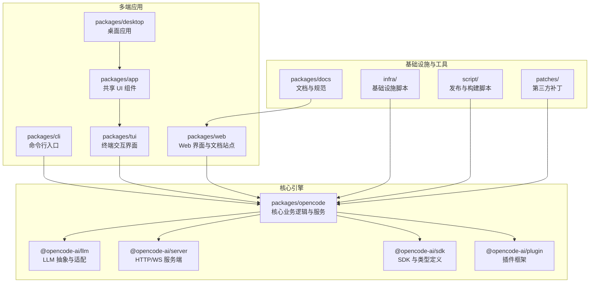
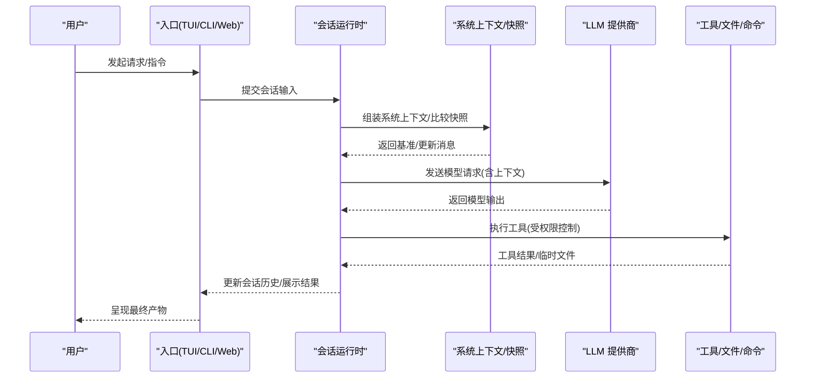
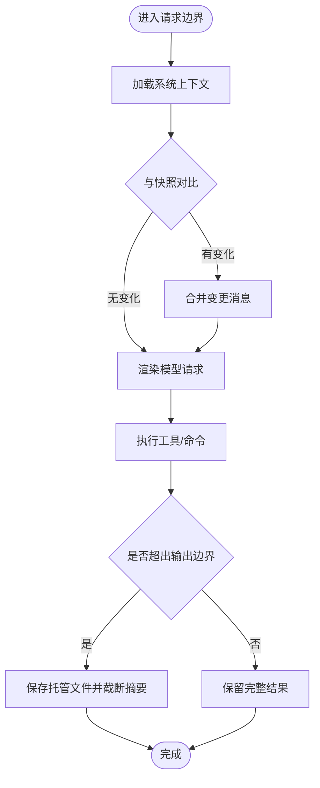
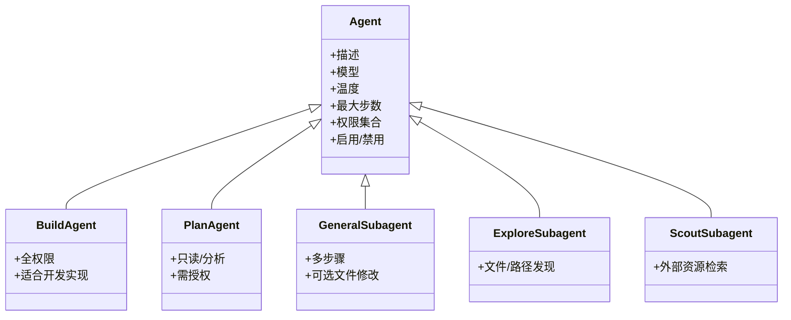
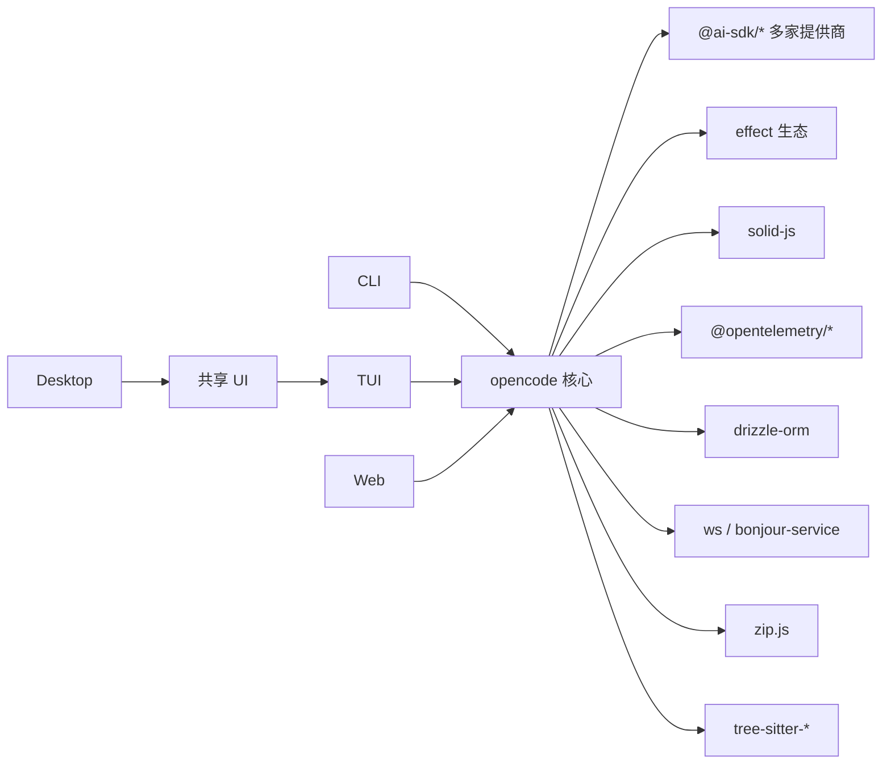

# 项目介绍与愿景

<cite>
**本文引用的文件**
- [README.md](file://README.md)
- [CONTRIBUTING.md](file://CONTRIBUTING.md)
- [CONTEXT.md](file://CONTEXT.md)
- [AGENTS.md](file://AGENTS.md)
- [packages/opencode/package.json](file://packages/opencode/package.json)
- [packages/web/src/content/README.md](file://packages/web/src/content/README.md)
- [packages/web/src/content/docs/agents.mdx](file://packages/web/src/content/docs/agents.mdx)
- [packages/web/src/content/docs/index.mdx](file://packages/web/src/content/docs/index.mdx)
- [packages/web/src/content/docs/enterprise.mdx](file://packages/web/src/content/docs/enterprise.mdx)
- [packages/console/app/src/routes/legal/terms-of-service/index.tsx](file://packages/console/app/src/routes/legal/terms-of-service/index.tsx)
- [packages/console/app/src/routes/legal/privacy-policy/index.tsx](file://packages/console/app/src/routes/legal/privacy-policy/index.tsx)
</cite>

## 目录
1. [引言](#引言)
2. [项目结构](#项目结构)
3. [核心组件](#核心组件)
4. [架构总览](#架构总览)
5. [详细组件分析](#详细组件分析)
6. [依赖关系分析](#依赖关系分析)
7. [性能考量](#性能考量)
8. [故障排查指南](#故障排查指南)
9. [结论](#结论)
10. [附录](#附录)

## 引言
OpenCode 是一个开源的 AI 编码代理，旨在以更开放、可组合、可扩展的方式，将大模型能力融入到日常软件开发流程中。它通过“会话运行时”“系统上下文”“权限控制”“多代理协作”等设计，帮助开发者在本地或企业环境中安全、可控地进行智能编码与工程化实践。

OpenCode 的核心使命是：
- 让 AI 辅助编程更易用：提供开箱即用的安装方式、跨平台客户端与命令行入口，降低使用门槛。
- 让 AI 辅助编程更可信：通过权限系统、只读/计划模式、可审计的会话历史与上下文快照，减少误操作风险。
- 让 AI 辅助编程更高效：支持多代理协作、多步骤任务执行、文件与命令操作、工具输出边界控制等，覆盖从分析到实现的完整闭环。
- 让 AI 辅助编程更开放：开源协议、社区驱动、插件生态、多提供商适配，避免厂商锁定。

OpenCode 的长远愿景是成为“开发者身边的智能工程助手”，在不改变现有工作流的前提下，将“思考—规划—验证—执行”的工程过程自动化与智能化，从而显著提升研发效率与质量。

## 项目结构
OpenCode 采用多包（monorepo）组织方式，围绕“核心引擎 + 多端应用 + 插件体系 + 文档与生态”的结构展开。下图展示了主要模块及其职责：

图表来源
- [packages/opencode/package.json:1-156](file://packages/opencode/package.json#L1-L156)
- [README.md:1-130](file://README.md#L1-L130)

章节来源
- [README.md:1-130](file://README.md#L1-L130)
- [packages/opencode/package.json:1-156](file://packages/opencode/package.json#L1-L156)

## 核心组件
- 会话运行时与系统上下文
  - 会话运行时负责持久化对话历史，并在每次请求前根据“系统上下文”“上下文快照”“安全请求边界”等机制组装模型输入，确保上下文稳定且可审计。
  - 系统上下文由多个“上下文源”组成，支持并发装配、动态变更与可组合性；变更会在“安全请求边界”统一合并，避免异步唤醒导致的状态漂移。
- 多代理与权限控制
  - 提供“构建”“计划”“通用”“探索”“侦察”等内置代理，支持按需切换与权限隔离，满足从分析到实现的不同阶段需求。
  - 默认限制文件修改与 Bash 执行，必要时需要授权确认，降低误操作风险。
- 多端入口与生态
  - 支持命令行、Web、TUI、桌面应用等多种入口；提供 SDK、插件与生态集成点，便于二次开发与企业定制。
- 安全与隐私
  - 默认不存储代码与上下文数据，处理过程可在本地完成或通过直连 AI 提供商 API 完成；企业版支持集中配置与 SSO，保障数据在组织内网安全可控。

章节来源
- [CONTEXT.md:1-130](file://CONTEXT.md#L1-L130)
- [AGENTS.md:1-159](file://AGENTS.md#L1-L159)
- [packages/web/src/content/docs/agents.mdx:38-120](file://packages/web/src/content/docs/agents.mdx#L38-L120)
- [packages/web/src/content/docs/enterprise.mdx:123-153](file://packages/web/src/content/docs/enterprise.mdx#L123-L153)
- [packages/console/app/src/routes/legal/terms-of-service/index.tsx:84-109](file://packages/console/app/src/routes/legal/terms-of-service/index.tsx#L84-L109)
- [packages/console/app/src/routes/legal/privacy-policy/index.tsx:31-50](file://packages/console/app/src/routes/legal/privacy-policy/index.tsx#L31-L50)

## 架构总览
下图展示了 OpenCode 的典型交互流程：用户通过任意入口发起请求，会话运行时根据当前上下文与权限策略生成模型输入，调用 LLM 提供商接口，再将结果回写到会话历史与工具输出中，形成“思考—规划—验证—执行”的闭环。

图表来源
- [CONTEXT.md:58-121](file://CONTEXT.md#L58-L121)
- [packages/web/src/content/docs/agents.mdx:38-120](file://packages/web/src/content/docs/agents.mdx#L38-L120)

## 详细组件分析

### 会话运行时与系统上下文
- 设计要点
  - 系统上下文由多个“上下文源”组成，支持并发装配与稳定键名组合，保证渲染确定性。
  - 变更在“安全请求边界”统一合并，避免异步唤醒导致的状态漂移；首次渲染包含完整基准上下文。
  - 上下文快照用于对比上次已准入值，仅在必要时发出“会话中系统消息”。
- 关键行为
  - 不可用上下文采用“缓存刷新”语义，不会阻断首次渲染；当上下文被替换或压缩时开启新的“上下文纪元”。
  - 工具输出受限于“模型工具输出”边界，超长文本保存到托管文件，但会话记录仍保留可重放的摘要。
- 价值
  - 使模型始终基于稳定的、可审计的上下文进行推理，同时允许动态更新与增量通知，兼顾灵活性与一致性。

图表来源
- [CONTEXT.md:39-121](file://CONTEXT.md#L39-L121)

章节来源
- [CONTEXT.md:1-130](file://CONTEXT.md#L1-L130)

### 多代理与权限控制
- 代理类型
  - 主代理：构建（默认，全权限）、计划（只读/分析，需授权）
  - 子代理：通用（多步骤任务）、探索（文件/路径发现）、侦察（外部资源检索）
- 权限模型
  - 默认拒绝文件修改与 Bash 执行，变更时触发授权提示；适合在不改动代码的情况下进行分析与规划。
  - 支持为特定代理设置温度、模型、提示词与最大迭代步数等参数，满足不同任务场景。
- 价值
  - 将“思考—规划—执行”解耦为不同代理，既可降低风险，又可并行推进多项任务。

图表来源
- [packages/web/src/content/docs/agents.mdx:38-120](file://packages/web/src/content/docs/agents.mdx#L38-L120)
- [packages/web/src/content/docs/agents.mdx:699-725](file://packages/web/src/content/docs/agents.mdx#L699-L725)

章节来源
- [packages/web/src/content/docs/agents.mdx:38-120](file://packages/web/src/content/docs/agents.mdx#L38-L120)
- [AGENTS.md:1-159](file://AGENTS.md#L1-L159)

### 多端入口与生态
- 入口形态
  - 命令行：提供 serve/web/tui 等子命令，便于在任意目录启动服务或交互界面。
  - Web/TUI：提供可视化界面与键盘快捷键，适合日常开发与演示。
  - 桌面应用：基于 Electron 包装 Web UI，提供原生体验。
- 生态集成
  - 插件与 SDK：支持二次开发与企业定制；生态项目如与 Daytona、Helicone 等集成。
  - 多提供商适配：内置多家 LLM 提供商 SDK，便于切换与迁移。
- 价值
  - 降低使用门槛，覆盖多种开发场景与团队习惯。

章节来源
- [README.md:46-129](file://README.md#L46-L129)
- [packages/web/src/content/docs/index.mdx:165-227](file://packages/web/src/content/docs/index.mdx#L165-L227)
- [packages/web/src/content/docs/enterprise.mdx:123-153](file://packages/web/src/content/docs/enterprise.mdx#L123-L153)

### 安全与隐私
- 数据处理原则
  - 默认不存储代码与上下文数据，处理过程可在本地完成或通过直连 AI 提供商 API 完成。
  - 企业版支持集中配置与 SSO 集成，确保数据在组织内网安全可控。
- 法律与合规
  - 服务条款与隐私政策明确适用范围与变更机制，保障用户知情权与选择权。
- 价值
  - 在追求效率的同时，优先保护用户的数据主权与合规要求。

章节来源
- [packages/web/src/content/docs/enterprise.mdx:123-153](file://packages/web/src/content/docs/enterprise.mdx#L123-L153)
- [packages/console/app/src/routes/legal/terms-of-service/index.tsx:84-109](file://packages/console/app/src/routes/legal/terms-of-service/index.tsx#L84-L109)
- [packages/console/app/src/routes/legal/privacy-policy/index.tsx:31-50](file://packages/console/app/src/routes/legal/privacy-policy/index.tsx#L31-L50)

## 依赖关系分析
OpenCode 的核心依赖围绕“LLM 提供商 SDK”“工具链与运行时”“UI 框架与状态管理”“数据库与文件系统”等维度展开。下图展示了关键依赖关系与模块耦合：

图表来源
- [packages/opencode/package.json:54-151](file://packages/opencode/package.json#L54-L151)

章节来源
- [packages/opencode/package.json:1-156](file://packages/opencode/package.json#L1-L156)

## 性能考量
- 上下文压缩与边界控制
  - 通过“上下文纪元”“基准上下文”“上下文快照”等机制，避免重复渲染与无效更新，降低模型输入规模。
  - 工具输出边界控制与托管文件机制，平衡可观测性与传输成本。
- 并发装配与懒加载
  - 上下文源并发装配与动态加载，结合“安全请求边界”统一合并，减少等待与抖动。
- 运行时优化建议
  - 合理设置代理的温度与最大步数，避免不必要的计算与调用。
  - 使用只读/计划模式先行分析，减少不必要的文件与命令操作。
  - 在企业环境中结合集中配置与 SSO，减少鉴权往返与网络延迟。

章节来源
- [CONTEXT.md:58-121](file://CONTEXT.md#L58-L121)
- [packages/web/src/content/docs/agents.mdx:255-301](file://packages/web/src/content/docs/agents.mdx#L255-L301)

## 故障排查指南
- 常见问题定位
  - 会话未正确初始化：检查项目根目录是否存在 AGENTS.md 或初始化命令是否成功执行。
  - 权限不足：确认代理权限配置与授权提示是否已处理；必要时切换到构建代理或调整权限。
  - 输出过大：关注“模型工具输出”边界与托管文件，确认是否需要裁剪或降采样。
  - 企业环境认证：确保私有 NPM 注册表认证已配置，或使用 .npmrc 文件注入凭据。
- 开发调试
  - 使用调试器附加到服务端进程，结合“安全请求边界”观察上下文变更与工具执行轨迹。
  - 如需并行任务与多步骤执行，优先使用通用子代理，避免直接在主代理上进行复杂操作。
- 社区支持
  - 加入 Discord 社区与 GitHub 讨论，参考贡献指南与问题模板，提高问题修复效率。

章节来源
- [CONTRIBUTING.md:178-300](file://CONTRIBUTING.md#L178-L300)
- [packages/web/src/content/docs/index.mdx:165-227](file://packages/web/src/content/docs/index.mdx#L165-L227)
- [packages/web/src/content/docs/enterprise.mdx:144-153](file://packages/web/src/content/docs/enterprise.mdx#L144-L153)

## 结论
OpenCode 以“会话运行时 + 系统上下文 + 权限控制 + 多代理协作”为核心，构建了面向真实工程场景的 AI 编码代理。它在开源协议与社区驱动下，提供多端入口、生态集成与企业级安全能力，既能满足个人开发者快速上手的需求，也能支撑企业内部的规模化落地。未来，OpenCode 将持续完善上下文管理、工具边界与多代理编排，让“思考—规划—验证—执行”的工程过程更加智能、可控与高效。

## 附录
- 快速开始
  - 安装与运行：支持 curl、包管理器、Homebrew、Scoop、Chocolatey、包管理器等多种安装方式；支持 serve/web/tui 等命令。
  - 初始化项目：在目标项目中执行初始化命令，生成 AGENTS.md 并纳入版本控制。
- 社区与贡献
  - 遵循贡献指南与风格偏好，提交 Issue 与 PR 前先沟通，确保方向一致。
- 企业与隐私
  - 企业版默认不存储代码与上下文数据，支持集中配置与 SSO；隐私政策与服务条款明确了适用范围与变更机制。

章节来源
- [README.md:46-129](file://README.md#L46-L129)
- [CONTRIBUTING.md:32-177](file://CONTRIBUTING.md#L32-L177)
- [packages/web/src/content/docs/index.mdx:165-227](file://packages/web/src/content/docs/index.mdx#L165-L227)
- [packages/web/src/content/docs/enterprise.mdx:123-153](file://packages/web/src/content/docs/enterprise.mdx#L123-L153)