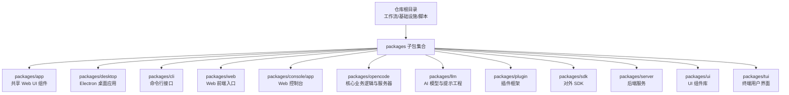
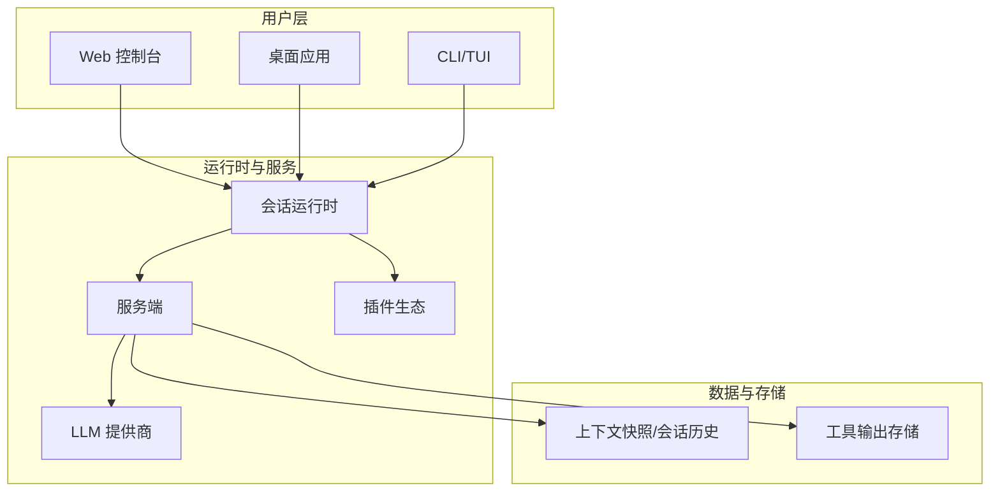
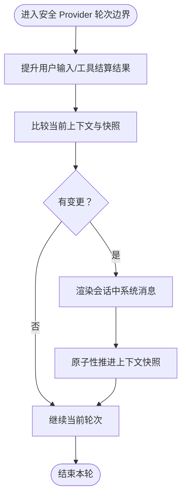
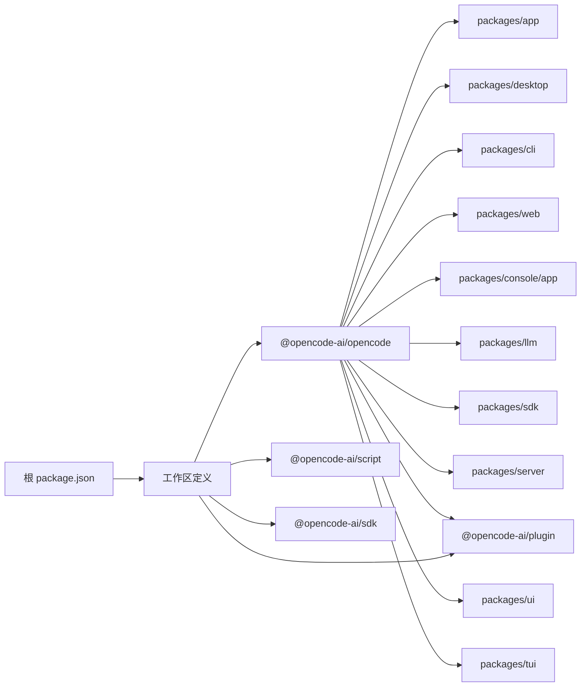

# 项目概述

<cite>
**本文引用的文件**
- [README.md](file://README.md)
- [package.json](file://package.json)
- [turbo.json](file://turbo.json)
- [CONTRIBUTING.md](file://CONTRIBUTING.md)
- [CONTEXT.md](file://CONTEXT.md)
- [packages/opencode/package.json](file://packages/opencode/package.json)
- [packages/app/package.json](file://packages/app/package.json)
- [packages/desktop/package.json](file://packages/desktop/package.json)
- [packages/cli/package.json](file://packages/cli/package.json)
- [packages/web/package.json](file://packages/web/package.json)
- [packages/console/app/package.json](file://packages/console/app/package.json)
- [packages/llm/package.json](file://packages/llm/package.json)
- [packages/plugin/package.json](file://packages/plugin/package.json)
- [packages/sdk/package.json](file://packages/sdk/package.json)
- [packages/server/package.json](file://packages/server/package.json)
- [packages/ui/package.json](file://packages/ui/package.json)
- [packages/tui/package.json](file://packages/tui/package.json)
</cite>

## 目录
1. [引言](#引言)
2. [项目结构](#项目结构)
3. [核心组件](#核心组件)
4. [架构总览](#架构总览)
5. [详细组件分析](#详细组件分析)
6. [依赖关系分析](#依赖关系分析)
7. [性能考量](#性能考量)
8. [故障排查指南](#故障排查指南)
9. [结论](#结论)
10. [附录](#附录)

## 引言
OpenCode 是一个开源的全栈 AI 驱动开发工具平台，旨在通过统一的会话运行时与多端体验（Web、桌面、CLI、控制台），为开发者提供从对话到执行的一体化智能编码体验。项目以“可安装、可运行、可扩展”为目标，覆盖本地开发、云端协作与企业级部署场景。

- 核心使命：让 AI 成为每个开发者日常工作的“智能伙伴”，降低沟通成本、提升交付效率。
- 技术愿景：以模块化、可观测、可扩展的 monorepo 架构为基础，构建跨平台、可插拔、可演进的 AI 编码基础设施。
- 价值主张：
  - 多端一致体验：Web 控制台、桌面应用、命令行与终端界面无缝衔接。
  - 可插拔生态：通过插件系统扩展上下文源、工具与模型提供商。
  - 会话即资产：持久化的会话历史与系统上下文，保障复杂任务的连续性与可审计性。
  - 易于贡献：完善的开发流程、调试指南与信任体系，鼓励社区共建。

## 项目结构
OpenCode 采用 monorepo 管理，根目录包含工作流、基础设施、包管理与脚本；packages 下按功能域划分核心子包，涵盖前端 UI、桌面应用、CLI、LLM、插件、服务端与 SDK 等。

图示来源
- [package.json:1-156](file://package.json#L1-L156)
- [turbo.json:1-26](file://turbo.json#L1-L26)

章节来源
- [package.json:1-156](file://package.json#L1-L156)
- [turbo.json:1-26](file://turbo.json#L1-L26)

## 核心组件
- 会话运行时与系统上下文
  - OpenCode 将“系统上下文”作为初始指令与动态更新的结构化载体，结合“会话历史”与“上下文快照”，在安全边界内按需注入模型请求，确保上下文稳定且可审计。
  - 关键概念：系统上下文、会话历史、上下文源、基线系统上下文、上下文快照、安全 Provider 轮次边界、PTY 环境等。
- 多端入口
  - Web 控制台与 Web 应用：提供可视化操作与配置界面。
  - 桌面应用：基于 Electron 的原生体验，封装 Web UI。
  - CLI 与 TUI：面向终端用户的交互方式，支持直接在项目中启动与远程连接。
- 插件生态
  - 通过上下文源注册表与工具注册表，实现对新上下文、技能与工具的热插拔式扩展。
- LLM 集成
  - 支持多模型提供商接入，结合请求选项与生成控制，适配不同协议与兼容性需求。
- 基础设施与可观测性
  - 使用 Effect 生态与可观测性工具链，保障服务稳定性与可维护性。

章节来源
- [CONTEXT.md:1-130](file://CONTEXT.md#L1-L130)
- [README.md:100-114](file://README.md#L100-L114)

## 架构总览
OpenCode 的整体架构围绕“会话运行时”展开，上层通过多端入口与用户交互，下层由服务端、LLM 提供商与插件生态共同支撑。会话运行时负责上下文组装、历史投影与安全边界内的变更注入，确保模型交互的确定性与可审计性。

图示来源
- [CONTEXT.md:1-130](file://CONTEXT.md#L1-L130)
- [README.md:100-114](file://README.md#L100-L114)

## 详细组件分析

### 会话运行时与系统上下文
- 设计要点
  - 系统上下文由多个“上下文源”有序组合而成，使用稳定键与纯渲染器保证可组合性与确定性。
  - 在“安全 Provider 轮次边界”前，仅允许已批准的上下文变更进入模型请求，避免异步唤醒导致的状态漂移。
  - 上下文快照用于对比与回放，支持跨进程重启与迁移场景。
- 关键流程
  - 初始化：根据当前注册表组合系统上下文，生成基线系统上下文与上下文快照。
  - 变更：当上下文源发生变化时，在下一个安全边界合并为“会话中系统消息”，并原子性推进快照。
  - 替换：压缩或模型/提供商切换会开启新的上下文纪元，保留历史但替换基线。
- 数据与状态
  - 工具输出可能超出会话历史容量，采用“托管工具输出文件”保存完整结果，并在模型可见部分提供截断预览。

图示来源
- [CONTEXT.md:39-107](file://CONTEXT.md#L39-L107)

章节来源
- [CONTEXT.md:1-130](file://CONTEXT.md#L1-L130)

### 多端入口与用户体验
- Web 控制台与 Web 应用
  - 提供可视化的项目浏览、会话管理与配置界面，适合初次使用者与探索性任务。
- 桌面应用
  - 基于 Electron 的原生体验，便于离线使用与系统集成。
- CLI 与 TUI
  - 面向高级用户与自动化场景，支持直接在任意目录启动，或连接远程服务进行交互。

章节来源
- [README.md:67-114](file://README.md#L67-L114)
- [CONTRIBUTING.md:72-95](file://CONTRIBUTING.md#L72-L95)

### 插件生态与扩展机制
- 扩展点
  - 上下文源注册：为系统上下文注入新的事实来源（如项目指令、环境变量、时间等）。
  - 工具注册：定义可在会话中调用的工具集，受授权与大小限制约束。
  - 技能注册：暴露可用技能名称与描述，权限检查后才可执行具体技能体。
- 生命周期
  - 插件可热加载，遵循稳定的贡献键与命名空间，避免重复键冲突。
  - 移除插件时，对应的上下文源会在下一个安全边界自然移除。

章节来源
- [CONTEXT.md:87-90](file://CONTEXT.md#L87-L90)

### LLM 集成与模型选择
- 请求选项与生成控制
  - 模型请求选项来自“目录”解析与会话变体，映射到具体提供商语义；生成控制与协议语义分离，便于跨提供商兼容。
- 协议适配
  - 通过协议适配器处理提供商特定的编码细节，确保请求体与响应的兼容性。
- 模型与提供商
  - 项目维护补丁集以适配第三方 SDK 的行为差异，保障多提供商一致性。

章节来源
- [CONTEXT.md:103-104](file://CONTEXT.md#L103-L104)
- [package.json:142-154](file://package.json#L142-L154)

### 基础设施与可观测性
- 运行时与工具链
  - 使用 Effect 生态与可观测性工具，确保服务的稳定性与可观测性。
- 包与工作区
  - 根 package.json 定义了统一的工作区与依赖目录，Turbo 管理增量构建与类型检查。

章节来源
- [package.json:24-93](file://package.json#L24-L93)
- [turbo.json:1-26](file://turbo.json#L1-L26)

## 依赖关系分析
OpenCode 的依赖关系主要体现在 monorepo 的工作区组织与包间耦合上。根依赖集中管理版本与补丁，各子包通过 workspace:* 引用内部包，形成清晰的分层与职责边界。

图示来源
- [package.json:108-115](file://package.json#L108-L115)
- [package.json:24-31](file://package.json#L24-L31)

章节来源
- [package.json:1-156](file://package.json#L1-L156)

## 性能考量
- 会话上下文压缩
  - 通过压缩与上下文纪元切换，减少模型输入规模，平衡上下文完整性与成本。
- 工具输出截断与托管
  - 对超长工具输出采用截断预览与托管文件相结合的方式，兼顾模型可见性与完整记录。
- 并发与确定性
  - 上下文源生产者并发评估，但最终组合顺序保持稳定，确保渲染确定性与可复现性。
- I/O 与资源
  - PTY 环境叠加与终端不变量（如 OPENCODE_TERMINAL）确保命令执行环境一致性，减少失败重试带来的额外开销。

章节来源
- [CONTEXT.md:74-121](file://CONTEXT.md#L74-L121)

## 故障排查指南
- 启动与调试
  - API 服务：先启动服务端，再启动 Web 应用进行 UI 测试；可通过指定端口调整监听地址。
  - 桌面应用：使用 Electron 包装 Web UI，开发时可分别调试服务端与 TUI。
  - 调试建议：优先使用 Bun 的 inspect 模式手动启动并在浏览器中附加调试器，避免断点映射错误。
- 依赖与补丁
  - 若遇到第三方 SDK 行为差异，检查补丁目录中的补丁文件是否正确应用。
- 贡献流程
  - 提交 PR 前确保关联议题、遵循规范与风格偏好；UI 变更建议附带截图或视频以便评审。

章节来源
- [CONTRIBUTING.md:97-142](file://CONTRIBUTING.md#L97-L142)
- [CONTRIBUTING.md:146-177](file://CONTRIBUTING.md#L146-L177)
- [package.json:142-154](file://package.json#L142-L154)

## 结论
OpenCode 以“会话运行时”为核心，结合多端入口与插件生态，构建了一个可扩展、可观测、可审计的 AI 编码基础设施。通过统一的上下文管理与安全边界内的变更注入，OpenCode 在保证稳定性的同时，为开发者提供了灵活而强大的智能编码体验。随着插件生态与提供商集成的持续完善，OpenCode 将进一步拓展其在多场景下的适用性与影响力。

## 附录
- 快速开始
  - 通过包管理器或一键安装脚本快速安装，支持 macOS、Windows、Linux 与多种发行版。
  - 桌面应用提供多平台安装包，亦可通过 Homebrew 等渠道安装。
- 社区与贡献
  - 通过议题模板与贡献指南参与讨论与改进；信任与担保体系帮助维护高质量贡献。
- 发展规划
  - 持续完善插件生命周期与上下文源热重载能力；增强多提供商兼容性与可观测性；优化多端一致性与性能表现。

章节来源
- [README.md:46-130](file://README.md#L46-L130)
- [CONTRIBUTING.md:178-300](file://CONTRIBUTING.md#L178-L300)